# 03 | 工程体系

[toc]

## 课前回顾

上节课做的脑图，实际是让我们在做脑图的过程中对前端知识有一个整体的认识，我们也应该经常这样去盘点前端知识，并且也需要对这庞杂的前端体系分一个轻重，让时间和精力用在自己真正感兴趣的地方。

## 优秀的前端工程师

### 大家眼中

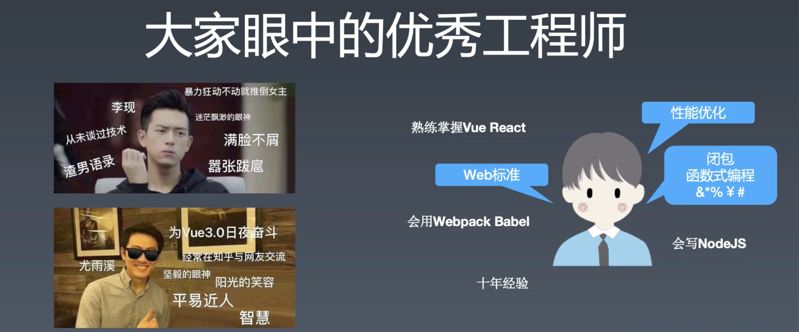

### winter 眼中

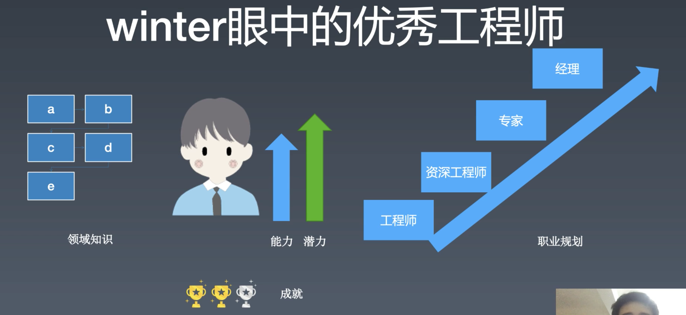

#### 能力

- 编程能力：是否能做出来
- 架构能力：做多大规模
- 工程能力：多少人一起做

#### 潜力

**基础越好，往更高更复杂的方向去才能更容易**。

#### 职业规划

你不理财，财不理你。职业规划也是一样，不去规划职业，职业也不会有什么成长。提前几年的规划，行动，寻找达到目标的机会。（美国、新加坡）

> 但是我觉得这个事情的前提是你要对自己真实的想法有一个了解，你真的想要满足的是自己什么样的欲望。你是要服务社会，还是要成就自我，还是要安逸生活，或是面子？

如果让你的雇主了解到你是否适合这份工作？

- 最有效的一点是「成就」。
- 成就可以是在公司中所完成的某个任务，所做的 APP，也可以是一些技术上的分享。
- **要把自己的思考和成果放到公开的空间中才能获得一些有价值的反馈**。

## 职业发展

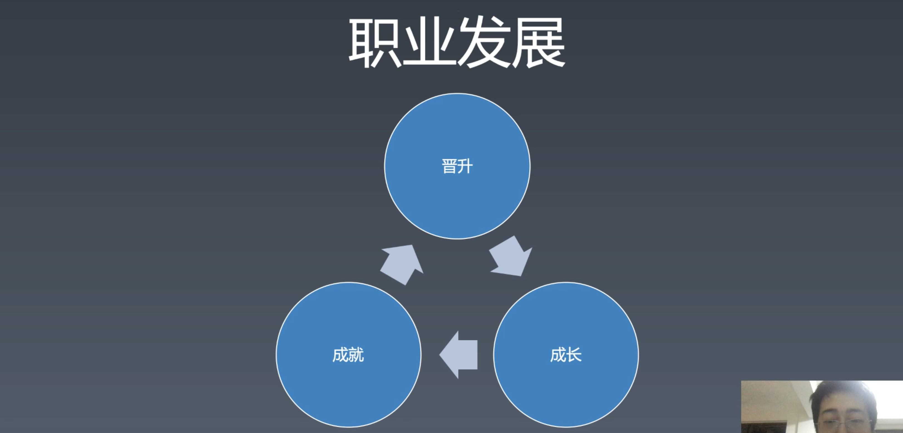

当你获得一定成长之后，你可以用你先有的能力去完成一个更好的成就，通过这个成就在市场上拿到一份更好的 offer，在新的岗位获得一定的成长。（这个过程，不只是在工作上，也可以是自己通过学习、通过完成某个自己的项目、或是参加一些开源项目来完成）

### 成就

- 业务型成就
- 工程型成就
- 技术难题

#### 业务型成就

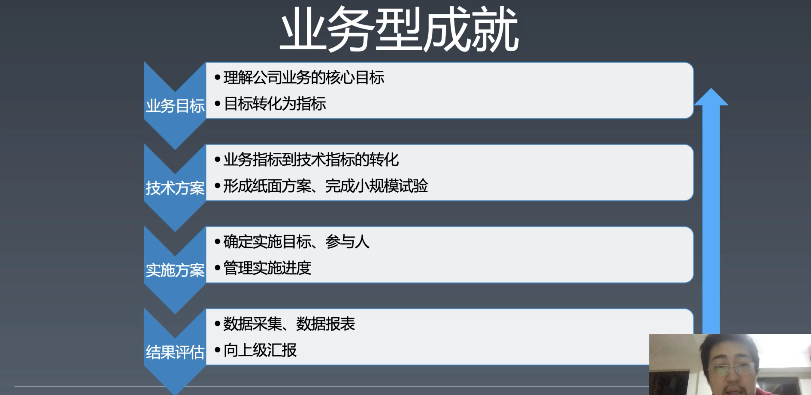

- 业务的核心目标——怎么挣钱（但可能这不是唯一目标）。

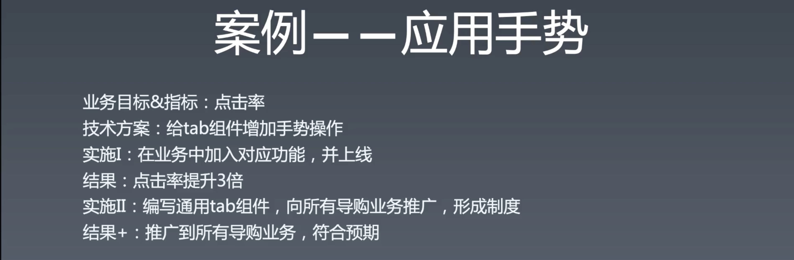

- 这个案例中，在技术层面没有任何的难度，但对整个业务的提升非常大，这需要对业务非常敏感，需要有一定的判断。 

> 完成一件事，最好是能将思考过程说情况并进行提炼，这部分的价值比事情最后的结果更具价值，因为这些经验可以复用到其他事情上。

#### 技术难题

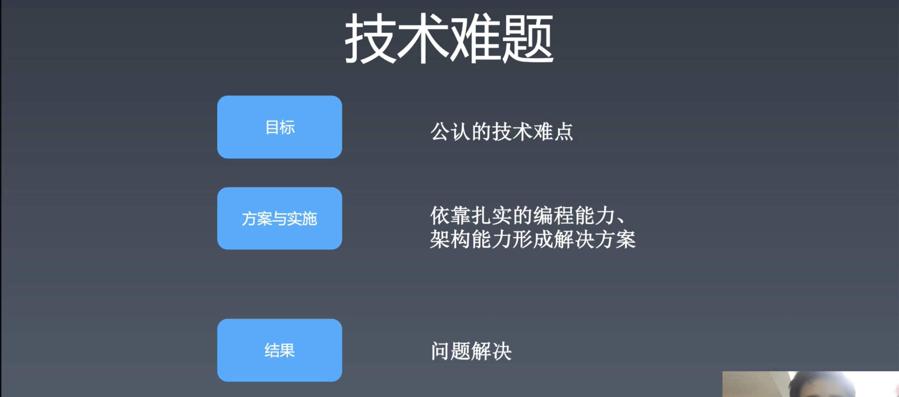

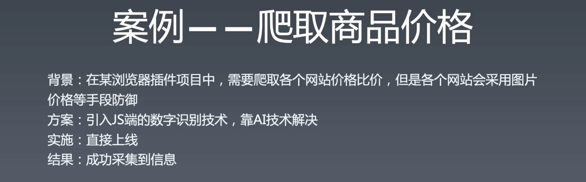

#### 工程型成就

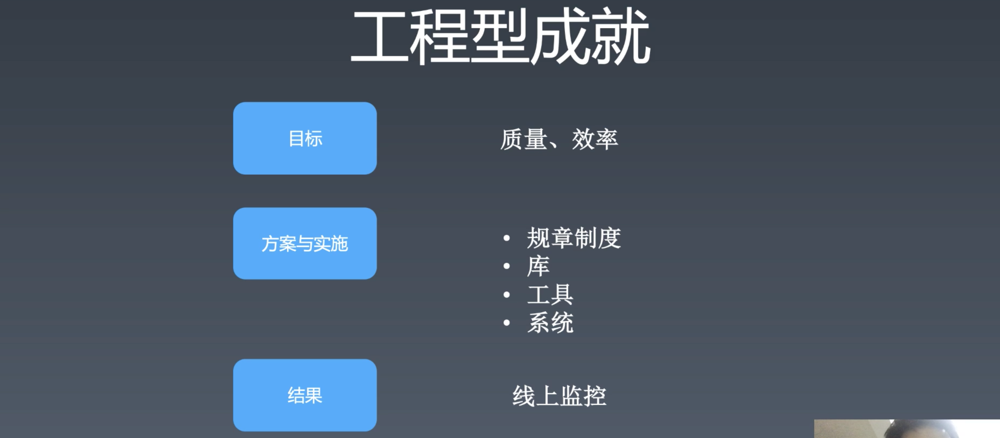

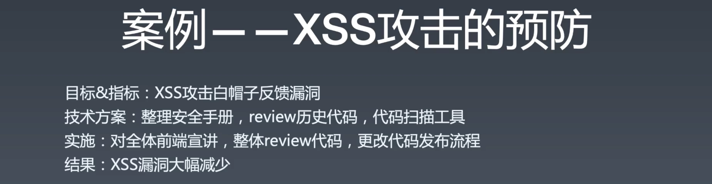

## 课间问答

#### 读开源项目的经验

1. 帮写文档，看文档中是否有需要改善或补充的地方。
2. fix bug，在修 bug 的过程跑起项目，单步追踪熟悉项目结构。
4. 提交作者 review

每个人的学习方法都不同，每个人都可以总结一套自己的学习方法。

#### 数据结构 

- 数据结构 80% 的需求都在用于排序，剩下是解决图和特定领域的问题。

- 数组 -> 线性表

- 学会使用 hash 是解决排序的一个很有效的方式
- 不可用 hash 的可用二叉树
- 练 leetcode 是锻炼思维的方式，有些题没有实用性，有些有。

> 不要被工作内容所限制，你每天没有做的事情不等于是不可以做的事情。

## 数据驱动的思考方式

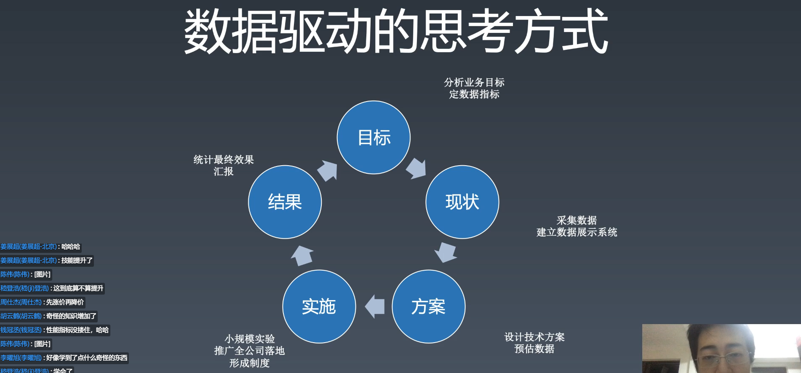

#### 目标

很多人有一个毛病，一来就出发，没有目标。没有目标很难将事情做好。

首先应该要有一个目标而不是方案，而目标是分析业务目标和指标。比如促进用户活跃和提高营收，单这两个业务不具体，那就应该用某个指标（拥有数据）来具化。那“用户活跃”是“日活除以月活”（互联网公司的很多财报会使用这个指标数据），月活是指这个用户这个月用过你的产品一次。要保持这种活跃度的方法有发红包、签到、游戏等。

淘宝指标三要素：

- 流量
- 转化率
- 客单价

所以要知道这个公司所认可的指标是什么，这样才能够获得晋升。所以，你的一切成果都要和这些指标牵扯上关系才行。

技术好，**业务敏感度高**。

高速增长的公司可以掩盖一切的问题，而营收业务等不提高，老板就会感到不安，就会采取很多不合理的方案，比如加班、“节约用纸”等。

#### 现状

采集数据，并用这些数据进行对比，对比是一个非常好的汇报方式。

#### 方案

方案的提出需要一个预估的数据，而非各种“一定”等非常不具化的非数据的说法。数量级上要合理。

#### 实施

当你不确定这个方案的影响时，那就先**小规模实验**，拿到一部分实现结果数据，再决定是否继续使用这个方案，扩大实现范围。

#### 结果

老黄牛就是做了很多事情但是不汇报，其实最好是都要给直接上级汇报，汇报是很正常的操作，不正式的汇报只需要过去跟他讲一讲，正式就需要约个时间。汇报是非常重要的，不汇报等于没有做。（这里的老板一般是上级或是上上级）

很多时候不是老板没时间，而是**你不敢做，或者你觉得做的没价值**。

> 信任是逐渐建立起来的。

误区：不是只有产品才和业务之间有直接关系。

好的工程师需要非常了解业务，因为你是用技术来为业务创造价值的。

> 这里要清楚，一般公司的目的是为了增长业务，而你的工作是为了业务服务，为了自我责任和社会责任，你有义务为公司业务创造价值。

## 前端技能模型

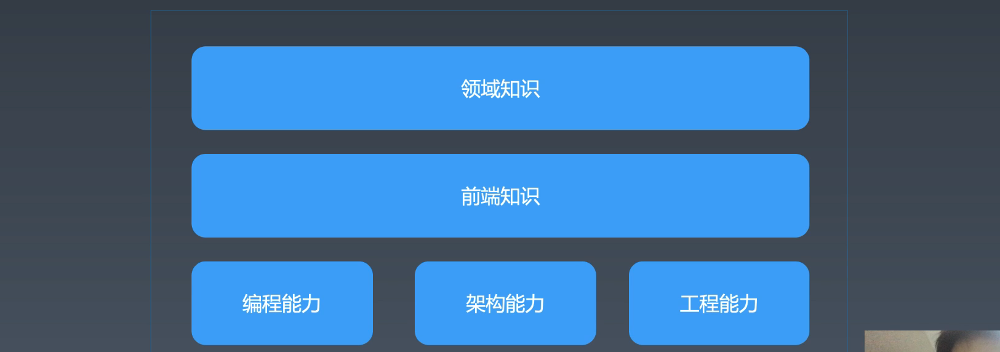

#### 领域知识

你的公司和你公司业务所再得领域知识。

#### 架构能力

- 组件化

#### 工程能力

- 工具链
- 持续集成

## 工具链

在淘宝，工具链的由来是因为过去淘宝在没有形成工具链这个概念的时候，有三十种左右的工具，而这些工具之间会有冲突，很多时候这个工具的产出无法用于另一个工具，为了能够让工具之间有一种关联，就设计了工具链这种链接工具的概念。工具链保证了工具能够在其中找到一个合理的位置，以使工具之间能合理的配合。

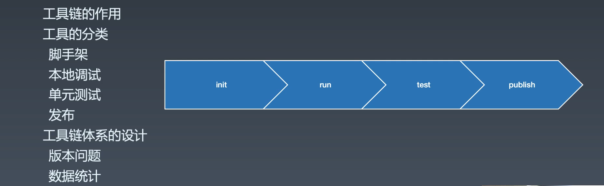

工具链中四个有价值的工具：

- 脚手架（init）
- 本地调试（run）
  - 本地跑起来
  - build 是隐藏在 run 和 publish 之中的
- 单元调试（test）
- 发布（publish）

工具链体系设计的两个问题：

- 版本问题
  - 同一个团队用相同的工具版本
- 数据统计
  - 比如每个组件使用和报错的比例
  - run、test、publish 等的时间和次数
  - 将这些数据可视化，可以很容易发现问题

## 持续集成

#### 客户端

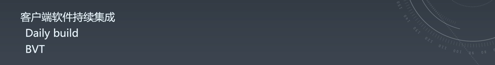

客户端软件（比如 office 系列）是需要 `build` 的，一次 build 可能需要七八个小时，所以就少 build。早年的软件行业大家分别做各自的模块，直到最后的**集成**阶段。所有，这里的集成也可以称为「最终集成」，而与之相对的概念是「持续集成」。

持续集成是很短的时间一次集成，比如每天（Daily build），当初提出是非常先进的概念。有一台专门用于 build 的机器，用一个自动化软件，比如 BVT（检查这个 build 好不好，一般是测试工程师来写的）。

客户端软件架构复杂，软件模块依赖容易出问题。高内聚，低耦合，在客户端开发中有着非常重要的要求。

#### 前端

前端有一个特点：页面间自然解耦，因为两个页面很难耦合，可能会用 postMessage 造成耦合。

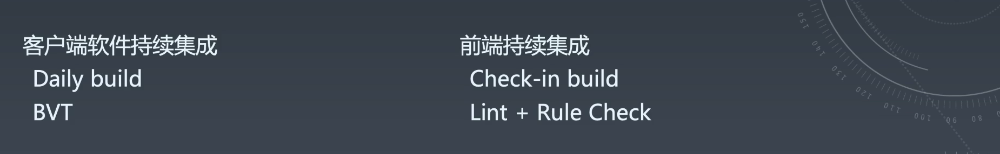

到了前端持续集成会有调整，比如 Daily build 改为每一次更改就 build 一次。

> 无头浏览器（看不见的浏览器），不渲染，但可以生成为 DOM 树，不消耗渲染资源。

## 技术架构

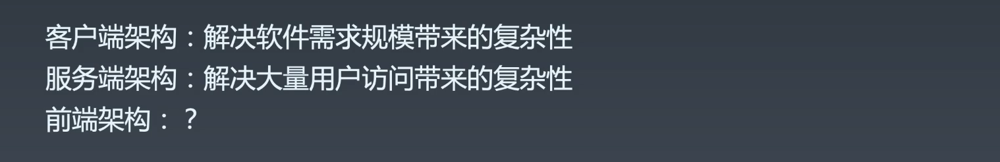

客户端架构师会去做：

- 模块
- 解耦
- 分层
- 模块与分层上设计大量的测试用例，保证解耦。

服务端架构的业务不复杂，但是需要解决大量的用户访问带来的复杂性，这会涉及到物理架构和逻辑架构。在淘宝，就算是下单也有一百多种逻辑。

#### 前端架构解决的问题

大量页面需求带来的重复劳动问题。

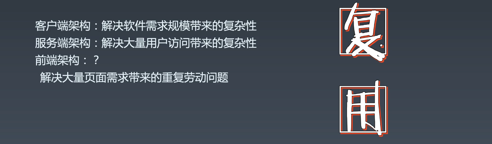

提高复用率！！！

#### 如何复用

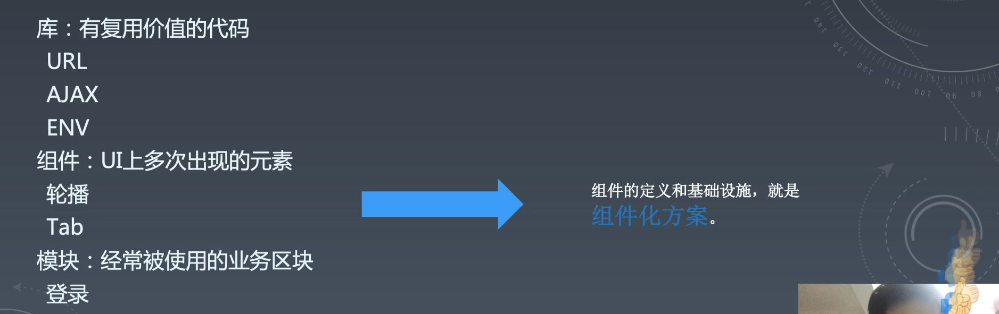

三个层次

- 库 - 有复用价值的代码，如下三类是最常用的：

  - URL
    - 将 URL 拆分成不同的部分
    - 解析 url 的正则，根据 [url 标准文档](https://tools.ietf.org/)（IETF 组织）来统一写
    - 浏览器如今也有相关的 API —— [URL](https://developer.mozilla.org/zh-CN/docs/Web/API/URL)
  - AJAX
    - 由于各个公司的不同会有不同的库
    - 各种开源的 ajax 其实对于大公司而言都不可用，因为需要做很多额外的工作，需要写大量的代码。
  - ENV（判断 UA）
    - 判断环境，是否是处于微信的环境里，是否是在某个浏览器里，ipad 或是 iphone 里。
    - 如果要用正则会使用到太多的知识了，因为有很多各种奇怪的垃圾知识（没有太多作用的知识，不过这个也不一定）

- 组件 - **UI** 上多次出现的元素

  - 比如
    - 轮播
    - Tab
  - 组件化，需要一定的规范来规划的，而不是随便写，这样会导致各种不同的调用方式。
  - 遵循一定的规则，组件之间可以很容易的组合在一起使用。
  - 现在都是基于框架的规范的组件，比如 React 和 Vue，React 风格会有 class 和使用 hook 的 function 。

- 业务模块 - 经常被使用的**业务区块**

  - 登录
  - （比如上加下公司的 UDFramework，快速搭建一个搜索列表页面）

  

## 课后问答

#### vue 组件怎么在 react 中使用？

- 这个问题很复杂

#### 如何判断是垃圾知识？

- 空间：这个知识在另一个地方就完全用不到。
- 时间：这个知识随着某个技术过期可能再也用不到。

#### 打好基础，具体指什么？

- 上学阶段是训练编程能力，因为可以有很多时间刷题，毕竟刷题也是很有意思的。
- 之后工作就是实现需求方面能力的提升。

> 看一个人有没有潜力，就是眼里有没有活，找到一个业务做出来。
>
> 既要有技术上的工程思路，既要有解决问题的编程能力，既要有实现系统的架构能力，也要有业务的敏感度。

#### 设计模式

Java 很需要，JavaScript 不是很需要，如果没有感觉到设计模式对你的呼唤可以不用去学，不用刻意的去追求。

#### A/B测试

两部分：

- AB 发布，AB 测试的力度是，如果是页面，就需要建立页面级别的发布系统。
- AB 埋点

#### 好的组件需要满足条件

这个后面会细讲

#### 单元测试

mocha，参考开源项目，比如：[spriteJS（360 的项目）](https://github.com/spritejs/spritejs)

#### 基础和功能实现的时间分配

- 小孩子才做选择，成年人都要。
- 投入更多的精力，少睡点觉，现实很残酷。

#### node 

- node 写工具非常好。
- 不要轻视服务端，如果想要搞服务端，则需要学习很多服务端的知识，如果用 node 做服务端，也需要很多 node 服务端的知识。
- 但是要作为服务器，与线上用户有关需要小心。

#### 怎么看待重构的代码

- 老代码，等业务更新才重构，业务改动时顺手改。

#### 阿里的 code view 怎么进行的

- 阿里没有严格流程，想做没有做好的东西

#### 如何提升代码质量

1. 实践，写的多了就能慢慢提升水平。
2. 开源项目的参与和学习，学而不思则罔，思而不学则殆。

#### 前端优化 = 性能优化

- 看上面“数据驱动的思考方式“的图，这张是做事的思考方式。
- 阿里手淘有 40 多条 check lish 用于性能优化，是五个循环做出来的，而非一次性做出来的。
- 只在实验室的性能优化是不会有效的。
- 例子
  - DNS 很多时候会消耗请求时间

#### 内存泄漏

内存泄漏与前端没有太大关系，前端只是会遇到因为 bug 而导致内存泄露的问题。而一般说的内存泄露其实是指内存占用太多的，一般是图片太多。如今比较多的是浏览器或是客户端的 bug 造成的内存占用问题。去分析一般是内存中图片展开的问题。

### 进阿里

关键是能力要够而不是年限。能力需要有能够证明的经历和作品（成就）。

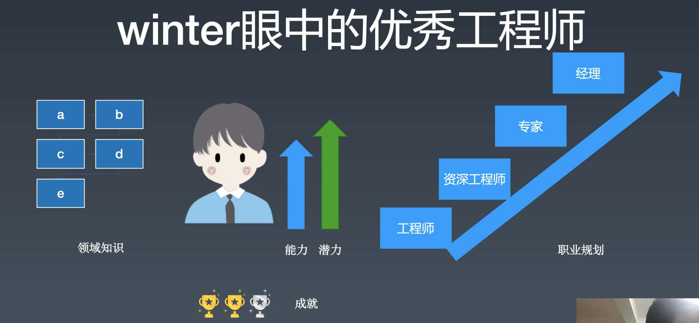

#### 面试

面试就是以上这些问题，你是要用能力来证明。

#### spa 导致内存占用过多

- 开发者工具 - momory

#### 确定内存问题的方法

二分法确认问题，删一半的代码去确认内存占用。

#### 如何千星 github

- 做一个能够帮助到大家的项目，而不是为千星而写项目

#### 推广项目

- 去各种网站推广，比如 stakeoverflow

#### 如何监控多个页面的性能

- 埋点，然后就 performance 对象的结果返回给服务器，这需要服务端给基础设施。

### 作业

- 写一下 url 的解析库。

## 课程涉及

### 参考链接：

- https://fed.taobao.org/blog/taofed/do71ct/fed-learning-quizzes-apply/?spm=taofed.blogs.blog-list.9.44fe5ac8p6qg66
- https://tools.ietf.org/html/rfc3986
- https://svn.apache.org/repos/asf/labs/webarch/trunk/uri/rev-2002/issues.html
- https://tools.ietf.org/
- https://github.com/spritejs/spritejs
- https://spritejs.org/#/

### 随堂作业：

- 把库里边的 URL 解析代码写一下

### 参考名词：

- UV：（Unique Visitor）独立访客，统计 1 天内访问某站点的用户数 (以 cookie 为依据)，如果清除了 cookies 或者更换设备访问，计数会加 1。按用户算的，比较真实一点。
- PV：（Page View）访问量, 即页面浏览量或点击量，在一定统计周期内用户每打开或刷新一个页面就记录 1 次。
- ctr：点击率（click-through rate）
- 判断用户活跃度：日活除以月活
- CICD：持续集成 (Continuous Integration) 和持续部署 (Continuous Deployment) 简称。
- SpriteJS：是跨平台的高性能图形系统，它能够支持 web、node、桌面应用和小程序的图形绘制和实现各种动画效果。
- 前端之巅：InfoQ 旗下关注大前端的技术社群
- 龙书：《编译原理》