# 重学 JavaScript | 词法，类型

[toc]

这节课开始讲 JavaScript，由最小的范围讲到最大的范围，细节到整体，字符到模块：

- Atom（词）
- Expression（表达式）
- Statement（语句）
- Structure（结构）
- Program/Module（程序/模块）

## Atom

JS 的 Atom 是基于 Unicode 的，可以理解为存储在内存中是以 Unicode 字符集中的某种编码方法存储的。

### Unicode

Unicode 是**字符集**，也就是它所规定的字符的集合。

在计算机领域中的字符集都有一个概念叫**码点（code point）**，比如「A」，就会对应到一个正整数 64 上，这个正整数就是这个字符的码点。

> 这里我想提醒一下自己，无论是我们社会中最常用的十进制，还是计算机只能读取的二进制，或者计算机科学中经常使用的八进制、十六进制，都是表示数，它们之间是可以相互转换的。只是这个数不一定用于像我们日常生活中的计数或者运算来帮助我们记录或是推算一些东西，而有可能用于编码或是存储，比如上面的 64 在 unicode 字符集中就表示 「A」

像「A」「a」这样的英文字符来自于我们计算机最早的字符集 [ASCII](https://zh.wikipedia.org/wiki/ASCII)。虽然 JS 没有使用 ASCII 字符集，但是今天所存在的字符集基本上都要兼容 ASCII 字符，ASCII 一共 128 个，而这 128 个字符中绝大多数字符与码点的对应关系在其他字符集中都得以被保留。

Unicode 是目前字符范围最广，也是得到最多支持和使用的字符集，因为它包含了世界各国的字符。

这是官网：https://home.unicode.org/ 。Unicode 最近在大力添加 emoji 字符，所以在官网上我们能看到很多 emoji **彩色字符**。

如果想要更加严肃的查看 unicode 字符的信息，请访问：https://www.fileformat.info/info/unicode/


#### 两个角度来看 Unicode：

- [Unicode Blocks](https://www.fileformat.info/info/unicode/block/index.htm)
- [Categories](http://www.fileformat.info/info/unicode/category/index.htm)

#### Unicode Blocks

如今 Unicode 的字符太多，如果只用 4 位十六进制数来表示已经不够用（大概是 16^4 = 65536）。

ASCII 字符集在 U+0000 到 U+007F，在很多时候也会要求 JS 代码在这个范围之内，也就是 ASCII 兼容的部分。

输出一下：

```js
let strArr = Array.from(new Array(128)).map((str,index) => String.fromCharCode(index))

//结果：
["", "", "", "", "", "", "", "", "", "	", "↵", "", "", "
", "", "", "", "", "", "", "", "", "", "", "", "", "", "", "", "", "", "", " ", "!", """, "#", "$", "%", "&", "'", "(", ")", "*", "+", ",", "-", ".", "/", "0", "1", "2", "3", "4", "5", "6", "7", "8", "9", ":", ";", "<", "=", ">", "?", "@", "A", "B", "C", "D", "E", "F", "G", "H", "I", "J", "K", "L", "M", "N", "O", "P", "Q", "R", "S", "T", "U", "V", "W", "X", "Y", "Z", "[", "\", "]", "^", "_", "`", "a", "b", "c", …]
// 这里的红色圆点就是各种空白字符
```

```js
let strObj = strArr.reduce((obj,str,index)=>{obj[index]=str;return obj},{})
0: ""
1: ""
2: ""
3: ""
4: ""
5: ""
6: ""
7: ""
8: ""
9: "	"
10: "↵"
11: ""
12: ""
13: ""
...
```

如今有很多 ASCII 字符都不再适用，并且有些字符是延续于早年的打字机，比如 U+000A 的 LINE FEED（进一行；换行） 和 U+000C 的 FORM FEED（进一张纸，翻页）。

以上的 ASCII 字符集属于 [Basic Latin](http://www.fileformat.info/info/unicode/block/basic_latin/index.htm) 这个 block 中。还有一个比较重要的 block 是 [CJK Unified Ideographs](http://www.fileformat.info/info/unicode/block/cjk_unified_ideographs/index.htm) ，因为我们最常用的中文字符就在其中。但是需要注意的是，并不是所有的中文字符都在其中，因为会有增补的部分加在 block 列表的后面，因此其中的数字并不是连续的，那么我们用正则去匹配 U+4E00 到  U+9FFF 就会不准确。

4位十六进制数表示的字符属于 BMP（**Basic Multilingual Plane** 基本的多语种平面），而 5 位十六进制数则不属于这个范围，比如  U+10000  U+1007F。在 JS 中处理超出 BMP 范围的字符集就需要使用 `String.fromCodePoint` 和 `''.codePointAt` API：

```js
String.fromCodePoint(0x1f625) // => "😥"
String.fromCharCode(0x1f625) // => " " 而使用 fromCharCode 则不能解析
```

其实之前我们使用 BMP 之外的字符场景非常少，自从出现 emoji 之后，因为 emoji 都是以 4 位十六进制数以上作为其码点。


JS 源码字符集是以 BMP 内为主，所以我们可以使用中文作为变量名的：

```js
let 厉害 = 1
console.log(厉害) // => 1
```

为什么我们平时会有一个最佳实践，不要将 ASCII 之外的字符放到源码中。

因为这里涉及到文件的字符编码问题，文件是可以选择多种不同的字符集来作为其对字符的编码解码方式，而不同的字符集对于相同的字符码会编码解码为不同的字符，而大部分字符集是兼容 ASCII 码的。

那么如果你必须要使用中文来作为源码的一部分，JS 也提供的一种方式来解决这个问题，使用 `\u` 转译表示这里使用的是 Unicode 字符集：

```js
for(let str of "厉害"){
    console.log(str.codePointAt().toString(16)) 
}
//5389
//5bb3

let \u5389\u5bb3 = 1
console.log(厉害) // => 1

// 在这里 \u5389\u5bb3 等同于 厉害

let \u5389害 = 1
console.log(厉害) // => 1

// 甚至可以混用
```

`\u` 除了可以使用在变量名的场景之外，也可以在字符串中使用。

> unicode 编码的文件中，`\u` 的转义写法和转义之后的原本字符在计算机看来是完全一样的，只是对于人而言是不同且不易阅读的。

> 但是不能作为 keywords，如下：
>
> ```JS
> // 将字符串转换为 4 位十六进制 unicode 编码
> function charToHexUniCode(str){
>     var res = ''
>     for( let s of str){
>         let code = s.charCodeAt(0)
>         let xCode = code.toString(16).padStart(4,'0')
>         res += `\\u${xCode}`
>     }
>     return res
> }
> 
> charToHexUniCode('var') // ===> "\u0076\u0061\u0072"
> 
> \u0076\u0061\u0072 foo = 1 // 报错：Uncaught SyntaxError: Keyword must not contain escaped characters 未捕获的SyntaxError：关键字不得包含转义字符
> ```

#### Categories

我们在 block 类别中可以看到是以编码数为基础，一部分连续的编码数形成一个块来进行分类的，而 Cotegories 则是以类型的不同，比如空格就有很多种：

- [ Separator, Space](https://www.fileformat.info/info/unicode/category/Zs/index.htm)

| Character                                                    | Name                      | Browser | Image                                                        |
| :----------------------------------------------------------- | :------------------------ | :------ | :----------------------------------------------------------- |
| [U+0020](https://www.fileformat.info/info/unicode/char/0020/index.htm) | SPACE                     |         | [view](https://www.fileformat.info/info/unicode/char/0020/space.png) |
| [U+00A0](https://www.fileformat.info/info/unicode/char/00a0/index.htm) | NO-BREAK SPACE            |         | [view](https://www.fileformat.info/info/unicode/char/00a0/nobreak_space.png) |
| [U+1680](https://www.fileformat.info/info/unicode/char/1680/index.htm) | OGHAM SPACE MARK          |         | [view](https://www.fileformat.info/info/unicode/char/1680/ogham_space_mark.png) |
| [U+2000](https://www.fileformat.info/info/unicode/char/2000/index.htm) | EN QUAD                   |         | [view](https://www.fileformat.info/info/unicode/char/2000/en_quad.png) |
| [U+2001](https://www.fileformat.info/info/unicode/char/2001/index.htm) | EM QUAD                   |         | [view](https://www.fileformat.info/info/unicode/char/2001/em_quad.png) |
| [U+2002](https://www.fileformat.info/info/unicode/char/2002/index.htm) | EN SPACE                  |         | [view](https://www.fileformat.info/info/unicode/char/2002/en_space.png) |
| [U+2003](https://www.fileformat.info/info/unicode/char/2003/index.htm) | EM SPACE                  |         | [view](https://www.fileformat.info/info/unicode/char/2003/em_space.png) |
| [U+2004](https://www.fileformat.info/info/unicode/char/2004/index.htm) | THREE-PER-EM SPACE        |         | [view](https://www.fileformat.info/info/unicode/char/2004/threeperem_space.png) |
| [U+2005](https://www.fileformat.info/info/unicode/char/2005/index.htm) | FOUR-PER-EM SPACE         |         | [view](https://www.fileformat.info/info/unicode/char/2005/fourperem_space.png) |
| [U+2006](https://www.fileformat.info/info/unicode/char/2006/index.htm) | SIX-PER-EM SPACE          |         | [view](https://www.fileformat.info/info/unicode/char/2006/sixperem_space.png) |
| [U+2007](https://www.fileformat.info/info/unicode/char/2007/index.htm) | FIGURE SPACE              |         | [view](https://www.fileformat.info/info/unicode/char/2007/figure_space.png) |
| [U+2008](https://www.fileformat.info/info/unicode/char/2008/index.htm) | PUNCTUATION SPACE         |         | [view](https://www.fileformat.info/info/unicode/char/2008/punctuation_space.png) |
| [U+2009](https://www.fileformat.info/info/unicode/char/2009/index.htm) | THIN SPACE                |         | [view](https://www.fileformat.info/info/unicode/char/2009/thin_space.png) |
| [U+200A](https://www.fileformat.info/info/unicode/char/200a/index.htm) | HAIR SPACE                |         | [view](https://www.fileformat.info/info/unicode/char/200a/hair_space.png) |
| [U+202F](https://www.fileformat.info/info/unicode/char/202f/index.htm) | NARROW NO-BREAK SPACE     |         | [view](https://www.fileformat.info/info/unicode/char/202f/narrow_nobreak_space.png) |
| [U+205F](https://www.fileformat.info/info/unicode/char/205f/index.htm) | MEDIUM MATHEMATICAL SPACE |         | [view](https://www.fileformat.info/info/unicode/char/205f/medium_mathematical_space.png) |
| [U+3000](https://www.fileformat.info/info/unicode/char/3000/index.htm) | IDEOGRAPHIC SPACE         |         | [view](https://www.fileformat.info/info/unicode/char/3000/ideographic_space.png) |

以上这些 space 在 js 中都是合法的 space，比如之前使用「零宽空格」让读你代码的人奔溃：

```js
'\uFEFF' // 输出一个零宽空格，然后将其复制到 var 和 zex 之间就可以了
varzex="zhaoenxiao"
zex //=>"zhaoenxiao"
```

> 注意，FEFF 不在以上列表中，因为 FEFF 也叫 BOM，用于微软当初为了区分文件所使用了一种方式之中。

## JS Lexical Grammar（词法）

```js
var \u5389\uu5bb3 = 1; // 这就是厉害两个字
厉害 // ==> 1

InputElement
 Whitespace 空白字符（如空格、tab 制表符、零宽字符等）
 LineTerminator 行终止符（换行符 回车）
 Comment 注释
 Token 词（和 word 不一样的词；记号；JS 中一切有效的东西）
```

- `Whitespace` `LineTerminator` `Comment` 在 JS 代码中被删除也不会有太大的影响（不过空格很重要，是隔断 token 的字符）
- 相对的 `Token` 就是一切有效的输入元素

### Whitespace

```
WhiteSpace ::
  <TAB> 		按下 tab 产生的空白
  <VT>  		纵向制表符
  <FF>  		换页
  <SP>  		普通空格
  <NBSP>		不打断字符
  <ZWNBSP>	零宽不打断字符
  <USP>			Unicode 所包含的空格
```

- 所有的 unicode whitespace 都可以

#### TAB

- 按下 tab 产生的空白
- 字符串 `'\t'` 
- 制表符，用于做表格很方便，同一列会对齐。
- 可以设置位数，早年计算机默认 8 位。

```js
'\t'.codePointAt(0) // => 9
```

- 尽量使用 `''.codePointAt` 和 `String.FromCodePoint` API

#### VT

纵向制表符

```js
'\v'.codePointAt(0) // => 11
```

#### FF(From Feed)

#### SP

普通空格，这个空格会 break 一个词，也就是分词。

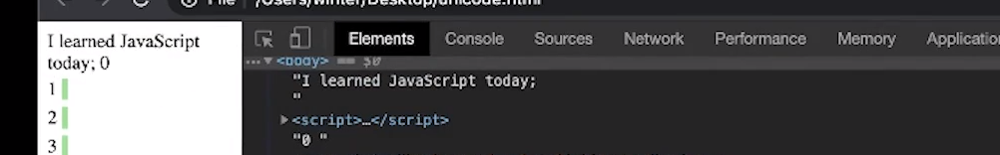

这里当我们将窗口的横向空间缩小，会看到这句话会换行，但其换行的方式是以词为单位的。

#### NBSP(NO-BREAK SPACE)

这也是我们经常在 html 中使用的空格 `$nbsp;` ，但其相对于 SP 而言是不会将单词与单词「打断」的，而是会将 NBSP 两边的单词看作一个整体：

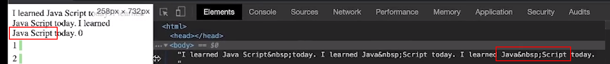

这里换行时，`Java Script` 会被看作是一个整体并没有被打断。

所以，其是一个处理排版的词。

```js
'\u00A0'
```

#### ZWNBSP

Zero width no break space

> winter 建议在工程上不要出现除 SP 之外的其他空格，一定要用也要使用 \u 转义

#### USP

就是上面那个列表中的，可以打印出来看看。

### LineTerminator

```
LineTerminator ::
  <LF> LINE FEED \n
  <CR> CARRIAGE RETURN （回车） \r
  <LS> LINE SEPARATOR
  <PS> PARAGRAPH SEPARATOR
```

- `<LS>` 和 `<PS>` 在 ASCII 之外，所以尽量少用。
- 我们一般使用的是 `\n` windows 的回车是 `\n\r` 
- 如果要做一个写代码的老实人，那就空格使用 SP，换行使用 LF


### Commet

- 单行注释 
  - `//` 双斜线开头，`\n` 换行符结束
- 和多行注释
  - 以`/*` 开头，以 `*/`  结束
  - 不能嵌套

后面会讲到注释如何影响代码结果。


### Token

```js
Token
	Identifier 	标识符
  Punctuator 	符号
  Literal 		字面量、直接量
  Keywords 		关键字
```

#### IdentifierName

```js
var a = 1;
var 厉害 = 2;

document.write("I'm alive");
```

- `a` `ducument` `write` `厉害` 在这里就是标识符

- Identifier 分为两部分，作为变量名的部分，比如 `a` 和 `厉害` （通过 `var` `let` `const` 关键字声明的词），和用作属性名的部分 `write` 

  - 变量名是不能使用关键字来命名的，而属性名是可以的。

    ```JS
    {
      get a()
    }
    
    var get = 1 // 有效
    
    document.body.className
    ```

    - `get` 很特殊，虽然它并不是一个关键字（可以用作变量名），但是却能有和关键字一样的特殊作用。
    - `dom` 元素的 `class` 属性之所以在 JS 中调用时是使用 `className` 来作为属性名，是因为 V3 版本不支持属性名使用关键字。而现在当你调用某个变量的 `class` 属性时不会报错，因为 JS 引入了新的词法解析基础设施。

#### Punctuator

```js
for(let i = 0; i < 128; i++){
  ...
}
```

- `=` `(` `)` `;` `<` 等等都是符号
- 符号其实和关键字差不多，都具有特定的功能

#### Literal

- Number
- String
- Boolean
- Object
- Null
- Undefined
- Symbol

```js
for(let i = 0; i < 128; i++){
  ...
}
```

- 这里的 `0` `128` 就是直接量、字面量
- 还有比如 `null` `true` `false` `'123'` 等等

##### Number

- 是以 IEEE 754 Double Float 作为标准实现
- `0.1` 和 `0.2` 在 IEEE 754 Double Float 中的表示方式并非我们所看到的那样

在内存中大概如下表示：

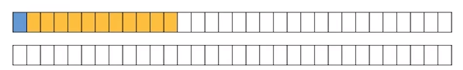

- Sign (1) 表示正负
- Exponent (11) 科学计数法
- Fraction (52) 精度

**语法：**

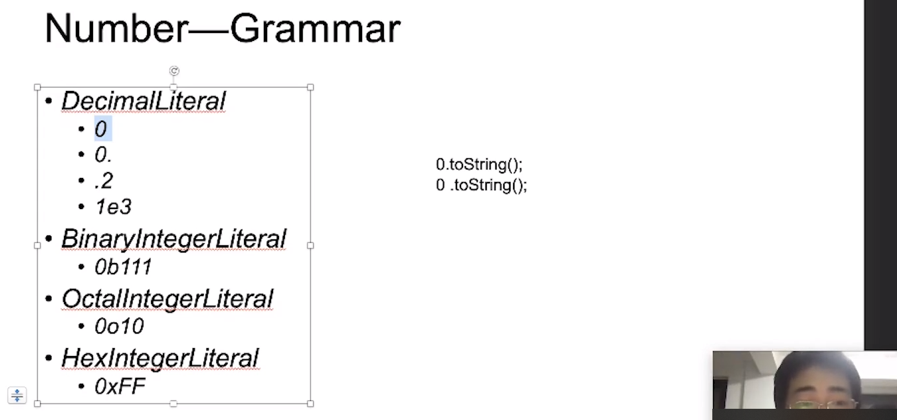

- 支持 10、2、8、16 四种进制的表示法
  - 这在以前是不支持的，那个时候我们需要使用 `parstInt('10', 8)` 来转换
- 其中十进制有 4 种写法


```js
0o10 + 1 // => 9
```

- 返回十进制数


```JS
97 .toString(2)
```

- 这里写成 `97 .` 而不是 `97.` 的原因是引擎优先会将 `.` 认为是 `97` 的一部分，将其作为一个数字整体，而不是作为读取属性值的操作。


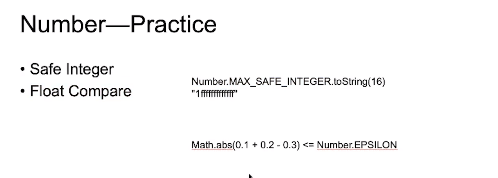

##### Sring

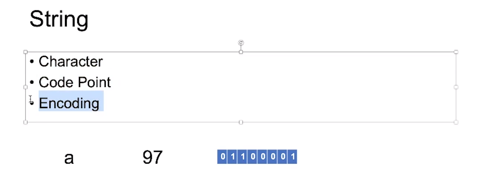

- a 十进制表示为 97，内存中表示为 `0110 0001`

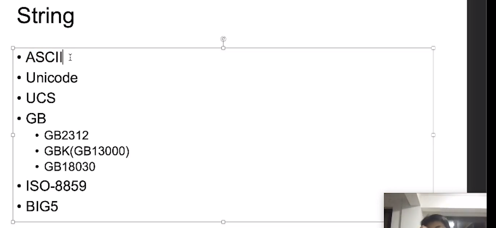

- UCS 是 Unicode BMP 范围内的字符，也就是 U+0000 ~ U+FFFF
- GB 国标，GB 和 Unicode 的字符编码基本完全不同，但是兼容 ASCII
- BIG5 繁体中文
- JS string 只会使用 Unicode 编码，准确一点说是 USC 编码，超过 BMP 范围的字符用当做两个字符，比如 emoji，只能使用 codePoint 系列的 API 才能解析。


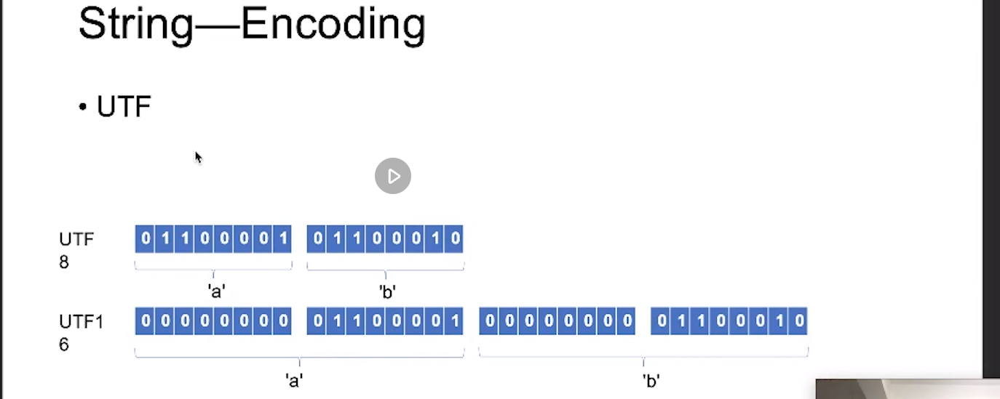

- Unicode 的 UTF 码点的存储方式
- 上面是 UTF-8 的存储方式，UTF-16 是下面的存储方式

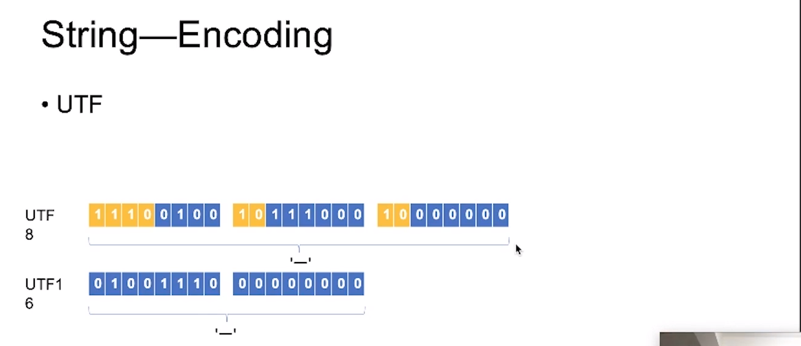

- 在 UTF-8 中当你遇到一个字符是以 `1110` 编码开头的，那么就会认为是三个字节存储。（有损）

  > 虽然 UTF-8 在内存中存储一个中文字符会占用三个字节，但是显示时，一个中文字符依然只会占两个英文字符的空间，也就是全角显示，当然英文也有全角显示。

- 而在 UTF-16 中是无损的。

- 虽然 UTF-16 存储中文等超出一个字节的字符时是无损的，但是存储 ASCII 码却是有损的，所以针对不同的情况而选择不同的编码方式可以做到节省资源。比如代码就可以多使用 UTF-8，因为基本以 ASCII 码为主，而如果是大量以中文、西文、拉丁文为主，则使用 UTF-16 能更好的节省空间。如果你特别的阔绰，你还能选择 UTF-32。（UTF-32 基本上没有使用，太耗内存）

- 在 JS 中默认是以 UTF-16 存储在内存中的，因此超出一个 BMP 范围之外的字符，不会认为是一个字符。


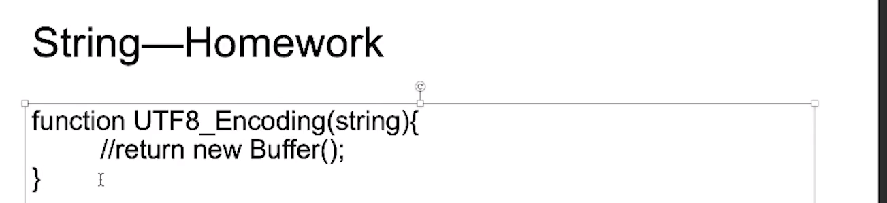


String 语法：

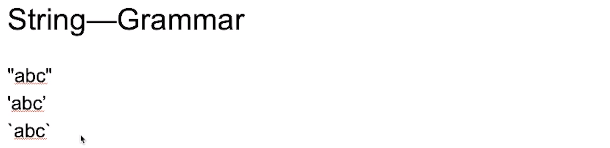

- `"\uXXXX"` 用于表示4位十六进制数的 unicode 编码字符，`"\xXX"` 用于表示 2 位十六进制数 unicode 编码字符
- `"\""` 其中的 `\"` 会被认为是一个字符，能够转义的字符还有以下这些：
  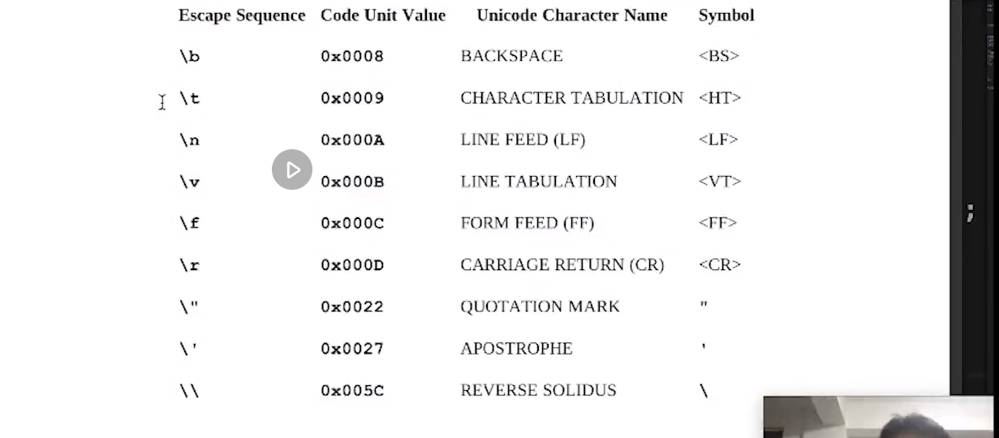
  
  - 这其中常用的是 `\n` 和 `\t` 

- `` 字符串模板

  ```js
  let sentance = 'Hello!'
  
  `I said: "${
  	sentance
  }" `
  ```

  - 这个字符串模板在引擎中分为三部分：
    -  `I said: "${ ` 
    - `sentance ` JS 表达式
    - `}" ` 
  - 不过**我们作为使用者（用户）而言不需要知道引擎是怎么去转换的**，但需要注意这使得规范上**顶级输入元素**有四个（除此之外也因为正则与 `/` 除号的冲突也单独做了区分）。不过呢，这对于使用者而言没有什么问题，而是对于实现的人而言会费很大的劲。

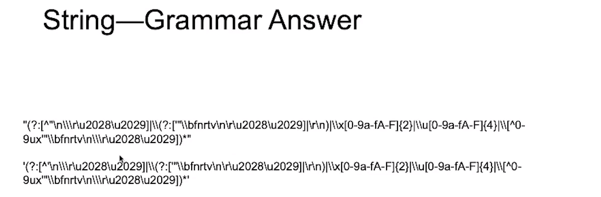


```js
a
/a/g
```

- 上面表示 `a/a/g` 而不是上面一个 a 下面一个正则。
- 有 `/` 出现的时候，先以识别为除号为主，然后再是正则。


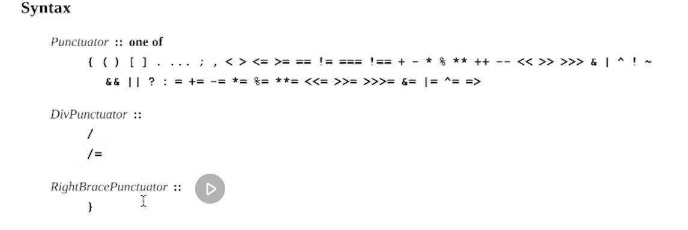

- 由于上面提到的 `/` 符号能作为除号，又能作为正则的字面量表示法，所以就从 `Punctuator` 中单独提出来定义命名为 `DivPunctuator` 
- `}` 也是一样

#### Keywords

```js
for(let i = 0; i < 128; i++){
  ...
}
```

- 这里 `for` 和 `let` 就是关键字，可以看到在代码编辑器中是会以特殊的颜色显示。
- 当特定的几个字符拼接在一起就成为了一个关键字，比如 `for` 是由 `f` `o` `r` 三个字符所组成的
- **Keywords 相当于一个特殊记号，有特殊的功能**。

### InputElement 输入元素

```js
InputeElement
	WhiteSpace
  LineTerminator
  Comment
  Token
  	Punctuator
    IdentifierName
    	Keywords
      Identifier
      Future reserved Keywords
    Literal
```

- `Punctuator` 和 `Keywords` 是帮助程序形成结构的
- `Identifier` 和 `Literal` 则是程序员所写出来的有效信息
- `Token` 下的这三类就形成了我们代码中的主体部分
- `Future reserved Keywords` 将来会使用的关键字，如今只剩下 `enum` 了


## 课后补充

- 如何理解文法？
  - （文法是语言结构的规则）
- UTF8 如何转换 GPK？
  - 这里 UTF8 与 GPK 属于不同字符集，在同一字符集中的不同编码之间转换是有自动化的方法的。在不同的字符集之间进行转换只能硬写对应关系，比如假设 "赵" 在 UTF8 是 36213 在 GPK 是 31263，那么就是指对应的去转换，属于硬编码，没有能够抽象的规则。
- 面试是要向面试官展示你的核心竞争优势，否则你什么都会那么一点也没有太大作用，打动不了面试官。
- 问题的价值是在于你的思考，如果一个问题在没有思考的情况下就获得了答案，这反而对你的思考会形成一种阻碍，所以要先尽量的思考如何去解答。
- HTML5 为什么现在没有 DTD 了，是否有什么替代？
  - HTML 的 DTD 从来不会被解析，他只是为了给人看的文档。
  - HTML5 没有 DTD 是彻底告别 SMGL 的一种行为。
  - 不要太纠结于 DTD 这个问题，课程中讲 DTD 是为了告诉大家 HTML 的由来。
- HTML4 其实只是语言设计上和 SGML 有关系，没有实际代码上的继承关系，所以 HTML4 也并不是用 SGML 的引擎去做的解析。
- 对于程序员最有价值的三个方面：操作系统、计算机网络、数据结构和算法
- 编译原理其实不是特别的重要，因为如果你不做编译器，而去学习编译原理的价值已经不高。其实，即使是龙书放到真正做编译的领域内也是很粗浅的，就像 JS 里也有很多传统的编译原理中并没有解决的问题。所以，基本上开始学的都是一些很理论的东西，如果真的要做一个相对完整能够使用的编译器，一定需要**在做的过程中去实践和学习的东西**。
- 前端学习什么操作系统？
  - 任意学习一个操作系统就可以了，主要是要理解操作系统的一些机制，就比如线程这个东西就是操作系统提供，并不是什么语言的多线程。如果不能理解操作系统的这些底层的东西，对于上层的语言这些就会理解不够透彻。
- V8 就别去看了，V8 的代码写的很槽糕，非常不适合新手去看。
- 今天讲的内存就是运行时的一部分。
- event loop 是 node 的概念，当然类似的东西浏览器中也肯定得有，因为毕竟不是说浏览器就执行完文档中的 JS 代码或者文件就完了，浏览器中也会触发事件也会 setTimeout 这样就会将一段一段的 JS 代码送给引擎去执行。
- `this.setState` 在 React 中是异步的
- 大部分工程师的晋升是靠工程体系，而在前端，工程体系基本上都是用 node 来做的。 
- 是否有只做 CSS 的前端？
  - 有的，比如大漠老师，一开始也是通过 CSS 进的阿里，不过后来也要补 JS 补工程化的东西。也就是说，可以一开始只专精于一个东西，之后再分阶段的去补充自己在前端体系中的知识，成为一个较为全面的工程师。 
- 前端的知识体系变化很快，所以要需要时刻更新。
- 课程主要还是以教给大家能力，而非结果。
- 如果没有能够写到简历中的项目，可以去参加一些开源项目。参加开源项目的过程：写文档、修 issue 分类、提 PR
- 浏览器会探测文件具体的字符编码，然后转为自己所需要字符编码。


## 涉及

### 课后作业：

- 写一个正则表达式 匹配所有 Number 直接量
  - 可参考 ECMA
- 写一个 UTF-8 Encoding 的函数
- 写一个正则表达式，匹配所有的字符串直接量，单引号和双引号

### 助教笔记：

- 链接：[ https://pan.baidu.com/s/1ZXlGGg6ev3Kq4udTR-mwqg ](https://pan.baidu.com/s/1ZXlGGg6ev3Kq4udTR-mwqg)提取码：ae7t

### 答疑回放：

- 链接：[ https://pan.baidu.com/s/18UOGFFeKa85dMtoUwUe-5Q](https://pan.baidu.com/s/18UOGFFeKa85dMtoUwUe-5Q)
  提取码：2z98

### 参考链接：

- 讲师提供：
  - https://home.unicode.org/
  - https://www.fileformat.info/info/unicode/
- 学员提供：
  - 计算浮点数的一个工具：[ https://github.com/camsong/blog/issues/9](https://github.com/camsong/blog/issues/9)
- 有助于你理解的知识：
  - 正则表达式：[ https://developer.mozilla.org/zh-CN/docs/Web/JavaScript/Guide/Regular_Expressions](https://developer.mozilla.org/zh-CN/docs/Web/JavaScript/Guide/Regular_Expressions)
  - 揭秘 0.1 + 0.2 != 0.3 https://www.barretlee.com/blog/2016/09/28/ieee754-operation-in-js/
  - ASCII，Unicode 和 UTF-8 ：[ http://www.ruanyifeng.com/blog/2007/10/ascii_unicode_and_utf-8.html](http://www.ruanyifeng.com/blog/2007/10/ascii_unicode_and_utf-8.html)

### 参考名词：

- [字符集](https://zh.wikipedia.org/zh/字符编码)：字符编码（英语：Character encoding）、字集码是把字符集中的字符编码为指定集合中某一对象（例如：比特模式、自然数序列、8 位组或者电脉冲），以便文本在计算机中存储和通过通信网络的传递。常见的例子包括将拉丁字母表编码成摩斯电码和 ASCII。其中，ASCII 将字母、数字和其它符号编号，并**用 7 比特的二进制来表示这个整数。通常会额外使用一个扩充的比特，以便于以 1 个字节的方式存储**。在计算机技术发展的早期，如 ASCII（1963 年）和 EBCDIC（1964 年）这样的字符集逐渐成为标准。但这些字符集的局限很快就变得明显，于是人们开发了许多方法来扩展它们。对于支持包括东亚 CJK 字符家族在内的写作系统的要求能支持更大量的字符，并且需要一种系统而不是临时的方法实现这些字符的编码。
- [Unicode ](https://zh.wikipedia.org/zh-hans/Unicode)：中文：万国码、国际码、统一码、单一码。是计算机科学领域里的一项业界标准。它对世界上大部分的文字系统进行了整理、编码，使得电脑可以用更为简单的方式来呈现和处理文字。
- [ASCII ](https://zh.wikipedia.org/wiki/ASCII)：（American Standard Code for Information Interchange，美国信息交换标准代码）是基于拉丁字母的一套电脑编码系统。它主要用于显示现代英语，而其扩展版本延伸美国标准信息交换码则可以部分支持其他西欧语言，并等同于国际标准 ISO/IEC 646。美国信息交换标准代码是这套编码系统的传统命名，互联网号码分配局现在更倾向于使用它的新名字 US-ASCII[2]。美国信息交换标准代码是美国电气和电子工程师协会里程碑之一。
- Token：记号、标记。JS 里有效的输入元素都可以叫 Token。
- [NBSP ](https://zh.wikipedia.org/wiki/不换行空格)：不换行空格（英语：no-break space，NBSP）是空格字符，用途是禁止自动换行。**HTML 页面显示时会自动合并多个连续的空白字符（whitespace character），但该字符是禁止合并的**，因此该字符也称作“硬空格”（hard space、fixed space）。Unicode 码点为：U+00A0 no-break space。
- [零宽空格](https://zh.wikipedia.org/zh-hans/零宽空格)：（zero-width space, ZWSP）是一种不可打印的 Unicode 字符，用于可能需要换行处。在 HTML 页面中，零宽空格可以替代。但是在一些网页浏览器（例如 Internet Explorer 的版本 6 或以下）不支持零宽空格的功能。
