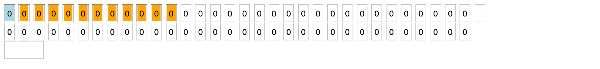
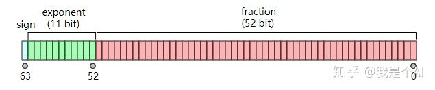
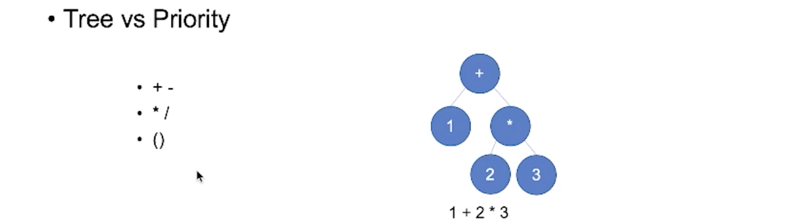
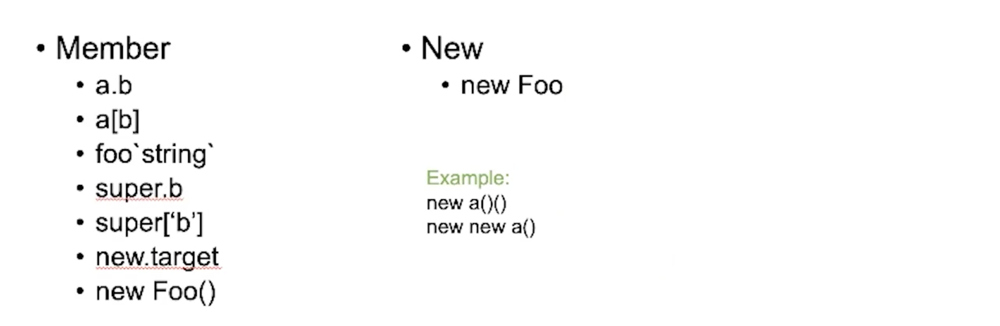
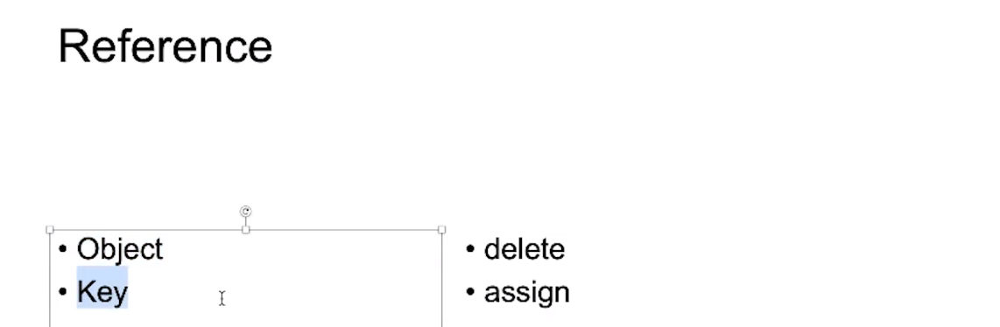
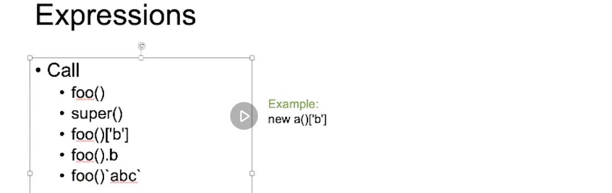
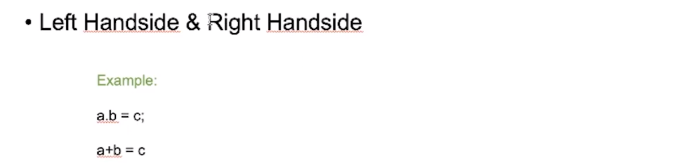
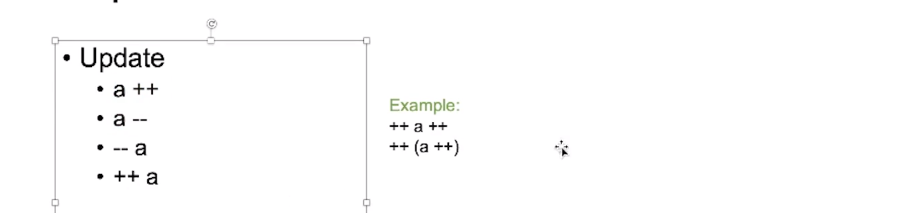
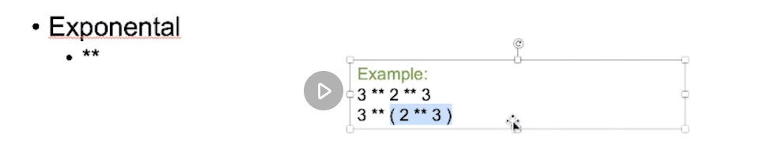
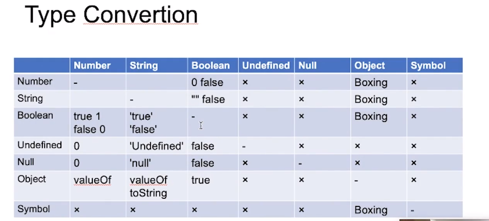

# 01.重学 JavaScript | 表达式，类型转换

[toc]

## 上节课遗留问题——IEEE 754

IEEE 754 Double Float 浮点数转换为位（bit）表示。


winder 提供的转换工具：https://jsfiddle.net/pLh8qeor/19/ 工具界面：



上面部分是二进制位（0和1 表示），下面输入框可以输入十进制浮点数。通过 vue 的 watch，将输入的浮点数转换为上面位的表示，从而可以更清楚的看到浮点数在内存中布局的情况，从而帮助我们理解 float。

### 一个机制

在讲这个机制之前，我们先来了解一下 IEEE 754 Double Float 具体是怎么来表示数字的。

> JavaScript 中的常规数字以 64 位的格式 [IEEE-754](https://en.wikipedia.org/wiki/IEEE_754-2008_revision) 存储，也被称为“双精度浮点数”。这是我们大多数时候所使用的数字，而这种“双精度浮点数”是用**二进制的科学记数法**来表示的，在计算机上是以二进制来进行存储的，单精度浮点数占用32位，双精度浮点数占用64位，如下图是 64 位双精度浮点数：
>
> 
>
> 最高位是**符号位(sign)**，**0**表示正数，**1**表示负数。接下来的11位储存的是的**指数(exponent)**，最后是52位储存的是**小数(fraction)**。浮点数的值可以用下面这个式子算出，类似于十进制的科学计数法。
>
> 
>
> 那么，既然谈到科学记数法，我们就来了解一下科学记数法。
>
> #### 科学记数法
>
> **科学记数法**（英语：Scientific notation，英国则称为 Standard form），又称为**科学记数法**或**科学记法**，是一种数字的表示法。 科学记数法最早由[阿基米德](https://www.wikiwand.com/zh-hans/阿基米德)提出。
>
> 在科学记数法中，一个[数](https://www.wikiwand.com/zh-hans/數)被写成一个[实数](https://www.wikiwand.com/zh-hans/實數)与一个10的次[幂](https://www.wikiwand.com/zh-hans/幂)的积：
>
> 
>
> 其中 ：
>
> - 必须是一个整数
> - （如果  是一个小于1的小数，或  大于等于10，皆可通过改变  来表示）
> - 是一个[实数](https://www.wikiwand.com/zh-hans/實數)，可称为**有效数**（英语：[significand](https://www.wikiwand.com/en/significand)）或尾数（英语：[significand](https://www.wikiwand.com/en/significand)）（英语：mantissa，在一些讨论[浮点数](https://www.wikiwand.com/zh-hans/浮點數)或[对数](https://www.wikiwand.com/zh-hans/对数)的文献中，亦使用尾数这个词，但定义与范围不一定相同，因此加以说明，以避免混淆）。
>
> 在[电脑](https://www.wikiwand.com/zh-hans/电脑)或[计算器](https://www.wikiwand.com/zh-hans/计算器)中一般用EXP或E（[Exponential](https://www.wikiwand.com/zh-hans/冪)）来表示10的幂：
>
> - 7.823E5=782300
> - 1.2e−4=0.00012
>
> #### 用科学记号的好处：
>
> 当我们要表示非常大或非常小的数时，如果用一般的方法，将一个数的所有位数都写出来，会很难直接确知它的大小，还会浪费很多空间。但若使用科学记数法，一个数的[数量级](https://www.wikiwand.com/zh-hans/数量级)、[精确度](https://www.wikiwand.com/zh-hans/精確度)和[数值](https://www.wikiwand.com/zh-hans/数值)都较容易看出，例如于[化学](https://www.wikiwand.com/zh-hans/化學)里，以[公克](https://www.wikiwand.com/zh-hans/公克)表示一个[质子](https://www.wikiwand.com/zh-hans/質子)[质量](https://www.wikiwand.com/zh-hans/質量)的数值为︰
>
> 
>
> 但如果将它转成科学记数法的形式，便可不需要写那么多零︰
>
> 
>
> 
>
> 又例如，若以[公斤](https://www.wikiwand.com/zh-hans/公斤)为表示单位，则[木星](https://www.wikiwand.com/zh-hans/木星)的质量值约为：
>
> 
>
> 像这样的大数亦无法直接用列出所有位数的方式表达出精确度，但科学记数法就能用下方形式明白的表示出来：
>
> 
>
> 所以，**比较两个数时，可以先看其数量级，也就是其次幂数的大小，然后再看其实实数（有效数）的大小**。
>
> #### 那么什么是实数？
>
> 在[数学](https://www.wikiwand.com/zh-hans/數學)中，**实数**是[有理数](https://www.wikiwand.com/zh-hans/有理數)和[无理数](https://www.wikiwand.com/zh-hans/無理數)的总称，前者如、、；后者如、等。实数可以[直观](https://www.wikiwand.com/zh-hans/直觀)地看作[小数](https://www.wikiwand.com/zh-hans/小数)（[有限](https://www.wikiwand.com/zh-hans/有限小数)或[无限](https://www.wikiwand.com/zh-hans/无限小数)的），它们能把[数轴](https://www.wikiwand.com/zh-hans/数轴)“填满”。但仅仅以[枚举](https://www.wikiwand.com/zh-hans/枚举)的方式不能描述实数的全体。实数和[虚数](https://www.wikiwand.com/zh-hans/虚数)共同构成[复数](https://www.wikiwand.com/zh-hans/复数_(数学))。
>
> #### 什么是有理数？
>
> [数学](https://www.wikiwand.com/zh-hans/数学)上，可以表达为**两个整数比**的数(, )被定义为**有理数**，例如，0.75(可被表达为)。整数和分数统称为有理数。与有理数对应的是[无理数](https://www.wikiwand.com/zh-hans/无理数)，如无法用整数比表示。
> 有理数与[分数](https://www.wikiwand.com/zh-hans/分數)形式的区别，[分数](https://www.wikiwand.com/zh-hans/分數)形式是一种表示比值的记法，如 [分数形式](https://www.wikiwand.com/zh-hans/分數)是[无理数](https://www.wikiwand.com/zh-hans/无理数)。
> 所有有理数的[集合](https://www.wikiwand.com/zh-hans/集合_(数学))表示为**Q**，Q+,或。定义如下：
>
> 
>
> 有理数的[小数](https://www.wikiwand.com/zh-hans/小数)部分有限或为[循环](https://www.wikiwand.com/zh-hans/循环小数)。不是有理数的[实数](https://www.wikiwand.com/zh-hans/實數)遂称为[无理数](https://www.wikiwand.com/zh-hans/無理數)。
>
> #### 什么是无理数？
>
> **无理数**是指除[有理数](https://www.wikiwand.com/zh-hans/有理数)以外的[实数](https://www.wikiwand.com/zh-hans/实数)，当中的“理”字来自于[拉丁语](https://www.wikiwand.com/zh-hans/拉丁语)的rationalis，意思是“理解”，实际是拉丁文对于logos“说明”的翻译，是指无法用两个[整数](https://www.wikiwand.com/zh-hans/整数)的比来说明一个无理数。
>
> 非[有理数](https://www.wikiwand.com/zh-hans/有理數)之[实数](https://www.wikiwand.com/zh-hans/實數)，不能写作两整数之比。若将它写成[小数](https://www.wikiwand.com/zh-hans/小数)形式，小数点之后的数字有无限多个，并且不会循环，即无限不循环小数（任何有限或无限循环小数可被表示称两个整数的比）。常见的无理数有大部分的[平方根](https://www.wikiwand.com/zh-hans/平方根)、[π](https://www.wikiwand.com/zh-hans/圓周率)和[e](https://www.wikiwand.com/zh-hans/E_(数学常数))（其中后两者同时为[超越数](https://www.wikiwand.com/zh-hans/超越數)）等。无理数的另一特征是无限的[连分数](https://www.wikiwand.com/zh-hans/連分數)表达式。
>
> [传说](https://www.wikiwand.com/zh-hans/傳說)中，无理数最早由[毕达哥拉斯](https://www.wikiwand.com/zh-hans/畢達哥拉斯)学派弟子[希伯斯](https://www.wikiwand.com/zh-hans/希伯斯)发现。他以几何方法证明无法用[整数](https://www.wikiwand.com/zh-hans/整数)及[分数](https://www.wikiwand.com/zh-hans/分數)表示。而毕达哥拉斯深信任意数均可用整数及分数表示，不相信无理数的存在。后来希伯斯触犯学派章程，将无理数透露给外人，因而被扔进海中处死，其罪名竟然等同于“渎神”。另见[第一次数学危机](https://www.wikiwand.com/zh-hans/第一次數學危機)。
>
> 无理数可以通过有理数的[分划](https://www.wikiwand.com/zh-hans/分划)的概念进行定义。
>
> ##### 举例
>
> 1. 
> 2. 
> 3. 
> 4. 
>
> 好的，这样我们就知道了什么是科学记数法，以及与科学记数法相关的概念，**总的来说，科学记数法就是一种表示数的形式**。那么为什么当用二进制科学记数法来表示十进制数时会出现精度丢失的问题？
>
> 这个问题首先要从**数位表示法**说起。今天我们看到的 `123` 这样的十进制数，能自然而然的理解其意义，但是有没有深究其内在的数学原理呢？
>
> 所谓十进制是 `0~9` 十个基本符号为基础的一种**数字表示法**，数位表示法是将一串**基本符号从左到右连续排列**的一种方法。为什么 `12` 是表示一十二，而不是二十一，或者是一加二的意思呢？因为数字所处的位置是有特别意义的，最右边第一个数字符号，代表基本的数0~9，而第二位的意义并不是`0~9`，而是`0*10`~`9*10`。推而广之，百位是`x*100`，（`x`是数字符号），用简练的数学公式就是`x*10^k `, 个位`k`是`0`，十位`k`是 `1` ，百位 `k` 是 `2` ，从右到左一直数下去。`123` 的意思就是`1*10^2+2*10^1+3*10^0`。
>
> **位置，进制，符号**这三者的关系就是 `“123”` 这种数字表示法内在的数学原理。
>
> 那么，`0.1` 是什么意思？是 `1*10^-1` ，向右数数的结果。**小数点是为了区分个位的位置在哪里**。
>
> 一个数要用**“数位表示法”**表示出来，必然需要能够化为`x*10^k`的形式，而并不是任意数都能够做到。从数位法小数的定义看可以得知，一个数要能够被表示出来，需要能除尽 `10`，才有若干个`x*10^k `的数位组合表示它，否则就是无数个符号才能表示。如`1/3`这个数除以`10`等于`1/3*1/10 = 0.0333333….`循环小数。
>
> 究竟哪些数可以用十进制表示哪些不可以？如**分母是10的因子和因子的合数**，如1，2，5，10，20，50等（当数的分母为 1 时，也就是整数的时候，由于其分母可以用任意数进行表示，所以是可以通过科学记数法进行表示的。比如 `2`，写成分数 `2 * 2 / 1 * 2`）。
>
> 回答题目，为什么`0.1`无法被二进制小数表示，`0.1`即`1/10`这个数要转换成二进制即`x*2^k`的组合数，必须要除尽`2`.要注意，`2`进制只有`0，1`两个符号，另一个需要注意，二进制被除数右移一位等于`*2`，而非`10`进制的`*10`。
>
> 那么 `2` 进制能够表示哪些十进制小数，`5/10`，因为能约成`1/2`，分母是`2`的因子。
>
> （这里让我感到迷惑的是，已经从十进制到二进制了，但为什么判断二进制是否能被除尽依然用十进制的数去考虑）
>
> 总结一点，就是**位置表示法**有其自身的缺陷，**并不能在有限的数位，表示众多有理数**，这个时候，需要**借助分数来帮忙，来避免位置表示法以固定数作分母这个缺点。**
>
> 
>
> 以上内容摘自：
>
> - [为什么0.1无法被二进制小数精确表示？](https://www.cnblogs.com/nobel/archive/2013/04/08/3009162.html)
> - [详解二进制浮点数](https://zhuanlan.zhihu.com/p/58731780)
> - [浮点数的二进制表示](https://www.ruanyifeng.com/blog/2010/06/ieee_floating-point_representation.html)


有效数字问题。比如 10 进制的有效数字，其第一位是非 0 的值，同理，二进制也是非 0 的值。而二进制与十进制的不同在于，其只有 0 和 1 两种数字。那么基于此，在 IEEE 754 中做了一个操作，它将第一位忽略不显示，原因是只要是二进制数其第一位不可能是 0，那么不是 0，就一定是 1，一定是 1 就可以省略从而能够节省一位的空间。

### 0

0 在内存中用位进行表示时，有正 0 和负 0，上图中就是第一个位（蓝色），0 表示正，1 表示负。

虽然有正零和负零，但是在数据层面来说是完全相等的，只不过在内存中的表示不同。

#### 如何区分是正零还是负零

```js
function check(zero){
  if(1/zero === Infinity){
    return 1
  }
  if(1/zero === -Infinity){
    return -1
  }
}
```

- 用 `1` 去除以这个 `0`，如果是正零，则等于 `Infinity` ，否则等于 `-Infinity`


衍生到取符号的方法：

```js
function sign(number){
  return number / Math.abs(number)
}

sign(100)  // => 1
sign(-200)  // => -1

sign(0) // => NaN
```

- 这个方法传入 0 时，会返回 `NaN` ，原因规范规定了 `0/0` 会返回 `NaN` ：

  > Division of a zero by a zero results in NaN; division of zero by any other finite value results in zero, with the sign determined by the rule already stated above.
  >
  > 零被零除以零的结果为NaN；零被任何其他有限值除以零的结果为零，其符号由上述规则决定。
  >
  > (from 12.7.3.2 Applying the / Operator)

那么我们就应该针对传入 `0` 的情况做处理：

```js
function sign(number){
  if(1/number === Infinity){
    return 1
  }
  if(1/number === -Infinity){
    return -1
  }
  if(1/number === 0){
    return 1
  }
  if(1/number === -0){
    return -1
  }
  return number / Math.abs(number)
}
```

- 当然其实不只是要处理 `0` ，还有对于传入非零值的处理，还有 `Infinity` 也会返回 `NaN`
- 所以要写一个完整、稳定的 `sign` 函数还是有点难度的。
- 要记得用去思考如何对 `sign` 做单元测试。


### 另一个问题

为什么 `Math.abs(1.3 + 1.1 - 2.4) < Number.EPSILON` 不对。

> `Number.EPSILON` 是用于测试浮点数的运算是否相等，比如：
>
> ```js
> x = 0.2;
> y = 0.3;
> z = 0.1;
> equal = (Math.abs(x - y + z) < Number.EPSILON);
> ```

这里 winter 给出的解释是，`1.3` `1.1` `2.4` 在转换为二进制时有三次精度丢失，然后再进行 `+` 和 `-` 的运算时会有两次的精度丢失，一共有五次的精度丢失，累计起来就会使其绝对值超过 `Number.EPSILON` 的值。但是呢，通过上面的 MDN 上给出的例子，一样也是所谓的五次精度丢失，所以这个可以将 winter 所说的原因证伪。

但是，他后面说的挺有道理。他说不同的浮点数进行转换时会产生不同的精度损失，所以我们应该设置一个自己的可接受损失值而不是使用环境所提供的 `Number.EPSILON` ，只是 `Number.EPSILON` 精度损失值是一个非常非常小的值，如果能小于它，那么说明计算的结果已经非常非常的准确了。

那么我们如何解决关于精度计算的问题？

最可靠的方法是借助方法 [toFixed(n)](https://developer.mozilla.org/en-US/docs/Web/JavaScript/Reference/Global_Objects/Number/toFixed) 对结果进行舍入：

```javascript
let sum = 0.1 + 0.2;
alert( sum.toFixed(2) ); // 0.30
```

请注意，`toFixed` 总是返回一个字符串。它确保小数点后有 2 位数字。如果我们有一个电子购物网站，并需要显示 `¥ 0.30`，这实际上很方便。对于其他情况，我们可以使用一元加号将其强制转换为一个数字：

```javascript
let sum = 0.1 + 0.2;
alert( +sum.toFixed(2) ); // 0.3
```

那么，我们来对 `1.3 + 1.1` 的结果进行验证，可以这样做：

```js
var a = 1.3;
var b = 1.1;
var isEqual = +(a + b).toFixed(1) === 2.4
isEqual // => true
```


## Expression 表达式

上节课我们讲了 Atom 部分，也就是词法部分，这节课开始我们将要进入语法部分的讲解。

Expression 是一个基础结构（基本单元 unit），**通过这个结构我们可以让计算机做最为重要的工作：计算**。大部分的主体内容也是由 Expression 来做的。

我们会分成 Grammar（语法）和 Runtime（运行时）两部分来讲。

> Any unit of code that can be evaluated to a value is an expression
> **可以求值的任何代码单元**都是表达式
>
> Since expressions produce values, they can appear anywhere in a program where JavaScript expects a value such as the arguments of a function invocation. As per the MDN documentation, JavaScript has the following expression
> 由于表达式产生值，因此它们可以出现在JavaScript期望值的程序中的任何位置，例如函数调用的参数。根据MDN文档，JavaScript具有以下表达式
>
> From：https://medium.com/launch-school/javascript-expressions-and-statements-4d32ac9c0e74

### Grammar

表达式中运算符的优先级是通过生成树的结构来实现的：



比如上图中的表达式 `1 + 2 * 3` ，其实是将 `+` 的左边与右边分别生成两个节点，由于右边又是一个由运算符 `*` 组成的新的表达式 `2 * 3` ，所以又生成了新的节点。

运算符的优先级是从使用者（程序猿）的角度来说的，而从语言的实现和定义的角度来看，而被称为树的结构或者语法，这部分内容实际上在产生式那一节有讲。

#### Member & New

Member 可以直接认为是**取属性的运算**，属性或是成员访问



Member 和 New 运算符是**优先级最高的运算符**。

> MemberExpression 在 ECMA-262 12.3 Left-Hand-Side Expressions 章节。


Member 有如下具体的表达方式：

- `a.b`  

  - 访问属性成员

- `a[b]` 

  - 传入字符串就和 `a.b` 等效，只是可以传入表达式，传入变量可以在运行时动态访问数据。比如来自于用户输入。

- `super.b` && `super['b']`

  - `super` 可以当作构造函数来使用，不过只能在 `class` 环境中使用，比如在 `constructor` 或是方法成员中调用。

  - `super` 关键字用于访问和调用一个对象的父对象上的函数。

  - `super` 可以像构造器去使用，也可以用于访问其父对象上属性，访问之前需要先调用 `super()` 来实例化一个父类对象：

    ```js
    class Parent{
    	constructor(){
        this.a = 1;
      }
    }
    
    class Child extends Parent{
      constructor(){
    		super(); // 我理解为实例化一个父类对象,并将其绑定到 this 上，这样才能在之后访问其属性
        console.log(this.a)
    	}
    }c
    ```

- `new.target`

  - 这个表达式只能完全的使用这几个字符来访问，而不能 `new.xxx` 这样。
  - 同样，这个表达式只能在构造函数中使用。
  - **`new.target`**属性允许你检测函数或构造方法是否是通过[new](https://developer.mozilla.org/zh-CN/docs/Web/JavaScript/Reference/Operators/new)运算符被调用的。在通过[new](https://developer.mozilla.org/zh-CN/docs/Web/JavaScript/Reference/Operators/new)运算符被初始化的函数或构造方法中，`new.target`返回一个指向构造方法或函数的引用。在普通的函数调用中，`new.target` 的值是[`undefined`](https://developer.mozilla.org/zh-CN/docs/Web/JavaScript/Reference/Global_Objects/undefined)。
  - `new.target` 用于什么地方？
    - 用于判断函数是否是通过 `new` 来调用的，并且能够知道是在 `new` 哪一个函数。因为非 `new` 时，其值为 `undefined` 。
    - 不过能判断是否通过 `new` 来调用基本上用不到，只是对于某些库的作者不希望使用者通过非设计方式来调用，或者说可以知道这个构造函数是通过什么方式来调用从而采取不同的处理方式，这属于防御性的 Feature.

- ```js
  foo`string`
  
  var name = 'enxiao'
  
  function foo(){
    console.log(arguments)
  }
  
  foo`Hello ${name}!`
  // =>
  0: Array(2)
  	0: "Hello "
  	1: "!"
  	length: 2
  	raw: (2) ["Hello ", "!"]
  1: "enxiao"
  ```

  - 将字符串和变量分为两个序列传入函数中，这就像之前讲字符串模版时所说的，会将字符串模版分段，将表达式与字符串进行分割，传入函数时，字符串部分放入一个数组作为函数第一项参数，之后再依次传入每一个表达式的返回值作为函数的另外参数，最后调用。
  - 这个可以用于之后写四则运算题。

- `new Foo()` 与 `new Foo` 的优先级不同。

  ```js
  function class1(){
  	return 'class1'
  }
  
  function class2(){
    return class1;
  }
  
  new class2 // => 这里是 f class1(){} ，如果构造函数内部返回了一个对象，则在通过 new 关键字进行实例化时会返回这个对象，而不是类的实例
  
  class2() // => f CLASS1(){} 与如上的结果相同
  
  new new class2()
  
  //上面这个表达式程序如何理解？
  //是以 new (new class2)() 来执行
  //还是以 new (new class2()) 来执行
  //答案是第二种
  ```


#### Reference



member 运算所返回的类型是： `Reference` 类型

```js
var o = {x: 1};
o.x + 2 // => 3
1 + 2 // => 3
// 以上，从执行结果来看没有任何区别
delete o.x
delete 1 
// 但当通过 delete 去操作时就不同了
```

- 之所有 `delete` 可以对 `o.x` 进行操作，是因为 `o.x` 会返回 `Reference` 类型
- 在进行加法运算时，会将引用类型的值找出然后进行计算。

`Reference` 类型由两部分组成：

- Object （上面式子中的 `o` ）
- Key （上面式子中的 `x` ）

`Reference` 很像指针概念的东西，是既能读又能写的参数。比如，`+` 号运算符有读的能力，而 `delete` 操作符有写的能力。

有写的能力的运算符有两个：

- `delete`
- `assign`

我们也可以认为引用类型只有在写的时候才和其他的数据类型有区别，在读的时候都是一样的。（我觉得这里之所以这样说，是指针对于这个运算符操作的时候，因为当你执行 `o.x + 2` 和 `1+3` 实际上对于 `+` 这个运算符来说确实没有区别，但是对于整个程序来说差别就大了，一个是动态值而另一个是静态值，在程序运行时是可能完全不同的两个值）

#### call

接下来讲比 `new` 优先级更低的表达式 `call` ：



对于 `new a()['b']` 会先执行 `new a()` 再执行 `['b']` 访问成员，而不是先执行 `a()['b']` 再 `new`

> 这并不是因为 `new` 的优先级高，而是因为当优先级相同的情况下，是优先从左侧开始执行。

#### Left Handside & Right Handside



上面学到的 `Member` `new` `call` 三种表达式可以属于 `Left Handside` ，其余表达式属于 `Right Handside` 

**Left Handside & Right Handside 指的是等号的左边与右边**。也就是有些表达式只能放到等号左边，有些表达式只能放到等号右边。所以在不同的语言部分都有这个概念。

```js
let obj = {};

function foo(){
	return obj
}

foo() = 1 // 会报错，但是并不是说这不符合语言规范，只是宿主（host）不允许这样做，算是一种约定俗成的规范
foo()['b'] = 2 

obj // => {b: 2}
```

#### Update



由于环境不允许出现 `++ a ++` 这样的语句，所以允许去深究前自增与后自增的优先级问题。

```js
 var a = 1, b = 1, c = 1;
a
++
b
++
c
[a, b, c] // => [1, 3, 3]
```

- 可以看到是 `b` 和 `c` 自增了，这是因为 `a ++` ，`a` 的后面不允许出现换行符。

#### Unary（单目运算符、一元运算符）


- 这里要注意 `await` 也是单目运算符。（可以认为文字和符号都是运算符）

- `void` 在 js 中是一个运算符，其运算结果是 `undefined` ，无论其后是什么。

  - 对于运行时来说没有什么作用。

  - 不过它有一个非常重要的作用是生成 `undefined` ，比如 `void 0` ，这是因为 `undefined` 在 js 中可以作为变量来使用，当你用一个被赋于其他值的 `undefined` 赋值给一个变量时就会发生错误。所以，如果要使用 `undefined` 值，就使用 `void 0` 来代替。

  - `void` 也能像空格一样起到改变语法结构的作用。比如：

    ```js
    for(var i = 0; i < 10; i++){
        var button = document.createElement('button');
        button.innerHTML = i
        (function (i){
    			button.onclick = () => console.log(i)
    		})(i)
        document.body.append(button)
    }
    ```

    在这个例子中，为了保证每一个按钮点击所打印的数字都是其按钮上显示的数字，我们使用了 IIFE（立即执行函数表达式）来产生一个闭包存储不同的 `i` 值。但这里的 IIFE 是通过添加在函数外层添加括号的方式来实现的，但其会产生问题，如下：

    ```js
    (function (i){
    			button.onclick = () => console.log(i)
    })(i)
    (function (i){
    			button.onclick = () => console.log(i)
    })(i)
    ```

    当存在上面 IIFE 之后没有添加分号的情况时，就会将下面 IIFE 认为是上面语句的一部分，从而可能产生错误。所以这里我们可以使用 `void` 来产生一个 IIFE：

    ```js
    for(var i = 0; i < 10; i++){
        var button = document.createElement('button');
        button.innerHTML = i
        void function (i){
    			button.onclick = () => console.log(i)
    		}(i)
        document.body.append(button)
    }
    ```
    
    使用 `void` 来实现 IIFE 的原理是，**只要语句不是以 `function` 开头则认为是表达式，函数表达式可以直接调用。**

- `~` 是按位取反，之后会有课程专门讲位运算。

- `! ` 非运算，我们可以使用 `!!a` 来做转化为布尔值的运算。


#### Exponential（指数运算）



指数运算是唯一一个右结合的运算符。

#### Multiplicative（乘法）

- `*` `/` `%`

#### Additive （加法）

- `+` `-`

#### Shift（左右移位）

- `<<` `>>` `>>>`

#### Relationship（关系）

- `<` `>` `<=` `>=` `instanceof` `in`

#### Equality（等式）

- `==` `!=` `===` `!==`

#### Bitwise（按位）

- `&` `^` `|` 

#### Logical（逻辑运算）

- `&&`  `||`

- 逻辑运算是短路逻辑，当某一表达式的结果符合`&&` 或 `||` 预期值（`&&` 预期 `falsy` 值，`||` 预期 `truthy` 值）则直接返回，比如：

  ```js
  function foo1(){
    console.log('foo1')
    return false
  }
  
  function foo2(){
    console.log('foo2')
  }
  
  foo1() && foo2() // => false 并打印 1
  ```

  这里由于 `foo1()` 返回 `false` 造成整个表达式被短路，`foo2()` 并没有执行。

  所以，并非先将两边的表达式都执行完之后再做运算。

#### Conditional

- ` x ? y : c` 三目运算符和上面两个逻辑运算符相同同样是短路逻辑。如果 `x` 为 `true` 则执行 `y` 否则执行 `c` ，并不会两者都执行。


> 问题：JS 中有几种加法？
>
> 两种，number 之间和 string 之间
>
> 有几种乘法
>
> 一种，number 之间相乘


以上我们所学习的大多数运算符都是支持所有数据类型，但却并不是对所有的数据类型都能做运算，所以这里就涉及到类型转换的问题。

比如：

- 加法要么两边是数字，要么两边是 `string`。
-  `a.b` （`member`），其左边一定是一个对象，所以你得转成对象，右边可以是 `Symbol` 或是 `string`。
- `a++` 的 `a` 必须是一个 `number` 
- `delete a.b` 右边得是一个 `Reference`
- `typeof a` 右边是什么都可以
- `~ a` 右边是 `number` 还得是整数（小数也可以，不过会忽略小数部分）
- `await a` 右边得是 `Promise`
- `in` 前面是 `symbol` 或 `string` 后面是 `obj`

### Type Conversion

> MDN 上关于 JS 类型的说明：[JavaScript data types and data structures](https://developer.mozilla.org/en-US/docs/Web/JavaScript/Data_structures)




##### 装箱

原始类型 -> 对象类型

- `Number` `String` `Boolean` `Symbol` 四个类正好对应四种原始数据类型 `number` `string` `boolean` `symbol` ，需要注意的是它们是不同的东西，通过 `typeof` 就能看到其输出的类型不同。**在使用它们进行运算时，会因为不同运算符而相互转换**。

- `Number` `String` `Boolean` 在不使用关键字 `new` 调用时，则是显示的做类型转换，比如 `String(1)` 会将 `number` `1` 转换为 `string` `'1'` 。所以，对于需要转换为原始类型，推荐使用这种显式的方式，虽然代码上看起来冗余，但提高了可读性，对理解代码实际语义有帮助。

  而使用 `new` 调用时则会将传入的原始类型装箱返回对象。除了使用这三种类来进行装箱之外，也可以使用 `Object` 进行装箱，比如 `Object('s')` ，会返回一个 `String` 的对象。`Object` 使用 `new` 和不使用都相同。

- `Symbol` 只能通过直接调用来获取一个 `symbol` 类型的值，而不能通过 `new` 来调用得到一个 `Symbol` 类对象，会提示 `Symbol is not a  constructor` ，但是可以通过 `Object` 来装箱获取：

  ```js
  Symbol('11') // => Symbol(11)
  typeof Symbol('11')  // => "symbol"
  
  typeof Object(Symbol('11')) // => "object"
  
  Object(Symbol('11')).constructor  // => ƒ Symbol() { [native code] }
  
  Object.getPrototypeOf(Object(Symbol('11'))) === Symbol.prototype // => true
  
  Object(Symbol('11')) instanceof Symbol // => true
  ```

  - 可以看到，`Symbol` 除了不能 `new` 之外，具备了 JS 类的其他特性，有 `prototype` `constructor` ，也能通过 `instanceof` 来查看被装箱后的值是否是 `Symbol` 的实例。

- 除了使用 `Object` 进行装箱之外，还可以使用以下方式来进行装箱：

  ```js
  (function (){return this}).apply(Symbol('1')) // => Symbol {Symbol(1)}
  ```

  - `apply` 的调用和使用 `.` 来访问相同，从而造成装箱的效果。（这里不是很明白）

- **装箱是将原始类型包装为相应的对象类型**，对于 `number` `string` `symbol` `boolean` `bigint` 而言是有相应的类，而 `null` `undefined` 没有，通过 `Object` 进行装箱会返回一个空对象，而不是对应的类的实例对象。


##### 拆箱

对象类型 -> 原始类型

先看原始类型与对象类型相加的例子：

```js
1 + {} // =>"1[object Object]"

1 + {valueOf(){return 1}} // => 2

1 + {toString(){return 2}} // => 3

1 + {toString(){return '2'}} // => "12"

1 + {valueOf(){return 1},toString(){return '2'}} // => 2

'1' + {valueOf(){return 1}, toString(){return '2'}} // => "11"

1 + {[Symbol.toPrimitive](){return 'toPrimitive'},valueOf(){return 1},toString(){return '2'}} // => "1toPrimitive"
```

- 在对象没有提供 `valueOf` 或是 `toString` 方法时，会调用其原型上的 `toString` 方法或是 `valueOf` 方法。
- 如果对象上有 `valueOf` 或是 `toString` 方法时则会返回这个方法的调用结果作为其拆箱的值，如果两个方法都有，则以 `valueOf` 为主。
- 除了以上两个方法之外，如果对象上有 `[Symbol.toPrimitive]` 方法，则以这个方法的结果为主。

上面我们是返回原始值，我们试试返回对象值：

```js
1 + {[Symbol.toPrimitive](){return {}},valueOf(){return 1},toString(){return '2'}} // VM13504:1 Uncaught TypeError: Cannot convert object to primitive value at <anonymous>:1:3

1 + {valueOf(){return {}},toString(){return '2'}} // => '12'

1 + {valueOf(){return {}},toString(){return {}}} // VM13654:1 Uncaught TypeError: Cannot convert object to primitive value at <anonymous>:1:3
```

- `[Symbol.toPrimitive]` 不允许返回非原始值
- 当 `valueOf` 返回对象值，则返回 `toString` 的值
- 最后是不能都返回为非原始值

这部分也可以去看一下规范。或是看看现代的 JS 教程：https://zh.javascript.info/object-toprimitiv 

从现代 JS 教程中，能看到 `[Symbol.toPrimitive]` 方法实际会接受一个叫做 `hint` 的值：

```js
let user = {
  name: "John",
  money: 1000,

  [Symbol.toPrimitive](hint) {
    alert(`hint: ${hint}`);
    return hint == "string" ? `{name: "${this.name}"}` : this.money;
  }
};

// 转换演示：
alert(user); // hint: string -> {name: "John"}
alert(+user); // hint: number -> 1000
alert(user + 500); // hint: default -> 1500
```

而这个 `hint` 就是指当一个对象被用在需要原始值的上下文中时，环境所「暗示」其转换的类型。有三种：`string` `number` `default` 


## 课后问答：

哪里能找到 ECMAScript 的测试用例？

- https://github.com/tc39/test262

如何防止下载用于显示在浏览器上的 pdf 问题？

- 这个没有办法，因为文件在用户的浏览器上，那么这个资源用户就有权下载，只是你可以通过一些方式来使用户下载的成本变高。
- 在浏览器端，用户的权限是高于前端代码能做到的权限的，并且很多时候你也需要获得用户的权限。


## 课程涉及内容

### 预习课件：

- 链接：[ https://pan.baidu.com/s/1jhqWjUk3K-HHmLpblRK-eg](https://pan.baidu.com/s/1jhqWjUk3K-HHmLpblRK-eg)
  提取码：yxa5

### 课后作业：

- 根据课上讲师已写好的部分，补充写完函数 convertStringToNumber
- 以及函数 convertNumberToString


### 参考链接：

- 讲师提供：
  - https://jsfiddle.net/pLh8qeor/19/
- 学员提供：
  - 运算符优先级：[ https://developer.mozilla.org/zh-CN/docs/Web/JavaScript/Reference/Operators/Operator_Precedence](https://developer.mozilla.org/zh-CN/docs/Web/JavaScript/Reference/Operators/Operator_Precedence)

### 参考名词：

- LeftHandSideExpression：ECMA-262.pdf 201 页 12.3
- UpdateExpression：ECMA-262.pdf 178 页 11.9.1
- [IIFE ](https://zh.wikipedia.org/wiki/立即调用函数表达式)：Immediately-invoked Function Expressions 立即执行的函数表达式