# 02.重学 JavaScript | 语句，对象

[toc]

## Statement 语句

- 在 JS 中我们怎么去定义、理解语句。

> A **computer program** is a list of "instructions" to be "executed" by a computer.
>
> 计算机程序是计算机要“执行”的“指令”列表。
>
> In a programming language, these programming instructions are called **statements**.
>
> 在编程语言中，这些**编程指令**称为语句。
>
> A **JavaScript program** is a list of programming **statements**.
>
> JavaScript 程序是编程语句的列表。
>
> 
>
> From：https://www.w3schools.com/js/js_statements.asp

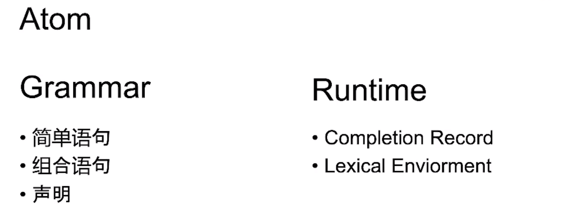

### Grammar

首先我们来将语句分个类，在 Grammar 层面有三种分类：

- 简单语句
  - 只有一句，比如调用 `foo()` 
- 组合语句
  - 可以嵌套简单语句
- 声明
  - 会产生特殊行为


### Runtime

- 内置类型
  - 除了我们之前所说的八种从语法层面来说的数据类型之外，在 Runtime 中还有很多**内置类型**，虽然这些类型我们在写代码时碰不到，但当程序运行时它们却确实存在于内存之中。 

- 两个概念：
  - Completion Record
    - 早期版本就叫 Completion，指语句的执行结果
  - Lexical Enviorment
    - 初始词法环境


#### Completion Record

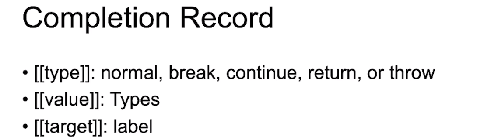

这个类型有三个字段：

- [[type]]；语句完成的类型，有五种取值，对应四个语句（除 normal 之外的）。
- [[value]]；之前所讲的八种语言类型。除此之外还有空值 `empty` 
  - 目前，只有 `throw` 和 `return` 会带这个字段
- [[target]]；一定是个 label

这些都是指**语句完成后**状态的描述。虽然 Completion Record 如果不去读规范，可能都不知道有这么个东西，但是它却在影响着语句的行为。之后也会在不同的语句中讲解它是如何发挥作用的。（以下简称 CR）


### 简单语句

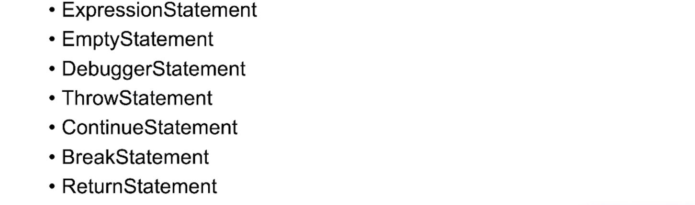

其中三个产生 normal，四个产生非 normal。

**复杂语句中都是根据其产生的 type 来决定自己的执行过程。** 

#### ExpressionStatement（表达式语句）

表达式本身就可以构成一个语句，也是语句中最主体的 部分，其告诉计算机做运算。

```js
a = 1 + 2;
```


#### EmptyStatement（空语句）

也就是一个分号 `;` 

```js
;
```


#### DebuggerStatement（调试语句）

 这个语句对于运行时而言不会发生任何作用，比如用户的电脑上，但是其在控制台中用于调试，产生中断，是规范留给引擎去实现的一个东西。

```js
debugger
```


#### ThrowStatement

其后面可以跟一个表达式

```JS
throw a;
```


#### ContinueStatement

```js
continue;
// or
continue [label1];
```

- 可带 `label` 

#### BreakStatement

```js
break;
// or
break [label2];
```

- 可带 `label`

#### ReturnStatement

其后面可以跟一个表达式

```js
return 1 + 2;
```


### 复合语句

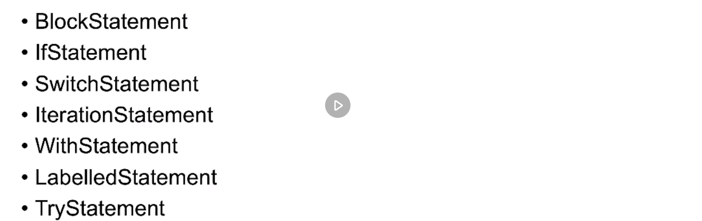

#### BlockStatement

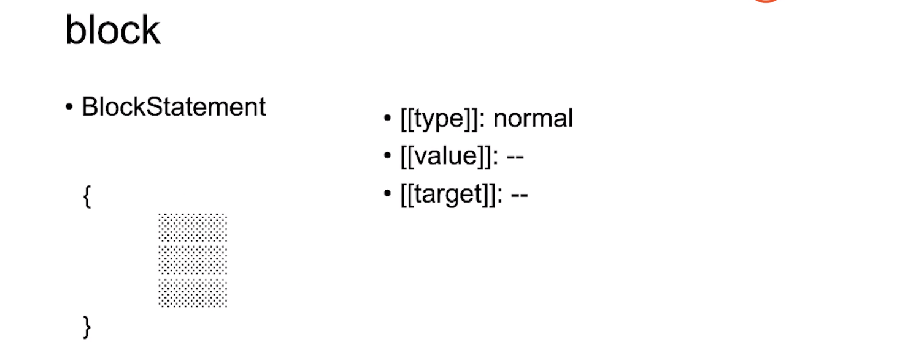

- 其由一对 `{}` 括起来构成，和对象的直接量构成方式相同。

- 会将多条语句括起来之后变成像是一条语句。所以它是形成我们语句非常关键的一个因素。

- 在最新的 ECMA 中，还能为 `let` 和 `const` 提供作用域。所以你可以在控制台中这样写代码：

  ```JS
  {
    const a = 1;
  }
  
  {
    const a = 1;
  }
  ```

- 正常情况下 BlockStatement 的执行结果就是 normal，但如果其内部 statement list 中的语句产生了非 normal 的结果则执行过程会被中断，比如：

  ```js
  {
    const a = 1;
    throw 1;
    const b = 2;
    console.log(b)
  }
  ```

  - 这里因为 `throw 1` 语句而中断了 block 语句的中的执行过程。

  - 这也是 `throw` `continue` `break` `return` 能够改变代码、语句执行顺序的基础逻辑，都在 block 中。

  - 不过对于 `continue` `break` `return` 需要在特定的语句下才能执行，比如 `continue` 需要在迭代语句中。否则会报：

    ```
    Uncaught SyntaxError: Illegal continue statement: no surrounding iteration statement
    ```

- blockstament 虽然很简单，其 block 内的语句是顺次执行，**但如果其中某个语句产生了非 normal 的结果，就会打断这样的执行状态**，从而能够产生代码结构化的特点（不是很懂，这个后面应该在讲代码结构化的部分会讲到）。

- 从这里我们可以看出，**CR 的 type 是非常重要的东西，能够控制语句执行不执行，怎么执行。**


#### Iteration

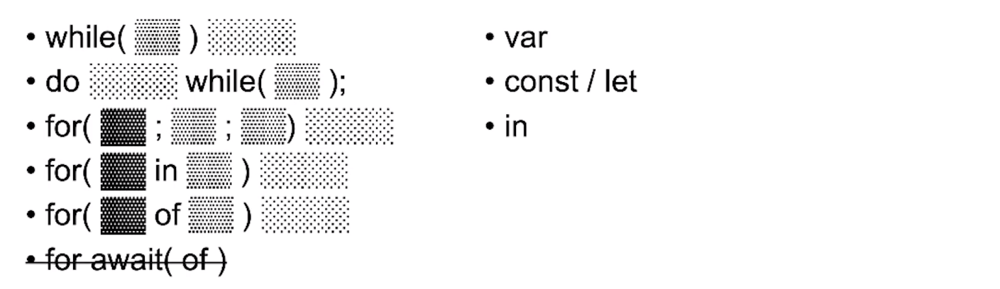

这里先讲前 5 种，`for await(of)` 等着之后讲结构化，promise 的部分再展开。

Iteration 语句和别的语句不同的是，语句可以执行多次，而其他的只会执行一次。

上面偏黑色的部分可以声明变量，稍浅的部分可以放表达式，再浅的部分可以放 block statement

- `while` 是由一个表达式（条件） + 语句的结构组成，由于有 block 语句的存在，所以其可以有多个简单语句。`while` 有个特点，如果其内部语句的 CR type 是 `continue` 或者 `break`，`while` 会将其消费掉。而不是简单的跳出这个语句，也就是说如果子语句出现 `continue` 或者 `break` 就会做相应的处理。如果是 `break` 就不执行了，`continue` 则中断这一次的 block，跳过这一次循环。

  - 如果 `break` 和 `continue` 的 CR 带有 label，则会由 `lable` 所指定的目标语句来消费。目前，`lable` 只有在循环语句中有作用。

- `do...while` 和 `while` 基本相同，只是多执行一遍语句。

- `for` 很特殊，上图中的偏黑部分可以放声明（`let` `const` `var`），对于 `var` 的声明都还好，因为其产生的变量只会在函数中产生作用域，而 `let` `const` 就会产生作用域，其范围在 block 之外。

  ```js
  for(let i = 0; i < 10; i++){
    console.log(i);
  }
  // => 0 1 2 3 4 5 6 7 8 9
  
  for(let i = 0; i < 10; i++){
    let i = 0
    console.log(i);
  }
  
  // => (10) 0 
  
  {
    let i = 0;
    while(i < 10){
      {
        let i = 0;
        console.log(i);
      }
      i++
    }
  }
  ```

  - 在第二个 for 循环的语句中，我们重新声明了一个 `i` 但是并没有报错，说明 `if` 之后 `()` 中的变量 `i` 并不是在之后的 block statement 中声明的。
  - 可以试想是在 block 之外还有一个 block，在那里声明了一个 i 

  - `let i = 0; i < 10; i++` 这三句话可以理解为在循环外层有一个副作用域，如上 13 行开始的代码。

- `for in` 和 `for of` 在语句结构层面完全类似
  
  -  `for in`  循环一个对象的所有属性。
  -  **而 `for of` 就稍微比较复杂，对任何可迭代属性的对象进行迭代，可以将其理解为一个语法糖，相当于调用了对象上的一个方法。**
  
- `in` 运算符和 `for in` 中的 `in` 有语法冲突，所以 `for in` 中的表达式不能出现 `in` 关键字。导致语法规范中出现了两种表达式，带 `in` 和不带 `in` （会有 ?in 的表示）


#### 标签、循环、break、continue

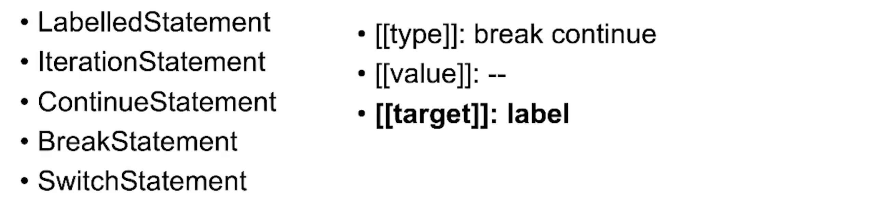

所有的语句都可以加标签变成 `LabelledStatement` ，而只有 `IterationStatement` 和 `SwitchStatement` 语句能够消费标签的语句。

虽然所有的语句都可以支持添加标签，但是并不会有任何的作用，所以有些人会将这个特性用于在代码可读性上来帮助自己区别，比如：

```js
function Parent(){
  public:
  	this.a = a;
  	this.b = b;
  private:
  	var x = 3;
  	var y = 4;
}
```

- 在还没有 `class` 的时候，通过标签在代码可读性上区分公有成员和私有成员。
- 但是对于协同开发的项目来说，如果不事先有一个开发规范，那么就会使和你一起协同开发的人搞不清楚这是什么。
- winter 不推荐写这样模仿外观但却没有任何功能的代码，我们应该追求的是**表达能力**相近而不是长相相近。比如函数式编程，我们用 JS 的语法特性来实现其编程的能力，这样才有意义，改变外观会造成混淆和难以调试，并且可能会面对因为未来的更新造成程序出错。

`LabelledStatement` 其实非常的不常用，很多代码规范不推荐使用它。虽然使用它能够提升一些性能，但是这点性能实际上很小而对于整个项目而言没有多大意义，也会让很多人读代码的过程中产生疑惑🤔。

#### try

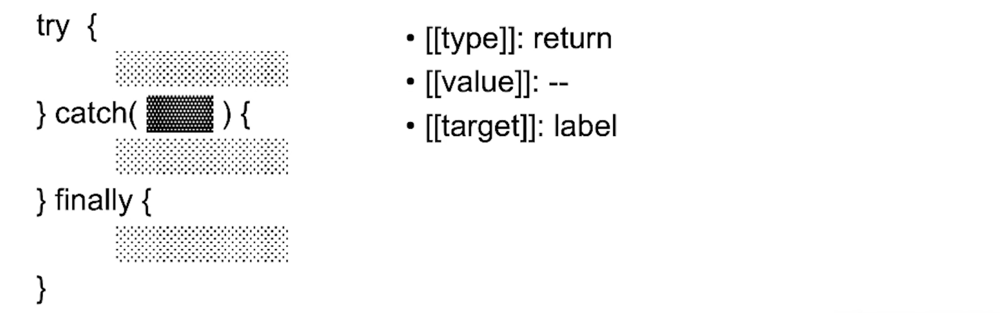

- try 是 js 语句中行为最为复杂的例子

- 每一个语句都需要带有花括号

- 除了 `throw` 语句之外，还有其他的语句能够产生 `throw` 的执行结果吗？

  - ExpressionStatement 可能会产生，比如 `1 = a` 所产生运行时错误。

- `catch` 后小括号的那部分所接受的变量和花括号共用一个作用域。

  - **作用域是从语言的角度来描述，并不关心运行时和底层机制或是背后思想，只关心声明的变量有效的范围。**

  ```js
  try{
      throw 1;
  }catch(e){
      let e = 1;
      console.log('catch')
  }
  // Uncaught SyntaxError: Identifier 'e' has already been declared
  ```

  - 可以看到在 `catch` 之后的语句块中我们重新声明变量 `e` 报错了，提示我们已经声明过。这个行为和 `for` 中声明的不同，和函数很像。

作用域与上下文的区别？

- **作用域指的是程序员电脑上，源代码中文本的范围。**比如：

  ```js
  try{
      throw 1;
  }catch(e){
      console.log('catch')
  }
  ```

  - 这里 `e` 就只能作用于后面的 block 之中的文本区域。

- **执行上下文指在用户的电脑上，内存中存变量的地方，JS 在执行的时候，所需要的对象。**

- ES3 中使用 `scope` 这个词来指代用户内存中的对象，新版换成了 `lexical environment` 


### Declaration 声明（一种机制）

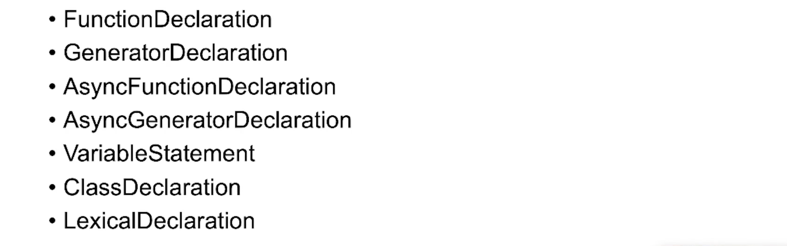

#### FunctionDeclaration

```js
function foo(){
  
}
```

- 需要 `function` 关键字和名称
- **`function` 位于语句开头，IIFE 是表达式，因为语句的开头并不是 `function` 关键字**

下面这个是函数表达式，不要和函数声明混淆，完全不同：

```js
const foo = function (){
  
}
```

- 可以没有名称，并且也可以形成 IIFE

同理 ClassDeclaration 一样

#### ClassDeclaration

```js
class Cat{
  
}

const Dog = class {}
```

- 上面的类声明不允许缺少名称，会报错。

#### GeneratorDeclaration

```js
function *gen(){
  let i = 0;
  yield 1;
  yield 2;
  while(true){
    yield i++
  }
}
```

- Generator 可以理解为特殊的 function，其内部可以使用 `yield` 
- generator 可以用于模拟 await
- 标准的 generator 的用法就是向上面那样产生无尽的序列，或是分步返回多个值。
- Generator 和 Function 特性基本相同，比如可以有表达式的形式。
- **它属于结构化编程的一部分，所谓结构化编程就是我为你提供各种结构化的表达能力，比如对象、函数、过程等等，通过提供这些东西让你的表达更接近于自然的思维。比如，有 `while` 这种循环了，为什么还要搞其他的 `do...while` `for` ，明明 `while` 也能实现它们的能力，说白了就是提供多一个选项，从而你能够选择多一种「词汇」来进行表达，和写文章的词汇量一样。当然，前提是你和你的读者要对这不同的「词汇」有足够的理解，才能使表达更清晰而不含混。**

  > 我是这样理解的，如果没有结构化的情况下，语言只剩下一条条的语句或是表达式，只会依次执行，如果想要更复杂的控制程序的执行过程就不可能。而一旦能够将这些语句放到不同的结构中，那么执行的过程就能变得更加灵活多变，也因此能写出更复杂的程序。

#### AsyncFunctionDeclaration

为什么说异步很重要？

- 和性能没有太大关系，主要是**代码结构**的问题。（也就是在代码结构层面看更容易让人理解，要线等待（await）之后才能执行之后的语句）

- 比如我们写一个时钟：

  ```js
  function tick(){
      var i = 0;
      setInterval(function(){
          console.log(i++)
      },1000)
  }
  ```

  - 上面是使用普通的函数，然后里面调用 `setInterval` 的方式

  ```js
  function sleep(m){
    return new Promise(resolve => {
  		setTimeout(resolve, m);
    })
  }
  
  void async function(){
    let i = 0;
    while(true){
      await sleep(1000)
      console.log(i++);
    }
  }();
  ```

  - 虽然和上面的效果相同，但是看起来更像是同步代码，就是等上面 `await` 执行完之后再执行后面的代码。

#### AsyncGeneratorDeclaration

```js
function sleep(m){
  return new Promise(resolve => {
		setTimeout(resolve, m);
  })
}

async function *gen(){
  let i = 0;
  while(true){
    yield i++
    await sleep(1000);
  }
}

void async function(){
  var g = gen();
  for await(let e of g){
    console.log(e)
  }
}()
```

- 具有 `Async` 和 `Generator` 两种函数的功能
- `for await` 就是为 `AsyncGeneratorDeclaration` 设计的。


#### VariableStatement（关于 `var` 及变量提升）

```js
var x = 0;
function foo(){
	var o = {x: 1};
  x = 2;
  with(o){
    var x = 3;
  }
  console.log(x)
}
foo(2) 
console.log(x)

// => 2
// => 0
```

- 为什么里面的函数打印的是 2，而外面的打印的是 0，原因是 `with` 语句块内的 `var x` 是在函数作用域的任何位置都可以被调用（提升，标准中叫 be BoundNames of VariableDeclarationList）。

  这个行为的产生是由于 **runtime 在执行代码之前会做预处理**，将声明的变量找出来放到一个列表中（包括其他的声明，只是 `class` `let` `const` 不允许你在声明之前使用）。

三条关于使用 `var` 的注意事项：

- 如果有 `var` ，不建议大家写在任何的子结构之中，一定要写在 function 的范围内
- 有 `var` 写在函数的最前面，至少是这个变量第一次出现的位置。
- 不要在任何的 block 中去写 `var` 

现在也有编程规范规定完全舍弃 `var` ，比如之前 Udacity 上的课程。


除了 `var` 之外，之前我们所学到的四大函数声明也有提升的效果，但函数与 `var` 不同的是其被赋予的内容也可以使用。


#### ClassDeclaration

相比之前的声明，class 就合理很多了。

```js
var cla1 = 0;
function foo(){
  cla1 = 2;
  class cls1{}
}

foo()

//VM151:3 Uncaught ReferenceError: Cannot access 'cla1' before initialization
```

- 会告诉你第 3 行对 cls 1 的赋值不能在类声明之前。
- 并且不允许重复声明
- `const` `let` 也是如此


### LexicalDeclaration

就是 `const` `let` 声明，特点和 `class` 相同。


## Object

这里开始讲 JS 的对象机制， object 是一种数据类型，也是 JS **结构化**的一部分。

> - 结构：构成事物整体的各个部分及其配搭、组合的方式。
> - JS 结构化：使 JS 代码整体的各个部分组合、搭配。
> - object 结构化是可用的一部分。

Object 在中文世界中不好翻译，在英文中 object 代表着世间万物，在大陆翻译为对象，但对象有目标性，比如打击对象，恋爱对象。台湾翻译为固件。中文其实有一个词很像「东西」「物」。

一种意识：对象这个概念其实不是一种数据存储的工具，要讲结构体这个概念才是数据存储的工具。

### 对象的唯一标识性


除了上面这个例子以外，还有一个例子是，有两个长的一模一样的苹果，你吃咬掉其中一个的一部分，另一个并不会变，从而你会知道这两个苹果不是同一个东西，这个概念从你 5 岁的时候就会建立。所以，不同的对象就是不同的，虽然长的一模一样，随着程序或是现实世界的改变，这两个对象可能发生不同的改变。


如果在计算机中描述这个事情，在不考虑资源占用的情况下，就是先平铺直叙的创建三个对象，然后改变其中一个。当然，在计算机中可以用一些方式（比如原型、享元模式等）来复用减少资源并且也能达到目的。

还是之前提到的那点，任何符合图灵完备的语言都可以实现相同的逻辑，比如使用递归来实现 while，**之所以不同的语言有这么多不同的特性，就是为了方便你用这些特性来清晰的表达你所要表达的内容，而不是拐弯抹角的去实现。这和你认识世界是相同的，你越是对世界和人类语言的理解清晰，你的表达也会越清楚。**

### 对象有状态、行为

有状态即会改变。


这里说的状态的改变即是行为。我的理解是行为导致其状态的改变，行为创造能量，能量导致状态改变。 a => b ，这里的箭头就是行为。

### 对象三要素

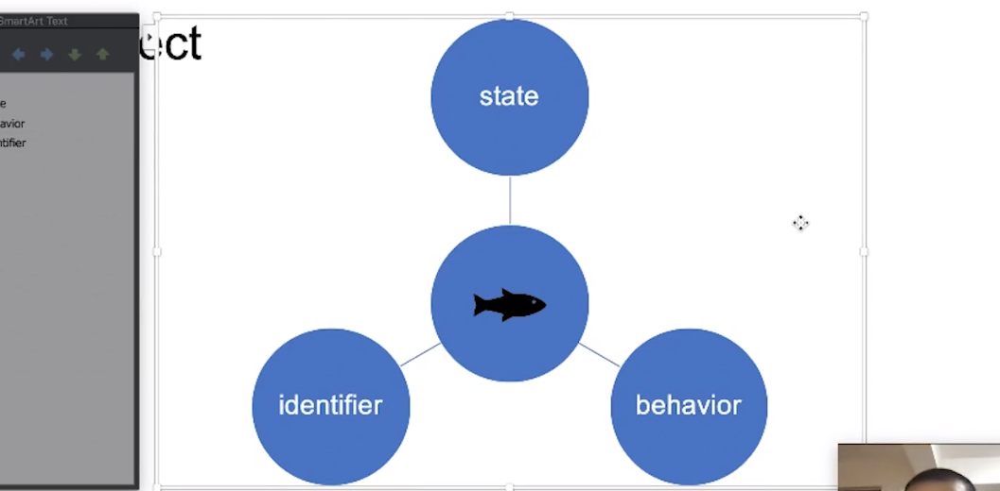

- 唯一性
- 状态
- 行为

所有的计算机语言，C 系（C C++ JAVA JAVASCRIPT python）或是非 C 系或是未来的语言，设计出来的对象一定会遵循这三要素，如果这三要素不满足则不是一个面向对象的语言了。

C++ 中将状态叫做**成员变量**，行为叫做**成员方法**，标示性叫做**对象指针**。

有同学提问说对象三要素不应该是封装、多态、继承吗？

- 封装、复用、解耦、内聚是架构上的概念，描述的是你代码在架构上的合理性。
  - 你的代码的封装性好，别人不容易见到里面的细节，就不容易出错。
  - 复用性，粒度合适、抽象合理的代码就可以大家都用。
  - 解耦，不同的模块之间的关联性比较弱。
  - 内聚和封装相似，但又不同。
- 继承是面向对象的一个子系统。
- 多态性是描述动态性的程度，比较复杂，可以去溯源搜论文。

这个三要素可能是从某本书里传出来的，但也确实是和对象有一定的关系。所以，重要的并不是背下来，然后面试的时候去照搬回答，而是要把这些概念都搞清楚，和自己的思想产生联系形成一套自己的理解，从而影响你的编程行为。


对象是偏向于人类思维的东西，而图灵完备更偏向于计算机思维。程序员就是在两种之间切换从而利用计算机来帮助我们解决问题或是完成某个目的，比如制作艺术品。


### 面向对象范式

#### class-based oriented object 

基于类的面向对象，如今的主流编程范式，代表 OC C++ Java，一脉相承。

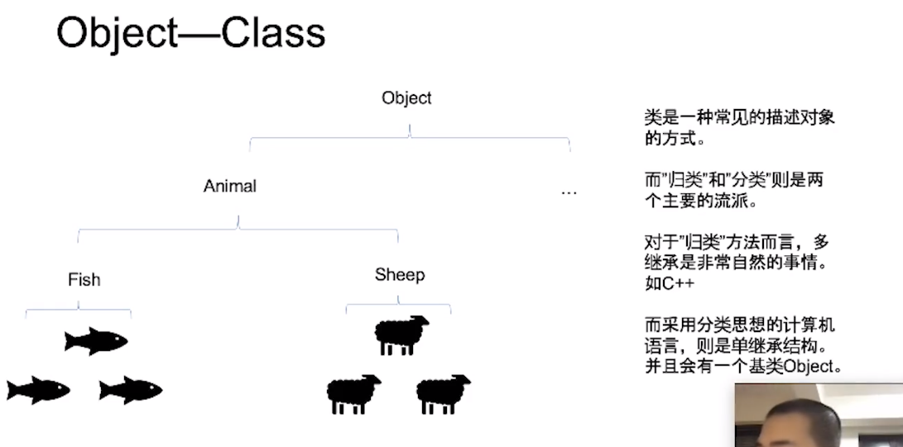

两个流派：

- 归类
  - 给你一堆对象，比如豆子，叫你归类，已经定好了有蚕豆、黄豆、绿豆，剩下有些归不了类的，就单独的归成一类。
  - 这个可能会产生多重继承，因为有些对象会属于多个类
  - 代表语言 C++
  - 需要解决菱形继承的问题，一个类的两个父类继承了另一个父类（基类）。
- 分类

  - 世间万物给一个基类 Object，然后再通过这个基类来衍生更多的子类，如上图。
- 一定会有一个基类，可能叫 Object，可能叫 Thing，不同的语言有不同的偏好
  - 分类困难：如果我们想要将两个分支的类抽象到一起去，所以我们就有了所谓的 inteface（接口），不得已在这个体系中添加接口机制。
  - 还有一个复用问题，两个类之间有一些共性，但是没有被分到同一只分支下，所以又有了一个叫做 mixin 的东西，也是带有行为和状态的东西。 
  

两个流派都有其优势和需要解决的问题，需要解决的问题就提出了很多新的概念和特性来解决。


#### Object-Prototype

基于原型，这也是 JS 最早选择的流派。

> 基于原型是一种机制，以使大家能够用这种机制来实现一种面向对象的编程范式，也就是说，如果在没有这种特性的情况下，其实也可以进行面向对象编程（粗浅的来看，使用对象来编程），只不过由于不能复用和继承，特别是继承，编程体验不好并且性能会有很大的消耗。

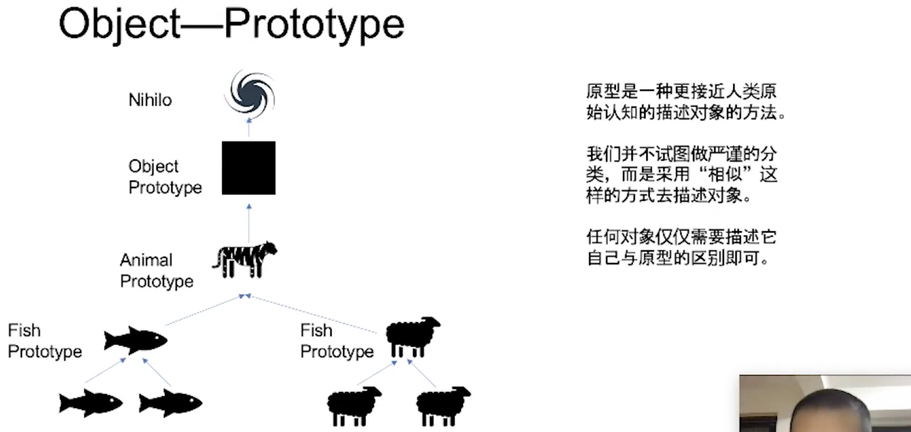

当你去描述一个对象的时候，比如老虎，是一个猫科豹属动物（通过界门纲目科属种这样一层一层的分下来），或者我们要给东北人描述华南虎时，可以说其是比东北虎小一些的老虎，那么这里就有一个参照物（原型）。

 所以，基于原型正是一种这样的体系，我们想描述一个羊只需要找一只典型的羊，然后将其描述清楚，剩下的其他羊只要以这只羊为参照（原型）通过与什么相似比较，比如高矮胖廋就可以了。同样，鱼、猫、狗都一样，如果再往上就需要找某个典型的动物进行描述（当然，鱼猫狗羊这些动物的上面肯定还有其他动物的抽象类）。最终，就会有一个 Object，万物的原型，在比较学术的描述中，Object 被叫做  Nihil（虚无），计算机就是 null，在 JS 中 `Object.prototype.__proto__ === null` 

基于原型的这一面向对象流派由于其不够严谨，所以发展略差。但却被 JS 的设计者 Brendan Eich 独具慧眼采用了。

#### Object Exercise

- 狗 咬 人
- 「咬」这个行为该如何使用对象抽象？
- 咬这个行为应该放在人上还是应该放在狗上？

回到面向对象的定义，什么叫对象得行为？

- 导致对象状态的改变即是行为。

那么，狗咬人谁的状态变了？

- 从宽泛的角度来说，都变了，狗可能心理状态发生了变化，而人则是身体状态和心理状态都发生了变化。如果不考虑心理状态，只考虑身体状态，那么就只有人的状态发生了变化，从正常状态变为受伤状态。

所以，这个行为应该放在人的身上。

> 这里也说明了类中的方法应该是用于改变或事间接改变类的状态。

```js
// 这是错误的做法
class Dog {
  bite(human){
    //...
  }
  狗急了(){} // 这是可以的
}

// 正确：
class Human {
  hurt(damage){
    /...
  }
}
```

- 虽然日常交流中我们会认为动作的执行者（主动者，发起者）是动作的主体，这个动作属于这个主体。**但在计算机中，动作是属于状态被改变者的。**
- 对象上的行为一定是改变自身状态的行为，和日常的行为不同。
- **一个误解：面向对象是尽量用贴近日常生活的语言去命名去描述，但其实并不是这样。程序员做的事情是先对这个事物、事情做有效的抽象，再用我们认为合适的抽象语言去描述。千万不要用产品经理的描述去设计代码。**
- 所以，要看一个 class、prototype 设计的好坏，你可以去对着其每一个方法看命名和方法的执行过程大概就能知道一二，命名听起来不像是改变自身行为的，甚至是说哪一个方法内没有改变自身，那就基本上不符合面向对象的行为。

在你不了解面向对象的编程思想时，尽量不要去乱写，否则会给自己造成很多麻烦。在这个时候不如写面向过程的代码，面向过程写好了一样也挺好的。

### Object in Javascript

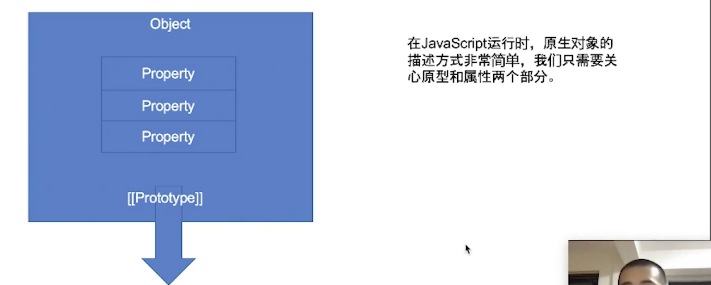

两个要素：

- 对象中有一堆**属性**

  - 属性可以有多个
  - 属性是一对 KV
    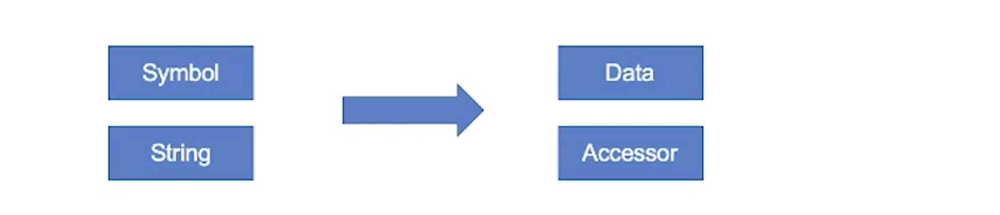
    - key 可以是 `symbol` 也可以是 `string`
    - value 也有两类 `Data` 数据型，`Accessor` 访问型
  - **严格来说属性是没有方法这个东西，只是为了搞了像 Java，所以有方法这一说**

- 对象中有一个**原型**。 

  - 注意，**原型非属性，在现代的一些 JS 引擎中可能给了属性去描述原型。但是从运行时的机制来说，原型是原型，属性是属性。**

    ```js
    var o = {}
    Object.getOwnPropertyDescriptor(o, '__proto__') // 
    
    Object.getOwnPropertyDescriptor(Object, 'prototype')
    // {value: {…}, writable: false, enumerable: false, configurable: false}
    ```

    - `__proto__` 没有描述符，也可以从侧面证明其并非属性。
    - 而 `Object` 构造器函数的 `prototype` 是有描述符的，说明其是一个属性，并且是一个对象。

#### JS 对象中的属性值 Value

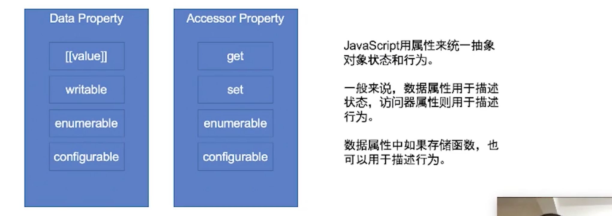

**Data Property（数据型）**属性有 4 个 attribute（特性、特征）：

- [[value]] 值
- writable 是否可写
- enumerable 是否可枚举
- configurable 是否可改变 attribute ，如果设置为 false，configurable 也不能改变

**Accessor Property（访问型）**属性也有 4 个 attribute，这个属性也俗称 getter 和 setter：

- get 函数
- set 函数
- enumerable 是否可枚举
- configurable 是否可设置

> 有很多同学在问 Set 和 Map 两种数据类型，这里先讲 Object 这个基本机制（偏底层），数据类型属于应用层的东西，是基于 Object 的一种衍生。

Accessor Property 保守着用，Vue2 的实现也是基于此。


当我们去访问一个属性时，神奇的继承能力或者说原型的体现，就是体现在我们并不是访问这个对象本身的属性，比如 `o.a` ，当对象 `o` 中没有 `a` 这个属性的时候，就会沿着原型往上找，一直找到 `Object.prototye` 这个万物之源，也是原型为 null 的对象。

其实我们现在的 JS 允许我们创造不以 `prototype` 为原型的对象，比如：

```js
let obj  = Object.create(null)
```

- 这个 `obj` 就缺少原型


#### JS Object API/Grammar

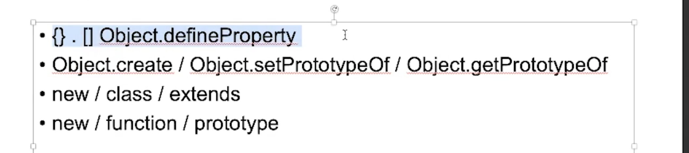

有四组 API：

- `{}.` / `{}[]` / `Object.defineProperty`
  - 不属于 class-based 的特点，而是最原始的能够创建对象、访问属性、改变属性的值，最基本的 API
  - 如果不考虑复杂的抽象，这一组也能够实现一定的作用。比如，我们可以把一个基本的对象通过 function 将其 return 出来。这也是用基本的面向对象做面向对象编程。
- `Object.create` / `Object.setPrototypeOf` / `Object.getPrototypeOf` 
  - 这一组是 ES5 提供的纯原型操作的 API
  - `Object.create` 在指定原型上创建对象
  - `Object.setPrototypeOf`  可以改变对象原型
  - `Object.getPrototypeOf`  可以获取对象原型
  - 上一组 API + 这一组 API 就形成了原滋原味的基于原型的面向对象，适合我们用原型思想去抽象和定义问题。
- `new` / `class` / `extends`
  - ES6 加入的 API
  - 虽然 JS 的运行时是基于原型的，但在语言的层面，JS 还是可以用原型来模拟基于类的面向对象的方法，模拟出来的和实际上基于类的面向对象没有区别。如果不考虑运行时的机制，那么就可以认为 JS 是支持了基于类的面向对象范式。
  - 用这一组 API 可以做基于类的面向对象编程。

- `new` / `function` / `prototype` 
  - 相比于之前的设计，这一组就是一塌糊涂、不知所云的模式。
  - 这一套是运行时是原型、语法上像 JAVA，实际上没有确定的面向对象的机制。困扰了十余年 JS 程序员的东西。

建议，使用前三套，二三套不混用，第四套让它永远的进入到历史的尘埃中。


以下是 JS Object 中特殊的对象：

#### Function Object

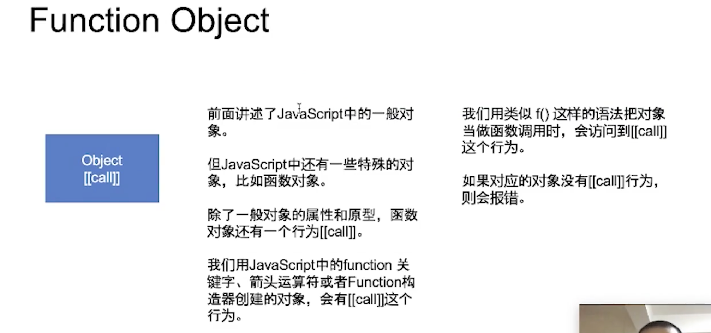

- `function object` 带了 `property` 和 `prototype` 之外的东西——`[[call]]`
- 我们用 JS 中的 `function` 关键字、箭头运算符或者 `Function` 构造器创建的对象
- 用类似 `f()` 这样的语法把对象当作函数调用时，会访问到 `[[call]]` 这个行为
- 如果被调用的对象没有 `[[call]]` 则会报错

`[[call]]` 是一个行为，而且这个行为并不是用 `property` 去描述的。在 JS 中有很多这种特殊的补丁。

带了 `[[call]]` 就是 `function`，带了 `[[constructor]]` 就是构造器。这两者是不同的。比如 `Number()` 和 `new Number()` 实际上是两个行为。

虽然 JS 中通过 `function` 声明的函数也能使用 `new` ，但是其行为可能会和预期产生偏差，比如：

```js
function foo(){
  return {a:1}
}

new foo() // => {a:1}
```

这里会返回 `return` 的那个对象，而非 `new` 出来的对象。

所以建议如果要用 `new` 来构造对象，`new` 的构造器用 `class` 来生成而不是用 `function`，这样的行为阅读起来才是比较合理的。

总之，判断是否是一个 `function obejct` 就在于是否有 `call` 的能力，`typeof` 也是这样判断。


#### Special object

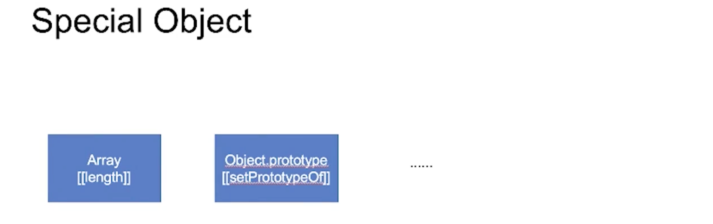

还有很多，重学前端中也有总结，但希望每个人都自己去做相关的总结列表。

比如 `Array` 有 `[[length]]` 这个内部方法：

```js
var o = [];
o.length // 0
o[100] = 1;
o.length // 101

Object.getOwnPropertyDescriptor(o,'length')
// {value: 101, writable: true, enumerable: false, configurable: false}
```

- 当给 `o` 数组的 `index` `100` 赋值 `1` 时，其 `length` 值也发生了变化
- 我们获取 `length` `property` 的 `Descriptor` ，发现其也是 `data property` 而非 `Accessor Property` ，也就是并没有通过 `getter` 方法来自动进行计算其 `length` 值
- 所以这个行为是属于 `Array` 的特殊行为

`Object.prototype` 具有 `[[setPrototypeOf]]` 内部方法，其表现为不能为 `Object.prototype` 设置原型：

```js
Object.setPrototypeOf(Object.prototype, {o: 0})
// Uncaught TypeError: Immutable prototype object '#<Object>' cannot have their prototype set
```

> 学员提出关于 JavaScript 中的术语问题
>
> Java 的术语和 JS 中的术语是完全不一样的东西并且和 C++ 的就更不相同了
>
> JS 的这套术语还是基于 JS 对象这套体系来建立，JS 和 C 系语言最大的背离的地方就是其运行时的对象。它的对象系统和任何一个 C 系语言的对象系统都区别极大。和 python 有点像，但是 python 没有原型这个机制。
>
> 有人提出数组可以理解为一个 Object，只不过其是用数字做为 key，这个理解没有问题。但是需要考虑到 V8 这样的引擎底层把代码优化得不像样，所以其真正的运行时到底是什么样，你是不知道的。我们所讲的运行时是**标准想象运行时**。真正的运行时为了优化可能使用完全超乎你想象的手段，你根本没有办法预测行为，最后数组可能都没了。不要小看这些编译原理大佬们的水平，他们不是就写写词法分析、语法分析，人家真正的功夫都在代码优化和虚拟机设计上。


## 其他问题

### UTF-8 编码问题

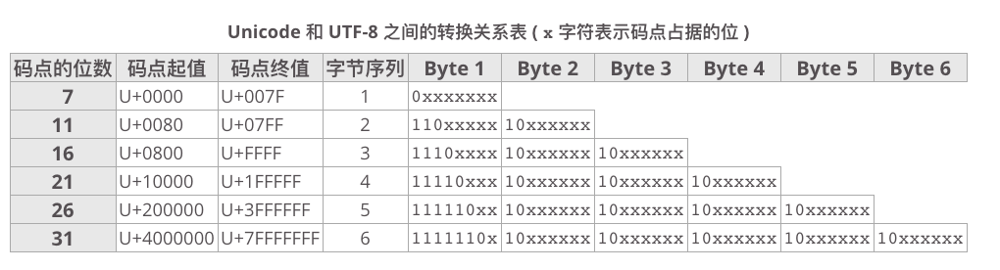

> 来源：https://www.wikiwand.com/zh/UTF-8

根据这个表进行编码即可，代码如下：

```js
function encodeToUTF8(str) {
  let utf8Code = ''; // 编译后 utf-8
  let result = []; // 最终返回的十六进制项数组
  const codePoint = str.codePointAt();
  // 判断是否为一个字符，由于超过 65535 之后的字符在 JS 中其 `length` 为 2，所以还需要判断 codePoint
  if (str.length !== 1 && codePoint <= 65535) {
    throw new Error("只能传入单个字符")
  };
  const binary = codePoint.toString(2); // Unicode 码点二进制表示
  // 编码
  if (binary.length <= 7) {
    utf8Code = '0' + binary.padStart(7, 0);
  } else {
    let rest = binary;
    while (true) {
      if (rest.length < 6) {
        utf8Code = `110${rest}`.padStart(8,1) + utf8Code;
        break;
      }
      utf8Code += `10${rest.slice(-6, rest.length)}`;
      rest = rest.slice(0, -6);
    }
  }
  // 拆分为八位二进制为一项的数组
  for (let l = utf8Code.length; l > 0; l -= 8) {
    let str = utf8Code.slice(l - 8, l)
    result.unshift(str);
  }
  return result.map((binary) => parseInt(binary, 2).toString(16)); // 转换为十六进制
}

const res = encodeToUTF8('赵');
console.log('res', res); // res [ 'e8', 'b5', 'b5' ]
```

### 查找拥有内部方法的特殊对象

在规范中查找某样东西，可以搜索到与其相似的东西并且我们已知的东西。比如搜索 `[[setPrototypeOf]]` 

> 9 Ordinary and Exotic Objects Behaviours
>
> 这里能够找到所有特殊对象的内部方法，规范称为 「Exotic Objects」

> `[[]]` 双中括号即表示内部方法（Internal Methods），也表示内部插槽（Internal Slots），使用语言的开发者无法访问，这是由引擎的开发者所实现的。

### 如何写出管理复杂的正则

比如做词法解析：

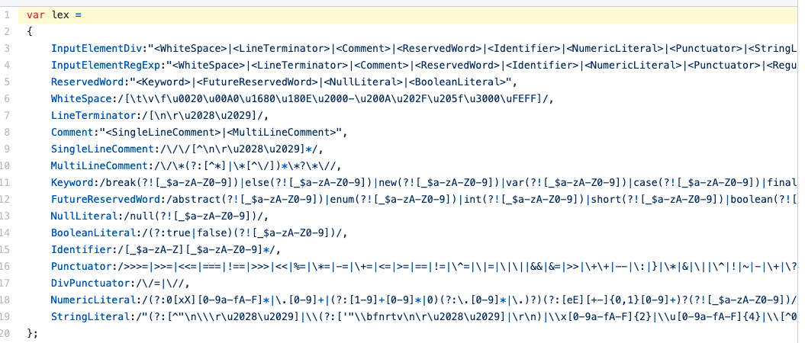

将不同的词的正则表示出来，然后再进行组合。这也是一种管理正则的方法。

地址：https://github.com/wintercn/JSinJS/blob/master/source/LexicalParser.js


## 课后补充内容

- 为 Object 加 `[[call]]` 属性对于 JS 开发者而言是不能做到的，而使用 C++ 开发 JS 引擎的那些工程师是可以的。


## 课程涉及内容

### 课后作业：

- 找出 JavaScript 标准里有哪些对象是我们无法实现出来的，都有哪些特性？写一篇文章，放在学习总结里。

### 有助于你理解的知识：

- 按照 ECMAScript 标准，一些特定语句（statement) 必须以分号结尾。分号代表这段语句的终止。但是有时候为了方便，这些分号是有可以省略的。**这种情况下解释器会自己判断语句该在哪里终止。这种行为被叫做 “自动插入分号”，简称 ASI (Automatic Semicolon Insertion) 。实际上分号并没有真的被插入，这只是个便于解释的形象说法。**
- `var` 最好写在函数内最前面或变量第一次出现的地方

