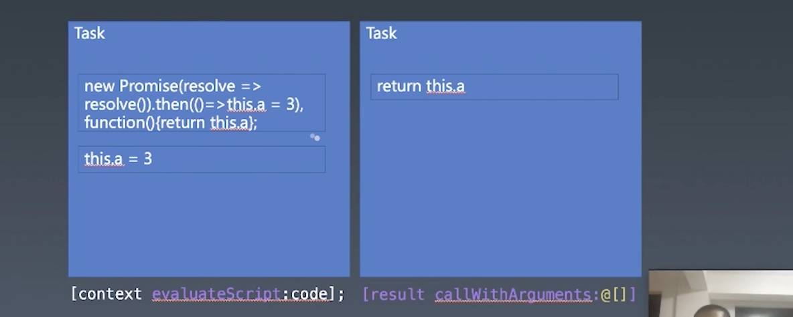

#  重学 JavaScript | 结构化（一）

[toc]


这节课我们讲**结构化程序设计**和程序的整个执行过程。这节课会通过运行一段 OC 的代码来帮助我们直观的理解 JS 代码是如何在引擎中运行的。

## 事件循环

严格来说事件循环并不是 JS 的内容，属于 JS 引擎之外的内容，比如浏览器或是 node 环境。

### OC 代码模拟 JS 引擎

```objective-c
#import <Foundation/Foundation.h>
#import <JavaScriptCore/JavaScriptCore.h>

int main(int argc, const char * argv[]) {
  @autoreleasepool {
    // var context = new JSContext
    JSContext* context = [[JSContext alloc] init];
    
    //context.evaluateScript("1 + 1")
    JSValue* result = [context evaluateScript:@"1 + 1"];
    
    //console.log(result.toString());
    NSLog(@"%@", [result toString]);
  }
}
```

- 7 行 —— 创建一个 JS 环境对象，也可以认为引擎。
- 10 行 —— 执行 JS 脚本
- 13 行 —— 打印 JS 脚本执行结果


此时的 OC 代码中还没有事件循环。

添加时间循环：

```objective-c
int main(int argc, const char * argv[]) {
  @autoreleasepool {
    // var context = new JSContext
    JSContext* context = [[JSContext alloc] init];
    JSValue* result;
    
		while(true){
      //context.evaluateScript("1 + 1")
    	result = [context evaluateScript:@"1 + 1"];

      //console.log(result.toString());
      NSLog(@"%@", [result toString]);
    }
    
  }
}
```

- 在执行 JS 代码的语句放到一个循环语句中，就能形成一个「循环」。但此时的代码每次循环所执行的都是 `1+1` ，所以我们需要添加一个输入来模拟其代码的来源是浏览器分配过来的。

```objective-c
while(true){
  char sourcecode[1024];

  scanf("%s", &sourcecode);

  // var code = NSString.stringWithUTF8String(sourcecode)
  NSString* code = [NSString stringWithUTF8String:sourcecode];

  //result = context.evaluateScript(code)
  result = [context evaluateScript: code];

  //console.log(result.toString());
  NSLog(@"%@", [result toString]);
}
```

- 这样我们就可以在 `shell` 上输入 JS 代码了。
- 但是我们这个事件循环十分的粗糙，只是简单的模仿「输入代码 -> 执行代码 -> 输入代码 -> 执行代码」的这个过程。


我们所讲的「宏任务队列」和「事件循环」大体上来说其实是同一个东西。是 JS 语言的调用方去使用 JS 的一种方式，如果你只需要执行一段代码，你是不需要使用事件循环的。

所以，我们的事件循环其实是在引擎之外的（上面的 JScontext 之外），它既不是引擎的一部分，也不是 JS 语言的一部分。

有同学说事件循环是不是就等于是死循环。但是与死循环不同的是，在 JS 世界之外，也就是安排「事件循环」这种机制的地方，在上述代码中为 `while` 语句块中的部分肯定都是异步的，它并不是像真正的死循环那样会卡死在循环之中而不执行循环之外的代码。并且，其中也可以接受外部的指令来进行控制，比如给一个将这个线程杀死掉的指令。

操作系统也有像「事件循环」这样的东西。

在上述代码中，我们是使用 `scanf` 来获取 JS 代码，但是在浏览器中可能就是等待着 `html` 引擎将 code 的片段传过来。这个地方也可以封装为一个叫 `getCode` 的函数。


新的问题，引擎要执行的 `getCode` 获取的 `code` 有几种类型呢？

- `<script> </script>` 标签中的代码片段，通过 `src` 引入相同
- `<script type="module">` `type` 为 `module` 的 `script`
- `setTimeout(function(){}, 1000)` —— 由像 `setTimeout` 发出的函数，还有各种事件中的回调函数。


**事件循环只是浏览器或是 node 环境执行 JS 的一种机制**，如果我们自己来实现一个浏览器，我们也可以没有时间循环只执行一段代码。

> 一定要明白的是这些被叫做机制也好、设置也好、特性也好的东西，都是在帮助程序具有更多的可能性，能做更多的事情，有能强大的功能。而不要将其变得非常神圣化，似乎是必不可少的。有些时候，你并不需要这些东西也能写出不错的代码。


### Promise

如果我们往一次宏任务中添加 `promise` ，这次宏任务除了会同步执行本次任务的代码片段之外，还会同步执行 `promise` 所安排的代码片段，而在宏任务之中执行的代码片段我们称之为「微任务」，如下图：



- 这里 `new Promise` 和 `then` 之中的代码都是微任务，其在 JS 引擎内部，是 JS 引擎队列

- 而在 JS 引擎之外执行的 `evaluateScript` 和 `callWithArguments` 则为宏任务
- 只有当前一个宏任务中的微任务执行完之后才会执行后一个宏任务中的微任务


要知道，并不是只有 `then()` 之中的代码才是微任务（`catch` `finally` 同理），或是说有 `then` 才会存在微任务，而是「微任务队列」这种机制是为了能让 JS 引擎内部实现异步执行代码的机制而存在的，也可以说是为了 `promise` 而存在的。

我们可以说，有 `then()` 就会在一个宏任务中存在多个微任务的情况，一切 JS 代码都是作为微任务执行的。

`setTimeout` `setInterval` 其实并不是 JS 本身的 API，而是由宿主浏览器所提供的 API，是宏任务，而 `promise` 是 JS 自带的 API，是微任务。


```js
new Promise(resolve => resolve()).then(() => this.a = 3), function(){return this.a};
```

- 执行这段代码，会返回 `,` 后面的函数，是因为 永远返回`,` 最后面的值。


为什么设置宏任务和微任务？

- 宏任务并不在 JS 的标准中，需要这种机制来执行不同的 JS 代码片段。而因 `promise` 存在的「微任务」概念是在 JS 在标准内，规定在 JS 引擎内部要有一个序列。由于早年浏览器都是从外部提供任务队列，所以有了这么一个「宏任务」与「微任务」的区分。（可以认为这种叫法是为了区分不同的任务）


JS 引擎的目的是将 JS 代码片段给执行掉，没有其他的定义。可以将 JS 引擎理解为一个库，而外部使用 `while` 将这个库包裹为一个服务，这个服务可以等待不同的 JS 代码片段的到来，然后执行。


Promise 的 `resolve` 或者 `reject` 会添加一个任务并入队。


`await` 后面的代码可以认为是用了一个 `then()` 


Promise 的内容在规范 104 页——`8.6 RunJobs()` 

在规范中，我们所称的微任务叫 Job


大家去学习的时候不要忘记前面的图谱，今天所学的东西在图谱的什么位置。

不要去关心那些变态面试题，越好的公司的面试官越不会把那些很变态的题丢给你。虽然好的公司的面试官也会问流传出来的一些很困难的面试题，面试官的问法和我们所想象的不同，一定会有一个思路，一步一步问过来。

就算是遇到了复杂的问题，也可以将这个问题拆解为简单的问题，然后再去解决这些简单的问题。


其实这些概念「宏任务」「微任务」都是为了帮助我们去理解代码在相应环境中的执行过程。


## 课程涉及

### 参考名词：

- OC：[ Objective-C ](https://zh.wikipedia.org/wiki/Objective-C)是一种通用、高级、面向对象的编程语言。它扩展了标准的 ANSI C 编程语言，将 Smalltalk 式的消息传递机制加入到 ANSI C 中。当前主要支持的编译器有 GCC 和 Clang（采用 LLVM 作为后端）。

