# 2. 重学 JavaScript | 结构化（二）

[toc]

## 结构化程序设计

这节课我们来讲 JS 中结构化程序设计的基础设施，而不是讲结构化程序设计，结构化程序设计本身是一门课程。


首先我们总结一下学习 JS 的思路。

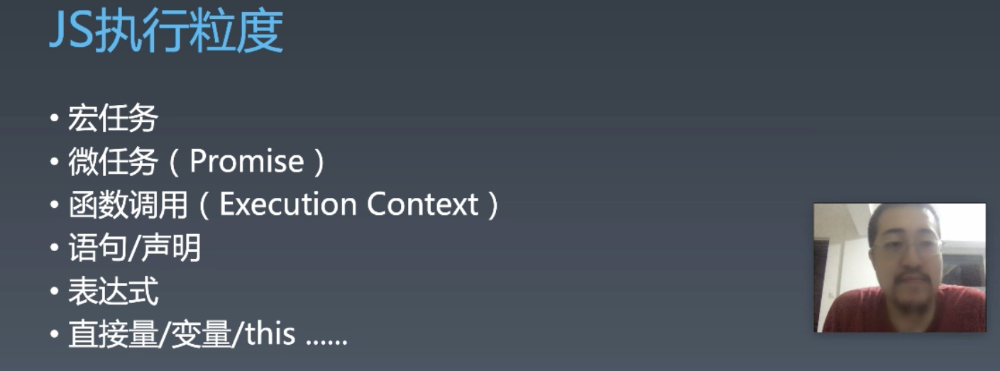

- 我们的课是和上述顺序相反

实际上往上还有一层

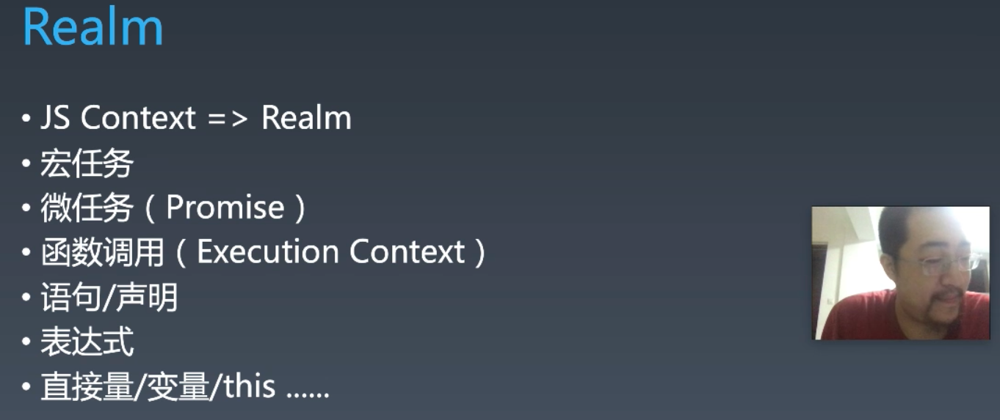

- 上节课的 OC 代码中有 「JS Context」—— 上下文，JS 中最大一块的东西，包含了 `Global` 中的所有东西。
- 上节课中我们执行了多个宏任务，但是**多个宏任务之间是共享了一个全局对象**。因此它的粒度比宏任务更大。（大粒度的东西包含了小粒度的东西，想象带粘性的沙粒，，可以参考这个论坛的回复：https://bbs.csdn.net/topics/340190369）


上节课我们主要讲解的是宏任务与微任务的执行顺序的关系，而没有讲解宏任务之间共享数据的 context。接下来我们要讲的概念是 JS Context 中最重要的一个东西 —— Realm（领域、范围、王国、国度、梦境）


### Realm 是什么？

我们不太需要关心它在英文中的原意。在 JS Context 中，Realm 有完整的一套 JS 对象，多个不同的 Realm 会创建完全不同的一整套像是 Object、Array、Date 包括它们的 prototype 这些原始的对象。

#### Realm 中有多少个对象？

> 可以参考重学前端课程：[JavaScript对象：你知道全部的对象分类吗？](https://time.geekbang.org/column/article/80011)

接下来，我们在浏览器中空白页的控制台中输出一下。在此之前，我们要知道浏览器并不是一个很纯碎的 JS 环境，其中有大量的非 JS 语言本身规范中的对象，比如 `document` 对象。所以我们需要过滤掉这部分对象。

```js
let set = new Set();
let globalProperties = [
  "eval",
  "isFinite",
  "isNaN",
  "parseFloat",
  "parseInt",
  "decodeURI",
  "decodeURIComponent",
  "encodeURI",
  "encodeURIComponent",
  "Array",
  "Date",
  "RegExp",
  "Promise",
  "Proxy",
  "Map",
  "WeakMap",
  "Set",
  "WeakSet",
  "Function",
  "Boolean",
  "String",
  "Number",
  "Symbol",
  "Object",
  "Error",
  "EvalError",
  "RangeError",
  "ReferenceError",
  "SyntaxError",
  "TypeError",
  "URIError",
  "ArrayBuffer",
  "SharedArrayBuffer",
  "DataView",
  "Float32Array",
  "Float64Array",
  "Int8Array",
  "Int16Array",
  "Int32Array",
  "Uint8Array",
  "Uint16Array",
  "Uint32Array",
  "Uint8ClampedArray",
  "Atomics",
  "JSON",
  "Math",
  "Reflect",
];

let queue = [];

for(let p of globalProperties){
  queue.push({
    path: [p],
    object: this[p]
  })
}

let current;

while(queue.length){
  current = queue.shift();
  obj = current.object
  
  console.log(current.path.join('.'));
  
  if(set.has(obj)) continue;
  
  set.add(obj);
  
  for(let k of Object.getOwnPropertyNames(obj)){
    let descriptor = Object.getOwnPropertyDescriptor(obj, k);
    
    if(descriptor.hasOwnProperty("value") && descriptor.value instanceof Object){
      queue.push({
        path: current.path.concat(k),
        object: descriptor.value,
      });
    }
    
    if(descriptor.hasOwnProperty("getter")){
      queue.push({
        path: current.path.concat(k),
        object: descriptor.get
      });
    }
    
    if(descriptor.hasOwnProperty("setter")){
      qqueue.push({
        path: current.path.concat(k),
        object: descriptor.set
      });
    }
      
  }
}
```

- 这里使用广度优先搜索，而重学前端中是使用递归做的深度优先搜索。


一个小作业：使用 AntV 的 G6 对这些对象做一下可视化，G6 是用于可视化编辑器的东西。


### 回顾结构化

从「微任务」到「语句/声明」之间有一个函数调用，我们如何才能实现一个函数调用？这里就涉及到一个重要的数据结构—— Execution Context

#### 函数调用

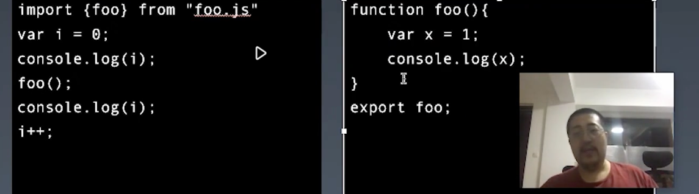

- 上面两段代码来自于两个文件。

-  上面代码的执行顺序：

  ```js
  var i = 0;
  console.log(i);
    var x = 1;
  	console.log(x);
  console.log(i);
  i++;
  ```

  - 假设你是 JS 引擎（JS Context），当你在执行 3 4 行语句的时候，能访问到变量 `i` 吗？
    - 是访问不到的

- 来考虑一种情况：

  ```js
  var i = 0;
  console.log(i);
    console.log(i);
  console.log(i);
  i++;
  ```

  - 将上面函数 `foo` 内的语句更改为执行 `console.log(i)` ，那么对于引擎（你）来说是不是有点麻烦，上下两句都能访问到 `i` ，而中间不能。


考虑稍微复杂的情况：

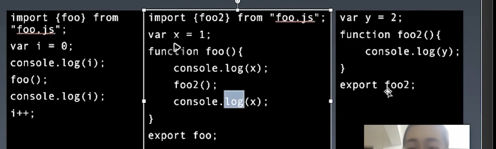

- 上面的代码会形成如下情形：
  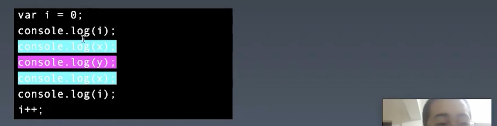
  - 这种情形就更复杂，在不同的语句中能访问的变量不同。


那么引擎是如何确定在不同的函数中能访问哪些变量的呢？

在这个执行过程中存在着一种进入函数和退出函数的时刻，对应上面的图就是每一个带有颜色背景的语句。在 JS 中有这样一种机制：

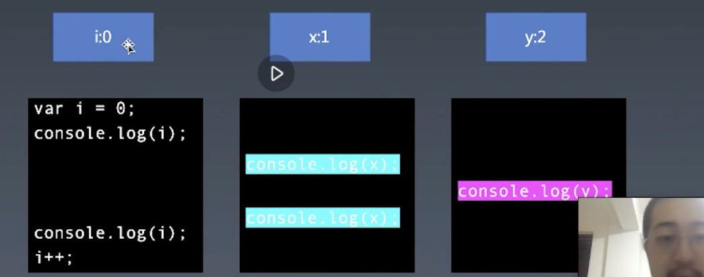

**会将上面的不同的文件（函数中）声明的变量存储在不同的环境中，当执行对应的函数环境时会将其执行环境切换到对应的环境中，并且当函数执行完毕之后也会将对应的环境销毁**。这个过程会让这些环境形成一个数据结构——「栈」，「执行上下文栈 Execution Context Stack」：

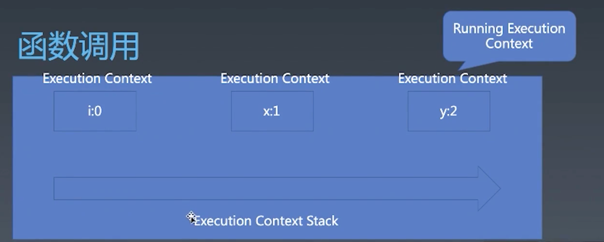

- Stack 这种数据结构支持像 JS 中 Array 的 `push` 和 `pop` 
- 而每一个调用栈也就是一个 Execution Context 执行环境
- 调用一个函数时会发生一次 Execution Context Stack 的 `push`，当函数调用完之后返回时会发生一次 `pop`
- 栈顶的元素被称为 「Running Execution Context」

> 规范中会多次出现 Execution Context Stack 术语，可以通过搜索来了解。


### Execution Context

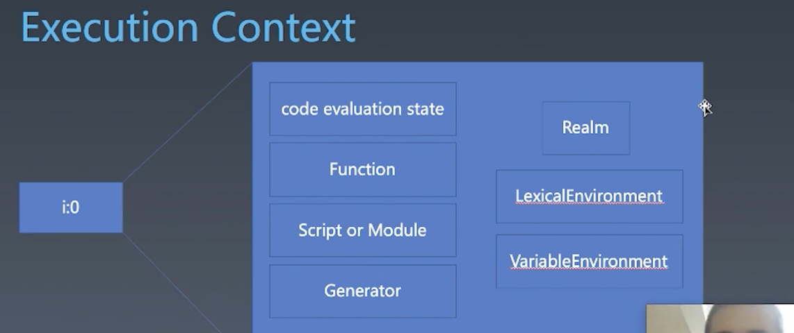

Execution Context 包含如下内容：

- code evaluation state
  - 代码执行的状态，主要是 `genarator` 和 `async` 有用，普通的函数不需要这个东西。
- Function
  - 如果 Execution Context 内执行的是一个函数，则有一个 Function，它有可能是 null，比如全局 `script` 中的代码不在函数中则为 null
- Script or Module
  -  和上面同理，如果是在一个 script 或是 module 内就有，否则为 null
- Generator
  - 和上面同理，由 genarator 产生的函数环境才会有。
- Realm
  - 需要知道自己所在的 Realm
- LexicalEnvironment
  - 词法环境，我们取变量值时所使用的环境
- VariableEnvironment
  - 变量环境


#### Execution Context 的种类

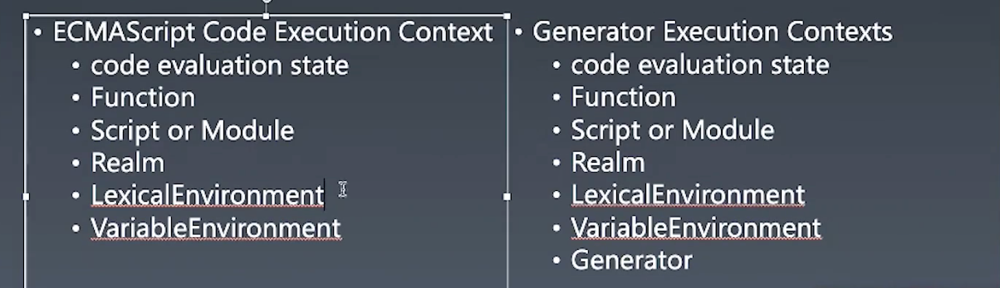

- 一种是 ECMAScript Code Execution Context
- 一种是 Generator Execution Context
- 两者只差一个 Generator，其余的没有什么特殊之处


#### LexicalEnvironment

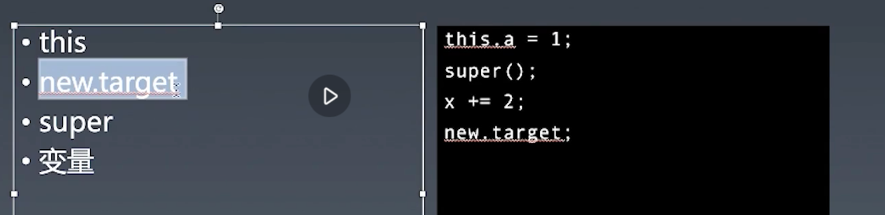

> 右边是实际代码中调用时对应左边的情况，当调用时则需要到 LexicalEnvironment 中去找。

LexicalEnvironment 中有这些东西：

- this（2019 之前在 Execution Context 之下）就如：

  ```js
  2019 之前：
  'Execution Context': 
  {
    LexicalEnvironment: {...},
    this: {...},
    ...
  }
                         
  2019：
  'Execution Context': 
  {
    LexicalEnvironment: {
      this: {...},
      ...
    },
    ...
  }
  ```

  - this 是多久被塞入 LexicalEnvironment 的？
    - 这个问题比较复杂，每一种函数都不太一样。比如箭头函数的 this 是和变量一起塞进去的，而普通函数则是调用的时候才塞进去。

- new.target

- super

- 变量


#### VariableEnvironment

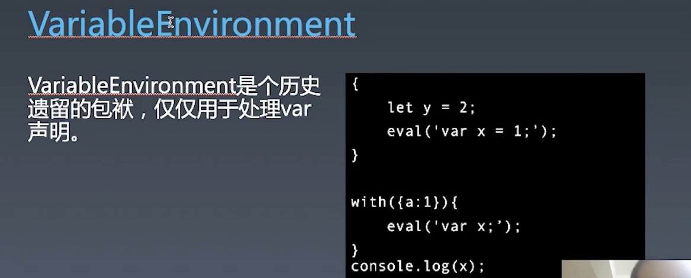

VariableEnvironment 是个历史遗留的包袱，仅仅用于处理 var 声明，并且 var 声明在正常的情况下也用不到 VariableEnvironment，因为 VariableEnvironment 是运行时设施，正常情况下，var 可以通过预处理将其变为函数级别的东西。

```js
{🌟
  let y = 2;
  eval('var x = 1;');
}
```

- 如今有 LexicalEnvironment，在上述代码中创建 LexicalEnvironment 是在 🌟 的位置。
- 上述代码当你执行到 `eval('var x = 1;');` 时，引擎需要将 `x` 存储到一个地方，则就需要用到 VariableEnvironment 去存。

```js
with({a:2}){
  console.log(a) // => 2
  eval('var x = 1;');
}
console.log(x); // => 1
```

- 在 `with` 内的 `var x` 声明的 `x` 会被声明到外层的函数级环境。

 

无论是 `LexicalEnvironment` 还是 `VariableEnvironment` 都是由复杂的结构组成，像是链表一样的结构，它里面的每一项叫做 `Environment Record` ，`Environment Records` 是一个基类，这个基类里面包含三个子类：

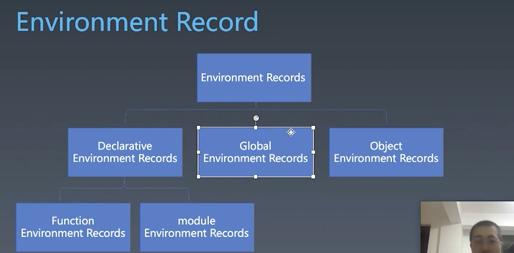

- 三个基类：
  - `Global Environment Records` 全局，就是任何一个 JS 引擎的实例，JSContext 这个级别只有一个，所有 Environment Records 最顶端。
  - `Object Environment Records` 一般是由 `with` 产生
  - `Declarative Environment Records` ，两种：
    - `Function Environment Records` 
    - `Module Environment Records` 

- 所有产生 `Environment Records` 有 `Global` `with` `function ` `module`


之前我们讲到 `LexicalEnvironment` 中包含了 `this` `new.target` `super` `变量` 这些东西，我们来讲一讲这些是怎么产生的。

这个机制也是 `Closure` 的实现原理。比如：

```js
var y = 2;
function foo2(){
  consolo.log(y);
}
export foo2;
```

这里产生的函数 `foo2` 被 `export` 出去了，而 `foo2` 内部访问了其外部的 `y` ，所以其内部会带有 `var y = 2` 的执行结果变成了函数的属性：

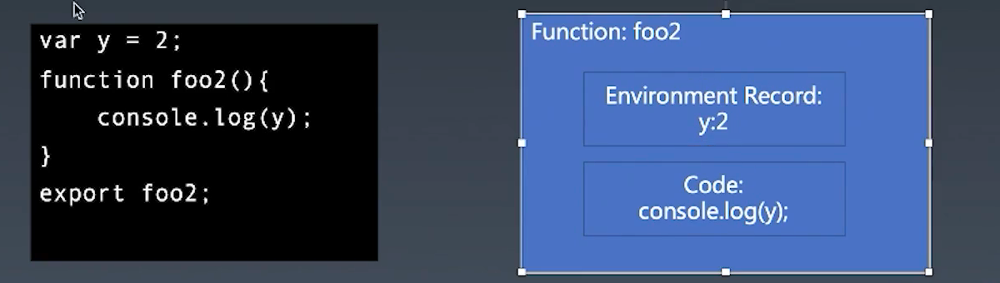

如果我们去溯源 closure，会发现这是非常标准的 closure，有环境部分（变量列表）和代码部分（Lamda 表达式部分）


再来看一个复杂的情况：

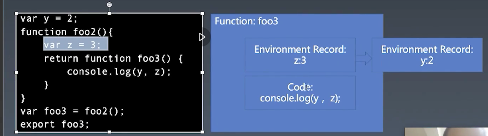

- 这里我们让 `foo2` 返回 `foo3` ，`foo2` 内部又加了 `z = 3` ，这个时候 `foo2` 执行会产生一个 `Environment Records`，然后 `foo3` 内能访问到 `z` 和 `y` ，并且 `foo3` 被导出给别处使用。这个时候 `foo3` 带的是 `z:3` 的这个 `record`，这里的 `Enviroment Record` 有一个 outer 的链接，链接到外层 `y:2` 的 `Enviroment Record`，所以在 `foo3` 的这个 `code` 中即能访问 `z` 又能访问 `y` 
- 如果将 `foo3` 更改为箭头函数，那么在 `foo3` 的 `Enviroment Record` 中还会有 `this:global` ：
  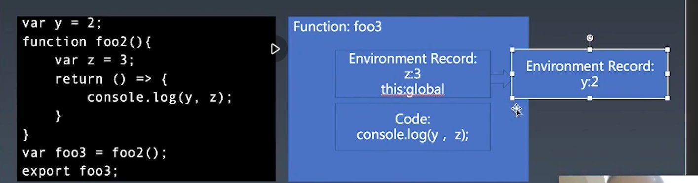
- 同理将 `foo2` 更改为箭头函数，其外链的 `Enviroment Record` 中也会有 `this`

- 所以说为什么在新版中加了箭头函数要将 `this` 放到 `Environment` 内，这是因为 `this` 不像以前那样只由调用的时候决定。 


### Realm

为什么在 `Execution Context` 中一定要有一个 Realm？

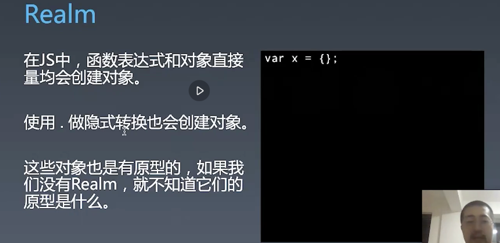

```js
var a = new Array();

var o = new Object();
```

那么在上面这段代码中需要用到 Realm 吗？

- 上面这两句不需要用到 Realm，因为 `Array` 和 `Object` 是两个全局变量，那么可以直接从 `LexicalEnvironment` 中能取到。

那哪些地方会需要用到 `Realm` 呢？

```js
var a = {};
```

- `{}` 这个对象字面量会用到，因为其有 `prototype`

```js
Object.getPrototypeOf({}) === Object.prototype // => true

var iframe = document.createElement("iframe");
document.body.appendChild(iframe);
frame.contentWindow.eval("this.o = {}");
frame.contentWindow.o instanceof Object // => false

var o = frame.contentWindow.o
Object.getPrototypeOf(o) === Object.prototype // => false
```

- 可以看到对象 `o` 在某一个 Reaml 中创建时则不另一个 Reaml 中的 Object 的实例。（此处是通过创建一个 `iframe` 来创建另一个 Reaml）

类似的 `function` `class` `[]` `1..toString()` 也是一样的，比如 `1..toString` 在转换为 `Number` 时会考虑是哪个 `Number`，就需要有 `Realm`   


回到这里：


这样我们就将 JS  大致建立了一个框架，从最外层的 JS Context 执行，JS Context 与 Realm，然后到里面的宏任务、微任务、函数调用、语句/声明、表达式、直接量/变量/this ... 过了一遍。 之后就需要自己去 MDN 或是 ECMA 中找具体的知识点放入其中。一些知识点也可以通过代码去尝试去实验。


## 课程补充

- 传给服务端的中文需要编码吗？

  - 如果服务端支持 Unicode 是不需要的，但是如果是 get 请求则需要 encode。浏览器的地址栏能看到中文是因为浏览器中的转化。

- Realm

  - 一套 JS 环境中的各种内置对象就是 Realm，也就是之前用代码找到并放到 set 中的对象。
  - 如果没有 Realm 就没有任何的内置对象可以使用，可以认为 Realm 是装着各种内置对象的盒子。有几个盒子就有几套内置对象。
  - Realm 一般只包含引擎对象不包含宿主对象。
  - Realm 是 JS 语言层面的概念，不能和具体的环境绑起来。

- 除了 Iframe 之外还有什么可以生成 Realm 的办法？

  - 在浏览器中是没有，在 OC 中是可以随便生成的。在 OC 中只要调用如下代码就产生一个 Realm：

    ```objective-c
     JSContext* context = [[JSContext alloc] init];
     //
     JSContext* context2 = [[JSContext alloc] init];
    ```

    - 现在有两个 Realm

- 在浏览器环境中， `MutationObserver.MutationObserver()`  和 `Promise` 都会创建微任务。

- 所有的宏任务都是在一个 JSContext 中去执行的，一个微任务会是一个人宏任务中的一部分。

- 如果李冰老师和winter老师讲同一个东西，如何确定哪个是正确的？

  - winter 说他只能确定自己讲的第一节课的内容是正确，也就是学习方法。他希望大家能学会的是建立知识框架和鉴别对错的方法，而不是根据老师所讲的来告诉你对错，你需要自己去辨别。

- 属性有对象和原型两个部分，`Object.getPrototypeOf` 用于找到这个对象的原型。

- `eval` 中的代码是可以访问到当前环境中的变量的，但是外层无法访问到里面通过 `let` 声明的变量：

  ```js
  function foo(){
      let a = 1;
      eval('let b = 2;console.log(a)')
      console.log(b)
  }
  foo() // => ReferenceError: b is not defined
  ```

  - 会打印 1，但是无法访问 b，这可能是因为 `eval` 会创建一个块级作用域吧。而如果是 `var` 声明的变量则是可以访问的：

    ```js
    function foo(){
        let a = 1;
        eval('var b = 2;console.log(a)')
        console.log(b)
    }
    //
    1
    2
    ```

- 正则对象也是 Realm 吗？

  - 是的，也是从 Realm 从取到的正则表达式的实例。

- Base64 是文件的一种编码。

## 课程涉及

### 参考链接：

- https://g6.antv.vision/en/

### 课后作业：

- 用 G6 antv 可视化 Realm 中的所有对象（选做）

