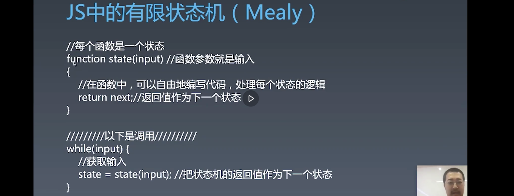

# 1. 浏览器工作原理 | 有限状态机

[toc]

## 有限状态机处理字符串

### 有限状态机

上节课我们已经使用过「状态机」，但其学名应该叫「有限状态机」，**有限状态机算是一种编程的思想，并没有一种固定的形态或是接口**，但是有限状态机的应用非常广，比如做游戏时的敌人AI，在编译原理里构建AST，包括正则表达式的实现去处理字符串，这些都是有限状态机非常适合的场景。学界的人也非常喜欢用有限状态机的方式去描述一些算法。

今天我们要学习用有限状态机处理字符串的技巧。


从字面来看望文生义，我们会认为「有限状态机」重要的是其状态，但其实其重点在于「机」而不在于「状态」。有限状态机的特点：

- **每一个状态都是一个机器**
  - 每个机器都是互相独立的，这和我们平时所讲的状态就非常的不一样了，我们平时都是用变量来表示某些状态，而状态机是把每个状态都设计成了一个独立的机器，在每一个机器里我们都可以做计算、存储、输出......，也就是我们可以在机器中做平时我们编程中所做的一切事情。
  - 要求：所有的这些机器接受的输入是一致的。你不能说这个状态接受的是一个字符串，那个状态接受的是一个 number，要么都接受字符串，要么接受到是 number，要么就接受字符串或者 number，总之，你可以**将所有的机器理解为参数一致的函数**。
  - 还有一个重要点：状态机的每一个机器本身没有状态，每次确定的输入都要产生一个确定的输出，如果我们用函数来表示状态机的话，这些所有的状态机都是纯函数，纯函数的意思是说它不能依赖一个外部环境来发生变化。
  - 以上是对状态机大概的描述
- 除此之外，**每一个机器都要知道下一个状态是什么，无论得到什么样的输入，它都应该能够正确的切换到下一个状态**：
  - 对于这样每个机器都有确定的下一个状态，这种状态机叫做 Moore 型状态机
  - 对于每个机器根据输入决定下一个状态，这种状态机叫做 Mealy 型状态机（平时我们都是使用这种），Mealy 型状态机比较强大，但是相较于 Moore 型状态机而言实现起来更加复杂一些。 （Mealy 是人名，用于给这种类型的状态取一个名称）

### 使用有限状态机处理字符串

在进行具体的状态机的讲解之前，我们还是先从问题出发：

- 在一个字符串中，找到字符"a"

  - 这里很多同学使用了底层库，比如 `indexOf` 或者使用正则，但其实**正则的底层都是使用状态机来实现的**。所以，最好是使用循环来实现。

  - ```js
    function match(string){
      for(let c of string){
        if(c === 'a'){
          return true;
        }
      }
      return false;
    }
    
    match('I am groot');
    ```

- 在一个字符串中，找到字符 "ab"

  - ```js
    function match(string){
      let foundA = false; // 是否找到 a 的标识
      for(let c of string){
        if(c === 'a'){
          foundA = true
        }else if(foundA && c === 'b'){
          return true
        }else{
          foundA = false; // 如果出现 a 之后并不是 b 则将其设为 false
        }
      }
    }
    
    match('I am groot');
    ```

- 在一个字符串中，找到字符"abcdef"

  - 使用和上面一样的思路：

    ```js
    function match(string) {
      let foundA = false;
      let foundB = false;
      let foundC = false;
      let foundD = false;
      let foundE = false;
      for (let c of string) {
        if (c === 'a') {
          foundA = true;
        } else if (foundA && c === 'b') {
          foundB = true;
        } else if (foundB && c === 'c') {
          foundC = true;
        } else if (foundC && c === 'd') {
          foundD = true;
        } else if (foundD && c === 'e') {
          foundE = true;
        } else if (foundE && c === 'f') {
          return true;
        } else {
          foundA = false;
          foundB = false;
          foundC = false;
          foundD = false;
          foundE = false;
        }
      }
      return false;
    }
    ```

    - 这里面使用多次的判断，如果循环的内部再使用循环而不使用 if，则其时间复杂度会变成 m * n，这也是这种朴素算法的缺点。
    - 那么我们要怎么更简单的处理这个问题？ 
      - 实际上我们可以将上面的 `foundA` `foundB` 等分多个 match，将 for 循环中的每一个 if 分成独立的函数，那么这就是适合我们使用状态机来解决问题的场景。

### JS 中的有限状态机（Mealy）



我们将每一个状态设计为一个函数，函数的参数为状态机的输入，而返回值返回另一个函数，也可以返回 state 自己，这个返回值就是下一个状态，在这个函数中我们可以自由地编写代码，处理每个状态的逻辑。

调用的方式是 while，只要有 input 就获取输入，然后喂给状态机调用，将状态机的返回值作为下一个状态机继续调用。

**如果 return next 是固定的值则是 Moore 型的状态机，如果 return next 和 input 有关则是 Mealy 状态机。**

```js
function match(string) {
  let state = start;
  for (let c of string) {
    state = state(c);
  }
  return state === end;
}

function start(c) {
  // 状态机只关心状态是否为 a，是则切换到 foundA 状态，否则又切换到开始，这里是自身（对于其他状态机而言是开始）
  // 这里也是为了排除非 a 的字符
  if (c === 'a') {
    return foundA;
  } else {
    // 状态不变
    return start;
  }
}

function end(c) {
  // 完全固定状态，只会返回自己，当然也可以返回其他的东西
  // 此状态也是陷阱状态，进入此状态之后也不会再进入其他状态了
  return end;
}

function foundA(c) {
  if (c === 'b') {
    return foundB;
  } else {
    return start;
  }
}

function foundB(c) {
  if (c === 'c') {
    return foundC;
  } else {
    return start;
  }
}

function foundC(c) {
  if (c === 'd') {
    return foundD;
  } else {
    return start;
  }
}

function foundD(c) {
  if (c === 'e') {
    return foundE;
  } else {
    return start;
  }
}


function foundE(c) {
  if (c === 'f') {
    return end;
  } else {
    return start;
  }
}
```

### 额外内容


用状态机处理诸如 "abcabx" 这样的字符串

```js
function match(string) {
  let state = start;
  for (let c of string) {
    state = state(c);
  }
  return state === end;
}

function start(c) {
  if (c === 'a') {
    return foundA;
  } else {
    return start;
  }
}

function end(c) {
  return end;
}

function foundA(c) {
  if (c === 'b') {
    return foundB;
  } else {
    return start;
  }
}

function foundB(c) {
  if (c === 'c') {
    return foundC;
  } else {
    return start;
  }
}

function foundC(c) {
  if (c === 'a') {
    return foundA2;
  } else {
    return start;
  }
}

function foundA2(c) {
  if (c === 'b') {
    return foundB2;
  } else {
    return start;
  }
}

function foundB2(c) {
  if (c === 'x') {
    return end;
  } else {
    // 这个地方要返回 foundB 调后的状态，因为表示已经匹配到了 ab 状态
    return foundB(c);
  }
}

match('abcabcabx')
```

作业：使用状态机完成 "abababx" 的处理。

可选作业：我们如何用状态机处理完全未知的 pattern？

- 有同学提到了 KMP 算法，但其实状态机比 KMP 算法要强大，最终实现的是 KMP 等效的版本，最终可以完成到正则那样带 `?` 或是 `*` 的程度。

- ```js
  function match(pattern, string){
    //???
  }
  
  match('ababx', 'I am ababx! hhha')
  ```

- 这个作业的时间复杂度必须是 Om + n，必须和这两个字符串的长度之和成正比，不能在里面使用双层的 for 循环。 
- 状态是生成的。


## 课程涉及

### 课后作业：

- 挑战题：我们如何用状态机处理完全未知的 pattern（选做）

### 参考名词：

- [Mealy ](https://zh.wikipedia.org/wiki/米利型有限状态机)：在计算理论中，米利型有限状态机（英语：Mealy machine）是基于它的当前状态和输入生成输出的有限状态自动机（更精确的叫有限状态变换器）。这意味着它的状态图将为每个转移边包括输入和输出二者。与输出只依赖于机器当前状态的摩尔有限状态机不同，它的输出与当前状态和输入都有关。但是对于每个 Mealy 机都有一个等价的 Moore 机，该等价的 Moore 机的状态数量上限是所对应 Mealy 机状态数量和输出数量的乘积加 1（|S’|=|S|*|Λ|+1）。