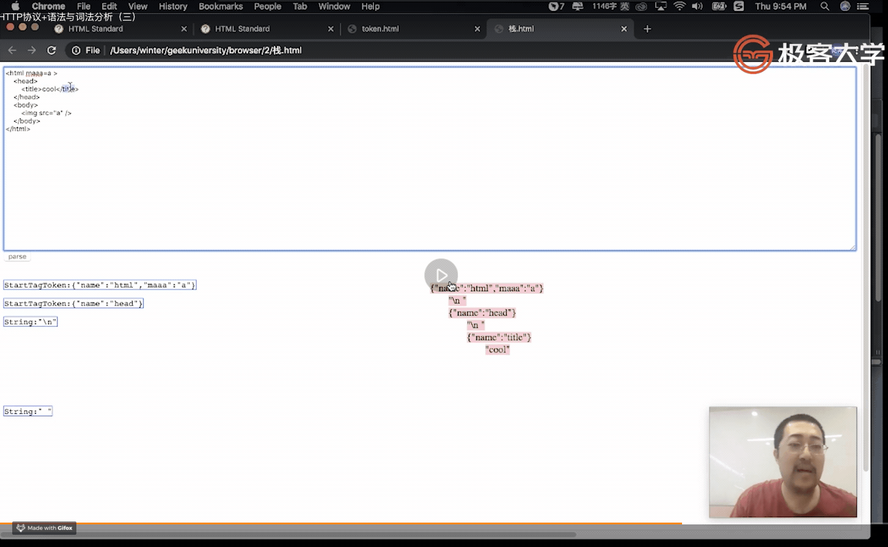

# 2.浏览器工作原理 | HTTP协议+语法与词法分析（三）

[toc]

## HTML 的解析

上节课我们完成了 HTTP 部分，得到了如下内容：

```js
{
  statusCode
  statusText
  headers
  body
}
```

本节课我们将获取到的 HTML 解析为 DOM


### 第一步：拆分文件

我们将从 `request.send()` 的结果中拿到的 response 传入本节课要实现的 `parser.parseHTML` 方法中解析为 DOM：

```js
let response = await request.send();

let dom = parser.parseHTML(response.body);
```

parser 是本节课要实现的一个模块，需要单独创建一个文件来写。

```js
module.exports.parseHTML = function (html) {
  console.log('html', html);
};
```

- 我们先创建一个 `./parser.js` 文件，然后写一个方法来接受 html，并且打印，最后导出。
- 然后去运行一下代码，看看能否打印出来，然后我们再进入下一步去编写这个函数的逻辑。


- 当然如果喜欢管理大文件的同学也可以不拆分，在同一个文件中继续写 parser 的代码。

### 第二步：创建状态机

我们要创建的这个状态机是什么样的呢？HTML 的词法是什么样的呢？

- 所以我们需要查看一下标准，在：https://html.spec.whatwg.org/multipage/parsing.html#tokenization

- HTML 很奇葩，别的语言像之前讲过的 JS ，它的词法会用产生式去定义，而 HTML 标准的服务很到位直接将状态机的状态给写出来了，而且写出来的每一章节就是伪代码，所以我们可以直接用这个伪代码来逐字逐句的翻译为 JS 代码。
- 在 tokenization 章节中定义了 80 个状态，但其中会有处理 RCDATA 和 Script 的状态，还有处理 comment、DOCTYPE 等，所以里面有很多东西是我们没有必要去做的，我们只需要用到 20 个左右的状态就可以实现一个基本的带标签的 HTML 语法。

#### 改造 server.js

将返回的 body 更换为 html 代码，而不是之前的 `ok` 字符。 

```js
const http = require("http");

const server = http.createServer((req, res) => {
  console.log('request received');
  console.log(req.headers);
  res.setHeader('Content-Type', 'text/html');
  res.setHeader('X-Foo', 'bar');
  res.writeHead(200, { 'Content-Type': 'text/plain' });
  res.end(
`<html maaa=a>
  <head>
    <style>
      body div #myid{
        width: 100px;
        background-color: #ff5000;
      }
      body div img{
        width: 30px;
        background-color: #ff1111;
      }
    </style>
  </head>
  <body>
      <div>
        
        
      </div>
  </body>
</html>`);
});

server.listen(8088);
```

#### 初始化状态机

```js
// 为什么有一个 EOF symbol
// 有些文本节点的结束可能是在文件结束的时候自然结束的，在没有遇到一个特殊的标签之前，可能这个解析器还会保持着一个等待补全字符的状态
// 所以我们没有办法把最后的这个文本挂上去，因此用一个 symbol（唯一）将其当作一个特殊的字符在整个循环结束之后再传给 state
// 这样我们就可以实现标示文件结尾的作用
// 可以使用这个技巧来处理绝大多数带结束的场景，有些时候处理字符串时也会用到
// 也可以不使用 Symbol，使用对象也可以，只要是唯一的
const EOF = Symbol("EOF"); // EOF: End Of File

function data(c){

}

module.exports.parseHTML = function parseHTML(html) {
  let state = data;
  for(let c of html){
    state = state(c);
  }
  state = state(EOF);
};
```

#### 总结


- FSM：[Finite-state machine](https://www.wikiwand.com/en/Finite-state_machine) 有限状态机

### 第三步：解析标签

有点复杂，看个图：


- 举例说明：比如 data 状态只会接收一个小于号 `<` 也就是开始标签的标志，接受之后进入「tag open」状态，如果接受一个 `/` 斜杠则会进入「eng tag open」状态，或是接受字母到「tag name」状态。然后，无论是「tag open」还是「end tag open」都是可以进入「tag name」状态的。「tag name」可以进入处理属性的状态「before attribute name」也可以进入自封闭标签「Self-closing start tag」
- 所以通过上图可以知道，根据接受的输入字符的不同，状态机会在不同的状态之间进行切换，最终去到固定状态机或是将输入消耗完之后停止在某个状态。

以下图示是 winter 自己所写的用图示和控制台的打印来直观感受解析 HTML 过程的小应用：


- 在文本输入框中输入一段 html 代码，然后点击 parse 按钮解析开始。
- 然后状态机开始不断的吞入字符，随着吞入不同的字符，**状态开始发生迁移**，并且会在右侧控制台打印出来，同时在图示中用红色圆形表示当前状态所处位置。
- 当状态位于 data 时会打印一个对象标示一个完整的 token

#### 总结


### 第四步：创建元素

如何创建一个元素？

- 就和前面所说，状态机的一个巨大优势就是每一个状态都是一个独立的函数，可以在这个函数中去写具体的逻辑。

创建元素在这里是 `emit` 一个 `token` ，所以需要一个函数来做这个事情：

```js
function emit(token){
    console.log(token);
}
```

- 在状态机的内部我们会使用 `emit` 函数将 token 提交
- 在这里只是打印，之后会做具体的操作

比如在 `data` 状态时就会提交：

```js
function data(c){
  if(c === '<'){
    return tagOpen;
  }else if( c === EOF){
    emit({
      type: "EOF"
    });
    return ;
  } else {
    emit({
      type: "text",
      content: c
    });
    return data;
  }
}
```

- 如果接收到 `EOF` 则会提交一个 `EOF` 类型的 token
- 接受到文本会提交 `text` token

标准是上面代码的文字描述伪代码，基本相同：

> ##### [12.2.5.1 Data state](https://html.spec.whatwg.org/multipage/parsing.html#data-state)
>
> Consume the [next input character](https://html.spec.whatwg.org/multipage/parsing.html#next-input-character):
>
> - U+0026 AMPERSAND (&)
>
>   Set the [return state](https://html.spec.whatwg.org/multipage/parsing.html#return-state) to the [data state](https://html.spec.whatwg.org/multipage/parsing.html#data-state). Switch to the [character reference state](https://html.spec.whatwg.org/multipage/parsing.html#character-reference-state).
>
> - U+003C LESS-THAN SIGN (<)
>
>   Switch to the [tag open state](https://html.spec.whatwg.org/multipage/parsing.html#tag-open-state).
>
> - U+0000 NULL
>
>   This is an [unexpected-null-character](https://html.spec.whatwg.org/multipage/parsing.html#parse-error-unexpected-null-character) [parse error](https://html.spec.whatwg.org/multipage/parsing.html#parse-errors). Emit the [current input character](https://html.spec.whatwg.org/multipage/parsing.html#current-input-character) as a character token.
>
> - EOF
>
>   **Emit an end-of-file token.**
>
> - Anything else
>
>   **Emit the [current input character](https://html.spec.whatwg.org/multipage/parsing.html#current-input-character) as a character token.**


接下来，如果在 `data` 状态中接收到 `<` 字符则会迁移到 `tagOpen` 状态：

```js
let currentToken = null;

function tagOpen(c){
  if(c === '/'){
    return endTagOpen;
  } else if(c.match(/^[a-zA-Z]$/)) {
    currentToken = {
      type: 'startTag',
      tagName: ''
    }
    return tagName(c);
  } else {
    return ;
  }
}
```

- 如果下一个字符是英文字符则会将一个 token 信息对象放入 `currentToken` 此模块的全局变量中暂存，此时并不能确定此 token 的 type，只是暂定为 `startTag` ，然后再进入 `tagName` 状态，之后可能会设置 `currentToken` 的属性。


来到 `tagName` 状态：

```js
function tagName(c){
  if(c.match(/^[\t\n\f ]$/)){
    return beforeAttributeName;
  } else if(c === '/') {
    return selfClosingStartTag;
  } else if(c.match(/^[a-zA-Z]$/)) {
    currentToken.tagName += c // .toLowerCase();
    return tagName;
  } else if(c === '>'){
    emit(currentToken);
    return data;
  } else {
    return tagName;
  }
}
```

- 如果为字母则会设置 `tagName` ，按照 [HTML 规范](https://html.spec.whatwg.org/multipage/parsing.html#tag-name-state)是需要做 `toLowerCase` 的操作的。如果想要 `JSX` 风格的标签，则需要做区分大小写，那么就不能做转换为小写的操作。在这里我们就不进行转换了，毕竟我们只是通过这个 toy-browser 来理解浏览器。
- 如果是空格则会进入 `beforeAttributeName` 状态
- 如果是 `>` 则说明形成了一个标签，会将其 `emit` 掉
- 如果是 `/` 则说明是自封闭标签，进入 `selfClosingStartTag` 状态


#### 总结


- 业务逻辑在这里是指更改 `currentToken` 全局变量
- 这里的「标签结束状态」是指遇到 `>` 字符，而不是指结束标签。


### 第五步：处理属性

 此步骤会加入几个状态：

- doubleQuotedAttributeValue 
- singleQuotedAttributeValue
- afterQuotedAttributeValue
- unquotedAttributeValue
- attributeName

我们先来看一下遇到空格之后进入的 `beforeAttributeName` 状态：

```js
let currentAttribute = null;

function beforeAttributeName(c){
  if(c.match(/^[\t\n\f ]$/)) {
    return beforeAttributeName;
  } else if(c === '/' || c === '>' || c === EOF) {
    return afterAttributeName(c);
  } else if(c === "="){
    throw new Error('...')
  } else {
    currentAttribute = {
      name: "",
      value: ""
    }
    return attributeName(c)
  }
}
```

- 如果还是空格的话就依然处于 `beforeAttributeName` 状态，比如 `<div     class="wrapper">` 这样的情况就需要将属性名之前的空格消耗掉，然后才能进入到下一个状态。
- 如果是 `/` `>` `EOF` 则会进入到 `afterAttributeName` 状态进行操作
- 如果是 `=` 则会报错。
- 如果是非以上则会创建一个属性节点，这个属性节点需要进入 `attributeName` 之后设置属性


接下来，进入 `attributeName` 状态：

```js
function attributeName(c) {
  if(c.match(/^[\t\n\f ]$/) || c === "/" || c === ">" || c === EOF) {
    return afterAttributeName(c);
  } else if(c === "=") {
    return beforeAttributeValue;
  } else if(c === '\u0000') {
    
  } else if(c === "\"" || c === "\'" || c === "<") {
            
  } else {
    currentAtteribute.name += c;
    return attributeName;
  }
}
```

- 11~ 12，如果字符 c 不是以上的特殊字符，则会将其追加到 `currentAttribute.name` 字符串属性的最后作为属性名的其中一个字符，并且依然处于 `attributeName` 状态。

- 当 c 为 `=` 时，说明属性名称的部分结束，则需要进入到下一个状态 `beforeAttributeValue` ，`beforeAttributeValue` 状态实际上是在处理是 `'` `"` 或者没引号开头


`beforeAttributeValue` 状态：

```js
function beforeAttributeValue(c) {
  if(c.match(/^[\t\n\f ]$/) || c === "/" || c === ">" || c === EOF) {
    return beforeAttributeValue(c);
  } else if(c === '\"') {
		return doubleQuotedAttributeValue;
  } else if(c === "\'") {
    return singleQuotedAttributeValue;
  } else if(c === ">") {
    // return data
  } else {
    return UnquotedAttributeValue(c);
  }
}
```

- `doubleQuotedAttributeValue` `singleQuotedAttributeValue` `UnquotedAttributeValue` 三个状态是差不同的处理方式，接下来以 `UnquotedAttributeValue` 举例。


`UnquotedAttributeValue` 状态：


- 如果是空格或者 `/` `>` 则会在 `currentToken` 中添加属性，并根据不同的输入字符做不同的处理并进入不同的状态。


#### 结果


- 可以看到有 attribute 的 `startTag` token 对象上就会带有 attribute 名称的属性了。


#### 总结


接下来我们需要将得到的这个标签转换为元素。



- 可以看到我们通过栈这种数据结构来帮助我们将标签转化为元素。
- 最终构建完成之后这个栈应该为空。


### 第六步：构建 DOM 树

既然要使用栈，那么就先创建一个栈：

```js
let stack = [{type: 'document', children: []}];
```

- 树的最上层是一个 `document` 元素，所以默认给了一个此类型的元素。
- `document.getElementsByTagName('html')[0].parentNode` 可以知道 html 的父节点就是 `doucment` 
- 添加 document 为最上层的父节点的原因是因为标签如果正常的入栈出栈之后 `stack` 内的元素为空，我们把元素都放到 `document` 的 `children` 中则可以通过 `stack[0]` 来将整棵树都取出来。


如何处理？首先先创建一个 element。

很多同学会把 element 和 tag 搞混，其实在我们的这个架构里，学习了浏览器的工作原理之后，我们会发现 **element 是最终构造出来的东西，tag 其实是写代码文本层面的称呼，所以在词法阶段是会有 tag 的概念，但等到构建 dom 的树的时候会叫 element。**

```js
function emit(token){
  // 取一个栈顶
  let top = stack[stack.length - 1];
  
  // 处理 startTag
  if(token.type === "startTag") {
    // 创建元素节点
    let element = {
      type: "element",
      children: [],
      attributes: []
    }

    element.tagName = token.tagName;

    // 取出 token 中的属性
    for(let p in token) {
      if(p != "type" && p != "tagName") {
        element.attributes.push({
          name:p,
          value: token[p]
        })
      }
    }

    top.children.push(element);
    element.parent = top; // 将新添加的 element 的 parent 设置为栈顶

    // 非自封闭标签将其入栈
    if(!token.isSelfClosing){
			stack.push(element);
    }
    
    currentTextNode = null;
    
  // 处理 endTag
  } else if(token.type === "endTag"){
    // 是否与当前栈顶匹配，不匹配则报错，匹配则将栈顶出栈标示完成了一对标签元素的解析
    if(top.tagName != token.tagName) {
      throw new Error("Tag start end doesn't match!")
    } else {
      stack.pop();
    }
    currentTextNode = null;
  }
}
```

#### 总结


### 第七步：文本节点

处理文本节点和之前处理元素节点差不多

```js
let currentTextNode = null;
```

- 使用 `currentTextNode` 来存储文本节点

```js
else if(token.type === 'text') {
  // 如果没有文本节点对象则创建一个
  if(currentTextNode == null) {
    currentTextNode = {
      type: "text",
      content: ""
    }
    top.children.push(currentTextNode);
  }
  // 将 token 附带的 content 追加在文本节点 content 的最后
  currentTextNode.content += token.content;
}
```

#### 总结


- 「多个文本节点需要合并」我觉得可能并不是节点的合并，而是每一个字符的合并，一个文本节点实际上应该是一整块并不需要合并。


## 课程涉及

### 预习内容：

- [浏览器：一个浏览器是如何工作的？（阶段一）](https://time.geekbang.org/column/article/80240)
- [浏览器：一个浏览器是如何工作的？（阶段二）](https://time.geekbang.org/column/article/80260)

### 课件及演示 Demo：

- 链接：[ https://pan.baidu.com/s/14OZzG_K5E3ymZHUXZrJS4Q](https://pan.baidu.com/s/14OZzG_K5E3ymZHUXZrJS4Q)
  提取码：xpxy

### 参考链接：

- https://html.spec.whatwg.org/multipage/parsing.html#data-state
- https://html.spec.whatwg.org/multipage/parsing.html#tagopen-state
- https://html.spec.whatwg.org/multipage/parsing.html#parsing-main-inselect

### 参考代码：

```HTML
<html maaa=a >
<head>
    <style>
body div #myid{
    width:100px;
    background-color: #ff5000;
}
body div img{
    width:30px;
    background-color: #ff1111;
}
    </style>
</head>
<body>
    <div>
        
        
    </div>
</body>
</html>
```

## 上节课你需要修改的代码：

```js
this.length *= 16;
this.length += parseInt(char, 16);
```

## 课后作业：

- 跟上课堂内容，完成 DOM 树构建