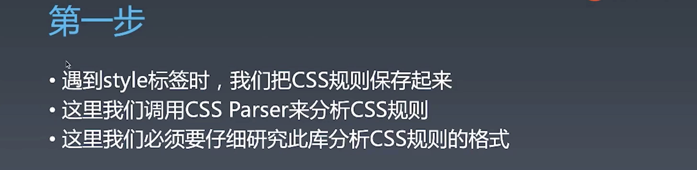
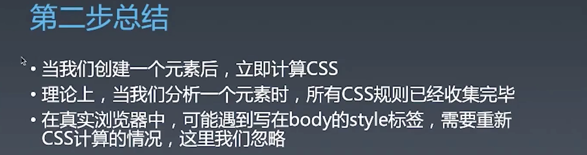
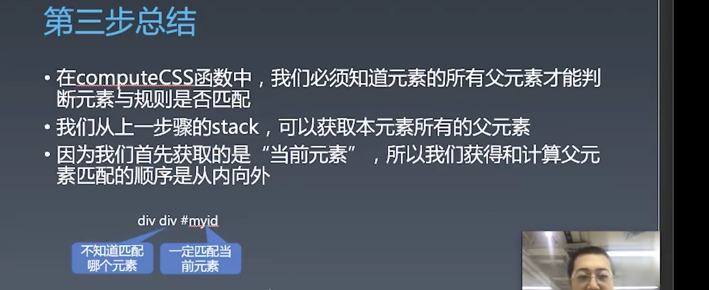
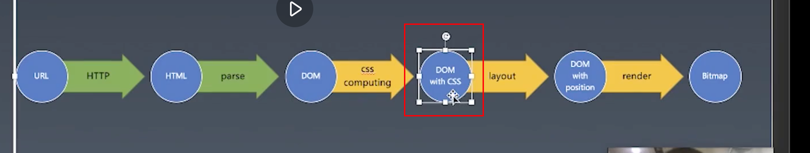

# 浏览器工作原理 | CSS计算 排版 渲染 合成（一）

[toc]

先来看一下目前进度的图示：


我们已经做了很多比较有成就感的工作了，从一个 url 开始，通过 http 协议和 html parser 已经将服务器返回的 html 文本生成了一个 DOM，但是这颗 DOM 树其实是一颗光秃秃的 DOM 树，这颗 DOM 树上东西很少，就只有和 HTML 代码中一一对应的东西，而我们去浏览器中查看 DOM 树会发现其有各种各样的信息。

如果我们想要将这颗 DOM 树进行渲染，则有一个重要的步骤，css computing，会将这颗 DOM 变成一颗带 computing style 的 DOM 树，接着就是 layout 算出其位置，有位置了就可以 render 往屏幕上画内容了。


## 环境准备

> npm install css

因为 CSS 的 parser 写起来需要涉及到很多编译原理的知识，所以这节课带着大家偷懒装一个 css 包

> 地址：https://npmjs.com/package/css
>
> 使用示例：
>
> ```js
> var css = require('css');
> 
> var ast = css.parse('body { font-size: 12px; }', { source: 'source.css' });
>  
> var css = css.stringify(ast);
>  
> var result = css.stringify(ast, { sourcemap: true });
> result.code // string with CSS
> result.map // source map object
> ```
>
> - 解析 CSS 代码，生成 AST([Abstract syntax tree](https://en.wikipedia.org/wiki/Abstract_syntax_tree) 抽象语法树）
>
> 解析示例：
>
> CSS:
>
> ```css
> body {
>   background: #eee;
>   color: #888;
> }
> ```
>
> Parse tree:
>
> ```js
> {
>   // 这一层标示这个对象是一个样式表
>   "type": "stylesheet",
>   "stylesheet": {
>     // 每一个选择器规则
>     "rules": [
>       {
>         "type": "rule",
>         // 之所以是 selectors，是为了处理带 `,` 的规则
>         "selectors": [
>           "body"
>         ],
>         // 对应花括号内部的样式声明
>         "declarations": [
>           {
>             "type": "declaration",
>             "property": "background",
>             "value": "#eee",
>             // 这部分我们用不到，是用于 soucemap 的
>             "position": {
>               "start": {
>                 "line": 2,
>                 "column": 3
>               },
>               "end": {
>                 "line": 2,
>                 "column": 19
>               }
>             }
>           },
>           {
>             "type": "declaration",
>             "property": "color",
>             "value": "#888",
>             "position": {
>               "start": {
>                 "line": 3,
>                 "column": 3
>               },
>               "end": {
>                 "line": 3,
>                 "column": 14
>               }
>             }
>           }
>         ],
>         "position": {
>           "start": {
>             "line": 1,
>             "column": 1
>           },
>           "end": {
>             "line": 4,
>             "column": 2
>           }
>         }
>       }
>     ]
>   }
> }
> ```

### 第一步 收集 CSS 规则

在计算元素的 css 之前，我们需要收集 css 规则。

toy-browser 就只收集 `<style>` 中的内容就可以了，不考虑 `<link>`

```js
else if(token.type === "endTag"){
  if(top.tagName != token.tagName) {
    throw new Error("Tag start end doesn't match!");
  } else {
    // 遇到 style 标签时，执行添加 CSS 规则的操作
    if(top.tagName === "style"){
      addCSSRules(top.children[0].content);
    }
    stack.pop();
  }
  currentTextNode = null;
}
```

- 之所以在 `stack.pop()` 之前做 `style` 元素内容的收集，是因为此时标签内的文本节点都已添加到其子节点中。

```js
// 加入一个新的函数，addCSSRule，这里我们把 CSS 规则暂存到一个数组里
let rules = [];
function addCSSRules(text) {
	let ast = css.parse(text);
  console.log(JSON.stringify(ast, null, "    "));
  rules.push(...ast.stylesheet.rules);
}
```

- 这块代码可以单独的作为一个模块 

#### 第一步总结



- 如果是完整的浏览器，就还会有遇到 `<link>` 标签的时候去请求文件，再来做解析保存的过程。


### 第二步：添加调用

上一步只是收集了规则，并没有对每一个元素调用 CSS 计算(computing)，这一步就是添加这个逻辑。

我们首先要找到在哪个位置进行添加调用 CSS computing 的逻辑。

CSS computing 我们可以认为只要有一个 element 在，那么它就对应一个 css computing 的过程。所以，我们将此逻辑添加到创建元素、添加名称和 attribute 之后：

```js
element.tagName = token.tagName;

// 取出 token 中的属性
for(let p in token) {
  if(p != "type" && p != "tagName") {
    element.attributes.push({
      name:p,
      value: token[p]
    })
  }
}

computeCSS(element);
```

- 这个和上一步解析 CSS 代码不同，我们希望计算 CSS 尽可能的早，因为 CSS 的**有些逻辑计算是依赖于其父元素**的，如果每个元素都最后去计算则会使整个页面的渲染推迟，所以正确的做法一定是每个元素刷出来之后就对其进行 CSS computing 计算。

```js
function computeCSS(element) {
  console.log(rules);
  console.log("compute CSS for Element", element);
}
```

- 这里只是打印查看一下当 `element` 元素是什么的时候，`rules` 又是什么

#### 第二步总结



- 如果遇到除了在 `head` 标签中有 css 之外，在 body 之中也有 css，则会发生重排重绘，甚至会造成 CSS 的重新计算。
- 重排一定会触发重绘，而重新 CSS 计算必然会造成重排，等于如果在整个渲染的流程里，在 first rendering 这个步骤中，**一旦在尾巴上放一个 style 标签产生了 CSS 重新计算，那么整个前面的所有步骤基本上就白费了，页面会发生一次闪动。**
- 所以，我们的 css 最佳实践是，所有的 css 内容都在靠前来写。


### 第三步：获取父元素序列

```js
function computeCSS(element) {
  // 获取所有父元素
  let elements = stack.slice().reverse();
}
```

- 这里是因为将 `computeCSS` 写在了 `parser.js` 文件中，所以可以直接去访问 `stack` 数组，从而可以快速的从 `stack` 中获取所有父元素。但实际上最好的方式是去 `element` 的 `parent` 中获取。
- 当 element 被传入 `computeCSS` 时，`stack` 在那个时间点中存储的正好的是该 element 的所有父元素。
- 这里使用 `slice()` 是为了复杂一份 stack 当前的状态，因为怕之后的操作会污染 `stack` （防御式编程）
- 使用 `reverse()` 是为了使父元素的排列变为「从内向外」，然后循环的时候从内向外进行匹配，这样可以减少计算量。


#### 第三步总结




#### CSS 选择器特点

规则的最后一部分一定会匹配到所要匹配的元素：

```html
<div>
  <span>abc</span>
  
</div>

<style>
  div span {
    color: blue;
  }
  
  body > div > #good {
    width: 200px;
  }
</style>
```

- 这里用规则 `div span` 匹配 `<span>` ，规则的最后一部分 `span` 一定会匹配到所要匹配的元素，其他的比如类、id、属性都是这样。同样，匹配 `id` 为 `good` 的 `` 也是这样的。
- 知道上面这一点是为了在做 css computing 时去「由右向左」的去匹配，优先从最后一个部分开始处理，这样可以减少计算量。


### 第四步：拆分选择器

选择器的类型很多，比如特别的是用逗号分隔的，叫做**选择器列表**（选择器组），如下：

```css
div span, body div #good {

}
```

- 实际上可以理解为有多个选择器放在一个规则之中（这里认为选择器和声明块一起被称为一个规则，可以查看https://developer.mozilla.org/zh-CN/docs/Web/CSS/Syntax）

  > CSS可以在声明块前面放置选择器（selector)，选择器用来选择页面多个元素的条件。**一对选择器与声明块称为规则集（ruleset)，常简称为规则（rule)**


```js
function computeCSS(element) {
  // 获取所有父元素
  let elements = stack.slice().reverse();
  if(!element.computedStyle){
    element.computedStyle = {};
  }
  
  // 取出 rule
  for(let rule of rules){
    let selectorParts = rule.selectors[0].split(" ").reverse();
    
    if(!match(element, selectorParts[0])){
      continue;
    }
    
    let matched = false;
    
    // j 为每一个 selector 的索引
    let j = 1;
    // 同时循环取出当前元素的父元素和匹配规则的上一层进行匹配
    for(let i = 0; i < elements.length; i++) {
      if(match(elements[i], selectorParts[j])) {
        j++;
      }
    }
    // 如果循环跑完了整个 selectorParts 说明完全匹配，则该规则对该元素是有效的
    if(j >= selectorPars.length){
      matched = true;
    }
    
    // 如果匹配到，则会把 css 属性声明加到 element 中的 computedStyle 上
    if(matched) {
      console.log('Element', element, 'matched rule', rule);
    }
  }
}
```

- 此时的 `match` 没有写，只是先将整个逻辑的架子搭好，这也是一种很好的编程方式，先把处理过程大致写出来，再填充细节。但这要求你对你要实现的目的有一个比较清晰的处理步骤，否则没有办法做到从更大的层面来书写代码。（我一般的方式就是一步一步的写，一边写一边想接下来的步骤，但是这样会有一个较大的问题是，如果其中的某个步骤有问题则会导致整体上也有问题，可能为了弥补这个问题之后的代码就会变得繁琐复杂而不利于维护。这也是为什么需要架构的原因，一个好的架构能保证软件系统的稳定、可扩展性等。）（**所以，我在写代码之前可以用文本来描述一个伪代码，然后根据这个伪代码来实现真实代码，一定要记住，要写下来，无论是用 markdown 还是笔纸，因为人的大脑能记住的东西太少**）


#### 第四步总结

- 选择器也要从当前元素向外排列
- 复杂选择器拆成针对单个元素的选择器，用循环匹配父元素队列


#### 问题

- 行内样式如何匹配？
  - 行内样式已经在 element 上了，我们只需要将来自 `style` 中的样式和行内样式进行合并就可以了。
- 当遇到像 `inherit` 这样特殊的属性值时，我们在 css computing 阶段是不处理的，我们只有到绘制和排版阶段用到这个属性的时候才会将 `inherit` 换成实际的值，比如 `inherit` 会去找其父元素的值。
- CSS 写在 body 里，CSS 会造成重新计算，这样会造成重绘？
  - 大概率会造成重绘，你把 style 标签写在 body 之后，基本上都会重绘
- 如果点击事件或者计时器修改 css 呢？
  - 一样的，只要你修改了 css 的任何一条规则，都会发生大规模的重新计算，如果属性改变，则一定会发生重绘。
  - 正常情况下，我们没有理由在页面加载好之后还去改 css rule，我们肯定是要么改 style 属性，要么改 class 属性。（也就是我们先写好一堆 css 规则，然后再通过更改元素的 class 或者 style 来更改其样式，这样性能更好）
- 虽然给每个元素都添加一个 class 能够保证性能最好（因为 css computing 做的工作变得更加简单）但是这点性能的优化其实没有太大的意义，因为 css computing 占整个页面加载的时间很少很少一部分，一般都在 10ms 内，所以这点优化可以忽略。（因此，对于优化我们需要看具体优化的时间，而不是优化就是好的，要衡量）
- 如果你将所有的 css 属性都写成行内样式那就不存在 css computing 阶段了，因为不需要去匹配 css 规则。


### 第五步：计算选择器与元素匹配

 实现 `match` 函数：

```js
function match(element, selector) {
  if(!selector || !element.attributes) {
    return fasle;
  }
 
  // 匹配 id 选择器
  if(selector.charAt(0) === '#') {
    let attr = element.attributes.filter(attr => attr.name === "id")[0]
     // replace 为 '' 空字符串就是删除这个字符
    if(attr && attr.value === selector.replace('#', '')){
      return true;
		// 匹配类选择器
    }else if(selector.charAt(0) === '.'){
      var attr = element.attributes.filter(attr => attr.name === 'class')[0]
      if(attr && attr.value === selector.replace('.', '')){
        return true;
      }
    }else {
      // 匹配元素选择器
      if(element.tagName === selector) {
        return true;
      }
    }
    return false;
  }
}
```


#### 第五步总结

- 根据选择器的类型和元素属性，计算是否与当前元素匹配。
- 这里仅仅实现了三种基本选择器，实际的浏览器中要处理复合选择器。


#### 问答：

- 之所以不使用之前那样带着大家一起敲代码的方式讲课，是因为就算 winter 已经用代码实现过很多次，但也不可能避免的会遇到翻车，需要调试来帮助将代码跑通，毕竟实现一个小型浏览器也是一个比较复杂的项目。
- winter 之所以不直接给出代码的原因是希望我们自己去手写一遍并且通过自己去理解，并通过自己的调适来让 toy-browser 能够正常的运行。
- `computeCSS` 函数做的工作
  - 将传入的 `element` 与 `rules` 中的规则进行匹配，如果匹配就将规则中的属性声明添加到 `element ` 中。
- 请问真实的浏览器也是先获取所有的规则，再匹配，还是边获取边匹配？
  - 每次获取一个新的规则，所有的元素都需要重新算一遍。所以是获取全部规则之后再匹配。
- CSS 的规范
  - 可以先看 2.1 的规范，虽然有点老 https://www.w3.org/TR/CSS2/
  - 其他的内容可以去 https://www.w3.org/TR 中搜索
  - 但是 css 的规范很乱，而且很多是 wroking traft 状态
  - css 的标准很难读

- 浏览器渲染的设计原理和系统渲染是否相似
  - 有相似的地方和不相似的地方，浏览器渲染最特别的地方就是 css computing，因为除了浏览器 winter 还没有见到过一个主流的 UI 系统是会用样式表的方式去定显示的属性。
- toy-browser 的总架构图就是最上面那张图，架构师画的图值钱😂


### 第六步：生成 computed 属性

```js
// 如果匹配到，则会把 css 属性声明加到 element 中的 computedStyle 上
if(matched) {
  let { computedStyle } = element;
  for(let declaration of rule.declarations){
    if(!computedStyle[declaration.property]){
      computedStyle[declaration.property] = {};
    }
    // 将值存储到一个对象中，而不是直接使用 k/v 的方式存储，是因为之后要处理优先级
    computedStyle[declaration.property].value = declaration.value
  }
  console.log(element.computedStyle);
}
```

- 通过这段代码我们可以知道 CSS 的样式是如何变为 computedStyle 的。


#### 第六步总结

- 一旦选择器匹配，就应用选择器到元素上，形成 computedStyle


#### 问答

- 真实环境中所有的样式都会放到 computedStyle 中吗？
  - 当然了，computedStyle 对象就是一个元素最后所有的样式属性，当然 computedStyle 并不一定使用对象存储。
  - 我们这里的 computedStyle 是根据 style 中 css 的样式代码获得的，实际上 computedStyle 会根据一个很复杂的关系而合成的。
- `document.styleSheets` 是 computedStyle 吗？
  - 不是，是解析 css 之后的类似于我们代码中的 `rules` 
  - computedStyle 是类似于 `window.getComputedStyle(ele)` 输出的结果


### 第七步：确定规则覆盖关系

先来看一下 [specificity](https://developer.mozilla.org/zh-CN/docs/Web/CSS/Specificity)（特殊性、优先级，指定的具体的程度）

选择器所指定的元素越模糊其优先级越低，比如标签选择器，伪元素选择器就属于低优先级的选择器。

#### 选择器类型

下面列表中，选择器类型的优先级是递增的：

1. [类型选择器](https://developer.mozilla.org/en-US/docs/Web/CSS/Type_selectors)（例如，`h1`）和伪元素（例如，`::before`）
2. [类选择器](https://developer.mozilla.org/en-US/docs/Web/CSS/Class_selectors) (例如，`.example`)，属性选择器（例如，`[type="radio"]`）和伪类（例如，`:hover`）
3. [ID 选择器](https://developer.mozilla.org/en-US/docs/Web/CSS/ID_selectors)（例如，`#example`）。
4. 内联选择器

`important` 并不是第五个优先级，而是单独的，有它则将会使其覆盖掉无它的属性，在实践中是尽量要禁止使用它的，它**只能用于 hot fix，临时的修改，比如在时间不多的情况下实在找不到修改这个样式的时候可以使用，在阿里使用会受到重罚。**

计算优先级是使用四元组的方式来存储优先级， [0,0,0,0] 每一个位置对应一种选择器类型，然后一一比对再决定使用哪个属性。IE 之前并不是用这种方式来存储优先级，而是使用了 4 个字符，每个字符 8 位可存 255 个数，所以会有一个 bug，当某种选择器类型超过 255 个就会进位然后其内部的属性就能够覆盖掉下一级的选择器属性。标准中是对每一位置乘以一个相对较大的数来存储，然后比较这个数。

实现 `specificity` ：

```js
function specificity(selector) {
  // 左高右低的排位
  let p = [0, 0, 0, 0];
  let selectorParts = selector.split(" ");
  for(let part of selectorParts) {
    if(part.charAt(0) === '#') {
      p[1] += 1;
    } else if(part.charAt(0) === '.') {
      p[2] += 1;
    } else {
      p[3] += 1;
    }
  }
  return p;
}
```

生成 `computedStyle` 部分：

```js
// 如果匹配到，则会把 css 属性声明加到 element 中的 computedStyle 上
if(matched) {
  let	currentSpec = specificity(rule.selectors[0]);
  let { computedStyle } = element;

  for(let declaration of rule.declarations){
    if(!computedStyle[declaration.property]){
      computedStyle[declaration.property] = {};
    }

    if(!computedStyle[declaration.property].specificity){
      computedStyle[declaration.property].value = declaration.value
      computedStyle[declaration.property].specificity = currentSpec
    }else if(compare(computedStyle[declaration.property].specificity, currentSpec) <= 0) {
      computedStyle[declaration.property].specificity = currentSpec
      computedStyle[declaration.property].value = declaration.value
    }
  }
  console.log(element.computedStyle);
}
```

`compare`

```js
// 如果返回小于 0 表示 sp2 的权重比 sp1 的大
function compare(sp1, sp2) {
  // 从高位开始比较
  if(sp1[0] - sp2[0]) {
    return sp1[0] - sp2[0];
  }else if(sp1[1] - sp2[1]) {
    return sp1[1] - sp2[1];
  }else if(sp1[2] - sp2[2]) {
    return sp1[3] - sp2[3];
  }
  return sp1[4] - sp2[4]
}
```


好的，以上逻辑处理完成之后就到了下面红框的部分：



我们给 DOM 穿上了衣服，但是还是透明的，我们还没有具体算出来应该画成什么样。


#### 第七步总结：

- CSS 规则根据 specificity 和后来优先规则覆盖
- specificity 是个四元组，越左边权重越高
- 一个 CSS 规则的 specificity 根据包含的简单选择器相加而成 


 

## CSS computing 步骤：

1. 收集 CSS 规则
2. 添加调用
3. 获取父元素的序列
4. 拆分选择器
5. 计算选择器与元素匹配(*)
6. 生成 computed 属性
7. 确定规则覆盖关系(*)


## 课程涉及

### 预习内容：

- [浏览器：一个浏览器是如何工作的（阶段三）](https://time.geekbang.org/column/article/80311)
- [浏览器：一个浏览器是如何工作的？（阶段四）](https://time.geekbang.org/column/article/81730)
- [浏览器：一个浏览器是如何工作的？（阶段五）](https://time.geekbang.org/column/article/82397)

### 课件及代码截图：

- 链接： https://pan.baidu.com/s/14OZzG_K5E3ymZHUXZrJS4Q
  提取码：xpxy

### 参考链接：

- https://www.w3.org/TR/CSS2/
- https://github.com/wintercn/JSinJS

### 有助于你理解的知识：

- 如何通过 link 异步加载 css，没有类似 script 的官方 async 属性，但可以参考这篇文章 hack：[ https://juejin.im/post/5d8873526fb9a06b155dfbca](https://juejin.im/post/5d8873526fb9a06b155dfbca)

### 课后作业：

- 实现复合选择器，实现支持空格的 Class 选择器（选做）