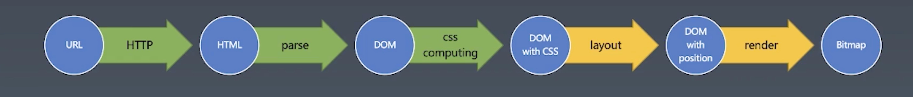
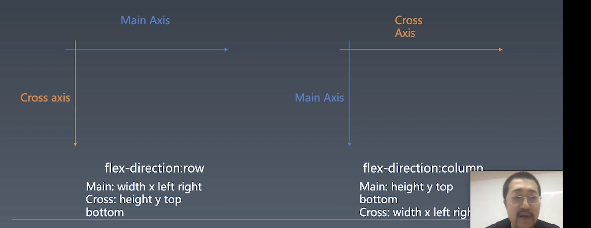
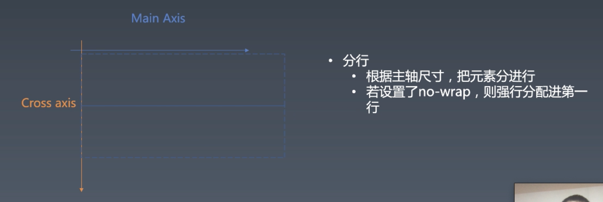
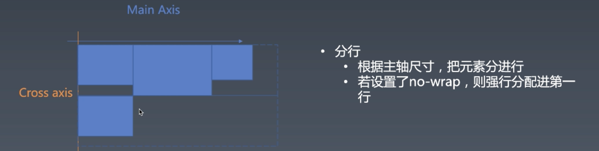

# 1.浏览器工作原理 | CSS计算,排版,渲染,合成（二）

[toc]

## CSS 排版

「排版」这个词，有时候会翻译为「布局」，winter 的朋友说「排版」和「布局」在国外是两个概念，「布局」是更大范围的布局，而在国内我们都称为「排版」，英文为「layout」。

浏览器中的排版有三代的技术：

- 第一代叫做「正常流」—— normal flow
  - 代表就是 `display: block` 和 `display: inline` `display: inline-block` 以及 `position: absolute` `position: relative`  还有 `float` 和 `float` 相关属性 `clear` 
- 第二代叫做「flex」布局
  - 我们的 toy-browser 会选择使用 flex 来排版，因为 flex 是三代排版技术中最简单能够实现，而且 RN 也证明了 flex 是可以完全的实现大家 layout 的需求的。
- 第三代——「grid」布局

虽然 flex 是三代中较为容易实现的布局，但其实也并非很容易，所以这节课的代码会是一些比较高强度的代码。

### 回顾



- 在之前的课程中我们完成了从 URL 到 HTML，使用 http 来实现的。
- 从 HTML 到 DOM，通过 parser 来实现。
- 从一个不带 CSS 的 DOM 到带 CSS 的 DOM，是通过 css computing 来实现的。


接下来要将这颗带 CSS 的 DOM 树变为带位置（position）的 DOM 树，因为渲染之前是一定要知道每个元素的位置的。


### 第一步 准备

#### 两个概念



- 主轴
- 交叉轴

我们在做 flex layout 需要一个抽象的方式。在 flex 中是可以从左往右，从右往左，从上往下，从下往上排等各种排布方向，为了处理一个排布方向，我们要么选择用 if else，但是如果使用 if else 就会有大量的 if else，里面代码会高度重复。所以，标准中选择了一种抽象的方式，我们会使用**主轴来代表元素的排布方向，交叉轴来代表与主轴垂直的方向**。

什么叫元素的排布方向？

- 比如我们进来了一个元素1，然后又进来了一个元素2，那么在一般的情况下，元素2会排在元素1的什么方向呢？如果排列在右边，主轴方向则为 row，`flex-direction` 就是用来表示主轴方向的。row 就表示主轴从左往右排，主轴就和 `width` `x` `left` `right` 这些有关系，而跟主轴垂直的侧轴就和 `height` `y` `top` `bottom` 有关系。
- 如果 `flex-direction` 为 `column` 则和上面情况相反。

因此，我们代码的第一步就是做一些准备工作，方便我们去写排版的算法。

#### 代码

`parse.js` 和 `client.js` 的代码不变，我们将新的 layout 的逻辑放到 `layout.js` 中。

```js
function layout(element){
    if(!element.computedStyle){
        return;
    }
    var elementStyle = getStyle(element);
  //...
}
```

- 没有 `computedStyle` 的元素就不走 layout 的逻辑。

- 有 `computedStyle` 的元素，我们通过 `getStyle` 方法对元素做预处理：

  ```js
  function getStyle(element){
      if(!element.style){
          element.style = {};
      }
      for(let prop in element.computedStyle){
          element.style[prop] = element.computedStyle[prop].value;
          if(element.style[prop].toString().match(/px$/)){
              element.style[prop] = parseInt(element.style[prop]);
          }
          if(element.style[prop].toString().match(/^[0-9\.]+$/)){
              element.style[prop] = parseInt(element.style[prop]);
          }
      }
      return element.style;
  }
  ```

  - 在元素上添加 `style` 对象，将 `computedStyle` 上的属性拷贝到 `style` 上。
  - 然后将有 `px` 字符或是数字的样式值转换为 `number` ，这样处理之后，这些样式值就可以直接参与运算，不再需要进一步的做特殊处理。（实际上，这一步如果是百分比的值还需要根据相对值进行计算。）


```js
function layout(element){
  //..
  if(elementStyle.display !== 'flex'){
    return
  }

  var items = element.children.filter(e => e.type === 'element');

  items.sort(function(a,b){
    return (a.order || 0) - (b.order || 0);
  })
```

- 3～5，`toy-browser` 只处理 `display` 为 `flex` 的元素。
- 7，过滤非 `element` 的节点，比如文本节点。
- 9～11，根据 `order` 属性对元素进行排序。


接下来对 `width` 和 `height` 进行处理：

```js
['width','height'].forEach(size => {
  if(style[size] === 'auto' || style[size] === ''){
    style[size] = null
  }
})
```

- 2～4，当 `width` 或者 `height` 为 `auto` 或者为空，那么我们就统一将其设置为 `null` ，便于之后用于计算。


对一些样式设置默认值：

```js
if(!style.flexDirection || style.flexDirection === 'auto'){
  style.flexDirection = 'row'
}
if(!style.alignItems || style.alignItems === 'auto'){
  style.alignItems = 'stretch';
}
if(!style.justifyContent || style.justifyContent === 'auto'){
  style.justifyContent = 'flex-start';
}
if(!style.flexWrap || style.flexWrap === 'auto'){
  style.flexWrap = 'nowrap';
}
if(!style.alignContent || style.alignContent === 'auto'){
  style.alignContent = 'stretch';
}
```


```js
var mainSize,mainStart,mainEnd,mainSign,mainBase,
        crossSize,crossStart,crossEnd,crossSign,crossBase;
```

- 这十个变量是第一步骤的重点，会用这些变量来对方向进行抽象：
  - `size` 是尺寸，可能是 `width` 或是 `height` ，是属性名。
  - `start` 和 `end` 也是两个属性的名字，假如我们的方向是从左往右，那么 `start` 为 `left` ，`end` 为 `right`
  - `base` 是做排版的起点，如果从左往右排，起点则为 0，从右往左排，则可能是元素的宽度值，只有两种值。
  - `sign` 表示排布的方向，从左往右是 `+1`，可以直接理解为符号，是数字化表示的方向，直接参与乘法运算，帮助减少 if else 的使用。
- 这十个变量是后面用于计算 layout 使用的。


接着是根据 `flexDirection` 来设置上面那些抽象变量：

```js
if(style.flexDirection === 'row'){
        mainSize = 'width';
        mainStart = 'left';
        mainEnd = 'right';
        mainSign = +1;
        mainBase = 0;

        crossSize = 'height';
        crossStart = 'top';
        crossEnd = 'bottom';
    }
    if(style.flexDirection === 'row-reverse'){
        mainSize = 'width';
        mainStart = 'right';
        mainEnd = 'left';
        mainSign = -1;
        mainBase = style.width;

        crossSize = 'height';
        crossStart = 'top';
        crossEnd = 'bottom';
    }
    if(style.flexDirection === 'column'){
        mainSize = 'height';
        mainStart = 'top';
        mainEnd = 'bottom';
        mainSign = +1;
        mainBase = 0;

        crossSize = 'width';
        crossStart = 'left';
        crossEnd = 'right';
    }
    if(style.flexDirection === 'column-reverse'){
        mainSize = 'height';
        mainStart = 'bottom';
        mainEnd = 'top';
        mainSign = -1;
        mainBase = style.height;

        crossSize = 'width';
        crossStart = 'left';
        crossEnd = 'right';
    }

    if(style.flexWrap === 'wrap-reverse'){
        var tmp = crossStart;
        crossStart = crossEnd;
        crossEnd = tmp;
        crossSign = -1;
    }else {
        crossBase = 0;
        crossSign = 1;
    }
```

- `style.flexWrap === 'wrap-reverse'` 会改变 `crossStart` 和 `crossEnd` 的方向，还有 `crossSign` 的值。


这样就完成了准备工作，这一步处理了 `flexDirection` 和 `flexWrap` 两个属性。


> 这里我们只用了三代布局中最简单的 flex 布局，而像 normal flow 还需要去根据 float 左绕排就会非常的麻烦。并且 rn 也证明了只使用 flex 的布局也能很好的实现 app 的排版。


### 第二步 收集元素进行(hang)



这里有两行，但其实一开始也不知道这些元素会分成几行，分行是根据元素 `mainSize` 判断的。



这里，由于第四个元素的 `mainSize` 超过了第一行剩下的空间，所以换到第二行。


#### 代码

```js
var isAutoMainSize = false;
if(!style[mainSize]){
  elementStyle[mainSize] = 0;
  for(var i =0; i<items.length; i++){
    var item = items[i];
    var itemStyle = item.style;
    if(itemStyle[mainSize] !== null || itemStyle[mainSize] !== (void 0)){
      elementStyle[mainSize] += itemStyle[mainSize];
    }
  }
  isAutoMainSize = true;
}
```

- 首先，我们要处理一种特殊情况，父元素没有设置 `mainSize` ，也就是父元素没有设置 `width` 或者 `height` 。那么父元素的宽度则由子元素决定，子元素会将父元素撑开。
- 这里也用 `isAutoMainSize` 表示是否已经通过子元素计算了父元素的 size。


```js
var flexLine = [] // 用于放一行的元素
var flexLines = [flexLine] 


var mainSpace = elementStyle[mainSize]; // 剩余空间
var crossSpace = 0;

for(var i =0; i < items.length; i++){
  var item = items[i];
  var itemStyle = getStyle(item);
  if(itemStyle[mainSize] === null){
    itemStyle[mainSize] = 0;
  }

  if(itemStyle.flex){
    flexLine.push(item);
  }else if(style.flexWrap === 'nowrap' && isAutoMainSize){
    mainSpace -= itemStyle[mainSize];
    if(itemStyle[crossSize] !== null && itemStyle[crossSize] !== (void 0)){
      crossSpace = Math.max(crossSpace,itemStyle[crossSize]); 
    }
    flexLine.push(item);
  }else {
    if(itemStyle[mainSize] > style[mainSize]){
      itemStyle[mainSize] = style[mainSize];
    }
    if(mainSpace < itemStyle[mainSize]){
      flexLine.mainSpace = mainSpace;
      flexLine.crossSpace = crossSpace;

      flexLine = [];
      flexLines.push(flexLine);

      flexLine.push(item);

      mainSpace = style[mainSize];
      crossSpace = 0;
    }else {
      flexLine.push(item);
    }
    if(itemStyle[crossSize] !== null && itemStyle[crossSize] !== (void 0)){
      crossSpace = Math.max(crossSpace,itemStyle[crossSize]);
    }
    mainSize -= itemStyle[mainSize];
  }
}
flexLine.mainSpace = mainSpace;
```


## 课程设计

### 参考链接：

- https://www.runoob.com/w3cnote/flex-grammar.html
- https://developer.mozilla.org/en-US/docs/Web/CSS/justify-content
- https://www.npmjs.com/package/images

### 代码截图及答疑回放：

- 链接：[ https://pan.baidu.com/s/1Zk1rzj3rBQF0vBp9jbGFcA](https://pan.baidu.com/s/1Zk1rzj3rBQF0vBp9jbGFcA)
  提取码：r59y