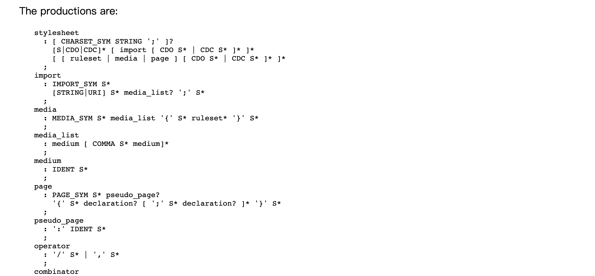
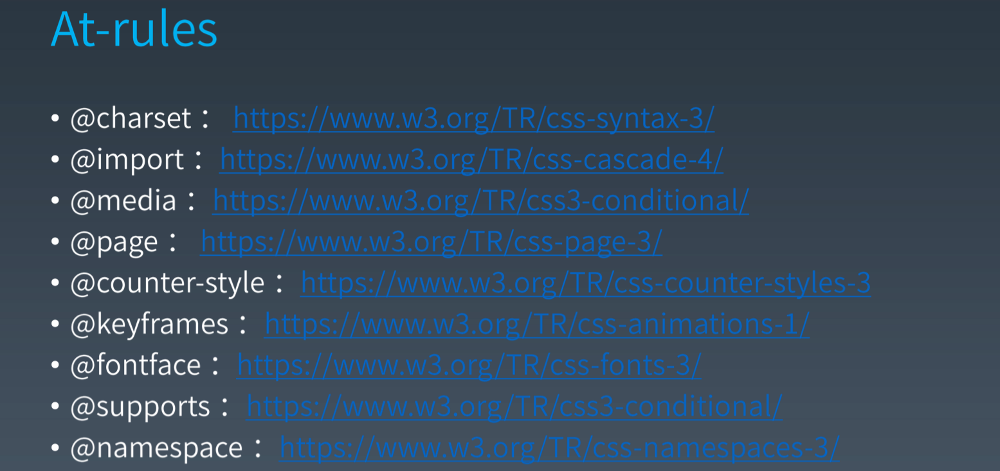
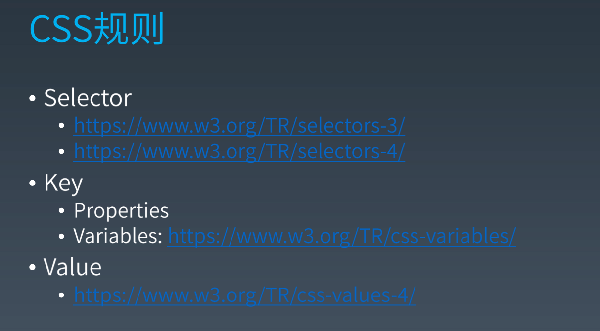

# 2.重学CSS | CSS基本语法,CSS基础机制（一）

[toc]

## 重学 CSS

我们重学 CSS 是站在一个新的角度——**完备性**和**体系化**，来看平时我们所掌握的 CSS 知识之间的关联。（重学系列都是这个特点，将已有的知识进行整理，从而发现一些新的知识）

### 第一步：CSS 语法的研究

我们说重学前端建立知识体系，但如何建立？我们需要**通过线索**。

CSS 是 HTML JS CSS 技术中标准写的最差的一个。所以，我们要找到 CSS 完整的结构线索非常困难，其标准很分散，MDN 中有很多 CSS 的内容，但是 MDN 也不一定完整，而 W3C 整理的结构非常差。

虽然 CSS 如今变成了一个复杂的难以确定标准的语言，但我们可以去从以往的简化的版本—— CSS 2.1 中开始学习。

- https://www.w3.org/TR/CSS21/grammar.html#q25.0
- https://www.w3.org/TR/css-syntax-3
- https://www.w3.org/TR/2011/REC-CSS2-20110607/

CSS 2.1 是一个 snapshot，它的整个标准是对 CSS 2.1 的完整描述，到了 CSS 3 才开始分的标准。所以我们可以从 2.1 中找到基本的 CSS 的结构。

看一下 CSS 2.1 的目录结构：

#### Quick Table of Contents

- [1 About the CSS 2.1 Specification](https://www.w3.org/TR/2011/REC-CSS2-20110607/about.html#q1.0)
- [2 Introduction to CSS 2.1](https://www.w3.org/TR/2011/REC-CSS2-20110607/intro.html#q2.0)
- [3 Conformance: Requirements and Recommendations](https://www.w3.org/TR/2011/REC-CSS2-20110607/conform.html#q3.0)
- [4 Syntax and basic data types](https://www.w3.org/TR/2011/REC-CSS2-20110607/syndata.html#q4.0)
- [5 Selectors](https://www.w3.org/TR/2011/REC-CSS2-20110607/selector.html#q5.0)
- [6 Assigning property values, Cascading, and Inheritance](https://www.w3.org/TR/2011/REC-CSS2-20110607/cascade.html#q6.0)
- [7 Media types](https://www.w3.org/TR/2011/REC-CSS2-20110607/media.html#q7.0)
- [8 Box model](https://www.w3.org/TR/2011/REC-CSS2-20110607/box.html#box-model)
- [9 Visual formatting model](https://www.w3.org/TR/2011/REC-CSS2-20110607/visuren.html#q9.0)
- [10 Visual formatting model details](https://www.w3.org/TR/2011/REC-CSS2-20110607/visudet.html#q10.0)
- [11 Visual effects](https://www.w3.org/TR/2011/REC-CSS2-20110607/visufx.html#q11.0)
- [12 Generated content, automatic numbering, and lists](https://www.w3.org/TR/2011/REC-CSS2-20110607/generate.html#generated-text)
- [13 Paged media](https://www.w3.org/TR/2011/REC-CSS2-20110607/page.html#the-page)
- [14 Colors and Backgrounds](https://www.w3.org/TR/2011/REC-CSS2-20110607/colors.html#q14.0)
- [15 Fonts](https://www.w3.org/TR/2011/REC-CSS2-20110607/fonts.html#q15.0)
- [16 Text](https://www.w3.org/TR/2011/REC-CSS2-20110607/text.html#q16.0)
- [17 Tables](https://www.w3.org/TR/2011/REC-CSS2-20110607/tables.html#q17.0)
- [18 User interface](https://www.w3.org/TR/2011/REC-CSS2-20110607/ui.html#q18.0)
- [Appendix A. Aural style sheets](https://www.w3.org/TR/2011/REC-CSS2-20110607/aural.html#q19.0)
- [Appendix B. Bibliography](https://www.w3.org/TR/2011/REC-CSS2-20110607/refs.html#q20.0)
- [Appendix C. Changes](https://www.w3.org/TR/2011/REC-CSS2-20110607/changes.html#q21.0)
- [Appendix D. Default style sheet for HTML 4](https://www.w3.org/TR/2011/REC-CSS2-20110607/sample.html#q22.0)
- [Appendix E. Elaborate description of Stacking Contexts](https://www.w3.org/TR/2011/REC-CSS2-20110607/zindex.html#q23.0)
- [Appendix F. Full property table](https://www.w3.org/TR/2011/REC-CSS2-20110607/propidx.html#q24.0)
- [Appendix G. Grammar of CSS 2.1](https://www.w3.org/TR/2011/REC-CSS2-20110607/grammar.html#q25.0)
- [Appendix I. Index](https://www.w3.org/TR/2011/REC-CSS2-20110607/indexlist.html#q27.0)

1、2、3 是关于标准本身的介绍，4 语法和基本的数据类型，5 选择器，6 给属性设定值、级联、继承，7 媒体类型，8 9 10 排版，11 渲染相关， 12 关于 list 的特殊处理， 13 页面媒体， 14 15 16 和渲染相关，17 table 单独的提出来一个话题，18 用户交互

8 9 10 是我们经常在网上能够找到的内容，比如「盒模型」「BFC」

**BFC 是 normal layout 中的概念**，也就是和排版相关的概念，我们平时很少接触到这些东西，反而那些做图书排版的编辑可能会更加熟悉。

> Winter 觉得学一个东西应该从 Grammar 开始看，而不是从标准的目录一个一个开始，因为标准本身是很晦涩的，这样会很消耗注意力。

#### CSS 总体结构（简化版）

- @charset
- @import
- rules
  - @media
  - @page
  - rule

标准中的 [CSS 语法](https://www.w3.org/TR/CSS21/grammar.html#q25.0) 说明：



- 从 `@charset` 开始，不过是 `?` 也就是可选。

- `S` 为空格，CSS 中有些地方能插入空格，有些地方不能插入空格，如果规定不能插入空格的地方插入了空格则会报错。这和 JS 中大部分空格都没用不同，其语法描述中到处都会告诉你能否插入空格。

- `CDO` 是 `<!--`  `CDC` 是 `-->` ， 用于那些不不支持 `style` 标签的浏览器，将 `CDO` `CDC` 加在 `style` 中可以保证如果浏览器不支持 `style` 也不会将其中的文本内容显示在页面中。因为这两个玩意儿是 HTML 中的多行注释的写法。（注意在 css 中，位于 `CDO` `CDC` 中的内容是有效的，因为 CSS 的解析器会忽略这个东西）

  ```html
  <style>
  	<!--
    div { font-size: 298px};
    -->
  </style>
  ```

- 2.1 时代的 `@` 规则很少，只有 media page import ，并且 media 也不能通过对屏幕的宽高的大小做比较来应用样式。css 3 的 media 语法完全被重构了。

- `ruleset` 就是最重要的规则级，是以 `selector` 开始的，然后接着 `{}` ，`{}` 里面是 `declaration` 

- 之后我们会学习 css 3 的 `selector` 

- `selector` 之后都是关于 `selector` 的内容和属性中内容。

- `@page` 做打印的时候可能会用到。

 

我们平时写 CSS 最多的内容就是 `rules` ，而 `@charset` 可以算是一个过时的东西，我们写 css 基本上都是要兼容 `ACSII` ，如果超过了 ACSII，可以通过转义去做处理。

CSS 中只有一种注释 —— `/* */` 

我们了解 CSS 语法是为了对 CSS 建立一个整体的认知，**因为语法中所提及的所有内容也就是 CSS 会使用的到内容**。

从上面对语法的总结中我们可以将 CSS 大致分为两个部分：带 `@` 的 rule 和不带 `@` 的 rule，所以我们也可以认为 CSS 就是一堆 rule 的集合。不带 `@` 的 rule 是我们经常所使用的，`@` rule 是用于处理一些特殊的场景和特定领域问题。如果画 CSS 脑图，两个个分支就可以确定了——  `At-rules` 和 `rules` 


### 第二步：CSS @ 规则的研究

 我们可以在 MDN 上搜索 `at rule` 查看比较全的 `At-rules` ：https://developer.mozilla.org/en-US/docs/Web/CSS/At-rule

详细的标准如下：



两个比较重要的：

- `@media` 媒体查询
  - 可以嵌套
  - 用的最多的可能可能就是检查屏幕大小，`max-width` `min-width` 
-   `@supports` 是用于检查 CSS feature 的规则，比如检查是否支持 `display: flex` 布局，但是 `@supports` 本身的兼容性就很差，所以目前来看这个东西还不是很好用，可能若干年后会有用吧🤷‍♂️

#### 问题

是不是 `postcss` 处理了兼容性问题，所以就放弃应用 `@supports` 了呢？

- `postcss` 其实解决的都是最表面的问题，深度的兼容性问题是你意想不到的。winter 之前做手淘，兼容三十多款用户用的最多的机型，这些机型中的兼容性问题并不是通过 `postcss` 去解决的，而是一个 case 一个 case 的去处理的，不过 `postcss` 已经帮你处理了很多问题了，比如带前缀，这种问题很麻烦但又没什么技术含量，不需要人为的处理。
- 版本兼容性问题其实是工程问题，而不是技术问题，因为随着时代的发展，机器的更迭，浏览器的升级，有些兼容性都会被处理掉，只是当我们遇到这些问题的时候，可能需要自己去想办法来一个一个处理。

Chrome 中的模拟机型靠谱吗？

- 完全不靠谱，一般来说要想做兼容性测试，都是会用真机。

如今要解决手机屏幕的适配问题最好使用 vw 的方案，而不是 rem，虽然 rem 是 winter 他们团队在 2013 年最先所提出来的。当时 vw 是完全不可能的，而且也没有 postcss，如果当时有 postcss，他们就会使用 postcss 和 vw，所以最终他们在那时就选择使用 rem 同时引入一些运行时的 JS 代码。

vw 就是和百分比宽度，和屏幕的百分比宽度成正比，这样你就可以去处理屏幕适配。但是你需要屏幕适配处理，并不是所有的元素都使用，不同的元素是有不同的语义，比如说文字是有点阵的位置，不可能都去缩放，所有不同的字体采用的大小可能都有所不同，文字你是希望它按照正常流去排列，而不是想让文字随着屏幕的大小去做缩放，保证一排就是这么多文字。

真正解决兼容性问题的是一个规则，而不是一个单位，单位只能去解决特定的问题。

如果想要了解一些手机的兼容性问题可以去查看 winter 的这篇文章：[手机淘宝的flexible设计与实现](http://www.html-js.com/article/2402) ，然后把里面关于 rem 的部分转换为 vw

 

### 第三步：CSS 规则的结构



- Selector 我们一般看 3，不看 4，4 估计要完。
  - 链接是产生式的地址，**产生式是在告诉你你的解析器的代码应该怎么去写**。
  - 3 的规则实际上不只是给 CSS 用，而且也可以给 querySelecotors 这个 API 使用。    
  - 4 由 CSS 的专家们对 selector 进行了进一步的划分，有了复杂选择器这一类
- Key
  - Properties 可以用变量来声明
- Value
  - 有很多不同的单位，并且可以使用函数和变量。
    - 比如 `calc()` 可以用不同的单位进行混合运算。不过淘宝的 `calc()` 在 winter 离开之前都还没有解锁。


> 从语法层面来学习一个语言并将其作为知识体系建立的基础是相对比较完备的，绝大多数知识点都可以放入其中，但也存在个别特殊的情况，遇到这样的情况就需要去重构你的知识体系的时机，这是好事！
>
> 但是呢，我觉得知识体系这个东西，基本上是对于一个熟手而言的，一个新手就好好找个教材或是老师跟着先走完一遍再考虑比较好。


####  问答：

- iconfont 的原理是什么？
  - 字体中的每一个字体是对应字符码点的，所以就是实现一种带有各种 icon 的字体集，然后用不常用的码点去表示就可以了。
- 复杂选择器要用到子元素，toy-browser 在哪里处理？
  - 实际上目前的 selector 3 是没有用到子元素的，而 4 有很多地方有用到，所以 4 可能药丸的原因也在这里，因为这是非常复杂的，但也说不定有什么办法可以相对简单的实现吧。主要的问题是，有些架构设计出来之后再改成本就会很高。
- GPU 的栅格化在哪里？
  - 栅格化也叫像素化，比如你要绘制一个圆形，就一定要将其变为一个位图（bitmap），像素点阵。GPU 的栅格化大部分都是指使用 shader 将其变为点阵的问题。这个一般都是在渲染的最后阶段去做，如果过早的去做就会在某些环节损失一些精度。
  - 建议不要跑到一个离自己知识体系太远的地方，否则连不过去就会很难受，但是如果感兴趣也可以啊。 

- **脑图的完备性不代表你每一个脑图上的知识点分支你也要都学，因为很多内容不太重要，只要了解个大概就行了。脑图的作用是告诉你有哪些知识，至于知识是否重要需要你去了解和根据很多情况进行分析。**
- 主题更换是不是可以使用 css + js 通过 css variable 来做？
  - 有很多种思路来做，这是一种思路，但是兼容性不太好。
- 如何测试 css variables 性能？
  - 看帧率，除了最开始加载的那一次是看 onload 的时间，剩余的去测渲染、显示主要是去看帧率在这个时间是否会大量的掉，或者掉多少。
- 暗黑模式是否可以通过 media + variable 来实现？
  - 理论上是可以的。


### 实现： 收集标准

在 W3C 的标准中有很多 CSS 的标准，我们尝试从中取出 CSS 的全部标准，找到它们的 URL。

地址：http://w3.org/tr/?tag=css

为什么 w3 的标准页面打开这么慢？是因为它把所有的标准内容都返回给你了，然后是在浏览器中通过 JS 来做过滤的，它们服务器不太好。

```js
var lis = document.getElementById("container").children

var result = [];

for(let li of lis) {
  if(li.getAttribute('data-tag').match(/css/))
    result.push({
      name:li.children[1].innerText,
      url:li.children[1].children[0].href
    })
}
console.log(result)
console.log(JSON.stringify(result)) // 复杂这个内容到编辑器的新文件中即可
```

通过以上这段代码来获取 css 的标准的网页链接和名称。

一共有 100 多个，非常的疯狂，只有 16 个在 recommendation 里，有 60 个 working drft（草稿，会依次进入 candidate recommendation，然后进入 proposed recommendation，然后进入 recommendation 里就是现在的标准，retired 就是退休）   

**像 `data-xxx` 这样的标签属性会被添加到 DOM 的 dataset 属性中，它的主要作用是表示 html 元素背后使用数据，比如你的 html 元素是来自于一个请求。`data-` 属性也不会影响 html 标准属性的判断，所以可以把一些附加的数据用 `data-` 放到 DOM 中。**


## 课后补充

- 可以使用 [DocumentOrShadowRoot.elementsFromPoint()](https://developer.mozilla.org/en-US/docs/Web/API/DocumentOrShadowRoot/elementsFromPoint) 接口来获取相对于视口坐标上的元素及其祖先元素。
- 老师不推荐 BEM，那推荐什么样的 class 命名？
  - 首先我们要明白 CSS 和 HTML 的关系是什么，HTML 是语义系统，CSS 是表现系统，那谁依赖谁？一般我们会认为表现是来自语义的，所以在编写 HTML 的时候，HTML 中的语义是不应该包含表现相关的信息，既然不包含表现，那么元素的 class 就不应该按照 CSS 的逻辑来写。之所以有这么多选择器，其实是 CSS 为了我们能够在任何 HTML 结构中也能够应用样式。既然是这样，那么 class 应该是我们在书写 HTML 的时候带来的语义和属性，之所以我们要有 class 不是因为我们要添加样式，即使我们不给元素添加 CSS，也可以写 class，id 属性也是如此。所以，理论上我们不应该为了 css 而给 html 设置 class 属性，如果在 html 中某些元素之间有内在关联，我们当然可以通过 class 属性、id 属性、父子关系将元素选择到。因此，winter 推荐先要将 HTML 的语义写对，然后使用选择器选择出正确的元素结构。
  - （winter 的大概意思是，既然 class 是作为 html 元素的一部分，而 html 是语义系统，那么 class 的命名也应该具有某种语义，而不是作为表现来使用。class 也应该具有人能够读明白的命名，但如今由于为了做样 class 层面的 scope，就会给 class 添加一些 hash，这样的命名人是无法理解的。）
  - winter 并不是觉得 html 就不能用作表现，实际上是可以的，只是他觉得混在一起不好，你又想用 html 来表达语义，但写出来的 class 又并非为了语义而写，而是为了表现，这样就很混乱。
- 还是一样，要对技术有自己的判断，而不是人云亦云。

 

## 课程涉及

### 课件：

- 链接： https://pan.baidu.com/s/1Zk1rzj3rBQF0vBp9jbGFcA
  提取码：r59y

### 参考链接：

- https://www.w3.org/TR/CSS21/grammar.html#q25.0
- https://www.w3.org/TR/css-syntax-3
- http://www.html-js.com/article/2402
- 小实验收集：[ https://www.w3.org/TR/?tag=css](https://www.w3.org/TR/?tag=css)

### 参考名词：

- [BFC ](https://developer.mozilla.org/zh-CN/docs/Web/Guide/CSS/Block_formatting_context)：块格式化上下文（Block Formatting Context，BFC） 是 Web 页面的可视 CSS 渲染的一部分，是块盒子的布局过程发生的区域，也是浮动元素与其他元素交互的区域。

### 参考代码：

- 收集标准（小型爬虫）：

```js
var lis = document.getElementById("container").children
 
var result = [];
 
for(let li of lis) {
    if(li.getAttribute('data-tag').match(/css/))
        result.push({
            name:li.children[1].innerText,
            url:li.children[1].children[0].href
        })
}
console.log(result)
console.log(JSON.stringify(result)) // 复杂这个内容到编辑器的新文件中即可
```

- 收集 CSS 属性相关标准：

```JavaScript
let iframe = document.createElement("iframe");
document.body.innerHTML = "";
document.body.appendChild(iframe);
 
function happen(element, event){
    return new Promise(function(resolve){
        let handler = () => {
            resolve();
            element.removeEventListener(event, handler);
        }
        element.addEventListener(event, handler);
    })
}

void async function(){
    for(let standard of standards) {
        iframe.src = standard.url;
        console.log(standard.name);
        await happen(iframe, "load");
    }
}();
```

- 「选择一个幸运的页面或者倒霉的页面」这是一句有趣的话
- 利用上面这段代码来爬取页面中我们想要知道的标准的内容（因为 CSS 的标准太多了）我们能够爬，是因为标准写的很规矩，比如所有的 property 都是有一个 `propdef` 这个 class 的

### 课后作业：

- 画一个 CSS 的脑图

