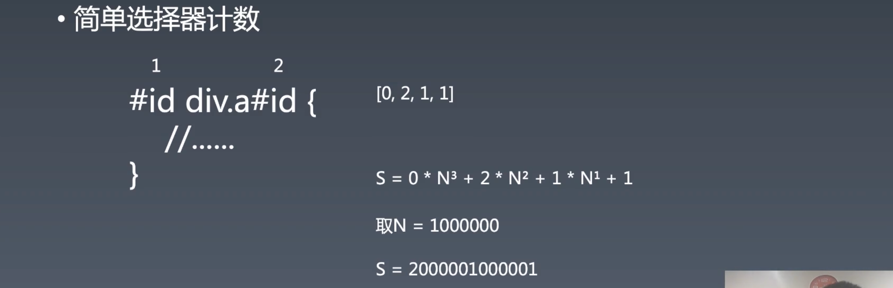
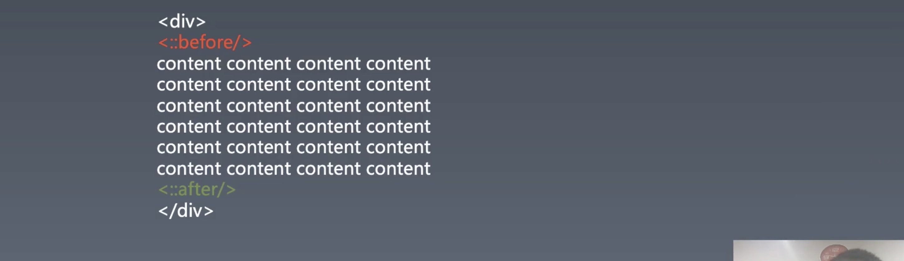
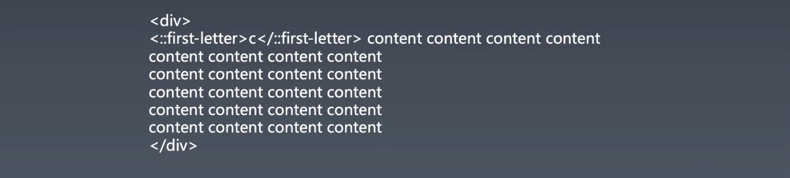
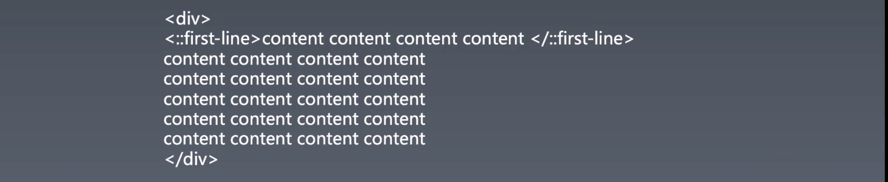
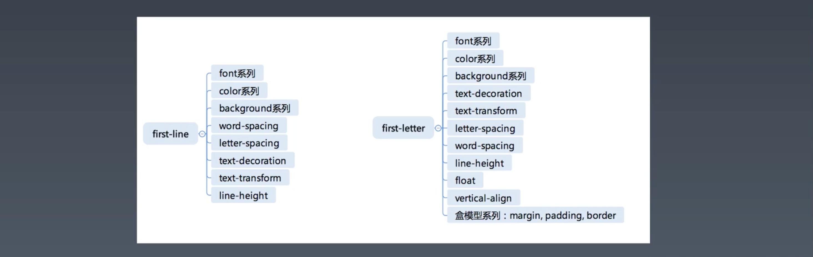

# 1.重学CSS | CSS基本语法,CSS基础机制（二）

[toc]

## 重学 CSS

### 选择器语法

#### 简单选择器——七种

- `*`
  - match 所有元素，给所有的元素统一添加属性使用的。
- `div` `svg|a`
  - type 选择器（元素）
  - 后面带 `|` 也就是 namespace，一个命名空间下的标签，其实我们所有选择器都是在 html 这个 namespace 下的标签（HTML 知识），只是可以省略不写，在重学前端的课程中有讲到要想选择一个 svg 里的 a 和要选择一个 html 中的 a 是不同的，使用 `|` 便可以区别选择。
- `.cls`
  - 可以理解为属性选择器的一种特例
- `#id`
- `[attr=value]`
  - `=` 有两种其他符号的替代—— `~=` `|=` ，`~` 类似于 `.cls` ，只要属性值中的任意匹配即可
  - 也可以不写 `=` ，表示只要有这个属性即可
- `:hover`
  - 伪类选择器，选中跟你的 html 写法大部分无关的状态，比如从用户交互来的状态改变，或者是浏览器机制带来的状态改变。
- `::before`
  - 伪元素选择器，和伪类选择器写法上比较相似，只是作用是**选择出一个本来没有的新的元素**，一般使用 `::` 语法，但也可以使用 `:` 

#### 复合选择器（compound selector）

- <简单选择器><简单选择器><简单选择器>
  - 无缝的写在一起（无空格和其他字符），因为「简单选择器」除了 tag 之外在选择器语法的开始位置都有一个特殊字符所以不会产生冲突。
  - 是「且、与」的关系，也就是必须同时满足这几种选择器的条件
- `*` 或者 `div` 必须写在最前面
  - 这是一个要求，`div` 是指 type 选择器

#### 复杂选择器

复杂选择器是将复合选择器用一些操作符（operator）进行连接组合而成的。

- <复合选择器><sp\><复合选择器>
  - 子孙选择器
- <复合选择器> ">" <复合选择器>
  - 直接子元素选择器
  - 和子孙选择器类似，浏览器实现的时候可以借用逻辑写在一起
- <复合选择器> "~" <复合选择器>
  - 兄弟选择器，位置无须紧邻，只须同层级。
  - Sibling 相关
- <复合选择器> "+" <复合选择器>
  - **相邻兄弟选择器**，当第二个元素*紧跟在*第一个元素之后，并且两个元素都是属于同一个父[`元素`](https://developer.mozilla.org/zh-CN/docs/Web/API/元素)的子元素，则第二个元素将被选中。
  - Sibling 相关
- <复合选择器> "||" <复合选择器>
  - level 4 的标准，之前是 level 3，表示 table 中选中一列，非常复杂
  - 一般浏览器都没有实现这个选择器
  - 算是一种知识拓展

#### 选择器列表

可以看作是复杂选择器上面的再一层（这是 winter 脑中的分类，但是我们怎么去理解都可以）。以 `,` 分隔的多个选择器。

#### 问答

- 老师推荐 BEM 的写法吗？
  - 不推荐，并且非常的反对。
  - 当你们知道什么是 block，知道什么是 element 就会反对 BEM 了。因为 BEM 自己生造了一些不严谨的概念。
  - 希望大家能跟着学完这个课程之后对技术有一个自己的观点，学会判断技术的方法，要有**技术价值观**，而不是学完之后要同意 winter 的想法大家变得有一样的结论，**就算有一样的结论也是由自己对技术的判断而产生的。**
  - **要是我最后把大家教成老师说这个都是对的，老师说那个都是对的，那么就是教失败了。**
- selector 4 要黄，是指部分还是全部？
  - 部分，但是也不确定。


### 选择器优先级

> 选择器优先级可以认为是选择器所**声明的属性的优先级**。

其实在之前做 toy-browser 的时候已经带着大家写了一个简单的选择器优先级判断的算法。这里介绍一下 CSS 标准中的选择器的优先级。

#### 简单选择器计数



- inline-style 比这些优先级都高，所以将选择器分为四级
  - 【行内】
  - 【ID】
  - 【class attributes pseudo-classes】
  - 【标签 pseudo-elements】
- 在同一个选择器中，同一个选择器是指复杂选择器里。
- 上面例子中最后得出的排布是 `[0,2,1,1]` 的四元组
- 根据选择器优先级计算的定义，选择一个 **N 进制**，只要这个 N 足够大就可以，接着将四级对应这个进制的位数，所以根据数学中进制的定义，就可以根据上面的公式计算出 `S` 这个权重值（之前的 toy-browser 是使用循环对比四元组中的每个值来决定使用哪个选择器的属性）
- 权重的判断是没有顺序的，就是将一个选择器的每一个简单选择器拿出来数数再计算。
- 注意啊，选择器优先级是指某些选择器都选中了一个元素，并且该元素的某个属性在这些选择器所在的规则中都有的情况下才会去考虑。

#### 做一组练习

> 权威的资料：[Calculating a selector's specificity](https://drafts.csswg.org/selectors-3/#specificity)
>
> A selector's specificity is calculated as follows:
>
> - count the number of ID selectors in the selector (= **a**)
> - count the number of class selectors, attributes selectors, and pseudo-classes in the selector (= **b**)
> - count the number of type selectors and pseudo-elements in the selector (= **c**)
> - ignore the universal selector
>
> Selectors inside [the negation pseudo-class](https://drafts.csswg.org/selectors-3/#negation) are counted like any other, but the negation itself does not count as a pseudo-class.
>
> Concatenating the three numbers a-b-c (in a number system with a large base) gives the specificity.

> specificity：the quality of being specific 具体的**质量**

请写出下面选择器的优先级（可以理解为计算具体的特性大小）

- `div#a.b .c[id=x]`    [0,1,3,1]
  - a:  `#a`
  - b:  `.b` `.c` `[id=x]`
  - c:  `div`
- `#a:not(#b)` [0,2,0,0]
  - a: `#a` `:not(#b)`
- `*.a` [0,0,1,0]
  - b: `.a`
- `div.a`  [0,0,1,1]
  - b: `.a`
  - C: `div`

要求：翻到一个权威的资料告诉我们优先级是什么？

#### 问答

- `*` 选择器有什么用？
  - 如果你要给所有的元素加一个属性你要怎么写？（所以是针对这种需求、这种场景来使用的）
- 之所以父元素的属性值发生了变化，子元素也跟着改变是因为子元素继承了这个父元素的这个属性值。
- `transform` 会改变重绘，但是 `transform` 不涉及排版，因为不影响别的元素，当然也可以认为发生了重排，只是自己的位置发生了变化，但是不影响周围元素的重排。（重排会导致大量的计算）
- CSS 有继承吗？
  - 有，一般我们说 **CSS 继承是指子元素的属性和父元素的属性之间的关系**，并不是面向对象上规则的继承。
- 可以学习极客时间上李冰老师的浏览器课程。 
- `:not()` 这种伪类是一种特殊的伪类——**函数性伪类**，所以 `:not` 本身不算优先级，但里面的选择要算。
- `transform` 没有改变元素上的 `height` `width` `left` `right` 这些属性值。
- `transform` 为什么这么复杂，有矩阵这些东西，这是因为 GPU 喜欢矩阵，做矩阵比较快，所以图形学中大量都是矩阵，拿坐标点和 `transform` 做计算，`transform` 本身就是一个矩阵，**在做渲染之前**会用现有坐标和 `transform` 一乘获得一个新的坐标。
- 如果学习 `webGL` 会发现基本都在使用 `transform` （矩阵）


### 伪类

#### 链接/行为

伪类中最早设计也是最重要的伪类：

- `:any-link`
  - 这是后来补上的，用于表示所有超链接的伪类。
  - 超链接元素：带有 `href` 属性的 `a` 元素或者图片中 `area` 元素
- `:link` `:visited`
  - 这两个是一对，`:link` 表示没有访问过超链接，`:visited` 表示访问过的超链接。
- `:hover`
  - 鼠标移动到其上方的元素
  - `:hover` 只会被鼠标触发
- `:active`
  - 只针对有交互的元素，对超链接来说点击的时候就是 active，按钮也是相同。
  - 所有元素都有。
  - 具有冒泡和捕获机制。
- `:focus`
  - 在我们的操作系统里有一个焦点系统，任何一个时刻在屏幕上有一个元素是其焦点，你的 keyboard 键盘事件都会和当前 focus 的元素有关系，使用 tab 可以切换焦点元素，和 `:active` 的区别在于，你 `:focus` 的元素并不一定 `:active` ，比如你通过 tab 切换到某个元素上，此时此元素并没有 `:active` ，除非你点击 `enter` 或者是鼠标点击。
  - `:active` 和 `:focus` 既可以被键盘触发也可以被鼠标触发。
  - 焦点系统算是一种可访问性系统，比如针对于盲人使用计算机，或者当你的鼠标驱动出了问题，你只能通过键盘来访问计算机时，你会发现操作系统的焦点可访问性做的非常的到位，令人感动的到位，但是我们很多网站却没有做到非常好。
  - 焦点系统对某些人某些场景非常到位的系统。
  - （我现在知道为什么像微软的官网或是 google 的网站当你点击的时候有一个外框，那就是通过 `:focus` 选择器声明的，能有效提高可访问性。）
- `:target`
  - 比较奇怪，当将 `a` 标签当作锚点，网页上的 `#` 的 hash 值变化到此元素，该元素具有 `:target` 伪类
  - 比较新的浏览器才支持

除了第一个和最后一个，剩下五个伪类都是针对超链接设计的，因为早先的网页更像是一篇文章加上超链接，没有我们现在网页的各种 block，按钮这些。

#### 树结构

- `:empty`
  - `:empty` [CSS](https://developer.mozilla.org/en-US/docs/Web/CSS) [伪类](https://developer.mozilla.org/zh-CN/CSS/Pseudo-classes) 代表没有子元素的元素。子元素只可以是元素节点或文本（包括空格）。注释或处理指令都不会产生影响。
- `:nth-child()`
  - **`:nth-child(an+b)`** 这个 [CSS 伪类](https://developer.mozilla.org/en-US/docs/CSS/Pseudo-classes)首先找到所有**当前元素**的兄弟元素，然后按照位置先后顺序从1开始排序，选择的结果为CSS伪类 `:nth-child()` 括号中表达式（an+b）匹配到的元素集合（n=0，1，2，3...）。
  - 看自己是其父元素的哪个孩子
  - 注意所有简单选择器都是针对当前元素的
- `:nth-last-child()`
  - 这是浏览器工程师痛恨无比的伪类选择器
  - 从后往前选择
- `:first-child` `:last-child` `:only-child`
  - 当前元素是父元素的第一个，最后一个，和唯一一个

我们在 startTag 做 computedCSS 的时候，以上几个伪类有哪些是实现不了的，哪些是能实现的。

实现不了：

- `:nth-last-child()`
- `:last-child`

- `:only-child`
- 因为这些需要知道与它们的同级的下一个元素是什么，所以就需要回溯，增加 layout 次数，从而增加性能消耗，不太推荐使用。

能实现：

- `:first-child`
- `nth-child()`
- `:empty` 
  - 如果是自闭合标签就是立马能够知道
  - 如果开始标签之后接着结束标签也是

 

> 注意：是先由简单选择器选择出一部分的元素之后，再根据简单选择器的结果对复杂选择器进行选择。


#### 逻辑型

逻辑性伪类目前能用的就是 `:not` ，`:not` 在 level 3 只能塞入复合选择器，在 level 4 是可以选择选择器列表，这也是为什么 winter 觉得 level 4 要黄的原因，如果能添加选择器列表（能添加选择器列表，意味着就可以添加复杂选择器），则 与 或 非 都能做，就可以无限的回溯，浏览器应该不会实现成这个样子。

- `:not` 伪类
- `:where` `:has`


#### 元素型

剩下的一些伪类选择器就是和特定的元素相绑定的，比如与 `input` 相绑定的 `:checked` ，这些伪类选择器你可以去学习对应的元素的时候就一起学习了。 

> winter 是一个反对使用很复杂选择器的人。

**将这些学习过的东西放到脑图中，之后学到新的知识就去思考这个东西应该放在脑图中的哪个位置，如果放不进去就要考虑是否现有的知识体系的构成方式有问题，就需要重新去考虑构建。**

之后会有加餐教大家写技术文章，脑图中的很多点都是可以用来写这些技术文章的，从而丰富自己的个人博客。


### 伪元素

- `::before`
- `::after`
  - 以上两个属性无中生有型伪元素
- `::first-line`
- `::first-letter`
  - 以上两个属于元素中本来就有东西，但是我们给他框起来




- 可以这样理解
  - `::before` 在元素的内容之前加入了一个元素
  - `::after` 在元素的内容之后加入了一个元素

`::before` `::after` 我们可以使用它们来做一些额外的事情，比如你的**内容没有语意**，像是一朵花就可以使用这个来塞入进去。

这两个元素在网页中很重要，可以将「语意」和「表现」进行分离。它们也有产生新的盒的作用，元素不一定跟它的盒子是等同的概念。

> 不过呢，我觉得 html 中肯定有一些元素是用于专门做表现用的。比如 div 和 span，就没有语义。

 



- `::first-letter` 等同于将第一个字符用一个元素将其框起来




- `::first-line` 会选中**你排版的第一行，所以和排版相关，和回车没有关系**，和实现显示的第一行有关，能排进第一行就会被框起来。
- 这个伪元素需要注意，因为是声明作用于在设备上显示的第一行。


我做的实验：


代码：

```html
<style>
  ::first-line{
    color: red;
  }
  div {
    width: 200px;
    border: 1px solid black;
    margin: 0 auto;
  }
</style>
<div>随便写点东西！！！！随便写点东西！！！！随便写点东西！！！！随便写点东西！！！！随便写点东西！！！！随便写点东西！！！！随便写点东西！！！！</div>
```

- 可以看到我这儿没有使用回车换行。


#### 可用属性

`::first-line` 和 `::first-letter` 有一个可用属性的问题：




#### 思考

为什么 `first-letter` 可以设置 `float` 之类的，而 `first-line` 不行呢？

- 如果你给 `first-line` 添加了 `float` ，那么 `first-line` 就不是 `first-line` 了，然后就会产生新的 `first-line` 又会被 `float` 出去。因为每一行脱离文档流出现无限循环。

那为什么可以给 `first-line` 可以设置字体大小？设置字体大小排版也会发生变化

-   这个与 `first-line` 本质的理解有关。`first-line` 其实并不是先选好有哪些文字在里面再应用，而是在排版的过程中，把 `fl` 的相关属性直接加到文字上。可以理解为文字内容的排版已经决定了，你设置文字的样式并不会影响到排版。
- 也就是 `layout` 这个过程中再去操作 `css` 相关的动作。 


### 作业：编写一个 match 函数

```js
function match(selector, element) {
  return true;
}

match("div #id.class", document.getElementById("id"));
```

- 不要使用 `querySelector` 和 `matchSelector` 这样已有的函数
- 可以去 npm 上找语法解析的包
- 提示：可以用正则


## 课程涉及

### 预习内容：

- [《CSS 选择器：如何选中 svg 里的 a 元素？》](https://time.geekbang.org/column/article/84365)
- [《CSS 选择器：伪元素是怎么回事儿？》](https://time.geekbang.org/column/article/84633)

### 课件及答疑回放：

- 链接： https://pan.baidu.com/s/1Zk1rzj3rBQF0vBp9jbGFcA
  提取码：r59y

### 随堂练习：

请写出下面选择器的优先级

- div#a.b .c[id=x]
- \#a:not(#b)
- *.a
- div.a

### 思考：

- 为什么 first-letter 可以设置 display:block 之类的，而 first-line 不行呢？

## 课后作业：

- 编写一个 match 函数

```js
function match(selector, element) {
    return true;
}

match("div #id.class", document.getElementById("id"));
```

