# 2.重学CSS | 排版与排版相关属性,绘制与绘制相关属性

[toc]

## 重学 CSS —— 属性

属性总的来看就是三大类：

- 排版
- 渲染
- 交互
  - 交互类的属性往往是比较新的属性，因为早期的 CSS 并不太管交互


### 排版属性

有三代排版

#### 盒（Box）

在讲排版之前，我们要首先要介绍一个概念 —— 盒（box）

box 是我们为了让一个元素以长方形的样子展现在界面中的一种模型概念。

box 是我们 CSS 中所使用的基础概念。**CSS 中从排版到渲染的基本单位就是 box 和文字**，没有别的东西。


做个填空题：

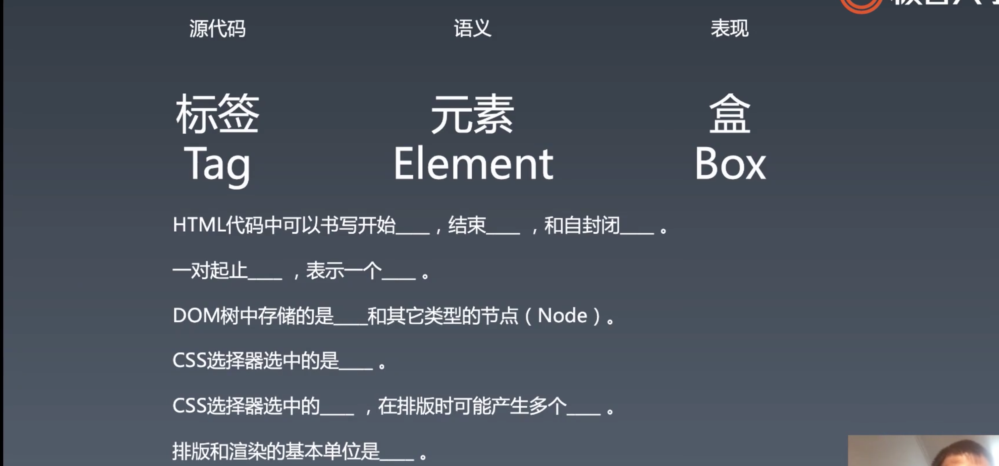

因为 box 这个概念会和标签（tag）、元素（element）混淆。

- HTML 代码中可以书写开始 <u>tag</u>，结束 <u>tag</u>，和自封闭 <u>tag</u> 
- 一对起止 <u>tag</u>，表示一个 <u>element</u> 
  - **脑子里记的是元素，写出来的是标签，看到的就是盒**
- DOM 树中存储的是 <u>element</u>，和其他类型的节点（Node）
  - 其他节点有文本节点、注释节点、docu type 等等
- CSS 选择器选中的是 <u>element</u> 
  - 因为 CSS 选择器是在 DOM 结构中去选择
- CSS 选择器选择中的 <u>element</u>，在排版时可能产生多个 <u>box</u> 
  - 产生多个盒主要有两种情况：一是 inline 元素会多产生多个盒（分行），二是伪元素，一个元素带着两个伪元素
- 排版和渲染的基本单位是 <u>box</u> 
  - 我们的 toy-browser 直接使用元素当作盒来进行排版和渲染了，其实这样是不对的。

脑子里记的是**元素**，写出来的是**标签**，看到的就是**盒**，并且元素产生盒。
书面语：**源代码里的是标签，语义里的是元素，表现在浏览器中的就是盒**

> 可以从上面两句话中获得一种理解，**语义**实际上是不存在于现实的抽象概念，是一种对事物的定义，用于帮助人们理解事物。

之后我们所讲的排版和渲染的部分都是针对盒。

#### 盒模型

盒模型是一种抽象概念，用于描述盒具体是什么样的。

网络上有很多讲盒模型的文章，但是问题是一开始讲盒模型但是不讲盒，这就有点本末倒置了，毕竟你得先有盒才能有盒模型。

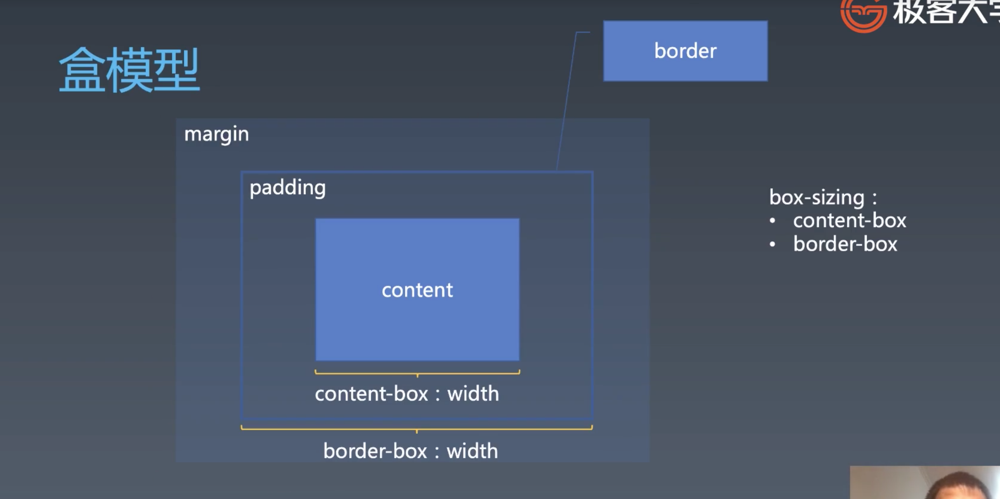

基础的盒分为四层：

- 最里面的叫做 content（内容），有可能是文字，也有可能是别的盒。
- content 的外层一圈叫做 padding（内边距）
- border ，有边框
- margin

我们所熟悉的 width，在现代浏览器中默认表示的是 content width，但这有点不符合人的直觉，所以后来有一个属性 `box-sizing` 用于调整这个 `width` 到底表示的是什么 `width` 

- `border-box` 就包含 border 和 padding content 
  - 需要注意，一个盒的完全宽度实际上应该还包括 `margin` 

盒模型本身并不是复杂，复杂的是如何将这些盒子进行排版。

> 再次提醒，**计算机是一门抽象技艺，在做任何的「表现」之前都是一种抽象的数据结构，并且伴随着这些数据的运算。**

#### 问答

- 为什么有盒模型？
  - 我们的很多概念是从排版而来
    - 比如 `margin` 就是表示一个图片周围的留白，留白是由于当你在书或者杂志、报纸上进行信息排版的时候需要在图片、表格的周围留有一定的空间而产生的形式。（设计出来的）
    - `padding` ，比如书籍排版中页边距这样的概念，绝大多数书籍的设计中是没有那种将文字仅仅印到书籍中每页纸边上的设计的，主要原因是打印技术做不到。（不一定吧）
  
    - 在我看来，盒模型属于解决如何排版、渲染的一个基本问题——用什么作为元素的排版基本单位。
  
- 为什么没有 `margin-box`
  
  - 这个问题 winter 也不知道，不过你可以去 CSS WG 的邮件组去查一下，这类问题都可以在邮件组中找到当初是怎么设计的。


### 正常流

> 接下来我们讲的很多概念是基于正常流的，也就是说只有在正常流中才有效。

在三代排版技术中，最困难、最反人类的就是 normal flow，说是「正常流」，但其实有很多让你无法正常理解的事情。

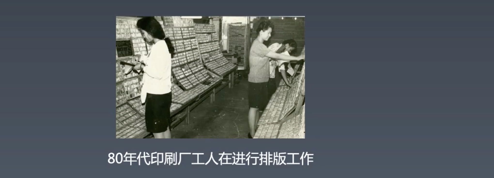

- 这些大姐和小小姐一手拿着装字的盘子，一手把这些字一个一个的放到版框中。
- 其实我们算是随着技术的发展产生的新的印刷工人，但是我们做的相对轻松的工作，真实的排版过程都由计算机帮我们做了（当然让计算机能够做这些事是由先辈们所做的工作完成的）并没有像这些小姐姐一样一个字一个字的排。

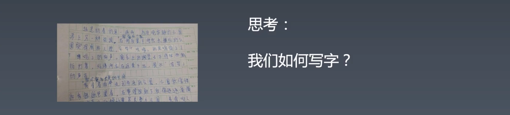

- 从左往右、从上往下
- 同一行写的文字是**对齐的**（上面的格子或者一些英文本子中的四道线都是帮助我们对齐的）
- 一行写满，换到下一行

中文字没有基线，英文和很多国家的文字是有基线的，不过这些都是和排版有关的知识。

> 文字为什么是以这样的方式排列，我想一定是跟人体本身对文字排列的感觉有关，只有感觉舒适的排列才能被人所应用。

#### 正常流排版

正常流排版和我们之前做过的 flex 排版的总的步骤相同：

- 第一步：将所有的盒和文字收进行里

- 第二步：计算盒在行中的排布。

  - 行里需要考虑盒和文字是如何进行排布的，一方面的有左右排布问题，一方面有上下排布的问题。正常流如果不考虑 float 的话，会比 flex 要简单。

  - 当你在计算每个行内排布的时候能够将**行高算出来**，然后将行对应着放就可以了。

- 第三步：计算行的排布

  - 在正常流中有些元素是占整行的，比如 block level 的元素，`display: block` 

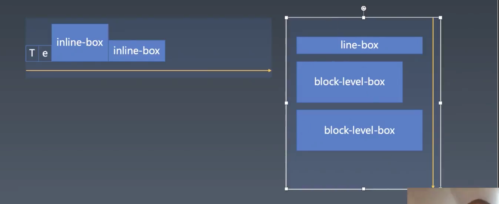

- 一行中我们从左到右去排列，行内会遇到两种东西——文字和 `inline-box` ，`inline-box` 具有宽高，和文字一起在一行中进行排列的时候有**对齐关系**。
- 行与行之间是从上到下排列，这里面需要注意的是 `line-box` 就是盒子中每一行由于换行产生的盒子，这个盒子并不是由元素包裹而产生的，`::fisrt-line` 实际上就是选择的第一行的 `line-box` 
- `line-box` 的概念就可以很好的帮助实现 `::first-line` 的选择，因为只要产生一行就放入一个行盒模型，这样需要选择第一行的时候直接拿这个行盒来设置属性即可。
- `line-box` 会和 `block-box` 一起排列。

- 图中这个从左排列的东西叫做「inline formatting context」IFC，右边的叫做「block formatting context」BFC。所以，无论是 IFC 还是 BFC 其实都是比较简单的概念，**从左到右就是 IFC，从上到下的就是 BFC**（基础定义）。是什么将其变得复杂了呢？是后面别的行为将其变得复杂。
  - 之后，BFC 会和其他的概念绕在一起。


#### 正常流的行模型

也就是，IFC 中内部是什么样的。

我们的文字有一个混排的关系，其中有几个概念：

- 文字本身有占据的空间
- 文字有对齐的关系
- **行内的盒和文字也有对齐的关系**
- 此外，还有行高的概念


中文之外的很多文字都需要通过**基线**来进行对齐。比如上图中的 「text」的下缘，其实和红色基线对齐的，但这不是文字真正的下边缘，也不是行底。我们英文练习本中的从上往下数的第三根线就是基线。第二根是沿着行中对称的一条线，帮助我们写 x e a 这样的文字的时候将文字的上边缘对齐。

我们的文字具有文字上缘与文字下缘，也就是上图中黄色方框的范围，然后根据行高也会有一个行内的留白，一个边距，文字上下离行盒有一段距离。所以，我们去设计 `verticle-align` 属性时就可以参考这些点。

#### 行内排列的代码演示

下面我们通过代码和实际的显示来理解行模型是如何设计的，也就是文字以及 `inline-box` 是如何在一行中进行排列的。

```html
<div style="font-size: 50px; line-height: 100px; background-color: pink;">
  <!-- 基线 -->
  <div style="vertical-align: baseline; overflow: visible; display: inline-block; width: 1px; height: 1px;">
    <div style="width: 100vw; height: 1px; background: red;"></div>
  </div>
  Hello
  <div style="line-height: 70px; width: 100px; height: 100px; background-color: skyblue; display: inline-block;">
    World!
  </div>
</div>
```

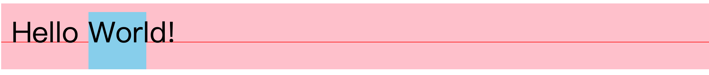

- 可以看到的是，当一行之中有普通文字——Hello，也有 `inline-block` 的时候，无论是`inline-block` 中的文字还是普通文字默认情况下都是基于 baseline 来进行排列的。并且也能发现 `inline-block` 由于要让其内部的文字以基线对齐，自己在垂直方向上也要发生变化——没有我们所预想的那样自己的上边框与所在盒内的上边框对齐。

```html
<div style="font-size: 50px; line-height: 100px; background-color: pink;">
  <!-- 基线 -->
  <div style="vertical-align: baseline; overflow: visible; display: inline-block; width: 1px; height: 1px;">
    <div style="width: 100vw; height: 1px; background: red;"></div>
  </div>
  Hello
  <div style="line-height: 70px; width: 100px; height: 100px; background-color: skyblue; display: inline-block;"></div>
</div>
```

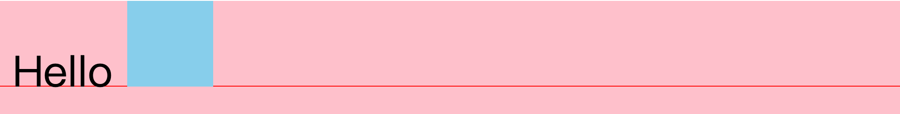

- 我们将 `inline-box` 中的文字删除，当 `inline-box` 中没有文字的时候其 `baseline` 是在 box 的底部。
- 并且当外层的盒子为了让行内的元素对齐，其高度也会发生变化。

```html
<div style="font-size: 50px; line-height: 100px; background-color: pink;">
  <!-- 基线 -->
  <div style="vertical-align: baseline; overflow: visible; display: inline-block; width: 1px; height: 1px;">
    <div style="width: 100vw; height: 1px; background: red;"></div>
  </div>
  Hello
  <div style="line-height: 70px; width: 100px; height: 100px; background-color: skyblue; display: inline-block;"></div>
  <div style="vertical-align: baseline;line-height: 70px; width: 100px; height: 500px; background-color: plum; display: inline-block;">world</div>
</div>
```

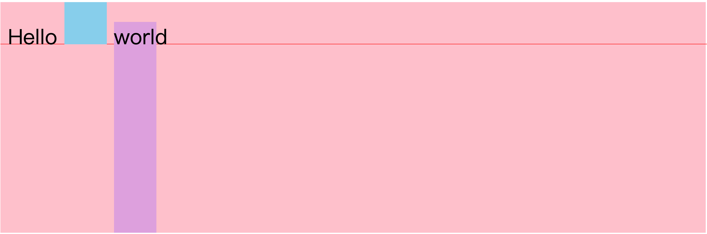

- 这里我们添加一个新的 `inline-block` 元素，其高度为 `500px` 并且让其按照 `baseline` 来排列，会发现出现了上面这样的显示效果。

```html
<div style="font-size: 50px; line-height: 100px; background-color: pink;">
  <!-- 基线 -->
  <div style="vertical-align: baseline; overflow: visible; display: inline-block; width: 1px; height: 1px;">
    <div style="width: 100vw; height: 1px; background: red;"></div>
  </div>
  Hello
  <div style="line-height: 70px; width: 100px; height: 100px; background-color: skyblue; display: inline-block;"></div>
  <div style="vertical-align: middle;line-height: 70px; width: 100px; height: 500px; background-color: plum; display: inline-block;">world</div>
</div>
```

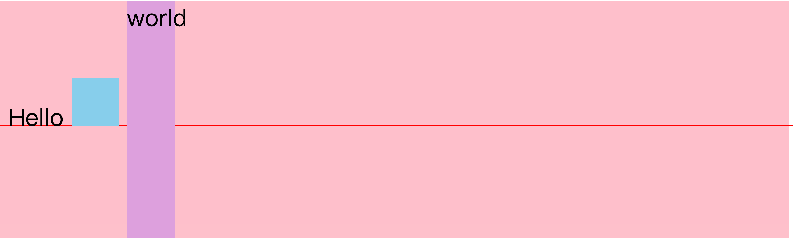

- 紧接着，我们只改变其 `vertical-align` 的值为 `middle` ，看到 `baseline` 发生了变化，会以最高的那个元素所设置的排列方式来显示。
- 所以行模型会始终保证最高的那个元素的对齐方式是正确的。

> 建议：我们的 `inline-block` 元素的 `vertical-align` 属性只使用 `bottom` `top` `middle` 之一，否则其元素内有无文字会产生不同的显示效果，从而影响整行的排列。


#### 总结

- `verticle-algin: baseline` 是拿自己的 `baseline` 去对齐行的 `baseline`
- `verticle-aligin: top middle bottom` 是拿自己的顶部、中间、底部去对齐行的顶部、中间、底部（不一定是这个元素底部）
- `verticle-aligin: text-top  text-bottom` 是拿自己的顶部、底部去对齐行的 `text-top text-bottom` 

#### 问答

- baseline 如何计算？
  - 是字体中提供的描述，可以从这个网站中看到如何设计字体：https://www.freetype.org/freetype2/docs/tutorial/step2.html#section-1

- `ele.getClientRects()` 可以获取元素内盒子的大小和位置
  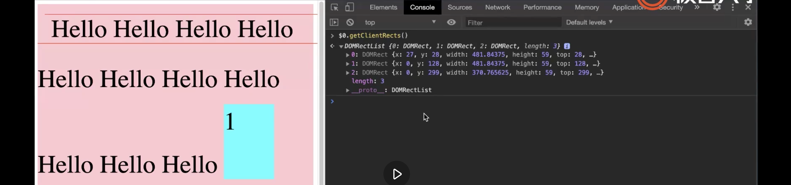
  - 这里获取了一个有很多 `Hello` text 的 `span` 的内的盒子三个 `line-box` 
  - 我们所看到的都是 `inline-box` ，`line-box` 是一个隐藏的东西
- 设置 `line-height` 在 `ios` `android` 上的表现不同，请问有什么可以解决这个兼容性问题吗？
  - 其实 `line-height` 没有兼容性问题，有兼容性问题的是字体，字体的 `baseline` 、整体的高度上会有差异。如果实在要统一就使用一个公用的字体。


### float 与 clear

正常流三大魔王：

- float clear
- margin 折叠
- overflow:visible 与 BFC

`float` 主要是为了实现文字饶排的情况：

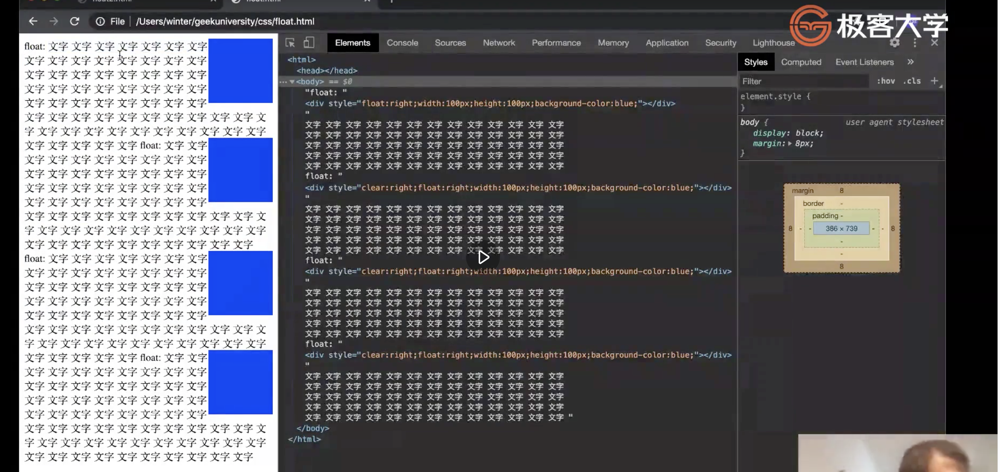

- 文字会包围 float 元素，遇到 float 元素会进行换行。

在古代会有使用 `float` 来做 layout 的流派

- 能够解决使用 `inline-block` 在行内排版中每一个块因为代码中的换行而产生的空白问题。
- 为每个 `float` 块添加 `margin` 也不会有重叠问题。
- 如今因为 `flex` 的普及，也很少有人使用这种排版方式。（flex 真香，没有对比就没有伤害）

之所以我们要使用 `clear` 属性来解决 `float` 元素塌陷的问题，主要是因为我们使用了 `float` 来布局，将一个块中的所有元素设置 `float` 。实际上如果按照 `float` 最初的设计用来实现文字绕排就不会有这样的问题存在。

### 问答：

- 使用 grid 可以实现一切布局（应该可以吧～）

- `float` 性能是不是有差点？

  - 没有本质差别，只要进了 layout，播动画就会很慢，剩下的场景，layout 快慢实际上也无所谓，所以一般不太在意这个事情。不过，`float` 会导致重排，但重排范围很小。

- `float` 导致重排问题

  - 因为浏览器的布局、渲染是一个元素一个元素进行的，所以你会发现在一个 box 中，如果前面的文字已经排好，如下：
    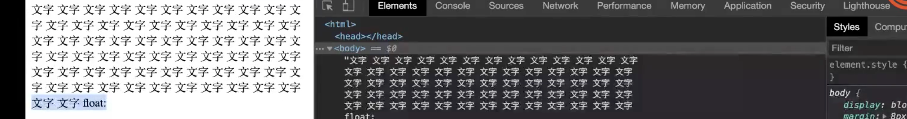

    然后，你在这后面添加了一个向左浮动的元素，像这样：

    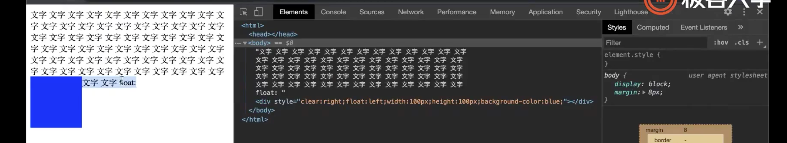

    那么就会导致这一行的其他元素或者文字进行重排（被鼠标选中的部分），如果这部分有很复杂的布局则会导致性能问题。

- 脱离文档流如何理解？
  
  - `float` 元素不在任何一个行盒之中。
  
- 为什么 `float` 没有中间
  - 可能是为了绕开复杂性的问题，不过现在已经有了文字绕排的提案，有实现相当于将元素 `float` 在中间。
  - word 能够实现，word 的 layout 比 html 的强大
- `first-letter` 是指源代码中的第一个文字，而 `first-line` 是指 css layout 中的第一个排 line box。

- 重学 CSS 部分，主要是将大家的概念理清楚，每个概念、领域的划分是非常重要的，如果一旦搞混，会出现有些问题无法解释。

### margin 折叠

> 折叠：我的理解是如果把元素当作一张纸则有部分被折叠到内部去了，从而改变了整体的宽高：
>
> 

margin 折叠只会发生的 BFC 中。这句话中的其他含义：

- 这句话的意思就是 LFC 中是没有外边距折叠这个事情的
- `float` 元素也没有
- 方向上只能发生 BFC 所规定的方向，一般情况下都是上下，因为要考虑 `rendering mode` ，蒙古文就是左右。

#### BFC 创建：

文档：https://www.w3.org/TR/CSS21/visuren.html#block-formatting

> [MDN - 块格式化上下文](https://developer.mozilla.org/zh-CN/docs/Web/Guide/CSS/Block_formatting_context):
>
> **块格式化上下文（Block Formatting Context，BFC）** 是Web页面的可视CSS渲染的一部分，是块盒子的布局过程发生的区域，也是浮动元素与其他元素交互的区域。
>
> 下列方式会创建**块格式化上下文**：
>
> - 根元素(`<html>`)
> - 浮动元素（元素的 [`float`](https://developer.mozilla.org/zh-CN/docs/Web/CSS/float) 不是 `none`）
> - 绝对定位元素（元素的 [`position`](https://developer.mozilla.org/zh-CN/docs/Web/CSS/position) 为 `absolute` 或 `fixed`）
> - 行内块元素（元素的 [`display`](https://developer.mozilla.org/zh-CN/docs/Web/CSS/display) 为 `inline-block`）
> - 表格单元格（元素的 [`display`](https://developer.mozilla.org/zh-CN/docs/Web/CSS/display)为 `table-cell`，HTML表格单元格默认为该值）
> - 表格标题（元素的 [`display`](https://developer.mozilla.org/zh-CN/docs/Web/CSS/display) 为 `table-caption`，HTML表格标题默认为该值）
> - 匿名表格单元格元素（元素的 [`display`](https://developer.mozilla.org/zh-CN/docs/Web/CSS/display)为 `table、table-row`、 `table-row-group、table-header-group、table-footer-group`（分别是HTML table、row、tbody、thead、tfoot的默认属性）或 `inline-table`）
> - [`overflow`](https://developer.mozilla.org/zh-CN/docs/Web/CSS/overflow) 值不为 `visible` 的块元素
> - [`display`](https://developer.mozilla.org/zh-CN/docs/Web/CSS/display) 值为 `flow-root` 的元素
> - [`contain`](https://developer.mozilla.org/zh-CN/docs/Web/CSS/contain) 值为 `layout`、`content`或 paint 的元素
> - 弹性元素（[`display`](https://developer.mozilla.org/zh-CN/docs/Web/CSS/display)为 `flex` 或 `inline-flex`元素的直接子元素）
> - 网格元素（[`display`](https://developer.mozilla.org/zh-CN/docs/Web/CSS/display)为 `grid` 或 `inline-grid` 元素的直接子元素）
> - 多列容器（元素的 [`column-count`](https://developer.mozilla.org/zh-CN/docs/Web/CSS/column-count) 或 [`column-width`](https://developer.mozilla.org/zh-CN/docs/Web/CSS/column-width) 不为 `auto，包括 column-count` 为 `1`）
> - `column-span` 为 `all` 的元素始终会创建一个新的BFC，即使该元素没有包裹在一个多列容器中（[标准变更](https://github.com/w3c/csswg-drafts/commit/a8634b96900279916bd6c505fda88dda71d8ec51)，[Chrome bug](https://bugs.chromium.org/p/chromium/issues/detail?id=709362)）。
>
> 块格式化上下文包含**创建它的元素内部的所有内容**.
>
> 块格式化上下文对浮动定位（参见 [`float`](https://developer.mozilla.org/zh-CN/docs/Web/CSS/float)）与清除浮动（参见 [`clear`](https://developer.mozilla.org/zh-CN/docs/Web/CSS/clear)）都很重要。浮动定位和清除浮动时只会应用于同一个BFC内的元素。浮动不会影响其它BFC中元素的布局，而清除浮动只能清除同一BFC中在它前面的元素的浮动。外边距折叠（[Margin collapsing](https://developer.mozilla.org/en-US/docs/Web/CSS/CSS_Box_Model/Mastering_margin_collapsing)）也只会发生在属于同一BFC的块级元素之间。

代码实验：

```html
<style>
  .container {
    background-color: lightgreen;
  }
  .item {
    width: 100px;
    height: 100px;
    background-color: aqua;
    margin: 20px;
  }
</style>

<div class="container">
  <div class="item"></div>
  <div class="item"></div>
  <div class="item"></div>
  <div class="item"></div>
  <div class="item"></div>
  <div class="item"></div>
</div>
```

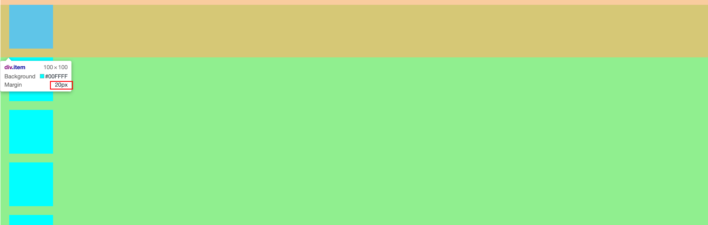

- 容器内容每一个块的上下间距是 20px，而不是 40px，这就是 BFC 中所规定的边距折叠。之所以 margin 要翻译为留白，是因为边距是可以相加的，而留白是只要周围有这些空白就可以，可以重复使用，比如这里我希望的是元素的周围留有 20px 的空白，所以是符合预期的，但如果认为是边距则不符合预期。（这里 winter 是用概念的更换来理解 BFC 的边距折叠问题）

下面，我们将最后三个 `.item` 放入一个没有任何样式设置的 `div` 中：

```html
<div class="container">
  <div class="item"></div>
  <div class="item"></div>
  <div class="item"></div>
  <div>
    <div class="item"></div>
    <div class="item"></div>
    <div class="item"></div>
  </div>
</div>
```

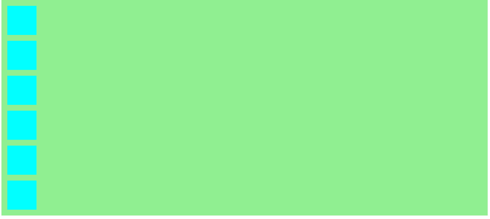

- 会发现显示的效果和之前没有差别。并且出现了一个很奇怪的现象，三个元素中的第一个元素的上外边距超出了其父元素的外边框。但是当我给父元素设置了外边框这种情况就消失了：

  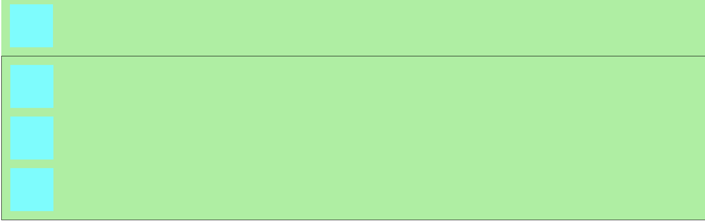

然后我们将这个没有样式的 `div` 设置一个 `overflow: hidden` 的属性：

```html
<div class="container">
      <div class="item"></div>
      <div class="item"></div>
      <div class="item"></div>
      <div style="overflow: hidden;">
        <div class="item"></div>
        <div class="item"></div>
        <div class="item"></div>
      </div>
    </div>
```

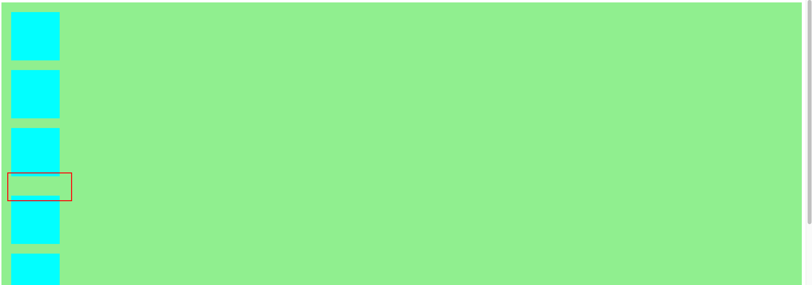

- 此时的情况就符合了预期，内部元素的外边距和其父元素的边框之间有了距离。

其实，这个问题和 BFC 没有关系，是 `margin` 本身的问题，在正常流中就会出现这样所谓的折叠问题。

> 注意这些都是和排版有关的。

#### 问答

- **一个 BFC 里面就是一个正常流，正常流里就有一个 BFC 和数个 IFC**
- 如果没有老师讲这些知识，我们该如何去学习？
  - winter 是从标准中去理解出来的
- 标准中：
  - `block container` 是里面可以容纳 block 的东西
  - `block level box` 是可以放入 BFC（从上往下排的环境）内的东西 
    - BFC 是正常流中的一种环境，还有一种是 LFC
  - 上面两个都具备就是 `block box`
- `display` 可以更改元素为 `inline level` 还是 `block level` ，`flex` `grid` 都是有 `inline level` 的，`inline level` 的元素可以设置 `vertical-align` 属性

#### BFC 与 float 的关系

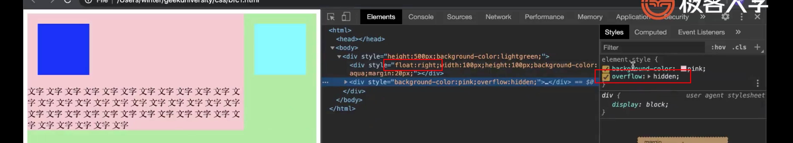

- 这里将两个元素放到一个盒子内，其中一个为 `float:right` 的元素，另一个是 `overflow: hidden` 的 BFC 元素，会以上面这样来排列，就是正常流的左右排列。

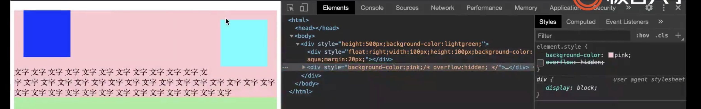

- 当我们取消 `overflow: hiddent` 属性，则会发生左侧元素的内容与父元素的合并，从而其内部的元素也会在外层正常排列，每一行文字都是一个行盒，而不是他们的父元素是一个行盒。


`flex` `inline-flex`：里面是 flex 布局，但是每一项是 flex-item，其内部是 `block-container` 正常流

`table` `inline-table`  ：里面是 table 布局

`grid` `inline-grid` ：里面是 grid 布局

`block` `inline-block`：里面是 normal flow 布局，只有这个是 `block-container` （产生 BFC）

上面不带 `inline` 的都是 `block level box` 


- 如何产生 BFC
  - 只要一个元素内部包含正常流就会产生 BFC
- 如果解决难以理解，也可以使用其他的方式来实现你想要的排版效果，这没什么大的问题。


### Flex

flex 排版和正常流一样要经历一下步骤：

- 收集盒进行
- 计算盒在主轴方向的排布
- 计算盒在交叉轴方向的排布

虽然和正常流的步骤差不多，但是正常流比 flex 复杂很多，比如会受到 float 的影响，使内部元素的排列发生一些变化，这些都会导致正常流的实现代码量会比 flex 代码量多好几倍。

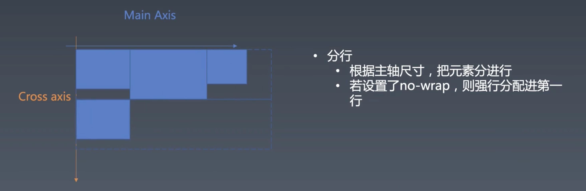

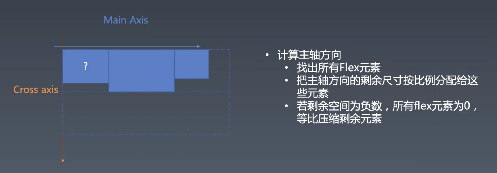

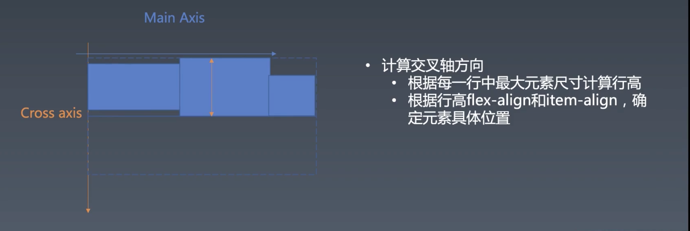


## 课程涉及

### 预习内容：

- [CSS 排版：从毕升开始，我们就开始用正常流了](https://time.geekbang.org/column/article/85745)
- [CSS Flex 排版：为什么垂直居中这么难？](https://time.geekbang.org/column/article/90148)
- 课件链接：[ https://pan.baidu.com/s/1pP6znwGPXicnHBMmVdHniQ](https://pan.baidu.com/s/1pP6znwGPXicnHBMmVdHniQ)
  提取码：0f8k

### 参考链接：

- https://www.w3.org/TR/2018/CR-css-flexbox-1-20181119/#flex-items

### 参考代码：

```html
<div style="font-size:50px;line-height:100px;background-color:pink;">
    <div style="vertical-align:text-bottom;overflow:visible;display:inline-block;width:1px;height:1px;">
        <div style="width:1000px;;height:1px;background:red;"></div>
    </div>
    <div style="vertical-align:text-top;overflow:visible;display:inline-block;width:1px;height:1px;">
        <div style="width:1000px;;height:1px;background:red;"></div>
    </div>
    <span>Hello Hello Hello Hello Hello Hello Hello Hello Hello Hello Hello </span>
    <div style="vertical-align:text-bottom;line-height:70px;width:100px;height:150px;background-color:aqua;display:inline-block">1</div>
    <div style="vertical-align:top;line-height:70px;width:100px;height:50px;background-color:aqua;display:inline-block">1</div>
    <div style="vertical-align:base-line;line-height:70px;width:100px;height:550px;background-color:plum;display:inline-block">1</div>
</div>
```

### 思考题：

- 我们如何写字？
  本周作业：

### 参考名词：

- IFC：inline formatting context
- BFC：block formatting context

### Tips：

- **大家请记住下面这个表现原则：如果一个元素具有 BFC，内部子元素再怎么翻江倒海、翻云覆雨，都不会影响外部的元素。**所以，BFC 元素是不可能发生 margin 重叠的，因为 margin 重叠是会影响外部的元素的；BFC 元素也可以用来清除浮动的影响，因为如果不清除，子元素浮动则父元素高度塌陷，必然会影响后面元素布局和定位，这显然有违 **BFC 元素的子元素不会影响外部元素的设定**。
- block-level 表示可以被放入 bfc
- block-container 表示可以容纳 bfc，产生 BFC
- block-box = block-level + block-container
- block-box 如果 overflow 是 visible， 那么就跟父 bfc 合并