# 1.重学CSS | CSS动画

[toc]

## 重学CSS —— 动画与绘制

我们之前已经学完了排版相关的属性，CSS 除了一些零零碎碎的属性之外基本上就三类：

- 排版
- 绘制
- 交互（动画）

零零碎碎的其他属性，比如 `will-change` 辅助类属性。

### Animation 动画

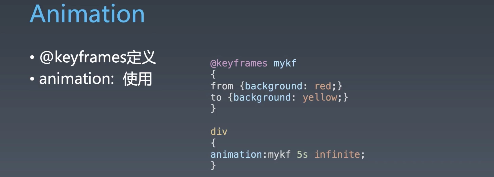

使用 `at-rules` 的 `@keyframs` 来定义，可以将 `@keyframs` 理解为声明变量的关键字，然后将这个声明之后产生变量传入 `animation` 中便得到了一个 `animation` 

`keyframes` 被称为「关键帧」，这里讲解一下定义。

当我们看显示器的时候，感觉显示器很稳定，感觉不到在刷新，但其实无论你是在看电影还是玩游戏，显示器都是在不断的刷新的。只有一类显示器不刷新——电子纸屏，这个玩意儿电断了之后屏幕所显示的内容也不会消失。

显示器是通过不断的闪动来实现刷新内容，只是闪动的频率高于你人眼能够识别、感觉到这个闪动的频率，从而让我们觉得显示的内容是流畅的。

只要刷新的频率在每秒 60 次以上人眼就会感觉很平滑，电影一般 24 48（李安 - 120，高速运动也能表现的很真实、顺畅），游戏会选择 60，24 在物体并非高速运动的情况下会比较顺畅，48 在我们没有操作时的情况下比较顺畅，60 就是你玩游戏操作也会感觉很顺畅。

**「关键帧」的意思是我们在定义时只需要去设置关键的那些帧，其他帧所显示的内容都是根据关键帧所算出来的。**

那么如何去计算呢？

我们先假设这些帧的变化是均匀的，那么计算就会比较容易，你知道在这个相同时间内，元素的属性值是如何变化的。当然实际的属性中可以通过设置其贝塞尔曲线来控制其变化的方式，从而计算的结果也会发现变化。

#### Animation 属性

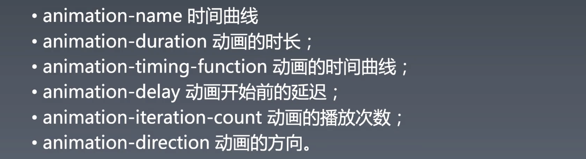

- `animation` 属性实际上是一个 `shorthand`  快捷、简写的属性，是由以下属性组成：

  - [`animation-name`](https://developer.mozilla.org/en-US/docs/Web/CSS/animation-name): 
  - [`animation-duration`](https://developer.mozilla.org/en-US/docs/Web/CSS/animation-duration): 动画持续的时长，也可以理解是动画快慢的控制
  - [`animation-timing-function`](https://developer.mozilla.org/en-US/docs/Web/CSS/animation-timing-function):  决定中间桢的计算方式
  - [`animation-delay`](https://developer.mozilla.org/en-US/docs/Web/CSS/animation-delay): 延迟
  - [`animation-direction`](https://developer.mozilla.org/en-US/docs/Web/CSS/animation-direction): 方向
  - [`animation-iteration-count`](https://developer.mozilla.org/en-US/docs/Web/CSS/animation-iteration-count): 重复次数
  - [`animation-fill-mode`](https://developer.mozilla.org/en-US/docs/Web/CSS/animation-fill-mode): 动画执行之前和执行之后的样式
  - [`animation-play-state`](https://developer.mozilla.org/en-US/docs/Web/CSS/animation-play-state): 动画状态：暂停还是进行

   

#### @keyframe 

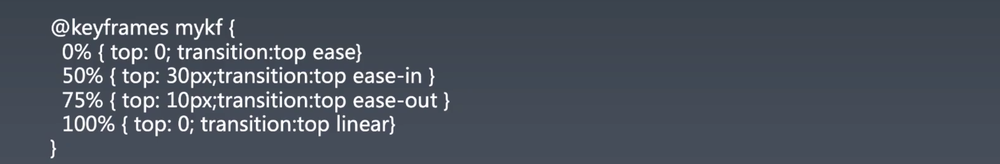

- 关键帧是可以通过设置 `transition` 来单独控制 `timing-function` 的
- `0%` ～ `100%` 可以用**别名** `from` `to` 来代替

### Trasition 动画

#### transition 属性

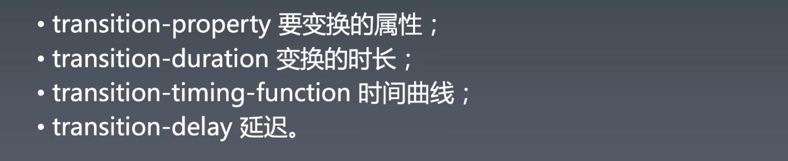

- `transition` 也是一个 `shorthand` 简写属性
- `transition` 的好处是可以很精细的控制每一个属性的变化，所以我们很多时候不指定 `animation` 的 `timing-function ` 而是通过 `transition` 的 `timing-function` 来精确的控制每一个属性的变化规律。（上上图中所示）

### cubic-bezier（3次方贝塞尔曲线）

之前我们有说到，动画的变化方式是可以通过贝塞尔曲线来设置，在具体的属性中是 `timing-function` ，而 `timing-function` 的值决定了你的属性值随着时间的变化方式：

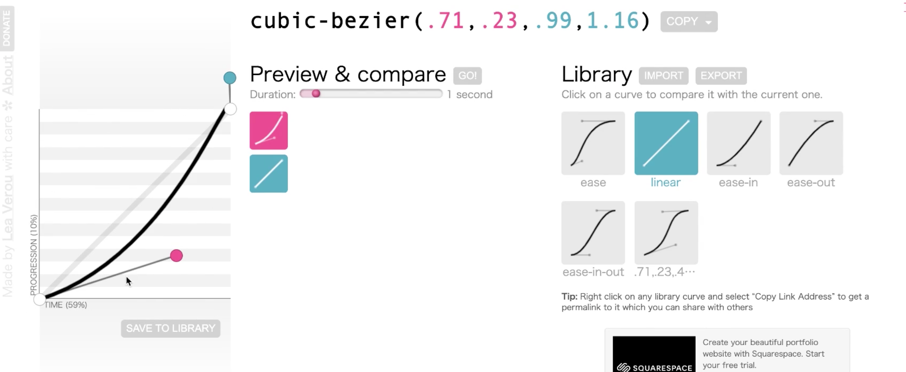

> 网站：https://cubic-bezier.com/#.17,.67,.83,.67

图中的坐标系的横轴表示时间，纵轴表示属性值，整条曲线就表示你的动画过程中属性值的变化。

> 之所以使用曲线是因为曲线比较符合人对事物运动的直觉。

CSS `timing function` 只能使用三次贝塞尔曲线 ，三次贝塞尔曲线是由一个起始点和一个终止点还有两个控制点来决定的，两个控制点会决定曲线的形状。

- `cubic-bezier()` 函数的前两个值决定了上图中红色控制点的位置，第一个值决定其在 x 轴上的位置，第二个值决定了其在 y 轴上的位置。后两个值决定了蓝色球的位置，第三个值决定了蓝球 x 轴上的位置，第四个值决定了篮球 y 轴上的位置。
- x 轴的值的范围在 0 ～ 1 之间，y 轴的值没有限制，甚至是负值，所以可以实现反向运动。

两个控制点可以设置负值从而产生属性值一开始会往回缩，然后再回到去终止点的方向：

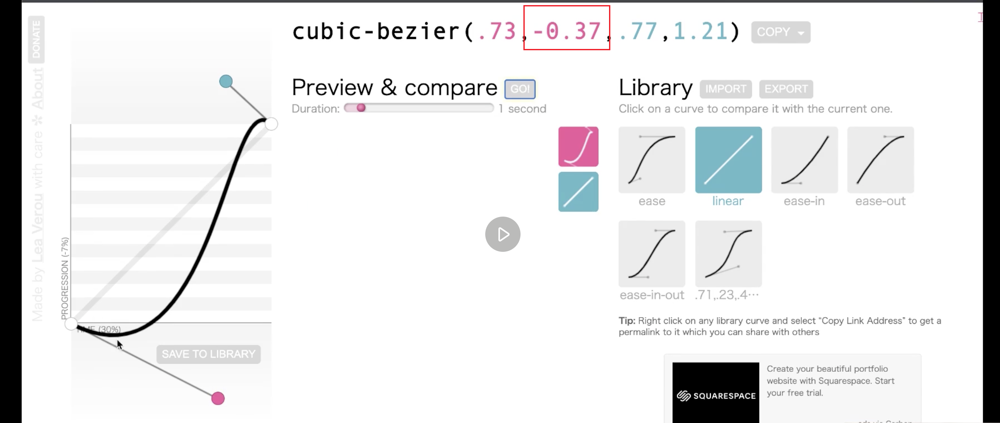

#### 内置曲线 —— 特例

- `ease` 
  - 经过长时间的研究所得出的一条让人感觉自然的变化
  - 推荐位移选择此曲线
- `linear` 
  - 匀加减速，给人的体验不好，不推荐使用
  - 这也是一种很特殊的情况，两个控制点在起始点和结束点的连线上。
- `ease-in` 
  - 退出型的动画
- `ease-out` 
  - 进入型动画

#### 贝塞尔曲线是什么

贝塞尔曲线其实并不是贝塞尔发明的，贝塞尔只是起到了将其**工程化的作用**，当然这体现了工程师的作用。最开始是雷诺汽车厂所研究出来的贝塞尔曲线，用于设计车身，利用贝塞尔曲线的差值特征使车身的形状更自然。

我们所使用的是三次贝塞尔曲线，那么为什么叫三次贝塞尔曲线？

一次贝塞尔曲线：

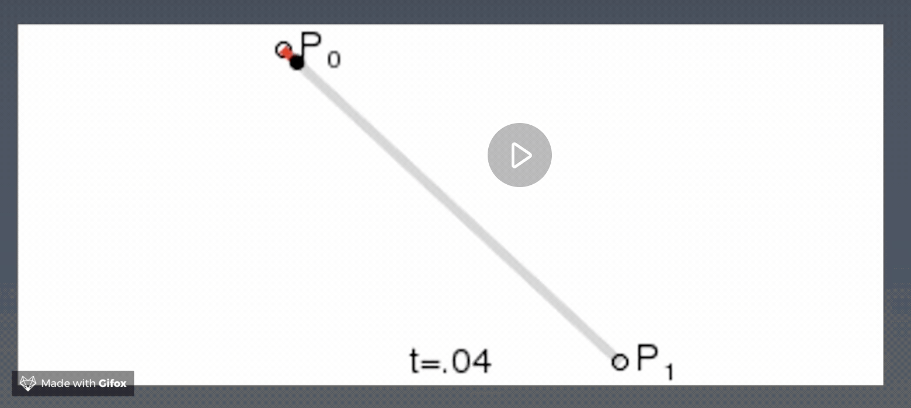

- 一次贝塞尔曲线，其实并不能画出一条曲线，而只是设定两个点，然后值在这两个点中变化。
- t 可以认为是 x 轴上的一个值。

二次贝塞尔曲线：

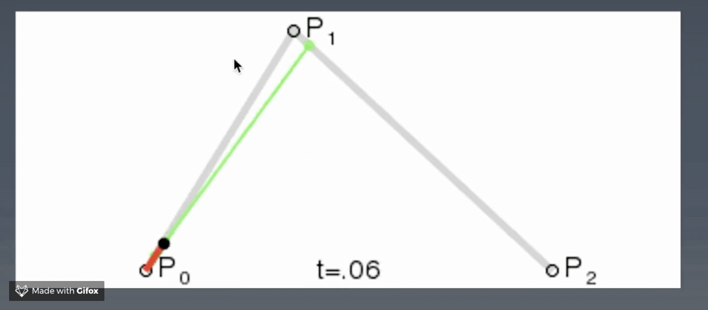

- 二次贝塞尔曲线有一个控制点，一个起始点，一个终止点。
- 可以观察到，我们所描绘出来的曲线是由 P0、P1 产生的点与 P1、P2 产生的点的连线上动态产生的。
- 三个点所经历的 t 相同，所以才有这样动态的效果。

三次贝塞尔曲线：

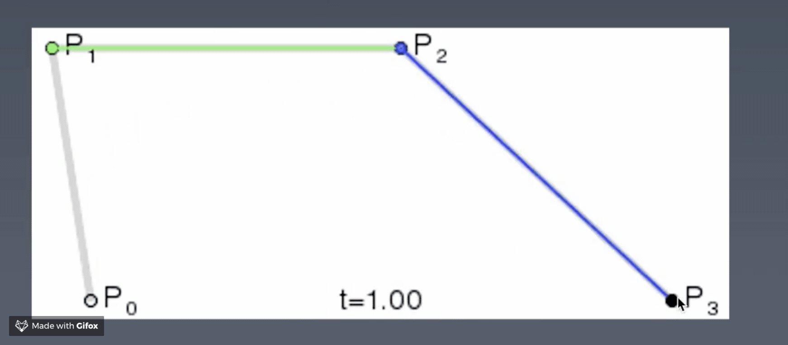

- 三次贝塞尔曲线与二次比较类似，只是又多了一层，通过二次贝塞尔曲线先产生两个蓝点，然后再在蓝点的连线上产生我们的值的集合红色曲线。
- 工业界中三次贝塞尔曲线是使用最多的，计算量适中，如果是四次则又要多一层，就更复杂了，每多一层有点像多一个幂的计算。
- 贝塞尔曲线实际上是一条几何曲线。

 

不推荐大家自己去调整实现贝塞尔曲线，因为我们所设计出来的贝塞尔曲线不一定符合大众审美。

#### 贝塞尔曲线场景——拟合

理论上多段的贝塞尔曲线可以拟合任何的形状。不过能用三次贝塞尔曲线完美拟合的情况并不是特别的多，虽然点很灵活，但是贝塞尔曲线的定义比较复杂，如果想要调成一个圆弧的形状是比较困难的，要不用肉眼去观察，要么需要有很好的数学基础去做这件事。

>  winter 数学不好，但是喜欢**去查论文直接将数学公式拿来用，通过实践来检验这个数学公式是否正确。**

 比如，`./transition.html` 文件中通过贝塞尔曲线来模拟物体的抛物线：

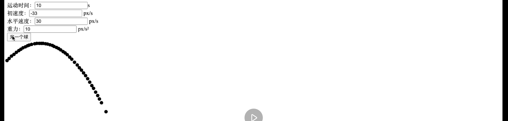

#### 问答

- 动画性能有什么学习的地方吗？（可以看 chrome 的优化内容）
  - 动画性能自己能控制的不是特别多
  - 建议大家使用 `transform` 动画而不是 `top left` 动画，因为 `top left` 进行了 layout
- 小甜饼是什么？
  - 比喻一个方便你平时编程的小特性，并不太改变整体的设计的东西，不用也可以，用了很舒服。

- CSS 动画和 gif 比有什么优势？
  - CSS 动画比 gif 的优势就很大了，因为 gif 是一种很差格式，任何使用都不推荐使用 gif 动画，**哪怕是使用很小的 video，那都比使用 gif 的性能要好很多**。gif 纯粹是位图定义的，性能杀手，少用。
- CSS 与 JS 哪个实现动画的性能更好？
  - 理论上是 CSS，其实要看具体的情况，所以需要在实际的场景上进行测试，查看哪个性能好。
- 能不用 JS 来实现所有的动画吗？
  - 理论上不行的，比如让一个球按照圆形的轨迹去环绕运动，使用 CSS 实现起来非常的困难，可能需要使用贝塞尔曲线去拟合环线，需要多段去拟合，通常是用 4 段或者 8 段。
- CSS 动画的底层原理
  - 没啥，就是 CSS 在底层不断的更改你的属性值，不过是改计算之后渲染之前的值，而不是改原始值。
- CSS 动画与 JS 动画同时进行会丢失帧吗？
  - 是否丢失帧取决于你当前设备的硬件资源是否够用，如果是高质量显卡配上好的 CPU，一般来说是不会丢帧。但是如果是手机上做复杂的 JS 运算则会导致 CSS 动画也会跟着丢帧。（这个问题我在 mac 上就遇到过，当你的 CPU 被某个程序占满时，你会发现鼠标移动到 dock 上的动画会有卡顿）
- 有 3D 动画吗？
  - 我们的动画跟 3D 或是 2D 没有关系，3D 2D 取决于你使用的渲染属性。
- AE 做的动画参考，前端如何实现？
  - AE 所做的某些动画是可以用贝塞尔曲线直接实现的，也有些动画是使用贝塞尔曲线去拟合的，并不是所有。所以如果你自由的让设计师使用 AE 去做动画的话，有些时候是很难完美的去复原这个动画的，你只能通过肉眼观察尽量的去拟合设计师所给出的效果。
- 启动 GPU 模式的关键是什么？
  - 其实并不是 GPU 模式的问题，我们所写的代码最终都会变成计算任务，计算任务是使用 CPU 还是 GPU 去执行不一定，那如何确定是使用 GPU 呢？比如有些属性就会使用 GPU —— `transform` ，这是一定会用 GPU 的属性，如果不放心可以使用 `transform 3D` ，因为 3D 不用 GPU 根本算不出来。
  - 现代浏览器上 `transform 2d` 也能使用 GPU
- `will-change` 其实并不是和启动 GPU 相关的属性，而是一个 composition 相关的属性，我们 toy-browser 中没有做 composition 这一步，可以将其理解为我们会把一些元素渲染出来的结果直接拼到一起，如果这个元素上 layout 相关的属性不变，render 相关的属性不变，那这一层就不需要拆开，这样就可能以前要使用 100 层现在只需要使用 10 层就够了，从而节省渲染的开销。`will-change` 是提升浏览器如何做 composition 的策略，因为将每层拼在一起很讲究，拼好了节约性能，拼不好会重新渲染。
- svg 动画需要学习吗？
  - 其实学的 svg，动画依然是 `transition` 这一套。
- 现在 CSS 动画的兼容性问题怎么样？
  - 非常好
- 正常的渲染不使用 GPU 吗？
  - 这个问题比较复杂，最终的像素的渲染是使用 GPU 的，只是说用多少 GPU 的问题，像 `transform` 这样的属性你能很确定它基本上不怎么走 CPU 的逻辑，设置的值可能就直接进 GPU 了。

- 如何检查是否开启 GPU？
  - 是否开启 GPU 我们是没有办法从任何调试工具上知道这个信息，你只能通过帧率去看，一般来说，CPU 计算过多帧率的变化很明显。而且，会不会用 GPU 跟你的设备相关，不一定和 chrome 相关，比如你用的华为，我用的 iphone，就会很不一样。
  - CPU 特点，CPU 使用过多手机会变得很热，还有手机帧率下降很快，耗电变高。
  - GPU 并不是开启不开启的问题，GPU 其实一直在参与运算，只是参与多少的问题，也就是说渲染的哪一步开始是 GPU，如果你每一帧里面主要的都是 GPU 运算，则性能就好，如果 CPU 运算多了性能就差，并不是完全不参与。

## 重学CSS —— 渲染与颜色

先讲一个例子来理解渲染。

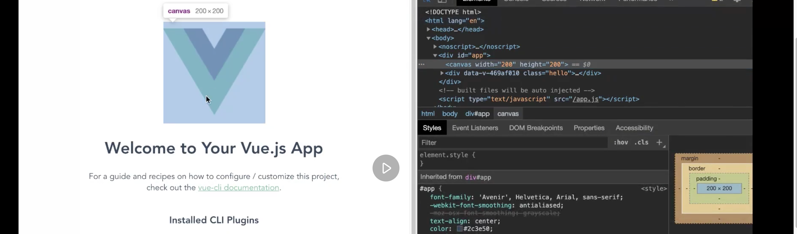

上图中 vue 的 logo 并不是 `vue-client` 的图片，而是一个 canvas，并且并不是使用 2d API 绘制，使用的是 webGL

大致看一下代码：

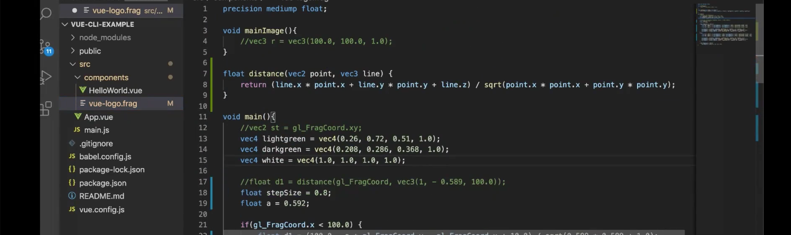

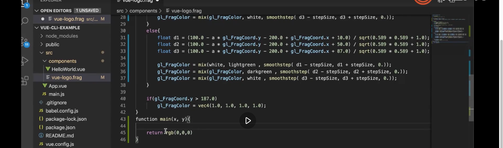

- 注意这个代码文件是 `frag` 

- 这段代码中的 `main` 函数的意思是怎么去画一个点。`gl_FragColor` 等于是 return 值， `gl_FragCoord` 是输入值。作用可以简单理解为根据输入 `x,y` 的点来返回点的颜色。

- 上面所画的 vue 的 logo 是 `200 * 200` 也就是 40000 个点，所以会执行 40000 次，如果用 cpu 来做这件事，稳稳的挂，用 GPU 的高速运算单元来并行执行就很容易，因为每个点之间是相互没有逻辑关系的，互不影响，进去同时出现的感觉，没有延迟渲染。

  这也是 CPU 和 GPU 的区别，GPU 相当于 1w 个小学生，CPU 相当于大学生，你让 1w 个小学生去算微积分，他们也算不出来，你让一个大学生算 1 万道的加减乘除他也够他受的，所以各有分工。

  

通过上面的例子主要是让我们知道**渲染**关注两件事情：

- 渲染的颜色
- 渲染的形状

我们先来看看颜色

### 颜色

颜色并不是一个值，当你眼睛看到一个颜色的时候，看到的是一束光。

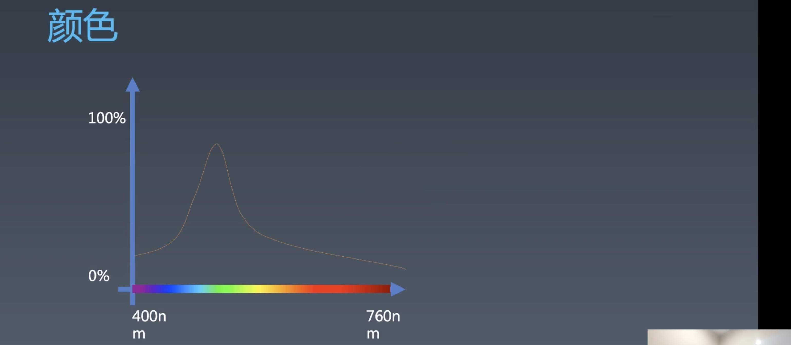

上图是人的肉眼能够识别的光的频谱。

任何光在任何频率上都有，是一种混合的东西，单色光很少，也有——激光，其他的光非常非常少。

所以，人对颜色的识别来源于视觉细胞对混合光的分析的结果。

人眼识别光有点傻，比如：

#### CMYK 与 RGB

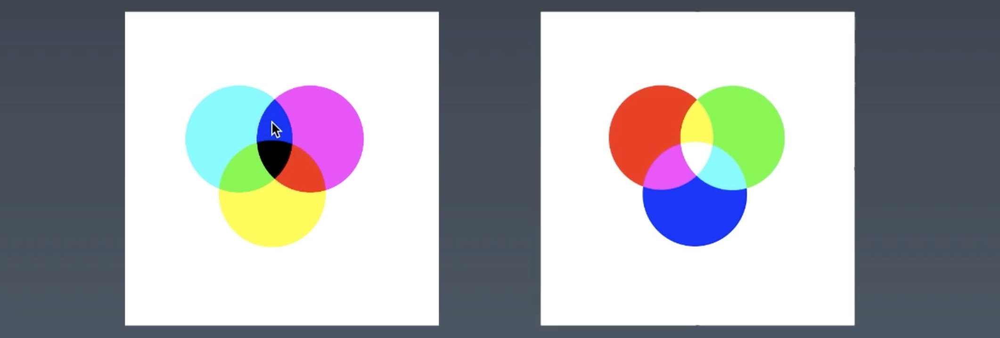

给人眼单独的红、绿、黄光是能够直接识别的，但是如果给了红、绿的混合光则会识别为黄光，这里有一个叠加的规则。如果所有的光都混合在一起就是白光，没有颜色。这是因为人眼里面有两种感官细胞——视锥细胞和视感细胞，视锥细胞对光的颜色感知很敏锐，视感细胞对光的强度感知比较好，所以在晚上的时候由于光弱而看不清颜色，而人眼视锥细胞只能识别三种颜色——红、绿、蓝（三原色）。

> 有几种皮皮虾可以看到十七种颜色。
>
> 有些画家天生能看到四种颜色。

红绿色盲是因为只有两种视锥细胞，红色和绿色是一样的分不清。

小时侯我们学过红、黄、蓝颜料三原色，这些颜料会将红、绿、蓝吸收呈现其补色，但其实真实的颜色是青、品红、黄，正好是光谱三原色的补色。

青、品红、黄（红、黄、蓝）颜料三原色在计算机体系中叫：CMYK，K 是黑色，而之所以有黑，是因为颜料在印刷行业中使用时并不会用三种昂贵的彩色来混合成黑色，所以就有一种单独的黑色颜料（便宜）。

红、绿、蓝人眼三原色在计算机体系中叫：RGB

虽然上面两种定义比较符合物理上对颜色的定义，但是不符合人类的直觉，人类的直觉会比如说这个东西偏红，无论是什么红都以其程度来判断，这个东西就是色相（Q），那么就出现了两种语义化的表示法：

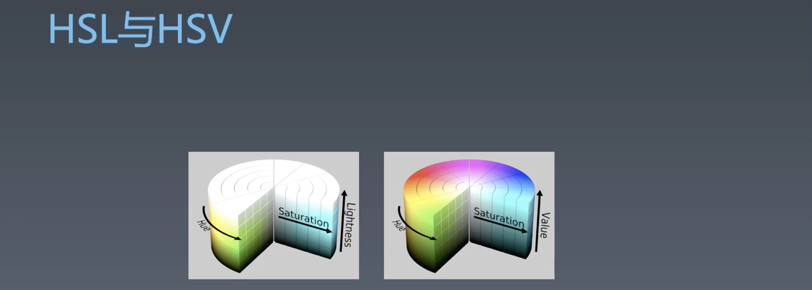

W3C 最早在设计 HSL 和 HSV 的时候有过一定的争论，最后选择了 HSV，其实两个差不多，就差在最后是用明度来表示还是用色值来表示。

色相实际上是将颜色根据波长分为 6 种，并且将它们圈成一圈形成一个色盘。

概念

- S 是色饱和度，纯度表示这个颜色所含杂光的数量，我们大脑直观的感受就是色饱和度越高的颜色就越鲜艳。S 为 0 纯黑
- H 色度
- Value 为 0 纯黑。
- Lightness 明亮度，最高为白，最低为黑

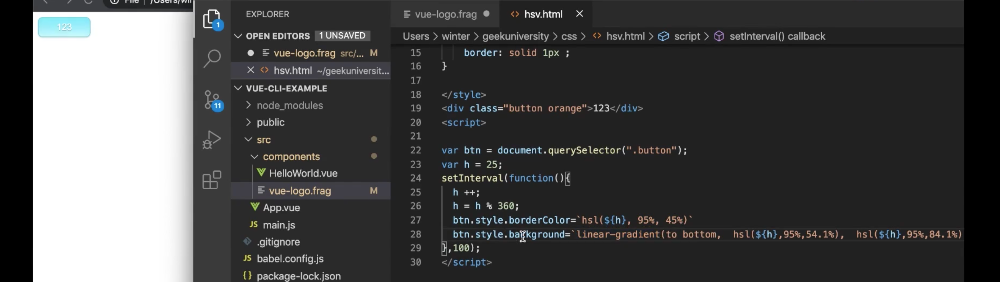

这个例子告诉我们可以通过只改变其 h 值来实现色度的改变来更改不同的色，但同时保持其 lightness 和 saturation 不发生变化。

### 形状

- border
- box-shadow
- border-radius

这三个属性可以改变我们 div 的形状形成图形，这些图形在定义时会定义为矢量图。绘制时会使用类似于 view 的 shader 将其绘制为位图，这个过程在有些资料中会叫做栅格化、像素化，绘制之后图形信息就永远的丢失了，因此会在最后关头做这一步。

> winter 不推荐使用 border 来画五角星、超级玛丽之类的图。

#### 神器

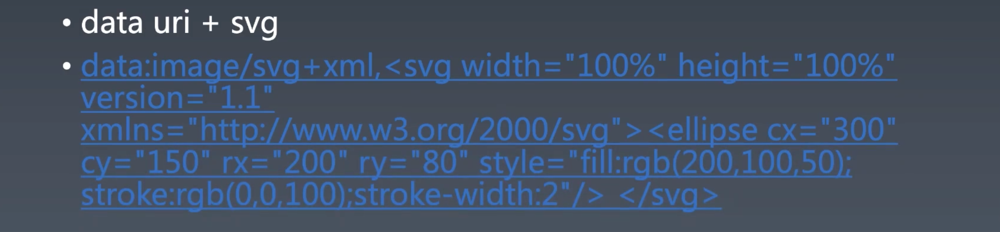

当我们想用图形的时候，我们应该让专业的来。 我们用 data uri 和 svg 永远可以得到让你满意的矢量图形，因为是 svg 可以画所有的矢量图，现存的完整的矢量图标准，经过多年的发展，功能完善，各个浏览器的实现也很稳定。

通过 data uri 的形式可以免去单独生成一个文件的烦恼，指成 `image/svg+xml` ，`,` 之后的部分就可以随便写了。

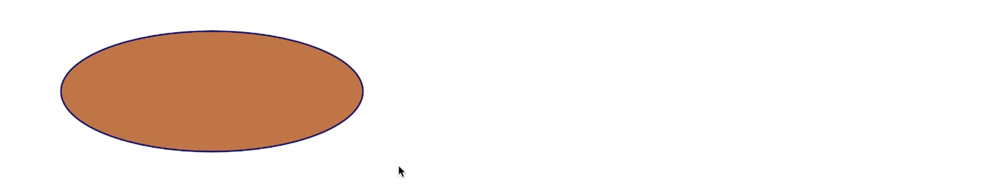

上面代码绘制出来的椭圆。

补充：

- svg 可以直接通过 AE 和 PS 导出。
- 我们让那些 CSS 属性回归到它们本来的功能，border 就让它去做边框吧。CSS 也讲究语义的。
- 相对于位图，图形越简单 svg 的优势越大。
- canvas 是 js 画的， svg 是一种矢量图格式，是用 xml 去写的，没有相关性。 
- 可以通过去查看 http://w3school.com.cn/svg 来简单的过一遍基础。
  - path 可以画任何图形
- svg 可以直接从设计师手中要到，除了极个别情况之外不需要你来手写，手写比较特殊场景。
- 使用 data uri 是可以将其放到 background 中

### 作业

在一个空白页面，通过 `getComputedStyle(document.body)` 将 body 的 computedStyle 取出来，带 -webkit- 的都不要，svg 特有的单独挑出来，将 CSS 属性进行分类。大家要对这个有个大致的判断，不会的就查 mdn 和 web 标准（爬虫）

- layout
  - display
  - position
- interactive
- Render/draw
- svg
- Other（辅助）

## 课程涉及

### 预习内容：

- [CSS 动画与交互：为什么动画要用贝塞尔曲线这么奇怪的东西？](https://time.geekbang.org/column/article/91325)

### 参考链接：

- https://cubic-bezier.com/#.17,.67,.83,.67
- [https://zh.wikipedia.org/wiki/ 貝茲曲線](https://zh.wikipedia.org/wiki/貝茲曲線)

### 课后作业：

- 打开一个空白页面，找到它的 body，把它的 ComputedStyle 取出来，会得到大概 280 个属性。把这些属性进行归类，用脑图的方式写到学习总结里。（作业描述具体参考视频最后的内容）

### 答疑回放：

- 链接：[ https://pan.baidu.com/s/12fo1ph3y6ebv0nA5NxXdsQ](https://pan.baidu.com/s/12fo1ph3y6ebv0nA5NxXdsQ)
  提取码：ryz8

