# 2.重学HTML | HTML语言与扩展

[toc]

上节课我们已经将 CSS 部分的内容讲完，但并不一定是非常完整的，只是按照了 winter 所认为的分类体系来逐一进行了讲解。实际上，你可以通过自己的思考和研究来完善 CSS 知识体系。

## 重学HTML 

### HTML 的定义：XML 与 SGML

HTML 是由 [**Tim Berners-Lee**](https://zh.wikipedia.org/wiki/%E8%92%82%E5%A7%86%C2%B7%E4%BC%AF%E7%BA%B3%E6%96%AF-%E6%9D%8E) 发明，同时它也创建了 W3C 和发明了 HTTP，他是我们的先辈，没有他发现的这些东西就没有我们现在的前端工作。

HTML 参考了 SGML，SGML 是 60 年代末 IBM 公司使用的标记语言，用于图书管理和文档描述，特点是可封闭也可以不封闭。

HTML 相当于在明确的 DTD 之下定义的一门标记语言，理论上在当时属于 SGML 的子集，但是并不是使用 SGML 引擎去解析，SGML 在那个年代并没有一个通用的处理引擎，所以 SGML 是定义了语言，你还是得针对这个语言去写自己的解析器。可以将 SGML 理解为学术概念而非能够直接使用的东西。

2000 年之后的某个时间，XML 作为 SGML 体系下的一个子集出现，有几个规定，开始和结束标签需要配对，另外使用了 XML space 去代替了 SGML 的 DTD。所以，早年 W3C 做过一件非常丢人的事情，他们搞了一个 HTML 2.0，这个版本最终是彻彻底底的失败了，因为当时 XML 很流行，所以 HTML 的组织就朝着这个 XML 方向发展，规定了很多严格遵循 XML 的 HTML 结构，包括我们的 p 标签现在是可以不写结束标签的，在2.0 是不行的。这些让开发者感觉麻烦的特性导致 W3C 中几个反对 2.0 的人离开了 W3C 并去创建了 WhatWG 这个组织，并开始发明 HTML5，后来又发生了很多事情，WhatWG 的人又被叫回了 W3C。

所以，如果我们想要整体上了解 HTML 这个语言是如何定义的，有两个视角—— XML 和 SGML：

- XML：http://www.w3.org/1999/xhtml
- SGML：https://www.w3.org/TR/xhtml1/DTD/xhtml1-strict.dtd


#### DTD（[Document type definition](https://en.wikipedia.org/wiki/Document_type_definition)）

DTD 会以实体（ENTITY，@符开始的东西）的方式去定义。

- 会引入其他的文件

- 会定义通用的事件

- 会定义元素

- DTD 不推荐大家去认真看，只要知道即可。但是推荐大家去看 `.ent` 文件中的内容

  - 比如 `xhtml-lat1.ent` 

    ```
    <!ENTITY nbsp   "&#160;"> <!-- no-break space = non-breaking space, U+00A0 ISOnum -->
    <!ENTITY iexcl  "&#161;"> <!-- inverted exclamation mark, U+00A1 ISOnum -->
    <!ENTITY cent   "&#162;"> <!-- cent sign, U+00A2 ISOnum -->
    <!ENTITY pound  "&#163;"> <!-- pound sign, U+00A3 ISOnum -->
    <!ENTITY curren "&#164;"> <!-- currency sign, U+00A4 ISOnum -->
    <!ENTITY yen    "&#165;"> <!-- yen sign = yuan sign, U+00A5 ISOnum -->
    <!ENTITY brvbar "&#166;"> <!-- broken bar = broken vertical bar, U+00A6 ISOnum -->
    ```

    这里面都是一些别名，比如 `&nbsp;` 不换行空格，注意它和空格是不同的，不要将它当作空格的替代品，在 HTML 中不推荐使用 `&nbsp;` 来代替空格，主要是因为会产生排版上的问题。

  - 又比如 `xhtml-symbol.ent` 

    ```
    <!ENTITY Alpha    "&#913;"> <!-- greek capital letter alpha, U+0391 -->
    <!ENTITY Beta     "&#914;"> <!-- greek capital letter beta, U+0392 -->
    <!ENTITY Gamma    "&#915;"> <!-- greek capital letter gamma, U+0393 ISOgrk3 -->
    <!ENTITY Delta    "&#916;"> <!-- greek capital letter delta, U+0394 ISOgrk3 -->
    <!ENTITY lambda   "&#955;"> <!-- greek small letter lamda, U+03BB ISOgrk3 -->
    ```

    这个文件中就定义了很多希腊字母的字符实体集，我们在表示数学公式中的特殊符号时都可以使用。比如 `&lambad;` ，在 JS 中表示为 `"\u00A0"` 在 html 中表示为 `document.body.innerHTML = "&lambda;"`  ，这也是喜欢半条命和函数式编程的同学很喜欢的符号。

  - 还比如比较重要的：`xhtml-special.ent` 

    ```
    <!ENTITY quot    "&#34;"> <!--  quotation mark, U+0022 ISOnum -->
    <!ENTITY amp     "&#38;#38;"> <!--  ampersand, U+0026 ISOnum -->
    <!ENTITY lt      "&#38;#60;"> <!--  less-than sign, U+003C ISOnum -->
    <!ENTITY gt      "&#62;"> <!--  greater-than sign, U+003E ISOnum -->
    ```

    这几个是一定要记住的，可以记名称或者记数值。为什么需要记住是因为这些特殊字符需要通过这种像是转义的方式来显示在 HTML 的文本之中，而像之前的 lamba 是可以通过复制粘贴的方式显示。

     `amp` 是 `&` 符号，`lt` 是 `less-then` `<` ，`gt` 是 `great-then` `>` 

    `quot` 是 `"` 双引号，当属性值中用到双引号的时候需要用到，虽然也可以通过 `'` 来表示属性值。


### HTML 标签——语义

> 实现一个网站并符合语义的其中一个好处是使你能去认真思考网站的内容，而不是都草草的去只为实现「外在」的样子而写代码。
>
> 这里有一些网站能帮助我们理解语义：
>
> - https://html.com/tags/
> - [HTML Element Reference - By Category](https://www.w3schools.com/tags/ref_byfunc.asp)

参考 http://static001.geekbang.org/static/time/quote/World_Wide_Web-Wikipedia.html 这篇 wiki 的内容，将其写成 HTML。

先来大致了解一下这个页面，并区分主体内容和「这个页面」内容不太相关的内容：

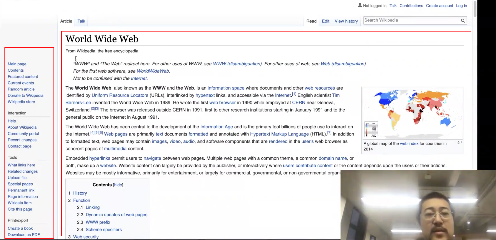

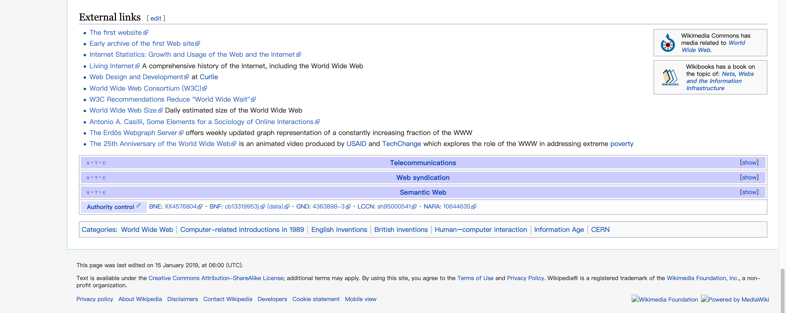

- 左侧导航

- 右上角有登录状态

- 内容主题上有一排做成 tag 的链接

- 最底部有和 wiki 网站相关的链接

- 重要：网页除了白色背景部分的内容之外的内容都可以认为是 `<aside>` 

  - 我们强调 `<aside>` 为非主体内容的东西，而不是侧边栏，是为了区分开 `<aside>` 和 `sidebar` 很像，会造成一种误解，会认为侧边栏才是 `aside` 。
  - 我们的 html 标签都是一种语义，是看不见的，而不是一种具体显示在网页上的外在表现，所以并不是「侧边栏」这种表现方式是 `aside` ，**而是要看「侧边栏」中的内容是不是 `aside` 。因为可能存在是「侧边栏」但内容属于网页主体的东西。**

    > 可以认为一个网页最重要的是内容本身，而其属于哪一块则由其内容在此网页中的类别决定。
  - 所以，上面网页中的 `aside` 主要就有四部分
    - 右上角的登录部分
      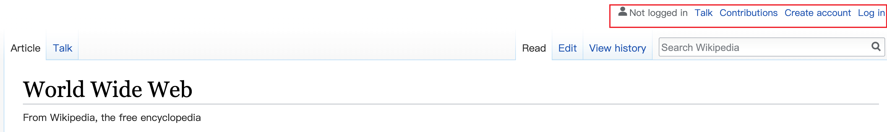
    - 主体内容上的一行导航部分，包括搜索
      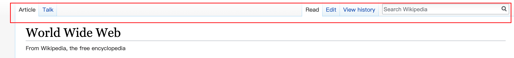
    - 左侧的「侧边栏」工具、切换语言、导出等部分
      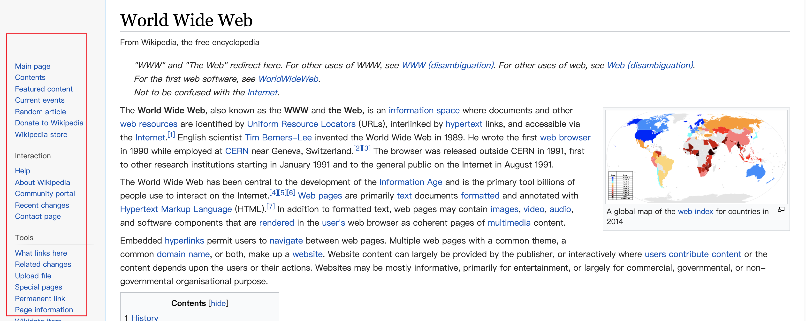
    - 底部的网站相关链接部分
      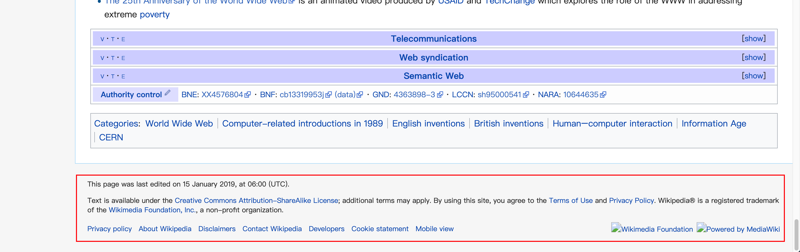

- 主体内容我们会使用 `<main>` 来包裹，`<main>` 的里面是可以放任何标签的，如果是文章就放 `<article>` ，如果是导航就放 `<nav>` （有些页面就是导航页），这里是 `<article>` 

- 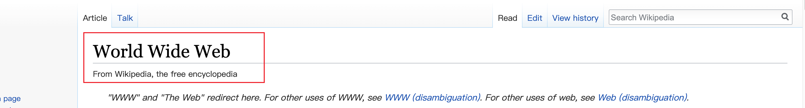

  - 这一部分是标题，除了使用 `h1` `h2` 这样表示标题的标签之外，还需要使用 `hgroup` 

    ```html
    <hgroup>
    	<h1>World Wide Web</h1>
    	<h2>From wikipedia,the free encyclopedia</h2>
    </hgroup>
    ```

  - 不过这中间有根横线是否需要使用 `<hr>` 标签？

    - 不能，因为这两个标题之前是补充关系，而不是 `<hr>` 语义中「故事中场景的改变或部分主题的转移」。如果要实现这一根横线可以使用 CSS

- 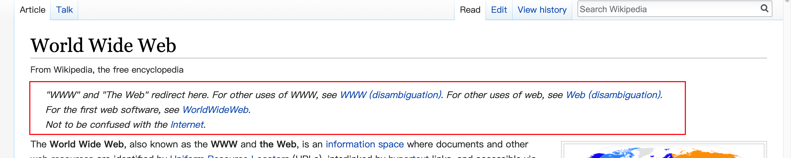

  - 这一部分属于补充说明，没有合适的标签，使用 `<div class="note">` ，或者也可以使用 `<p>` ，也算是一种段落，看你如何理解。
  - "WWW" 可以使用 `<abbr>` 表示缩写词

- 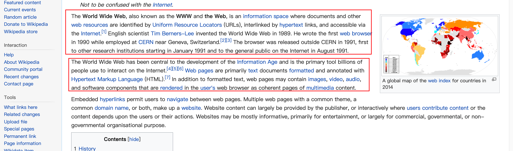

  - 这些就是 `<p>` 段落
  - `<p>` 可以不使用结束标签

- 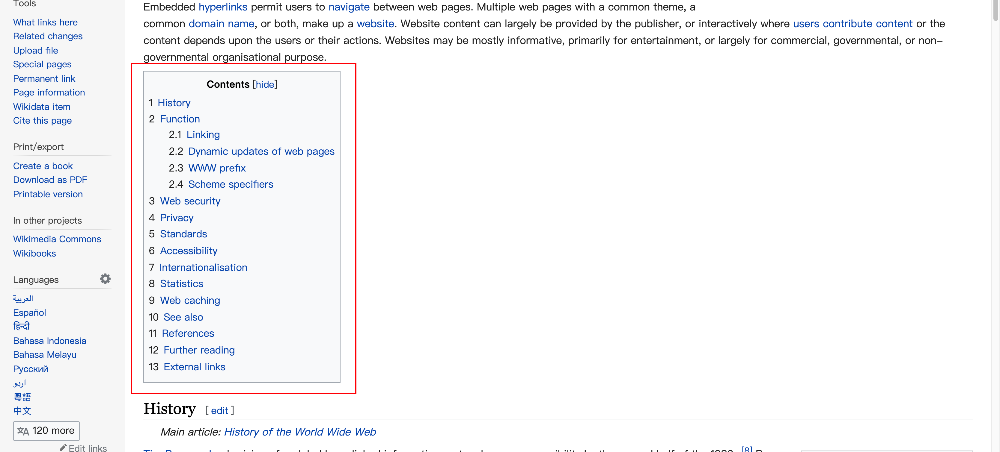

  - 目录，作用是导航，所以使用 `<nav>` 包裹，使其成为 nav 模块。
  - "Contents" 可以使用 `h3` 
  - 每一个条目都是可以点击并会实现跳转的链接，所以使用 `<a>` 框起来。
  - 这整块是一个有序列表，所以使用 `ol` 框起来，并每个条目加上 `li` 
    - 要确定一个列表是否是有序，最简单的方式是将顺序打破看对整体上要说明的目的是否有影响。这里会有影响是因为文章的目录是根据文章的结构排列的，更改会发生变化。
    - 这里的 `2.1` `2.2` 需要使用 CSS 来实现，甚至可以使用 JS，记住 HTML 本身是不管表现的，就算是有序列表但是在前面样式的是圆点，你也要使用 `ol` 而不是 `ul` 

- 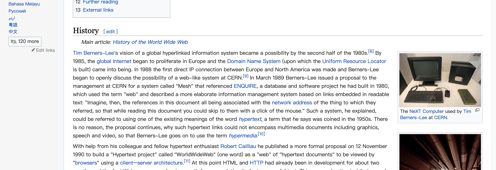

  - 接下来就是每一章节的内容，我们需要使用 `<section>` 来包裹。
  - 然后是标题 `History` 可以使用 `h2` 或者 `h3` 
  - 这个时候也发现之前的内容是一个 `header` 「介绍性内容」，所以可以使用 `<header>` 将其包裹。当然也可以使用 `section` ，但是 `header` 更贴近这段文章的语义。

- 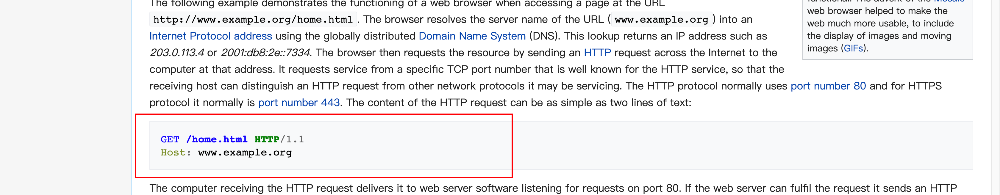

  - 这样的内容可以认为是预格式化（预先排版好的）的内容，所以需要使用 `<pre>` 进行包裹。并且这也是一个示例，所以也需要使用 `<samp>` 进行包裹。

    > 这是一段 HTTP 协议的内容描述，因为这段内容的换行是非常严格的，所以我们**不需要浏览器帮我们做自动换行**，因此我们使用了 pre 标签，表示这部分内容是预先排版过的，不需要浏览器进行排版。
    >
    > 又因为这是一段计算机程序的示例输出，所以我们可以使用 samp 标签。
    >
    > 因为同时是代码，我们还需要加上 code 标签

- 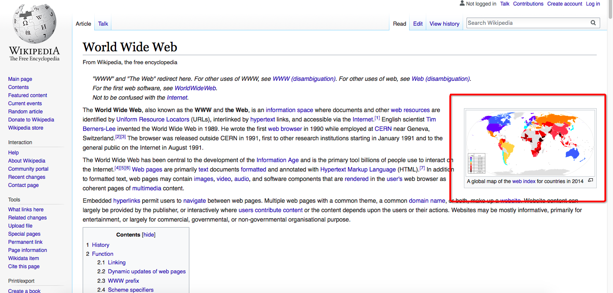

  - 这种带有标题介绍的媒体（图片、视频等）我们需要使用 `figure` 来包裹，并使用 `figcaption` 来包裹标题：

    ```html
    <figure>
     
     <figcaption>The NeXT Computer used by Tim Berners-Lee at CERN.</figcaption>
    </figure>
    ```

- 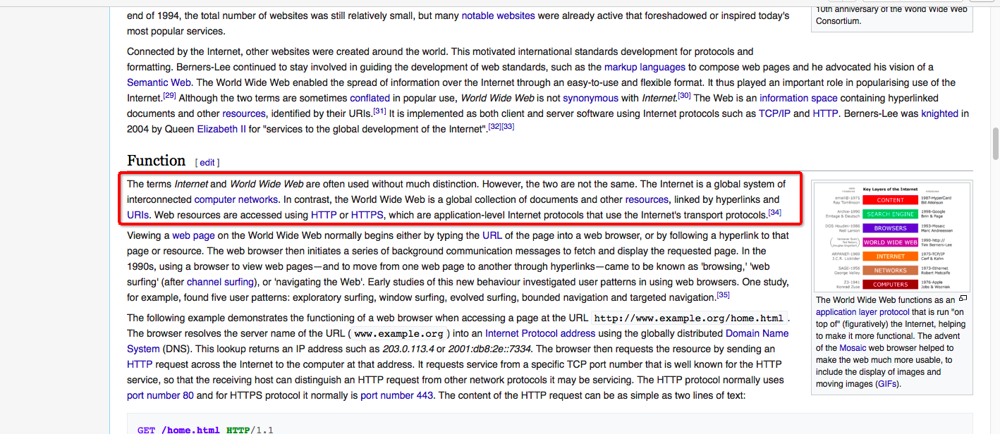

  - 需要注意这一段落。段落的开始有使用 `terms` 这个词，表示后面的词为「术语」对于术语，我们需要使用 `<dfn>` 进行包裹：

    ```html
    The terms Internet and World Wide Web are often used without much distinction. However, the two are not the same. 
    The <dfn>Internet</dfn> is a global system of interconnected computer networks.
    In contrast, the <dfn>World Wide Web</dfn> is a global collection of documents and other resources, linked by hyperlinks and URIs. 
    ```

    > HTML定义元素（`<dfn>`）用于指示在定义短语或句子的上下文中定义的术语。

  - 除了 `<dfn>` 用于说明内容为术语之外，我们也可以使用 `<dl>` 列表来定义术语。

    - `<dl>` 的内部需要使用 `<dt>` 和 `<dd>` 来分别表示术语项和术语的描述。（definition term、definition description)
    - `<dt>` 和 `<dd>` 在使用上没有前后顺序之分。

- 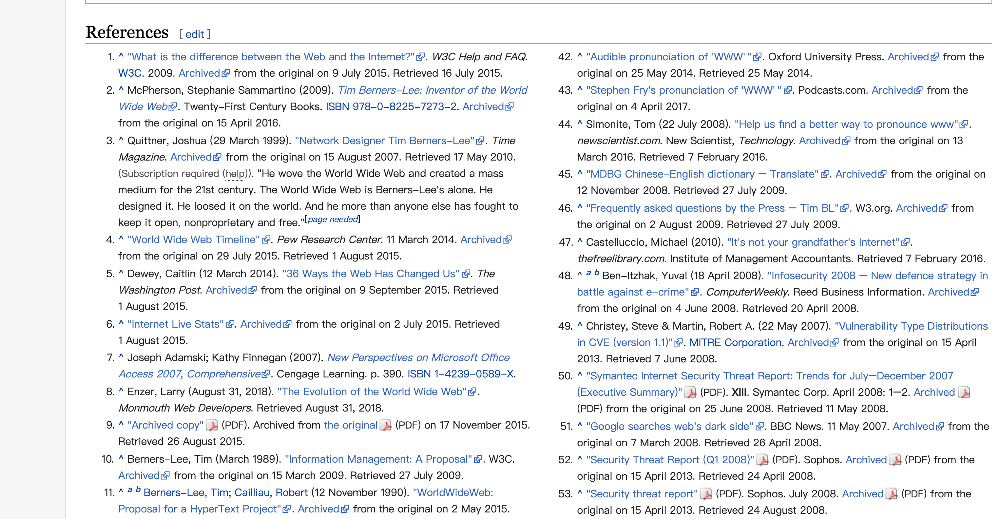
  
  - 上面是整个引用部分，第一个引用中的第一个超链接中的文字可以使用 `<cite>` 标签包裹，表示引用的文章标题，然后最后的时间可以用 `<time>` 包裹。


#### 问答及补充

- html 新增结构化标签有 header、main、footer、aside 等，都用 aside 是不是太概括了？
  - 当我们使用这些标签的时候要明白，`header` 到底是谁的 `header` ，`main` 又是谁的 `main` ，`footer` 又是谁的 `footer` 呢？
  - 我们会认为 `aside` 和 `main` 是一对，网页的主体的部分使用 `main` ，非主体使用 `aside`  

- 如果找不到一个好的语义标签来包裹内容便可以使用 `div` 和 `span` ，因为如果**一旦使用了错误的标签就会导致整个页面内容的意思发生偏差引起问题。**
- 当你的整体页面使用 `h1` 到 `h6` 不够时，可以将网页分为多个 `section` 在 `section` 中再来使用 `h1` 到 `h6` 
- 语义化最大的意义和作用是什么？
  - 语义化有很多意义，但是 winter 自己写代码的时候也不太用这么语义化的标签，除非自己非常的顺手并且**场景非常好**的。
  - 好处：1.对残障人士所使用的屏幕阅读器非常的友好，2.SEO 的能力，但是也不一定，比如像百度这样的引擎对语义化有副作用。百度是你现在黑他，他明天就改了。 
  - 语义化有点像使用标签说话，掌握的词汇量多少的问题，词汇量多可以表达的方式就多（举例：奥巴马、特朗普、莎士比亚的词汇量的不同，或是我们平时说中文中是否使用成语）
  - 如果你想在某些地方表达的更精确，对机器更友好就可以多使用语义化的标签。
  - winter 处中立态度，能用更好，不用也没什么，但是作为 HTML 知识体系中的一部分我们是需要知道的。（我个人是建议尽量去使用的）
- 是不是语义化的标签使用可以减少 class 的数量？
  - 客观上是肯定可以的，但是不建议这样使用（一定要记得**语义化是为了表示网页内容中的内在含义**）
- 语义化标签到底是谁的工作，文章作者、编辑器作者、业务开发者、机器人？
  - 主要是编辑器作者和业务开发者。
- 其实在 word 中也有语义化的内容，可以从工具栏中看到。
- 不建议在语义化上花过多的时间，可以去研究一下 markdown 所生成的这些标签。


### HTML 语法

HTML 有六类可以写出来的元素：

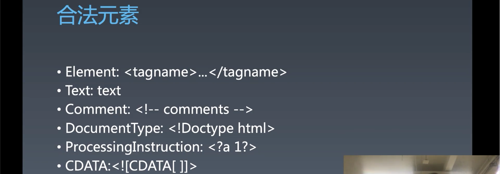

- Comment: 需要七个状态来处理。 `<!-- comments -->`
- ProcessingInstruction 预处理，不好用，没用。
- CDATA 类似于 JS 中的反引号 ``，可以在 [] 写除了 ]]> 组合之外的任何字符 

#### 字符引用

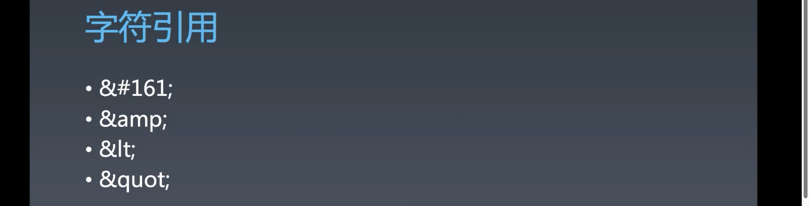

- 之前已经从 `.ent` 文件中学习了。


## 涉及内容

### 预习内容：

- [HTML 语义：div 和 span 不是够用了吗？](https://time.geekbang.org/column/article/78158)
- [HTML 语义：如何运用语义类标签来呈现 Wiki 网页？](https://time.geekbang.org/column/article/78168)
- [HTML 元信息类标签：你知道 head 里一共能写哪几种标签吗？](https://time.geekbang.org/column/article/82711)
- [HTML 链接：除了 a 标签，还有哪些标签叫链接？](https://time.geekbang.org/column/article/85341)
- [HTML 替换型元素：为什么 link 一个 CSS 要用 href，而引入 js 要用 src 呢？](https://time.geekbang.org/column/article/89491)
- [HTML 小实验：用代码分析 HTML 标准](https://time.geekbang.org/column/article/89832)
- [HTML 语言：DTD 到底是什么？](https://time.geekbang.org/column/article/92227)
- [HTML·ARIA：可访问性是只给盲人用的特性么？](https://time.geekbang.org/column/article/93777)

### 参考链接：

- https://www.w3.org/TR/xhtml1/DTD/xhtml1-strict.dtd
- http://static001.geekbang.org/static/time/quote/World_Wide_Web-Wikipedia.html

### 随堂练习：

- 实践：为 wiki 编写 HTML

### 答疑回放：

- 链接：[ https://pan.baidu.com/s/1qsmODnHQGN66zGNUGCunvw](https://pan.baidu.com/s/1qsmODnHQGN66zGNUGCunvw)
  提取码：tn7z
- 链接：[ https://pan.baidu.com/s/1RgcNhuQZhLwfm5PMCIueQQ](https://pan.baidu.com/s/1RgcNhuQZhLwfm5PMCIueQQ)
  提取码：0ebl