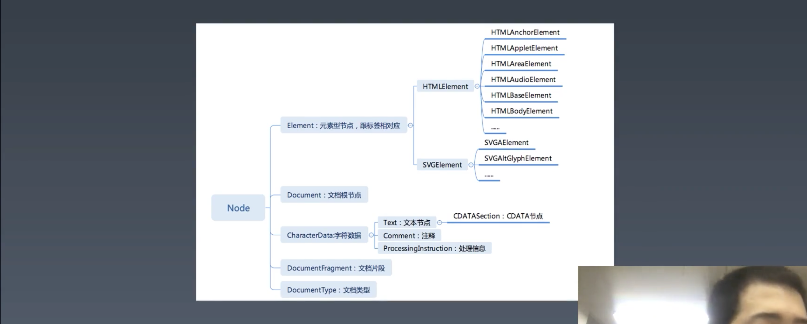
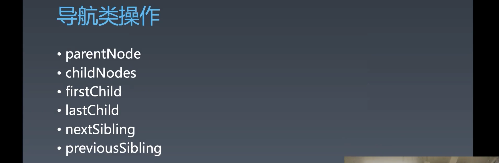
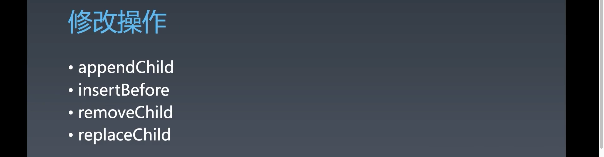
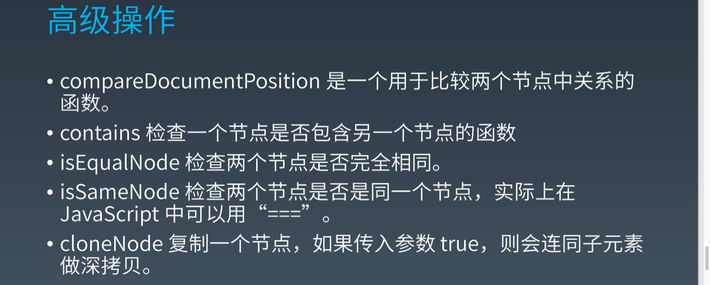
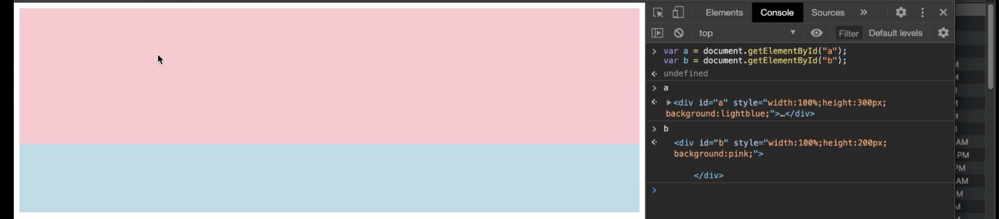

# 重学浏览器API | DOM API，事件机制

[toc]


## 重学 DOM —— DOM API



- DOM 树之中的基本单位就是 Node
- 有五种 Node
  - Element 
    - HTMLElement
    - SVGElement
  - Document 根节点，每个文档只有一个
  - CharacterData
    - Text
      - CDATASection（特殊的语法构成的文本节点）
    - Comment
    - ProcessingInstruction 是 `<?a 1?>` 标签进入 DOM 树的名称
  - DocumentFragment DOM 树中没有，但是可以被 `append` 到其他的元素上，相当于不存在，直接将rang 里面的元素 append 上去了，帮助我们批量的添加元素非常有利的工具
  - DocumentType 没什么作用

为什么有 Element 和 HTMLElement ？

- 这个需要说到 XML 的 namespace，XML 是可以多 namespace 共存的，在 XML 语言中最常见的是 HTML、SVG、mathXML，然后只要多一种 namespace 就会多一种子类。
- 所以，当 HTMLElement 中写了 `<a>` 和 `SVGElement` 中的 `<a>` 是两个东西，因为其 namespace 不同。
- 之前讲 CSS 的时候也说到，CSS 选择器可以使用 namespace 配合 `|` 来区分元素。
- 我们在 HTML 中是通过 `:`  来添加 `namespace` 的，在 DOM 中则是通过不同的子类来区分，在 CSS 是通过 `|` 来区分，这是这几种语言对元素的的可访问性的完备化。


#### 节点操作

##### 导航类操作



- 以上六个访问节点的 API 也有其 Element 版本

  - parent
    - **parentNode 一定是 Element，因为别的 Node 没有 children**
  - children
    - 会忽略文本和空白节点
  - firstElementChild
  - lastElementChild
  - nextElementSibling
  - previousElementSibling

- `childNodes` 是会根据你的操作实时发生变化，所以需要注意，比如这样的代码就会有问题：

  ```js
  let a = document.getElementById('a');
  let b = document.getElementById('b');
  for(let i = 0; i < a.children.length; i++){
    b.appendChild(a.children[i]);
  }
  ```

  - 这里想要将 a 元素中的子元素添加到 b 元素中，但是每当你添加一个 a 元素中的子元素到 b 元素，a 中的子元素就会少一个，从而 a.length 就会 -1，导致的问题是你无法将 a 中的所有元素都添加到 b 中，并且顺序也有问题。

  - 解决办法是：

    ```js
    let a = document.getElementById('a');
    let b = document.getElementById('b');
    while(a.children.length) {
      b.appendChild(a.children[0])
    }
    ```

    这个时候发现了 while 的用途

##### 修改操作



- 三类
  - `appendChild`  和 `insertbefore` 是一对，因为 `insertbefore` 无法将元素添加为其最后一个子元素，所以需要一个 API 来形成一种完备性。
  - `replaceChild` 可以通过 `insertBefore` 和 `removeChild` 来实现。
- DOM 操作都是 W3C 的事情。
- 一个非常重要的潜规则：所有的 DOM 元素只有一个父元素，所以如果你将一个元素的插入到某个元素中，然后又将此元素插入到另一个元素中，第二次的操作会将第一次的元素自动 remove 掉，从而造成一种移动的感觉。所以，你去操作 DOM 树，不需要先去移除某个元素，再添加，你只需要将元素添加到另一个地方，它就会自动的从 DOM 树下掉下来。


##### 高级操作



- 以上这些 API 非常好用，热情的推荐大家记住。

## 重学 DOM —— Event

### DOM api 包含什么？

很多同学会认为 DOM 会包含浏览器中所有的 API，但其实并没有。比如，`crypto` 不在 DOM API 中，它是 W3C 中一个独立的标准—— [Web Cryptography API](https://www.w3.org/TR/2017/REC-WebCryptoAPI-20170126/)  —— 定义的。还比如 `fetch`  `web-animations` `CSSOM` 

一个误解：BOM 包含所有的东西，BOM 包含更少。

DOM 是有**边界**的，具体来说，DOM 包含三块的东西：

- DOM 树相关
- 事件相关
- Range 相关
  - 浏览器中最难的部分


### Event

[EventTarget.addEventListener()](https://developer.mozilla.org/en-US/docs/Web/API/EventTarget/addEventListener)

> Syntax
>
> ```js
> target.addEventListener(type, listener [, options]);
> target.addEventListener(type, listener [, useCapture]);
> target.addEventListener(type, listener [, useCapture, wantsUntrusted  ]); // Gecko/Mozilla only
> ```

- `addEventListener` 有三种参数模式

  - `options` 对象
    - `once` 只执行一次
    - `passive` 不会 `preventDefault()` ，因此你可以完全将此行为做成完全异步的。这个对于性能有好处，比如 `scroll` `touchMove` 等高频事件。
      - 有一个版本的 `breaking change` 将手机浏览器上的 `touchMove` 默认设置为了 `passive` ，如果想要成功的 `preventDefault()` 阻止滚动，就必须显示的传入 `false` 
  - `useCapture` 和捕获或者冒泡有关 
    - 此参数也可以在 `options` 中传入
  - 最后一种模式只有在 `Gecko/Mozilla` 内核的浏览器中才能使用

- `listener` 参数除了接收函数之外还接收对象

  ```js
  document.body.addEventListener('click', {handleEvent: function(){ console.log('handle click')}})
  ```


#### 捕获与冒泡



这里有两个元素，蓝色的 `a` 和在 `a` 内部的粉色 `b` 

如果假设我们是浏览器的实现者，当我们如图点击一下鼠标左键，你第一个收到的信息是什么？

- 相对于 `viewport` 的坐标 `x` `y` 

那拿到这个坐标你如何确定你点击的元素？

- 通过将元素位置与坐标做比较，和 box-tree 去比较。

和 box-tree 如何比？

- 层级从上到下的比较，也就是 root 元素开始从外往里找——捕获。

找到之后想让所有的元素收到这个事件，这个时候该怎么办？

- 那就从里往外再传递——冒泡。

当你去设计浏览器也会这样去做——一个捕获过程一个冒泡过程。

```js
a.addEventListener('click', () => closole.log('a'),true)
b.addEventListener('click', () => closole.log('b'),true)
```

- 点击粉色区域，由于设置了 `useCapture` 为 `true` ，捕获过程，因此会先打印 `'a'` 再打印 `'b'` ，从外向内

```js
a.addEventListener('click', () => closole.log('a'),false)
b.addEventListener('click', () => closole.log('b'),false)
```

- 现在由于将 `useCapture` 设置为 `false` ，打印结果为 `b` `a` 


那么这两个过程，到底谁先谁后？

- 一个元素上一定是先捕获再冒泡，这是一个比较符合常识的模型。


> 这一块的内容需要去看一下「重学前端」的课程
>
> 然后，对于 API 的学习需要自己去翻一下 MDN 上的文档来逐一了解和理解。


### 补充

- MDN 上的 API 不够完整


## 课程涉及内容

### 参考链接：

- https://developer.mozilla.org/en-US/docs/Web/API/EventTarget/addEventListener

### 答疑回放：

- 链接：[ https://pan.baidu.com/s/1BXg6C1xZKdOM-7O1yTSb3g](https://pan.baidu.com/s/1BXg6C1xZKdOM-7O1yTSb3g)
  提取码：bawk

