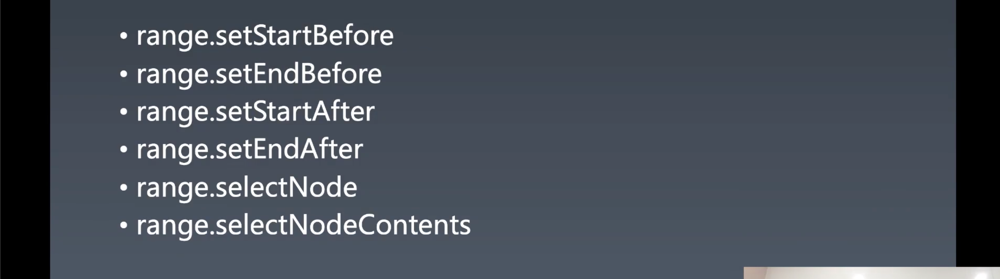

# 重学浏览器API | 其它API，总结

[toc]

## 重学浏览器 API

> 我是这样理解浏览器 API 的，浏览器在接收到 html 文件之后，将这些文字进行解析形成了位于内存中的各种数据模型，比如有 DOM 和 CSSOM，然后浏览器的环境又提供了能够让我们操作这些模型以便控制页面的能力——浏览器API。

### 一个问题


```html
<div id="a">
  <span>1</span>
  <p>2</p>
  <a>3</a>
  <div>4</div>
</div>

<script>
	let element = document.getElementById("a");
  
  function reverseChildren(element) {
    let children = element.childNodes;
  }
</script>
```

- 答案参考 `reverseChildren.html` 文件


### Range API


Range API 是比 DOM 节点 API 功能更强的一组 DOM API，注意 Range API 隶属于 DOM API，也是 DOM API。

**Range 代表了 DOM 树中的一个片段，其不需要遵循 DOM 的层级关系**。比如，你可以是第一个元素的某个子元素到第二个元素的某个子元素。

Range 有一个起点有一个终点，可以大致认为 Range 和 HTML 代码中的一个区段是完全等效的。

创建一个 Range 一般会使用 `setStart` 和 `setEnd` 来设置其起点和终点。这两个 API 构成了 Range 的完备性，可以设置 DOM 树上的任何一个起点和一个终点，甚至可以设置文本节点中某个文字的前或者后，这个能力非常强大，我们在操作的时候可以不用单个节点的去操作，可以将一个节点切割为半个，类似于将一个文本节点中间挖一个洞。（精确的手术）

Range 的另外一种获取方法是利用 `getSelection()` ，如果我们写一个网页在页面中可以用鼠标来进行选择，而这个段选择是可以使用 `getRangeAt` 这个 API 来获取其 Range。


#### Range 用于辅助的快捷 API



- 前四个 API 可以让我们在某个节点的前或者后设置 range 的起点或者终点。
- `range.selectNode` 可以直接选中节点
- `range.selectNodeContents` 选中节点的内容

以上，下面这组 API 是属于方便使用的，而上面那两组 API 是基础且完备的，其实只需要使用上面那两组 API 就完全够用了。


#### 选中 Range 可以干什么？


- `range.extractContents()` 将里面的内容摘出来，摘出来之后会创建 `fragment` ，我们之前也讲过 `fragment` 是文档的片段，当 `append` 一个 `fragment` 到一个节点的时候，它 `append` 上去的是 `fragment` 的内容，而自己是不用 `append` 到 DOM 上的。
- 另外一个能力是可以在 `range` 的位置插入一个元素，这个就很厉害了。因为我们使用 `insertBefore` 和 `appendChild` 我们只能在元素与元素之间的缝隙里插入，而使用这个能力，我们是可以在文本与文本之间插入元素。
- `insertNode` 和 `fragment` 配合使用会有奇效。


#### 实战

开始的题目——「一个问题」，做这个题时有一个目标，当我们去 `reverse` 时，是希望重排的次数尽可能的少，因为理论上如果子元素有 1w 个，当你每一次的重排都会卡很久，因为你每一次的操作都会改变一次 DOM 结构。

通过 range 我们只需要两次操作，第一次将子节点移除，第二次把已经排列好的子节点 `append` 上去，这个时候我们的 `reverseChildren` 的结果就是完美的。

```js
let element = document.getElementById('a');

function reverseChildren(element) {
  let range = new Range();
  range.selectNodeContents(element);

  let fragment = range.extractContents();
  let l = fragment.childNodes.length;
  while (l-- > 0) {
    fragment.appendChild(fragment.childNodes[l]);
  }
  element.appendChild(fragment);
}

reverseChildren(element);
```

1. 创建一个 `range` 
2. 使用 `selectNodeContents` 选中 `element` 这个元素的所有子元素
3. 使用 `extractContents` 将位于 `range` 上的 `element` 元素的子元素摘出来放到 `fragment` 中
4. 然后在 `fragment` 上进行逆序的操作，由于 `fragment` 只是零时暂存的节点集合，所以不会造成页面重排的情况
5. 最后再将 `fragment` 中的元素添加到 `element` 中

以上对于 DOM 的操作造成的重排只有两次，第一次是 `range.extractContents()` ，第二次是 `element.appendChild(fragment)`


精细操作文本节点中的文本：

```html
<div id="a">123456789</div>
<script>
  let textNode = document.getElementById('a').childNodes[0];
  let range = new Range();
  range.setStart(textNode, 3);
  range.setEnd(textNode, 6);
	range.extractContents();
</script>
```

- 通过 `range.setStart(textNode, 3);` 和 `range.setEnd(textNode, 6);` ，选到文本中 index 3 ~ 6 ，然后使用 `extractContents` 将其摘取出来。
- 在页面中的效果就是 `456` 文本不见了。


更为精细的操作：

```html
<div id="a">123<span>456</span>789</div>
<script>
  let textNode = document.getElementById('a').childNodes[0];
  let range = new Range();
  range.setStart(document.getElementById('a').childNodes[1].childNodes[0], 2);
  range.setEnd(document.getElementById('a').childNodes[2], 2);
	range.extractContents();
</script>
```

- 我们将起点设置为 `<span>` 中的某个文本点，终点设置为 `div` 上最后的文本节点中的点，当我们进行 `extractContents()` 操作时，会将 `span` 中的一部分文本和 `div` 上最后文本节点中的一部分文本移除，而不会将 `span` 也移除掉。

- 但如果我们想要将 `span` 移除，则需要将起点设置在开始 `div` 开始文本节点 `123` 之后：

  ```js
  range.setStart(document.getElementById('a').childNodes[0], 3);
  ```

  

#### 什么时候使用 Range API

1. 做比较消耗性能的 DOM 操作时，比如海量节点的批量操作，或者多次执行的操作。
2. 当我们需要精确去操作元素的内容时


#### 问答

- `Range` 和 `doucment.fragment` 有什么区别？
  - 两者没有直接的关系，只是可以配对进行使用，使用 `range.extractContents()` 将 DOM 进行切割然后返回 `fragment` 
- 做文字限制的时候，是否可以用 range API
  - 这个需要看你是做什么文字限制，如果是 `input` 中的文字是没有办法使用 range API
- 可以用 range API 来实现在不使用 escc comand 修改选中文本的样式吗？
  - 可以
- `fragment.childNodes.length` 会把文本节点也算上吗？
  - 当然会啦，像 `childNodes` 这样的 API 对应的有 `children` 这些只算上元素节点的 API。


#### 补充

- 当我们要做一个富文本编辑器或者 content editable 时就非常需要使用到 `range` ，如果只使用 `content editable` 就会使页面上留很多废标签，另外很多操作也会造成非预期的行为。所以，做富文本编辑器是一个在前端中独立的、需要高超技艺的领域，需要设计到 copy paste，还有特殊格式等，阿里到 P7 深入的可以到 P8。但是大家如果不是专门做富文本编辑器实际上不需要掌握那么多东西，大家只需要将 range API 当作自己武器库中的一个终极武器就可以了。
- range 的兼容性很好，是出现在 HTML5 之前的一个特性。
- 这节课我们学习的 API 都是非常实用的 API，比如接下来要学习的 CSSOM ，只要学会了就可以给开发带来好处。


### CSSOM

CSSOM 分为几个大类，先讲最简单的纯 CSSOM 的部分。


#### document.styleSheets

所有 CSSOM 的 API 都是从 `document.styleSheets` 开始的。

在空白的页面中是没有 `document.styleSheets` ，而添加一个 `document.styleSheets` （样式表）有两种方式：

- 使用 `<style>` 标签

  - 直接在内容中写 CSS 代码即可。

- 使用 `<link>` 标签

  - 需要给属性 `href` 传入一个 `uri` 值，不过也可以使用 `data` 协议：

    ```html
    <link rel="stylesheet" title="x" href="data:text/css,p%7Bcolor:blue%7D">
    ```

    - 在 `text/css,` 之后可以写 CSS 代码
    - `%7B` 和 `%7D` 是 `{` `}` 的 Unicode 编码
    - data url 是 winter 非常喜欢的特性，凡是需要用独立文件的地方都可以通过这个 `data uri` 来写成内联的，非常的舒适。
    - `link` 需要写 `rel="stylesheet"` 否则不会将其解析为 CSS


一段带有 CSS 的 HTML 页面代码：

```html
<style title="Hello">
  a {
   color: red; 
  }
</style>
<link rel="stylesheet" title="x" href="data:text/css,p%7Bcolor:blue%7D">
```

访问这个页面，并在控制台中输出`document.styleSheets` 的值：


- 这里可以看到，`StyleSheetList` 数组有两条，每一条都是 `CSSStyleSheet` 类对象。那是否还有别的 `StyleSheet` 吗？我们现在基本上是可以认为是没有，但是未来不好说，理论上讲是允许有其他的 `StyleSheet` ，因为 `CSSStyleSheet` 的父类就是 `StyleSheet` ，类似于 `HTMLElement` 继承于 `Element` 一样。

我们没有不通过 DOM API 去创建样式表的能力，必须使用 HTML 代码或者 DOM API 去创建样式表，很严格。

我们来看一下 `CSSStyleSheet` 里面的属性：

- 最重要的一个属性是 `cssRules` css 规则，可以通过 `disabled` 来控制它是否生效。`cssRules` 是 css 代码内容中的规则。
- `ownerNode` 可以找到其节点，两种可能性——style 和 link


#### Rules


- 可以通过 `insertRule` 这个 API 来操作 rules，这个 API 设计的比较鸡贼，它不接受对象，只能接受一个文本，如果没有 `styleSheets` 的情况是不能添加的。第二个参数是位置。
- `insertRule` 和  `removeRule` 是 winter 理想的形态，通过序列号来添加和移除，但是奇怪的一点是 `insertRule` 只能通过字符串来添加，当你从 cssRules 取出对象 rule 之后还不能直接添加进去，需要转换为字符串。


#### Rule


这个和我们之前所讲的 CSS 的内容是对应的。

- 有普通的 rule —— CSSStyleRule 
- 和一堆 at-rule，每一种 at-rule 都对应了一个接口


   

`CSSStyleRule` 由两部分组成

- selectorText String —— `selectorText` 
- Style K-V 结构

可以直接在上面对样式进行更改：

```js
document.styleSheets[0].cssRules[0].style.color = "lightgreen"
```

- 一般我们都是访问一个元素的 `style` 属性来更改这个元素的样式，如果想要批量的更改可以使用 CSSOM 的这个 API 来进行操作。


#### getComputedStyle


CSSOM 中很重要的 API，有两个参数。 通过 `getComputedStyle` 所取得的 `style` 是无法修改的，但是我们可以使用 `style` 属性去修改，使用 `style` 属性的优先级较高，所以 `computedStyle` 会随着 `style` 变化，并且 `computedStyle` 也会将你通过 CSS 添加上去的属性一起计算出来，所以通过这个 `getComputedStyle` 能够获取元素最真实情况的样式。


#### 问答

- CSSOM 属于 DOM 吗？

  - CSSOM 不属于 DOM，是两组不同的 API

- 标签可以通过 range 切成部分吗？

  - 你可以通过将一个 span 切成两个 span，但是没有能将一个 span 切成半个 span 的东西（而且半个 span 是什么呢？）

- 如果想修改 after before 的 style 可以使用 `getComputedStyle` 吗？

  - 和普通元素一样，是不能的，但是你可以通过修改 `rule` 来修改，比如以下 HTML

    ```html
    <style>
      a::before {
        color: red;
        content: "Hello"
      }
    </style>
    <link rel="stylesheet" title="x" href="data:text/css,p%7Bcolor:blue%7D">
    <a>world</a>
    ```

    现在我们来修改伪元素中 `Hello` 文字的小大：

    ```js
    document.styleSheets[0].cssRules[0].style.fontSize = "40px"
    ```

    也就是你需要找到那条 `rule` 然后更改这个 rule 的 style 即可

- `getComputedStyle` 拿到的是 CSSOM？

  - 是 `style` 对象，我们一般将这节课中所讲到了和 CSS 相关的 API 叫做 CSSOM

- 使用 `range` 去切 `style` 会怎么样？

  - 能切。。

    ```js
    let range = new Range()
    range.selectNodeContents(document.getElementsByTagName('style')[0]);
    range.extractContent();
    ```

    - 但是不要这么做，否则一起工作的小伙伴无法知道为什么样式不生效。

- CSSOM 在实际中有哪些应用的场景？

  - 比如批量的修改元素的样式，不用再批量的修改这些元素的 style，我们可以去改 CSSOM 中的 rule
  - 伪元素的样式更改
  - **总之就是用 CSS 做的事情，使用 CSSOM 都可以做，只是在 JS 层面**


#### 补充

- DOM 是什么意思？就是你 HTML 代码能干的事情，我们用 DOM 都能干，都有一个等效的形式。

- CSSOM 是什么意思？就是你用 CSS 代码能干的事情，我们用 CSSOM 都能干，也有一个等效的形式。

- DOM 和 CSSOM 的区分也是这样来的。

- 这两个是全部的浏览器 API 吗？不是，还有很多其他的。

- `range` API 确实很强大，但是并不是说有了锤子就到处找钉子，看到就用，而是心里要有一根弦，一个标准，比如在需要处理大量的 DOM 操作时或者精细操作时就需要使用，但其实 80% 的情况下都用不到，操作只有很少数量的 DOM 页面的改变实际上没必要使用。当然还有一个标准，你可以去查看 performance ，然后确定是否需要。

- 这个课的目的在于建立大家的知识体系，知道前端这个相关的技术中有什么东西，这样你才能知道有这些工具可以使用，虽然这个课程讲的并不是特别的精细，但是至少你知道了有这么个玩意儿你可以用，然后你去查资料的时候会有一个方向。比如当你想要修改伪元素的样式的时候，你就知道可以通过 CSSOM 来操作，然后你去查一下 MDN 上的相关 API 即可

- `range` 中还有很多很多的 API 可以学习，可以进行多种不同的操作。

-  data uri

  > 参考文章：https://www.cnblogs.com/hustskyking/p/data-uri.html

  - 

    - 这里有一个 `file` 协议，然后还有 http 协议等，我们所有的 URI 都是由前面的协议和后面的协议内容组成

  - 而 `data uri` 也是协议中的一种，所以我们也可以在浏览器的地址栏中访问这个协议，这个协议的特点是，所有的响应数据都在这串字符串中，比如：

    ```
    data:text/html,<a>x</a>
    ```

    

    `data:` 到 `,` 之间的这部分相当于服务端返回的头 `Content-Type` 的值，浏览器需要对响应的头 `Content-Type` 有要求。

- `data` 协议也可以使用 `base64` 进行编码在 `content-type` 之后添加一个 `;` 然后写成 `base64` 即可，`,` 之后就得使用 `base64` 的编码：

  ```
  data:image/gif;base64,R0lGODlhEAAOALMAAOazToeHh0tLS/7LZv/0jvb29t/f3//Ub//ge8WS
  ```

- 所有能使用 `href` 的地方都可以使用 `data URI` ，包括 `script` 中的内容
- 我们之前使用的所谓 base64 的图片实际上是采用了 base64 编码的 data uri 图片


### CSSOM 视图

我们有一些 API 是由 CSSOM 所规定的，首先就是窗口 API

#### 窗口 API

```js
let childWindow = window.open("about:blank","_blank");
```

- 不指定第三个参数调用 `window.open()` 会默认打开一个新的标签页

```js
let childWindow = window.open("about:blank","_blank","width=100, height=100, left=100, top=100");
```

- `window.open` 这个 API 是没有第三个参数的，但是 CSSOM 的 View 的部分是允许你操作新打开的 window 的大小和位置。（不一定有用，需要浏览器支持）

```js
childWindow.moveBy(-50, -50);
childWindow.resizeBy(100, 100);

childWindow.moveTo(100, 100);
childWindow.resizeTo(1000,1000);
```

- `moveBy` 差值更改子窗口当前位置
- `moveTo` 更改子窗口位置到给定的参数
- `resizeBy` 差值更改子窗口大小
- `resizeTo` 更改子窗口大小到给定的参数

```js
window.moveBy(-100,-100);
```

- 父窗口也能调用这几个 API，但是不会发生变化。


#### 滚动 API

适口滚动


- 整个白色的部分是 viewport 视口。
- 可以通过 `window.scrollX` 或 `window.scrollY` 这组 API 来获取视口的当前位置。
- 使用 `scrollBy` 差值改变滚动条的位置。
- 使用 `scrollTo` 改变滚动条的位置到给出的参数。

元素滚动


- `scrollBy` 和 `scrollTo` 和 `window` 相同，只是 `scrollX` 用 `scrollLeft` 代替，`scrollY` 用 `scrollTop` 代替
- 可以通过 `scrollHeight` 和 `scrollWidth` 来获取内容的整体高度和宽度而不是元素的高度，注意此高度和宽度并不包含滚动条部分。（这个可以再研究一下）


#### 元素大小与空间

```js
$0.getClientRects()[0]
```

- 可以用 `getClientRects` 来获取元素本身所占用的空间，和相对于适口的非常准确的位置。

- 为什么 `$0.getClientRects()` 得到的是一个数组？

  - 因为当一个元素为 `inline` 时，每换一行内部会产生一个行盒：

    ```html
    <div style="width: 100px; height: 400px; overflow: scroll;">
      <span style="background-color: antiquewhite;line-height: 2;">文字 文字 文字 文字 文字 文字 文字 文字 文字 文字 文字 文字</span>
    </div>
    ```

    

    获取 `span` 元素的位置会有 6 个元素，并且能够看到行与行之间时有空白的。当我把 `span` 设置为 `inline-block` 时，就使其变为了 `block-box` ，通过 `getClientRects` 获取位置信息时也只有一个元素了。

  - 通过 `getClientRects()` 获取元素位置为多个的情况只有这一种

- 当我们想要整个元素的位置的时候可以使用：

  ```js
  $0.getBoundingClientRect()
  ```

以上两个 API 是 CSSOM 中 View 部分最重要最实用的 API，比如当我们想要做拖拽时可以通过 `getBoundingClientRect` 来获取元素精确的位置，并且通过设置 `transform` 的值来调整它的位置，否则使用元素提供的 top left 这些带有排版意味的属性是很难控制元素的位置的（因为会涉及到和父元素的位置关系）。


这两个 API 都会返回 `x` `y` `left` `top` 相互之间是别名的关系。


#### 其他 API

`window.innerHeight` 和 `window.innerWidth` 是获取视口大小的 API，而 `screen` 系列是和眼前的物理屏幕相关 API。

`window.outerHeight` 和 `window.outerWidth` 是获取浏览器所占的大小，我们很难用到。

`window.devicePixelRation` DPR，物理像素与实际像素的比值，一般为 2，少数安卓机会到 3，当为 2 时，一个逻辑像素等于 4 个物理像素，如果是 3 就是 9 个（横竖 3 个）。 

还有一种方式获取 `innerHeight` 和 `innerWidth` —— `document.documentElement.getBoundingClientRect()` ，返回的 `height` 和 `width` 也是准确的。一般也使用这种方式获取，因为这样可以使获取元素高宽统一，在写代码时获取最外层元素时可以少写 if 判断。


#### 问答

- 微信登陆打开新的页面扫码，扫码成功后二维码页面关闭原页面刷新，这个可以用 `window.open()` 返回的示例对象控制吗？
  - 理论上是可以，open 出来的 window，并且是同域的话，那么是可以直接控制的，如果不是同域，也可以使用 postMessage 来控制。

- 在移动端不想使用 iframe 想打开另一个页面进行操作，操作后返回之前的页面还能找到原页面的操作记录，有什么推荐方案？
  - 推荐单页方案，不要打开新的页面。因为移动端 iframe 是肯定不行的，移动端 iframe 问题太多了，不敢用，千万别往里扎，移动端 iframe 没有人关心你可不可用。
- 有什么好的方式知道滚动停止吗？
  - 没有好的方式，只能去检测 onscroll。
-  `window.close()` 出于安全问题的考虑，对于 http 等协议的窗口使用这个 API 来关闭的。


### 浏览器提供的所有 API

之前讲了 DOM API、CSSOM API、CSSOM View API ，这些是浩瀚的 web API 中的一小部分，不过是非常重要的一部分，接下来我们来找到所有 API。

理论上你只要掌握了 DOM 和 CSSOM 的 API 已经可以操作页面上的任何东西，但对于某些特殊的需求还是需要另外的 API 的。

打开 `about:black` 页面，执行：

```js
let names = Object.getOwnPropertyNames(window);
```

这样便可以获得 800 多个 names：


**这些 names 就包含了所有你能使用的各种 API 的入口。**

接下来我们进行一些过滤。


过滤 JS 中有的 API：

```js
// ECMA 262
{
    let js = new Set();
    let objects = ["globalThis", "console", "BigInt", "BigInt64Array", "BigUint64Array", "Infinity", "NaN", "undefined", "eval", "isFinite", "isNaN", "parseFloat", "parseInt", "decodeURI", "decodeURIComponent", "encodeURI", "encodeURIComponent", "Array", "Date", "RegExp", "Promise", "Proxy", "Map", "WeakMap", "Set", "WeakSet", "Function", "Boolean", "String", "Number", "Symbol", "Object", "Error", "EvalError", "RangeError", "ReferenceError", "SyntaxError", "TypeError", "URIError", "ArrayBuffer", "SharedArrayBuffer", "DataView", "Float32Array", "Float64Array", "Int8Array", "Int16Array", "Int32Array", "Uint8Array", "Uint16Array", "Uint32Array", "Uint8ClampedArray", "Atomics", "JSON", "Math", "Reflect", "escape", "unescape"];
    objects.forEach(o => js.add(o));
    names = names.filter(e => !js.has(e));
}
```

- JS 中的全局对象。
- 属于 ECMA 262


过滤讲过的 API：

```js
names = names.filter( e => {
    try { 
        return !(window[e].prototype instanceof Node)
    } catch(err) {
        return true;
    }
}).filter( e => e != "Node");
```


过滤掉事件相关：

```js
names = names.filter( e => !e.match(/^on/))
```


过滤 webkit 相关：

```js
names = names.filter( e => !e.match(/^webkit/))
```


过滤掉 html 和 whatwg 中的：

```js
//https://html.spec.whatwg.org/#window

{
    let names = Object.getOwnPropertyNames(window)
    let js = new Set();
    let objects = ["BigInt", "BigInt64Array", "BigUint64Array", "Infinity", "NaN", "undefined", "eval", "isFinite", "isNaN", "parseFloat", "parseInt", "decodeURI", "decodeURIComponent", "encodeURI", "encodeURIComponent", "Array", "Date", "RegExp", "Promise", "Proxy", "Map", "WeakMap", "Set", "WeakSet", "Function", "Boolean", "String", "Number", "Symbol", "Object", "Error", "EvalError", "RangeError", "ReferenceError", "SyntaxError", "TypeError", "URIError", "ArrayBuffer", "SharedArrayBuffer", "DataView", "Float32Array", "Float64Array", "Int8Array", "Int16Array", "Int32Array", "Uint8Array", "Uint16Array", "Uint32Array", "Uint8ClampedArray", "Atomics", "JSON", "Math", "Reflect", "escape", "unescape"];
    objects.forEach(o => js.add(o));
    names = names.filter(e => !js.has(e));

    names = names.filter( e => {
        try { 
            return !(window[e].prototype instanceof Node)
        } catch(err) {
            return true;
        }
    }).filter( e => e != "Node")

    let windowprops = new Set();
    objects = ["window", "self", "document", "name", "location", "history", "customElements", "locationbar", "menubar", " personalbar", "scrollbars", "statusbar", "toolbar", "status", "close", "closed", "stop", "focus", " blur", "frames", "length", "top", "opener", "parent", "frameElement", "open", "navigator", "applicationCache", "alert", "confirm", "prompt", "print", "postMessage", "console"];
    objects.forEach(o => windowprops.add(o));
    names = names.filter(e => !windowprops.has(e));
}

//https://html.spec.whatwg.org/

{
    let interfaces = new Set();
    objects = ["ApplicationCache", "AudioTrack", "AudioTrackList", "BarProp", "BeforeUnloadEvent", "BroadcastChannel", "CanvasGradient", "CanvasPattern", "CanvasRenderingContext2D", "CloseEvent", "CustomElementRegistry", "DOMStringList", "DOMStringMap", "DataTransfer", "DataTransferItem", "DataTransferItemList", "DedicatedWorkerGlobalScope", "Document", "DragEvent", "ErrorEvent", "EventSource", "External", "FormDataEvent", "HTMLAllCollection", "HashChangeEvent", "History", "ImageBitmap", "ImageBitmapRenderingContext", "ImageData", "Location", "MediaError", "MessageChannel", "MessageEvent", "MessagePort", "MimeType", "MimeTypeArray", "Navigator", "OffscreenCanvas", "OffscreenCanvasRenderingContext2D", "PageTransitionEvent", "Path2D", "Plugin", "PluginArray", "PopStateEvent", "PromiseRejectionEvent", "RadioNodeList", "SharedWorker", "SharedWorkerGlobalScope", "Storage", "StorageEvent", "TextMetrics", "TextTrack", "TextTrackCue", "TextTrackCueList", "TextTrackList", "TimeRanges", "TrackEvent", "ValidityState", "VideoTrack", "VideoTrackList", "WebSocket", "Window", "Worker", "WorkerGlobalScope", "WorkerLocation", "WorkerNavigator"];
    objects.forEach(o => interfaces.add(o));

    names = names.filter(e => !interfaces.has(e));
}
```


当把上面的都过滤之后，剩下的第一个是 `Intl` ，这个 API 并不是 W3C 的标准，也不是 ECMA262 的标准，而是属于 ECMA 402 中的内容——国际化。找到了，给滤掉：

```js
//http://www.ecma-international.org/ecma-402/5.0/index.html#Title
names = names.filter(e => e != "Intl")
```


接下来是 `WebGL` 系列的 API，标准地址：https://www.khronos.org/registry/webgl/specs/latest/1.0/#5.15，是由 4 家标准化组织一起制定的。过滤：

```js
//https://www.khronos.org/registry/webgl/specs/latest/1.0/#5.15

names = filterOut(names, ["WebGLVertexArrayObject","WebGLTransformFeedback","WebGLSync","WebGLSampler","WebGLQuery","WebGL2RenderingContext","WebGLContextEvent","WebGLObject", "WebGLBuffer", "WebGLFramebuffer", "WebGLProgram", "WebGLRenderbuffer", "WebGLShader", "WebGLTexture", "WebGLUniformLocation", "WebGLActiveInfo", "WebGLShaderPrecisionFormat", "WebGLRenderingContext"]);

```


然后是 `WaveShaperNode` ，可以去 MDN 上查找—— https://developer.mozilla.org/en-US/docs/Web/API/WaveShaperNode 这个属于 `webAudio API`  —— https://webaudio.github.io/web-audio-api/#waveshapernode ，查看稳定版本——https://www.w3.org/TR/webaudio/ 然后看看相关 API，过滤：

```js
//https://www.w3.org/TR/webaudio/

names = filterOut(names, ["AudioContext", "AudioNode", "AnalyserNode", "AudioBuffer", "AudioBufferSourceNode", "AudioDestinationNode", "AudioParam", "AudioListener", "AudioWorklet", "AudioWorkletGlobalScope", "AudioWorkletNode", "AudioWorkletProcessor", "BiquadFilterNode", "ChannelMergerNode", "ChannelSplitterNode", "ConstantSourceNode", "ConvolverNode", "DelayNode", "DynamicsCompressorNode", "GainNode", "IIRFilterNode", "MediaElementAudioSourceNode", "MediaStreamAudioSourceNode", "MediaStreamTrackAudioSourceNode", "MediaStreamAudioDestinationNode", "PannerNode", "PeriodicWave", "OscillatorNode", "StereoPannerNode", "WaveShaperNode", "ScriptProcessorNode", "AudioProcessingEvent"]);

```


然后是 `TextEncoderStream`  这个在重学前端中没有，因为时间过了有两多年了，所以浏览器也发生了很大的变化。在 MDN 找一下标准。过滤：

```js
//https://encoding.spec.whatwg.org/#dom-textencoder

names = filterOut(names, ["TextDecoder", "TextEncoder", "TextDecoderStream", "TextEncoderStream"]);
```


其实在 whatwg 中的标准很少，可以去 http://spec.whatwg.org 中查看：


`SyncManager` 这个 API 是由 W3C 下的 Community Group 社区小组所制定的标准，虽然没有 W3C 的 Working Group 权利大，但是所制定的这个标准依然被浏览器所实现了。


过滤掉以上的 API 之后就还剩下 400 多个 API


## 课程涉及内容

### 预习内容：

- [浏览器 CSSOM：如何获取一个元素的准确位置](https://time.geekbang.org/column/article/86117)

## 参考链接：

- https://spec.whatwg.org/

### 参考代码：

```HTML
<link rel="stylesheet" title="x" href="data:text/css,p%7Bcolor:blue%7D">
```

- apis.html：
  链接：[ https://pan.baidu.com/s/1m_-Z_NPjrwpJxzppcRuBEQ ](https://pan.baidu.com/s/1m_-Z_NPjrwpJxzppcRuBEQ)提取码：irgz

### 课后作业：

- 把所有的 API 画进脑图里

### 答疑回放：

- 链接：[ https://pan.baidu.com/s/1ciT-D-v5RAtw6tLDYyjhfQ](https://pan.baidu.com/s/1ciT-D-v5RAtw6tLDYyjhfQ)
  提取码：tsgd