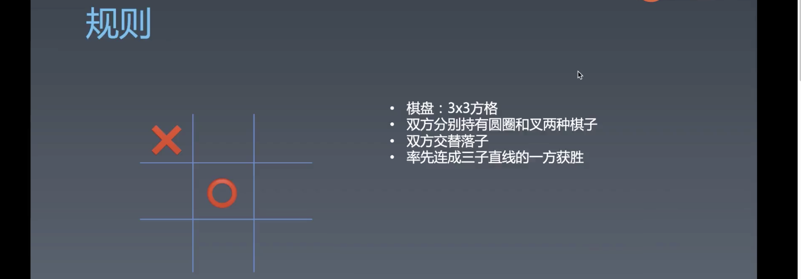

# 编程与算法训练 | TicTacToe / 井字棋

[toc]

## 编程训练 —— TicTacToe

这节课开始进入到编程环节。为大家安排了一组比较综合的练习。

很多时候大家将编程训练和算法训练混在一起，**算法训练只要求输入输出**，而编程训练需要我们的**过程**、**代码结构**、**对语言的基础工具的运用**上都有一定的要求，所以编程是一个更广泛的概念。

之前有个公开课教大家做一个黑白棋，但逻辑很复杂，所以换一个相对简单的训练——TicTacToe（井字棋）

写这个游戏的难度其实不高，但是要在不用高级的 AI 算法下写出一个完美的 AI 就比较困难了。

### 规则



- 连成的直线一共有 8 种可能。

可以用什么数据结构来表示一下棋盘？

- 一维数组（最好的一种）
- 二位数组（最符合人类思维）
- Map 
- ...

需要注意的是不同的数据结构会牵涉到之后的算法。

我们用一种数据结构来表示这个棋盘，实际上是要从一个坐标系中拿到不同位置的状态。这个游戏中每一个点有三种状态：

1. 没有棋子
2. X 棋子
3. O 棋子

二维数组比较符合人类的思维，所以我们先用二位数组来完成这次练习，然后会再用一维数组。所以叫编程练习，是因为不但要讲算法，还会涉及到用什么样的数据结构去抽象什么的问题。一维数组这个抽象是一个非常好，而且是非常强大的抽象，有什么好处呢，之后讲到的时候就知道了，比如百分号取余换行（或者乘法 + 加法获取坐标状态 `y * 3 + x`）。

### 步骤

#### 第一步 —— 决定数据结构

```html
<script>
	let pattern = [
    [0,0,0],
    [0,0,0],
    [0,0,0]
  ]
</script>
```

将 pattern 表示为二位数组。


#### 第二步 —— 渲染 UI

渲染 UI

> 作业不限制使用 UI 的技术，不过需要注意的是，你所使用的技术是你能够驾驭的。

```js
const X = '❌';
const O = '⭕️';
let pattern = [
  [X, 0, 0],
  [0, O, 0],
  [0, 0, X],
];

let board = document.querySelector('.checkerboard');

function render() {
  pattern.forEach((row) => {
    row.forEach((str) => {
      let cell = document.createElement('div');
      cell.classList.add('cell');
      cell.innerHTML = str ? str : '';
      board.appendChild(cell);
    }); 
  });
}

render();
```


#### 第三步 —— 放置棋子

技巧：

虽然这个技巧我的代码中没有使用到，但是可以记一下。

```js
let color = 1;

function move(x, y){
  pattern[y][x] = 1;
  color = 3 - color;
	// or
  color = 3 / color;
  // or
  color = color === 2 ? 1 : 2
  show();
}
```

- 当一个变量在两个数值状态之间切换的时候可以使用，两数之和减去变量，或者两数之积除以变量，当然也可以使用三元操作符。


#### 第四步 —— 判断胜负

我需要思考除了枚举八种胜利的情况然后 if else 之外是否还有其他的算法。

- 一种是参考落子点，然后看有没有新增的情况。
- 全屏检查

算法就这两种，你要考虑的问题是什么，什么是斜线、横向、纵向上全是一样棋子的情况。


用于检测胜负的方法：

```js
function judge(piece) {
  for (let i = 0; i < 3; i++) {
    // 三行相同
    {
      // 这个 win 表示此行中的每个棋子是否都和当前所下棋子相同
      let win = true;
      for (let j = 0; j < 3; j++) {
        if (pattern[i][j] !== piece) {
          win = false;
          break;
        }
      }
      if (win) {
        return true;
      }
    }

    // 三列相同
    {
      let win = true;
      for (let j = 0; j < 3; j++) {
        if (pattern[j][i] !== piece) {
          win = false;
          break;
        }
      }
      if (win) {
        return true;
      }
    }

    // 左上到右下的斜向
    {
      let win = true;
      for (let j = 0; j < 3; j++) {
        if (pattern[j][j] !== piece) {
          win = false;
          break;
        }
      }
      if (win) {
        return true;
      }
    }

    // 左下到右上的
    {
      let win = true;
      for (let j = 0; j < 3; j++) {
        if (pattern[2 - j][j] !== piece) {
          win = false;
          break;
        }
      }
      if (win) {
        return true;
      }
    }
  }
  return false;
}
```

- 整块代码其实被分为了四部分：
  - 判断每一横排中是否有一个不是当前持方的棋子
  - 判断每一竖排是否有一个不是当前持方的棋子
  - 判断从左上到右下的斜排是否有一个不是当前持方的棋子
  - 判断从左下到右上的斜排是否有一个不是当前持方的棋子
- 有两个嵌套循环，这样可以让每一部分拿到两个自增的 index 变量用于访问二维数组中的值。（两次遍历是为了取得每个位置上的状态）
- 每一部分实际上可以认为是某一种类的排，都有一个单独的变量 `win` 表示是否获胜，并且当这一部分的遍历结束后根据此变量进行判断。内部遍历的每一种结果就是获胜的每一种情况。
- 这一算法的关键之处在于分情况进行处理，并且使用反逻辑的方式，并不是去判断某一排的棋子都相同，而是判断这一排中的某一棋子非所下棋子。
- 可以在大脑中模拟整个遍历的过程，想象有一只手依次指向某一排中的每一个值，当指的过程中如果发现其中一个棋子不是该持方的棋子时就 `break` 此次遍历去往另一排中进行遍历，如果某一排都指完了都没有 `break` 则返回 `true` 。


### 第五步 —— 提示胜利

添加辅助提示某一方快要获胜的功能。

```js
function clone(obj) {
  // 很消耗性能
  return JSON.parse(JSON.stringify(obj));
}

function willWin(pattern, piece) {
  for (let i = 0; i < 3; i++) {
    for (let j = 0; j < 3; j++) {
      if (pattern[i][j] !== 0) {
        continue;
      }
      let temp = clone(pattern);
      temp[i][j] = piece;
      if (judge(temp, piece)) {
        return true;
      }
    }
  }
  return false;
}
```

- 这段代码的关键算法在于先去模拟刚下完的一方去下剩下的空白位置，然后判断是否能够获胜。

- 这种思路和普通的思路有差别，普通的思路是判断是否在一排中有两个相同的棋子并且有一个空白，普通的思路在算法上肯定会比这种更加的复杂。

- 使用 `JSON.parse(JSON.stringify(obj));` 会比较消耗性能，有一个解决办法可以不使用 clone，而是先改变再恢复：

  ```js
  function willWin(pattern, piece) {
    for (let i = 0; i < 3; i++) {
      for (let j = 0; j < 3; j++) {
        if (pattern[i][j] !== 0) {
          continue;
        }
        temp[i][j] = piece;
        if (judge(temp, piece)) {
          temp[i][j] = 0;
          return true;
        }
        temp[i][j] = 0;
      }
    }
    return false;
  }
  ```


### 第六步 —— 最好的选择（AI）

在实现「最好的选择」这个功能之前，我们要考虑两个问题：

- 受到 willWin 的启发，我方在什么时候会输？
  - 对方 willWin 的时候

- 有没有情况下是还没有下子之前就一定会输？
  - 我方没有 willWin 且对方大于等于两个 willWin，或者说我下任一一步对方都有 willWin 的点

```js
// 对于要下棋子那一方的最好预判，优化：可以给 pattern 添加一个 hash，如果已经搜索过这个模式，就不用搜
function bestChoice(pattern, piece) {
  let key = pattern.toString() + piece; // 使用当前棋局的模型和棋方形成一个字符串 hash key
  if(manual.get(key)){
    return manual.get(key);
  }
  let point = willWin(pattern, piece);
  // 如果有 point 说明要胜利了，这里也是递归的退出条件之一
  if (point) {
    return {
      point,
      result: 1, // -1 输 0 平 1 赢
    };
  }

  // 默认认为自己处于最坏的情况
  let result = -1;

  // 检查棋盘中的每一个可能会走的点，并且获得对方的最好选择
  outer: for (let i = 0; i < 3; i++) {
    for (let j = 0; j < 3; j++) {
      if (pattern[i][j] !== 0) {
        continue;
      }
      let temp = clone(pattern);
      // 我方在某个空位下一个棋子
      temp[i][j] = piece;
      // 获取对手的最好选择
      let opposite = bestChoice(temp, piece === O ? X : O); 
      // 对手最差的结果就是我方最想要的结果，那么对 opposite.result 取反则是我方想要的情况
      // 如果这个情况比我方现在的情况好，那么我就用这个结果
      if (-opposite.result >= result) {
        point = [j, i];
        result = -opposite.result;
      }
      // 没有这一条等于全盘搜索，现在做成了 win lose 减枝，减少运算量 
      if(result === 1){
        break outer;
      }
    }
  }

  return {
    point,
    result: point ? result : 0,
  };
}
```

- 注释里对于这个算法的解释差不多已经说得很清楚了

- 比较困难的地方在于这段逻辑：

  ```js
  if (-opposite.result >= result) {
    point = [j, i];
    result = -opposite.result;
  }
  ```


#### 棋谱

```js
// 棋谱
let manual = new Map();
manual.set([
  [0, 0, 0],
  [0, 0, 0],
  [0, 0, 0],
].toString() + O, {
  point: [1,1],
  result: 0
})
manual.set([
  [0, 0, 0],
  [0, O, 0],
  [0, 0, 0],
].toString() + X, {
  point: [0,0],
  result: 0
})

// 对于要下棋子那一方的最好预判，优化：可以给 pattern 添加一个 hash，如果已经搜索过这个模式，就不用搜
function bestChoice(pattern, piece) {
  let key = pattern.toString() + piece; // 使用当前棋局的模型和棋方形成一个字符串 hash key
  if(manual.get(key)){
    return manual.get(key);
  }
  //...
}
```

- 利用当前棋局的模型和棋方 hash 之后来作为 key 存储棋谱，之后只要遇到这样的情况则使用棋谱中的建议。


### 一维数组棋盘模型

模型如下：

```js
let pattern = [0,0,0,0,0,0,0,0,0];
```

需要更改取值的方式：

```js
function render() {
  board.innerHTML = '';
  for (let i = 0; i < 3; i++) {
    for (let j = 0; j < 3; j++) {
      let cell = document.createElement('div');
      cell.classList.add('cell');
      cell.addEventListener('click', () => {
        putPiece(i, j);
      });
      let str = pattern[i * 3 + j]
      cell.innerHTML = str ? str : '';
      board.appendChild(cell);
    }
  }
}
```

- 代码中所有像第 10 行那样对 `pattern` 做存取操作的地方都需要更改
- 利用乘法和加法可以模拟出坐标系的方式取每个格子上的状态

#### 一维数组的骚操作

```js
function clone(obj) {
  return Object.create(obj);
}
```

- 利用 `Object.create` 来创建一个对象，对象的 `__proto__` 是 `obj` ，虽然对象本身没有值，但是可以访问其原型上的值，因此可以减少内存。


### 问答

- 绑定事件过多不是会影响性能吗？
  - 你们对性能的认识有根本性的错误，性能的好坏是实际测出来的，不是凭空或者看网上的文章去胡猜的事情。
  - 另外，性能好性能差，for 循环 while 循环性能有差异，你选用哪个是看这个地方性能是否重要，其次才是性能好性能坏的问题。
  - 对绑定事件这个事情来说，无论是重要性还是好坏性都是否定的，首先这个地方的性能不重要，其次绑定过多的事件并不会影响性能，触发事件才会影响性能。
  
- 我们应该先考虑如果设计判断胜负的函数其传入值和返回值都是什么？

  - 在这个游戏中，我们可以传入的值有刚刚下的棋子的种类和棋子的位置以及棋盘。

    > 所以在考虑函数传什么的时候，也可以先考虑能传入的东西有哪些。

- 对于递归的调试有什么好的方法吗？

  - 使用 `log` 比使用 `debugger` 要舒服一些
  - 再就是不要嫌麻烦，将这些通过 UI 动画的方式显示出来，可以使用树的形式


### 补充

- 如果在工作或者学习中做了好事要学会宣传和表达。
- 我们除了学习实现的步骤之外，也需要学习如何去做抽象，数据的抽象和函数的抽象。
- 如果对逻辑的描述不够严谨，则之后写出的代码也会有些疏漏。
- 写递归一定要知道终止条件是什么。
- 在 `bestChoice` 方法中我们是全盘都进行了模拟，但对于更复杂的棋盘游戏，这样的算法肯定是不行的。所以其他的游戏会使用剪枝算法，Alpha go 使用的是蒙特卡罗剪枝，也叫概率剪枝。
- 做棋类的预估运算，会遇到这样的求索过程：精确搜索 -> 估值 -> 深度神经网 -> 卷积网 -> 训练
- 做游戏 AI 要程序员本身对于游戏有够深度的理解
- 对于更复杂的棋类 `bestChoice` 可以优化的地方：
  - 添加 `level` 来决定其搜索的深度，也可以决定其是否使用估值。比如当棋只剩下很少的可走空位时就可以用精度搜索保证结果的完美。
  - 缓存已经遍历过的棋盘，用 `hash` 标示
- 写这个例子是为了让我们去学习编程能力相关的：
  - 语言本身的运用及表达
  - 算法设计
  - 数据结构设计

## 课程涉及内容

### 答疑回放：

- 链接：[ https://pan.baidu.com/s/1jC-SX7eK76HqVQyXbvthCA](https://pan.baidu.com/s/1jC-SX7eK76HqVQyXbvthCA)
  提取码：h0xm

### 参考代码：

```js
function show(){
  let board = document.getElementById("board");

  board.innerHTML = "";

  for(let i = 0; i < 3; i++){
    for(let j = 0; j < 3; j++){
      let cell = document.createElement("div");
      cell.classList.add("cell");
      cell.innerText = pattern[i][j] == 2 ? "❌" :
      pattern[i][j] == 1 ? "⭕️" : "";
      cell.addEventListener("click", () => move(j, i));
      board.appendChild(cell);
    }
    board.appendChild(document.createElement("br"))
  }
}
```

```css
.cell {
  width:100px;
  height:100px;
  background-color: green;
  display:inline-block;
  border:solid 1px white;
  vertical-align: middle;

  line-height: 100px;
  font-size: 50px;
  text-align: center;
}
```

### 参考名词：

- 蒙特卡罗方法（英语：Monte Carlo method），也称统计模拟方法，是 1940 年代中期由于科学技术的发展和电子计算机的发明，而提出的一种以概率统计理论为指导的数值计算方法。是指使用随机数（或更常见的伪随机数）来解决很多计算问题的方法。
  20 世纪 40 年代，在科学家冯·诺伊曼、斯塔尼斯拉夫·乌拉姆和尼古拉斯·梅特罗波利斯于洛斯阿拉莫斯国家实验室为核武器计划工作时，发明了蒙特卡罗方法。因为乌拉姆的叔叔经常在摩纳哥的蒙特卡洛赌场输钱得名，而蒙特卡罗方法正是以概率为基础的方法。（[ https://zh.wikipedia.org/wiki/ 蒙地卡羅方法](https://zh.wikipedia.org/wiki/蒙地卡羅方法) ）

### 课后作业：

- 看完课程，完成 TicTacToe 的练习
- 根据课程内容自己完成一个五子棋的游戏编程（选做）

