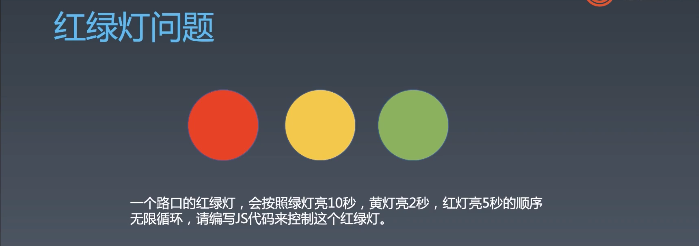

# 1.编程与算法训练 | 异步编程

[toc]

今天的课程会学习「异步编程」和「寻路算法」

「异步编程」是新版 JS 的精髓，「寻路算法」主要是教大家搜索。

## 编程训练 ｜ 异步编程

为什么先教异步编程是为了之后更方便的实现动画，动画是为了算法演示。 

### 红绿灯问题



#### 上古解法

只使用 setTimeout

建议将「业务逻辑」（灯变色）和「时序的控制逻辑」分开。

```html
<style>
  div {
    background-color: grey;
    display: inline-block;
    margin: 30px;
    width: 200px;
    height: 200px;
    border-radius: 50%;
  }
  .yellow.light {
    background-color: yellow;
  }
  .red.light {
    background-color: red;
  }
  .green.light {
    background-color: green;
  }
</style>

<div class="red"></div>
<div class="yellow"></div>
<div class="green"></div>

<script>
  let lights = document.querySelectorAll('div');
  let red = document.querySelector('.red');
  let yellow = document.querySelector('.yellow');
  let green = document.querySelector('.green');

  function extinguishAll() {
    lights.forEach((light) => light.classList.remove('light'));
  }

  function redLightUp() {
    extinguishAll();
    red.classList.add('light');
  }

  function yellowLightUp() {
    extinguishAll();
    yellow.classList.add('light');
  }

  function greenLightUp() {
    extinguishAll();
    green.classList.add('light');
  }

  function go() {
    greenLightUp();
    setTimeout(() => {
      yellowLightUp();
      setTimeout(() => {
        redLightUp();
        setTimeout(() => {
          go();
        }, 3000);
      }, 2000);
    }, 5000);
  }
</script>

```

- 使用 「复合选择器」来处理灯的亮灭是一个恰当的方式，因为只需要切换 `.light` 类即可。
- 使用 `setTimeout` 做异步处理的问题在于会产生 callback hell（嵌套地狱）

> 已知能够让程序一直执行的方式有如下几种：
>
> - `setInterval` 
> - 不设置跳出点的递归调用
> - 无限循环，比如使用 `while(true)`


#### Promise

使用链式调用来代替嵌套。

```js
function sleep(ms) {
    return new Promise((resolve) =>
      setTimeout(() => {
        resolve();
      }, ms),
    );
}

function go() {
  greenLightUp();
  sleep(5000)
    .then(() => {
    yellowLightUp();
    return sleep(2000);
  })
    .then(() => {
    redLightUp();
    return sleep(3000);
  })
    .then(() => {
    go();
  });
}
```

- 减少的嵌套，但是没有本质上的改进。


#### async await

出现的原因是大家想让 Promise 当普通函数调用，用一种特殊的语法去等待 Promise 的改变之前中断函数内部的执行，然后等状态发生变化之后再执行之后的代码。

```js
async function go(){
  greenLightUp();
  await sleep(5000);
  yellowLightUp();
  await sleep(2000);
  redLightUp();
  await sleep(3000);
  go();
}

// or

async function go() {
  while (true) {
    greenLightUp();
    await sleep(5000);
    yellowLightUp();
    await sleep(2000);
    redLightUp();
    await sleep(3000);
  }
}
```

- 这里使用了两种无限执行函数的方法——递归调用和无限循环`whie(true)`


#### 手动控制

```js
let nextBtn = document.querySelector('.next');

  function happen(ele, event) {
    return new Promise((resolve) => {
      ele.addEventListener(
        event,
        () => {
          resolve();
        },
        { once: true },
      );
    });
  }

async function next() {
    while (true) {
      greenLightUp();
      await happen(nextBtn, 'click');
      yellowLightUp();
      await happen(nextBtn, 'click');
      redLightUp();
      await happen(nextBtn, 'click');
    }
  }
```

- 这样当点击 `next` 按钮时就会进行灯的切换。
- 原理是 `await` 会等待 `Promise` 状态发生变化，我们如果不点击 `next` 按钮则状态会一直为 `pending` ，`await` 之后的代码也不会执行。


#### generator

可以认为 `generator` 是可以自己控制函数的执行，并返回多个值的函数。

```js
function* g(){
  yield 1;
  yield 2;
  yield 3;
}

let i = g();
i.next() // => {value: 1, done: false}
i.next() // => {value: 2, done: false}
i.next()  // => {value: 3, done: false}
i.next() // => {value: undefined, done: true}
```

- 执行 `g()` 之后会返回一个 `Iterator` 的迭代器，然后调用其 `next()` 方法会返回一个带有 `value` 和 `done` 的对象，从这个对象中我们可以获取函数内返回的值和判断函数是否执行完毕的标示。
- generator 本来和异步一点关系没有，但是后来大家发现它也有中断函数执行的效果。有一段时间没有 `async await` 时，就有人用 generator 和 Promise 来实现异步编程。

用 `generator` 实现红绿灯：

```js
// 著名用于异步的库 —— co
function co(iterator) {
  let { value, done } = iterator.next();
  if (value instanceof Promise) {
    value.then(() => {
      co(iterator);
    });
  }
}

function* go() {
  while (true) {
    greenLightUp();
    yield sleep(1000);
    yellowLightUp();
    yield sleep(200);
    redLightUp();
    yield sleep(500);
  }
}

co(go());
```

把 `generator` 函数变为 `async`  函数：

```js
function run(iterator) {
  let { value, done } = iterator.next();
  if (value instanceof Promise) {
    if(done) return;
    value.then(() => {
      co(iterator);
    });
  }
}

function co(generator){
  return function() {
    return run(generator());
  }
}

const asyncGo = co(go);
```

- 通过 co 函数可以将 go 变为一个类似 `async`  的函数。

- 不过我们现在已经没有必要这么做了。


 `generator` 可以和 `for of` 搭配使用：

```js
function* g(){
  yield 1;
  yield 2;
  yield 3;
}

for(v of g()){
  console.log(v);
}
```

- 使用 `generator` 函数也可以是一个无限循环的函数，但是不能用于 `for of` ，否则会死机。不过可以使用 `async geenrator` 来搭配 `for awiat of` 使用：

  ```js
  async function* g(){
    let i = 0;
    while(true){
      await sleep(1000);
      yield i++;
    }
  }
  
  for await(let v of g()){
    console.log(v);
  }
  ```

  - 这样就可以生成一个无线列表，并不会造成死机。


## 课程涉及

### 参考代码：

复制代码

```
.cell {
    display:inline-block;
    width:6px;
    height:6px;
    background-color: gray;
    border-bottom:solid 1px white;
    border-right:solid 1px white;
    vertical-align: middle;
}
#container{
    width:701px;
}
```

- 链接：[https://pan.baidu.com/s/1tHVyJGIPZkqfBLcUgjKRMA](https://pan.baidu.com/s/1tHVyJGIPZkqfBLcUgjKRMA)
  提取码：mqz3

### 课后作业：

完成路径编辑器（下节课使用）
