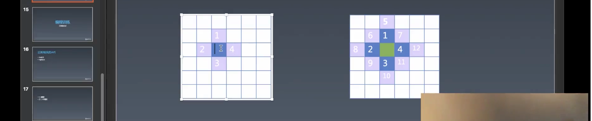
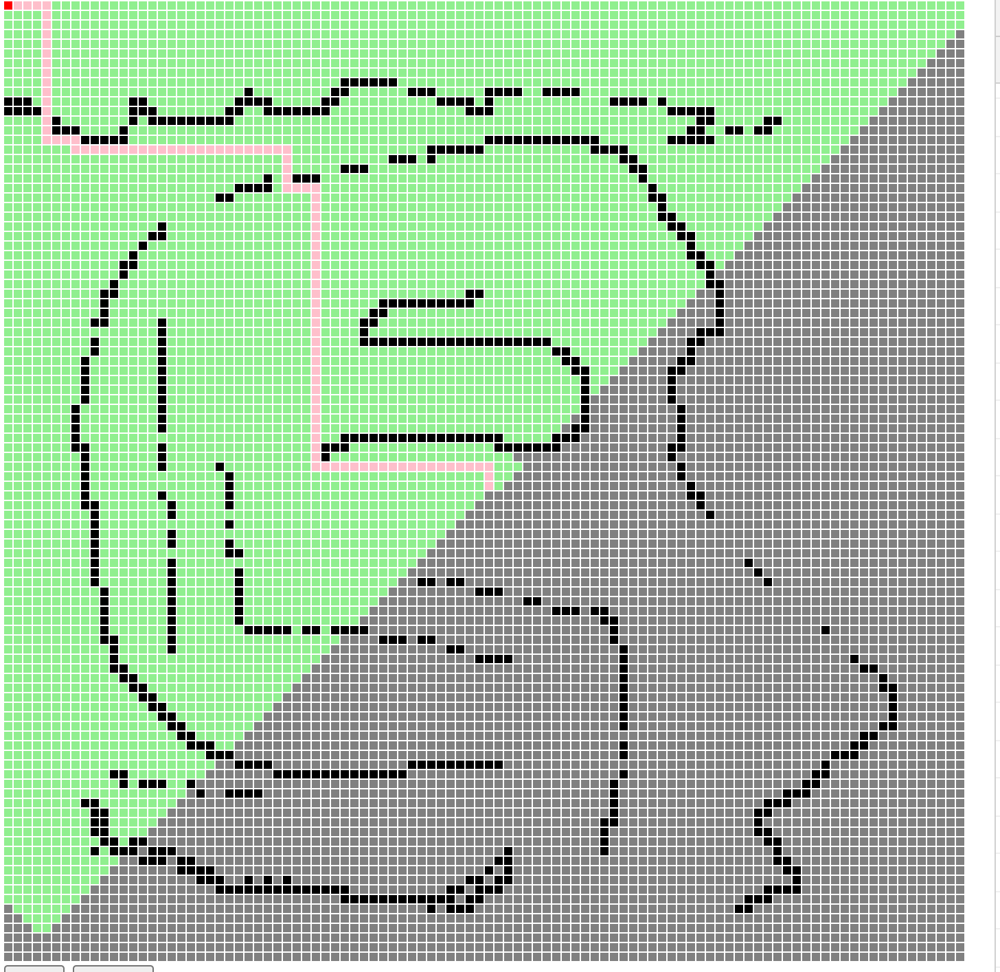
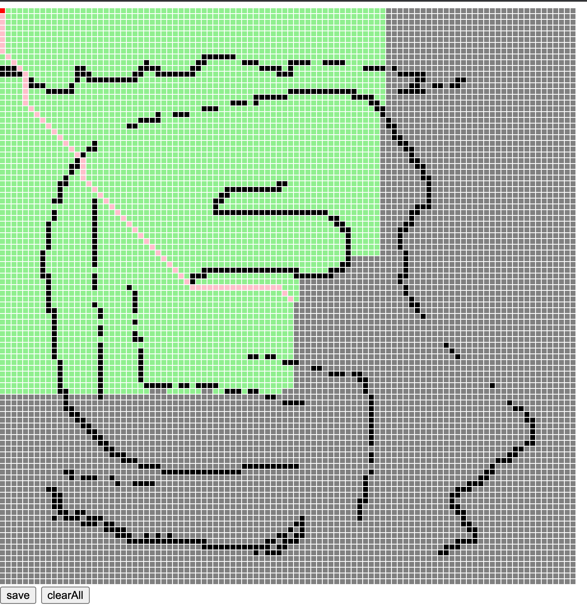
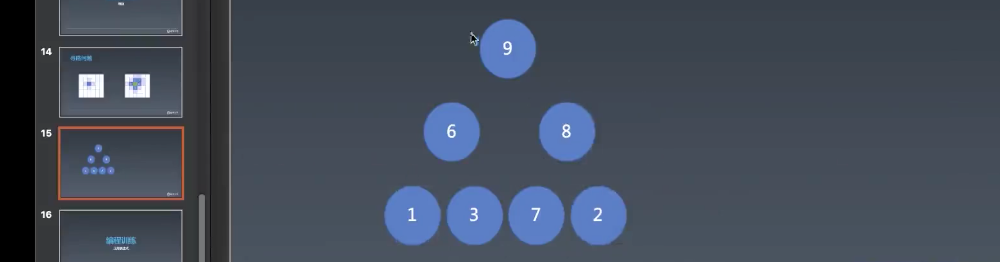
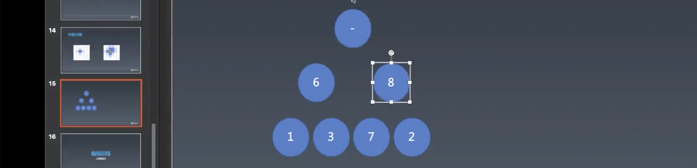
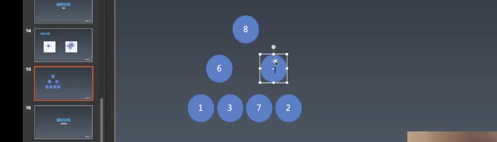
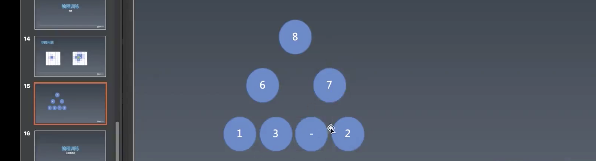
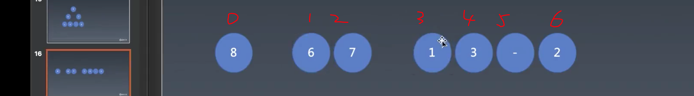

# 3.编程与算法训练 | 寻路问题（搜索），正则表达式

[toc]

## 编程与算法训练 | 寻路问题（搜索）

接下来的步骤是寻路。

什么是寻路？

- 我们的地图上有一个起点和一个终止点，然后寻找一条能够从起点走到终点的路径。



我们先使用一种相对简单的算法，只能寻找当前点的上下左右的点。我们认为是一个递归的过程，但实际上并不是由递归去做的。

步骤：

- 首先，会从起点开始找上下左右的点，能走点的会进行标注，走过的点也会做标记，规定不能往回走。
- 然后是去找起点所找到的四个 1 2 3 4 点的上下左右的点——5 6 7 8 9 10 11 12
- 接着依次类推，不断的往外扩展，一直到我们能走的区域包含终止点就停止。

虽然这个过程也能通过递归来实现，但是会很不舒服，所以我们使用搜索算法来实现。

搜索算法分为两种：

- 广度优先算法
- 深度优先算法

寻路的情况适用于广度优先搜索，因为深度优先搜索是找到一条路一直走到黑，很像递归。


使用「广度优先」判断能否走到终点的代码：

```js
function findPath(map, start, end) {
  // 广度优先搜索会使用到队列
  let queue = [start];

  function insert([x, y]) {
    map = map.slice();
    // 如果非 0 则不添加，非 0 有两种情况，1.该格子是我们所画的障碍物；2.此格子已经走过
    if (map[100 * y + x] !== 0) {
      return;
    }
    // 如果超出了边界则不添加
    if (x < 0 || y < 0 || x >= 100 || y >= 100) {
      return;
    }
    // 已经走过的格子
    map[100 * y + x] = 2;
    queue.push([x, y]);
  }
  // 白格有三种状态：1.未知 2.走到（蓝色） 3.能否继续走（紫色），过程：白->紫->蓝
  // 将蓝色格放入队列，然后再依次将这些格展开就可以了
  while (queue.length) {
    // 队列的特点是一侧入队，另一侧出队，所有有两组 API 选择：1.pop unshift 2.push shift
    let [x, y] = queue.shift();
    // 偷懒牺牲性能
    // 找到终点的时候
    console.log('[x,y]', [x,y])
    if(x === end[0] && y === end[1]){
      return true;
    }
    // 要将起始点的紫色格子变蓝就要去找它上下左右的格子是否能走
    // 有三种情况不能走：1.有障碍 2. x y 如果小于 0 大于 100 超过的边界不能走 3.走过的路
    insert([x - 1, y]);
    insert([x + 1, y]);
    insert([x, y - 1]);
    insert([x, y + 1]);
  }
  // 没有找到
  return false;
}
```

- `insert` 函数很重要，决定了格子能否插入到队列中

「深度优先」：

```js
async function findPath(map, start, end) {
  // 深度优先搜索会使用到堆栈
  let stack = [start];

  async function insert([x, y]) {
    map = map.slice();
    // 如果非 0 则不添加，非 0 有两种情况，1.该格子是我们所画的障碍物；2.此格子已经走过
    if (map[100 * y + x] !== 0) {
      return;
    }
    // 如果超出了边界则不添加
    if (x < 0 || y < 0 || x >= 100 || y >= 100) {
      return;
    }
    // 已经走过的格子,添加状态 2
    map[100 * y + x] = 2;
    container.children[y * 100 + x].style.backgroundColor = 'lightgreen';
    await sleep(5);
    stack.push([x, y]);
  }
  // 白格有三种状态：1.未知 2.走到（紫色） 3.能否继续走（蓝色），过程：白->紫->蓝
  // 将紫色格放入队列，然后再依次将这些格展开就可以了
  while (stack.length) {
    // 堆栈的特点是先入后出，后入显出，所以有两组 API 选择：1.push pop 2.unshift shift
    let [x, y] = stack.pop();
    // 偷懒牺牲性能
    // 找到终点的时候
    console.log('[x,y]', [x, y]);
    if (x === end[0] && y === end[1]) {
      container.children[y * 100 + x].style.backgroundColor = 'red'
      return true;
    }
    // 要将起始点的紫色格子变蓝就要去找它上下左右的格子是否能走
    // 有三种情况不能走：1.有障碍 2. x y 如果小于 0 大于 100 超过的边界不能走 3.走过的路
    // 注意：如果这里不添加 await，则会变成同步代码
    await insert([x - 1, y]);
    await insert([x + 1, y]);
    await insert([x, y - 1]);
    // 深度优先会先对此点进行出栈判断
    await insert([x, y + 1]);
  }
  // 没有找到
  return false;
}
```

- 和「广度优先」相比，区别在于：
  - 使用的数据结构不同，一个是队列，一个是堆栈，从而也就决定了其调用 API 的差别
  - 「深度优先」会一个方向一直走到底，这是由于 `pop()` 方法所决定，只会先去搜索 `[x, y + 1]` 的点

### 可视化

由于量太大，通过打断点是无法知晓是如何找到的，或者找到的是否正确。所以我们可以利用可视化的手段来呈现一种视觉效果来帮助我们了解整个算法的过程。

```js
function sleep(ms) {
  return new Promise((resolve, reject) => setTimeout(resolve, ms));
}

async function findPath(map, start, end) {
  // 广度优先搜索会使用到队列
  let queue = [start];

  async function insert([x, y]) {
    map = map.slice();
    // 如果非 0 则不添加，非 0 有两种情况，1.该格子是我们所画的障碍物；2.此格子已经走过
    if (map[100 * y + x] !== 0) {
      return;
    }
    // 如果超出了边界则不添加
    if (x < 0 || y < 0 || x >= 100 || y >= 100) {
      return;
    }
    // 已经走过的格子,添加状态 2
    map[100 * y + x] = 2;
    container.children[y * 100 + x].style.backgroundColor = 'lightgreen';
    await sleep(5);
    queue.push([x, y]);
  }
  // 白格有三种状态：1.未知 2.走到（紫色） 3.能否继续走（蓝色），过程：白->紫->蓝
  // 将紫色格放入队列，然后再依次将这些格展开就可以了
  while (queue.length) {
    // 队列的特点是一侧入队，另一侧出队，所有有两组 API 选择：1.pop unshift 2.push shift
    let [x, y] = queue.shift();
    // 偷懒牺牲性能
    // 找到终点的时候
    console.log('[x,y]', [x, y]);
    if (x === end[0] && y === end[1]) {
      container.children[y * 100 + x].style.backgroundColor = 'red'
      return true;
    }
    // 要将起始点的紫色格子变蓝就要去找它上下左右的格子是否能走
    // 有三种情况不能走：1.有障碍 2. x y 如果小于 0 大于 100 超过的边界不能走 3.走过的路
    // 注意：如果这里不添加 await，则会变成同步代码
    await insert([x - 1, y]);
    await insert([x + 1, y]);
    await insert([x, y - 1]);
    await insert([x, y + 1]);
  }
  // 没有找到
  return false;
}
```

- 很简单，只需要使用 `async` `await` 异步执行代码即可——22 行
- 需要注意的是，每一个 `insert` 之前也需要添加 `await` 否则当第一个 `insert` 执行完毕之后 `findPath` 会暂停并返回一个 Promise

### 寻找路径

上面我们只是做了是否能找到终点的逻辑，并用可视化来帮助我们理解程序是如何执行的。

这一节是要寻找到路径并且将这条路径填充颜色，代码如下：

```js
async function findPath(map, start, end) {
  // 广度优先搜索会使用到队列
  let queue = [start];

  // prev 是 [x, y] 的上一个点，用于寻找最短路径
  async function insert([x, y], prev) {
    map = map.slice();
    // 如果非 0 则不添加，非 0 有两种情况，1.该格子是我们所画的障碍物；2.此格子已经走过
    if (map[100 * y + x] !== 0) {
      return;
    }
    // 如果超出了边界则不添加
    if (x < 0 || y < 0 || x >= 100 || y >= 100) {
      return;
    }
    // 已经走过的格子,添加状态 prev
    map[100 * y + x] = prev;
    container.children[y * 100 + x].style.backgroundColor = 'lightgreen';
    await sleep(1);
    queue.push([x, y]);
  }
  // 白格有三种状态：1.未知 2.走到（紫色） 3.能否继续走（蓝色），过程：白->紫->蓝
  // 将紫色格放入队列，然后再依次将这些格展开就可以了
  while (queue.length) {
    // 队列的特点是一侧入队，另一侧出队，所有有两组 API 选择：1.pop unshift 2.push shift
    let [x, y] = queue.shift();
    // 偷懒牺牲性能
    // 找到终点的时候
    console.log('[x,y]', [x, y]);
    if (x === end[0] && y === end[1]) {
      let path = [];
      // 找到终点之后寻找路径
      // 只要不是起点则将
      while (x !== start[0] || y !== start[1]) {
        path.push([x, y]);
        // 为路径填色
        container.children[y * 100 + x].style.backgroundColor = 'pink';
        // 用当前点取出上一个点
        [x, y] = map[y * 100 + x];
      }
      // 为终点填色
      container.children[y * 100 + x].style.backgroundColor = 'red';
      return path;
    }
    // 要将起始点的紫色格子变蓝就要去找它上下左右的格子是否能走
    // 有三种情况不能走：1.有障碍 2. x y 如果小于 0 大于 100 超过的边界不能走 3.走过的路
    // 注意：如果这里不添加 await，则会变成同步代码
    await insert([x - 1, y], [x, y]);
    await insert([x + 1, y], [x, y]);
    await insert([x, y - 1], [x, y]);
    await insert([x, y + 1], [x, y]);
  }
  // 没有找到
  return null;
}
```

- 首先，假设插入点为 A，计算出插入点的点为 B，则我们需要向 `insert` 函数传入 B，然后把 B 点的坐标存到 map 的 A 点 Index 中。
- 接着，我们便可以在成功找到终点的逻辑中，利用 `prev` 值来寻找到路径。方式是遍历出存在 map 内的上一个点的坐标并存储到 `path` 中，直到回到起点为止。 （30 ～ 43 行）



不过以上的结果是只会走上下左右的点，从而形成的线也是横平竖八的样子，这并不是最短的线路，最短的情况是能够走斜线，所以我们需要将能够斜着走的逻辑加上。

```js
await insert([x - 1, y], [x, y]);
await insert([x + 1, y], [x, y]);
await insert([x, y - 1], [x, y]);
await insert([x, y + 1], [x, y]);

// 斜方向的点
await insert([x - 1, y - 1], [x, y]);
await insert([x + 1, y + 1], [x, y]);
await insert([x + 1, y - 1], [x, y]);
await insert([x - 1, y + 1], [x, y]);
```

结果：




### 优化算法

之前使用的无论是「广度优先」还是「深度优先」算法，实际上都有点老实巴交的感觉，一步一步的去搜索周围的点，比如明明终点在右侧，它却要还去搜索左侧的点。而我们想要的效果应该是直接能够去往终点的方向去找，这样才能最快的找到路径。 

数学家的方法：启发函数，寻找与终点的关系，优先寻找启发函数推荐的点，只要启发函数算出来的这个值它小于真实的到终点的距离，那么你就一定能够找到最佳路径。这个结论很强力，**带启发函数的搜索，我们称之为 A start搜索**。

所以，我们需要寻找启发函数最小的点，那么我们就需要一个数据结构，每次都可以吐出最小的点。

我们使用「无序数组」作为数据结构， 然后在代码中实现这个数据结构的类：

```js
// 无序数组
// 利用这个数组来决定之后启发搜索的顺序
class Sorted {
  // 可以参考 sort 函数
  constructor(data, compare) {
    this.data = data;
    this.compare = compare;
  }

  // 取一个数组中最小的值
  take() {
    // 寻找一个最小值，最小的时间复杂度大O 是 On；排序 sort 的时间复杂度是 O * logn，所以不行
    if (!this.data.length) {
      // 这里 return undefined 的原因是 data 数组中当都 pop 出去之后也会返回 undefined
      return;
    }
    let min = this.data[0];
    let minIndex = 0;
    // 很常规的获取最小值的方法，遍历对比
    for (let i = 1; i < this.data.length; i++) {
      // 这里需要和 sort 方法一致
      // 提供 compare 方法的好处在于，可以自定义比较的过程
      if (this.compare(this.data[i], min) < 0) {
        min = this.data[i];
        minIndex = i;
      }
    }
    // 删除最小值
    this.data[minIndex] = this.data[this.data.length - 1];
    this.data.pop();
    return min;
  }

  push(point) {
		 this.data.push(point);
  }

  get length(){
    return this.data.length;
  }
}
```

- 实例化这个数据结构需要两个参数，一个是原始的数组数据，第二个是对比方法。利用这两个参数我们就可以创建一个 `take()` 方法从「无序数组」中取出最小的值。
- 取最小的值的方式是很普通的遍历对比，哪个值更小就保留哪个，遍历结束后将最小的那个取出。（17 ～ 30）
- 在 28 ～ 30 中使用了一个技巧，用最后的那个值将最小值覆盖掉，然后再 `pop` 掉最后的值，这样剩下的无序数组中就没有最小值了。
- 另外，还有一个需要注意的地方是，这个无序数组是没有 `length` 和 `push` 方法的，所以需要添加一个 `get length()` 返回其 data 属性的长度，和 `push` 方法。
- 这里可以发现一个问题，我们实际上是在利用数组这种 JS 提供给我们的数据结构再做一层抽象，然后设计出我们所想要的新的数据结构的能力。

接着，我们有了「无序数组」的类，就可以实例化，并使用这个数据结构的能力来帮助我们用更短的时间完成搜索，代码：

```js
async function findPath(map, start, end) {
  map = map.slice();

  function distance([x, y]){
    // 算两个点之间的直线距离，其实还需要开根号，因为不开根号不影响结果，并且能够节约性能，所以就省略了
    return (x - end[0]) ** 2 + (y - end[1]) ** 2;
  }

  let collection = new Sorted([start], (a, b) => distance(a) - distance(b));

  // prev 是 [x, y] 的上一个点，用于寻找最短路径
  async function insert([x, y], prev) {
    // 如果非 0 则不添加，非 0 有两种情况，1.该格子是我们所画的障碍物；2.此格子已经走过
    if (map[100 * y + x] !== 0) {
      return;
    }
    // 如果超出了边界则不添加
    if (x < 0 || y < 0 || x >= 100 || y >= 100) {
      return;
    }
    // 已经走过的格子,添加状态 prev
    map[100 * y + x] = prev;
    container.children[y * 100 + x].style.backgroundColor = 'lightgreen';
    await sleep(1);
    collection.push([x, y]);
  }
  
  while (collection.length) {
    // 从无序数组中将离终点最近的点取出来
    let [x, y] = collection.take();
    // 找到终点的时候
    if (x === end[0] && y === end[1]) {
      let path = [];
      // 找到终点之后寻找路径
      // 只要不是起点则将
      while (x !== start[0] || y !== start[1]) {
        path.push([x, y]);
        // 为路径填色
        container.children[y * 100 + x].style.backgroundColor = 'pink';
        [x, y] = map[y * 100 + x];
      }
      // 为终点填色
      container.children[y * 100 + x].style.backgroundColor = 'red';
      return path;
    }
    await insert([x - 1, y], [x, y]);
    await insert([x + 1, y], [x, y]);
    await insert([x, y - 1], [x, y]);
    await insert([x, y + 1], [x, y]);

    await insert([x - 1, y - 1], [x, y]);
    await insert([x + 1, y + 1], [x, y]);
    await insert([x + 1, y - 1], [x, y]);
    await insert([x - 1, y + 1], [x, y]);
  }
  return null;
}
```

- 使用 `new Sorted` 的实例来替代之前的队列（9）
- 传入的对比方法，需要返回的是两个点到终点直线距离的差值，这样才能知道哪个点离终点更近，从而优先搜索这个点。
- 然后就是在遍历 `collection` 时取出距离最小的点将它周围的有效点（白点）添加到 `collection` 中。然后一直循环这个过程直到找到终点为止。
- 以上会有一个问题，当一个点的右边和下边是障碍，而右下没有障碍是，路径可以从此点跳到右下点。不过，这个问题的前提是只能左右上下移动。


### 改进 Sorted

目前的算法中 `Sorted` 类的实现还不够高效，我们试着用堆（binary heap）解决这个寻路问题。

binary heap 本质上是一颗二叉树，其中有一种堆叫做大顶堆，特点是每一个父节点都比两个子节点要大：



> 对应的还有小顶堆，父节点比两个子节点要小。

那么我们需要利用大顶堆的特点呢？

我们将最上面的 9 拿掉，用 `-` 代替，则为了保持大顶推的特点，此节点需要与两个子节点中较大的值交换如下，直到交换到最底部的叶节点：







那么使用大顶堆这样的方式去取最大的元素时，其特点是需要经过的操作数与其高度相等（顶层 - 底层），如果这个堆有 n 个元素，这个堆的高度是多少？

- `log(n + 1)`   - 1

`Sorted` 算法的实际复杂度是 n，而二叉堆是 `log(n + 1) - 1` 所以能大大提高性能。


一般来说，我们实现一个树的数据结构时，会使用对象：

```js
{
  value: 9, 
  left: null,
  right: null
}
```

但实际上我们在实现数据结构的时候并不常使用对象，因为对象的开销很大，创建大量的对象在内存中也会造成问题，并且性能也不是很好。

所以，我们使用数组形式来表示二叉树：



- 假设父节点的 index 为 i，而其两个子节点的 index 为 `i * 2 + 1` 和 ` i * 2 + 2`  。知道了 index 我们就可以获取到值，然后用值比较得出较小值或是较大值。

> 这部分内容可以在之后学习了数据结构之后回来看。
>
> 时间点：1:29:04


### 补充

- 所有的搜索算法的区别都在于其数据结构。

- 递归问题都可以用 stack 的形式去写。

- 之所以 winter 写这个小应用这么快，是因为他写了至少 8 遍。

  > 熟能生巧啊，朋友。
  >
  > 可以试着不看之前的代码尝试写一写。

- 一个非常经典的算法问题——编辑距离，看两个字符串，然后用增删改的最少步骤去把一个字符串变成另一个字符串。
  - 这个问题你用动态规划是可以算出它会走多少步，但是如果你想要将每一步存下来也需要我们实现寻找路径的方法——在插入下一个点的时候存储上一个点的坐标。
  - 存储 prev 的手段在算法中是一个很普遍的。
- 学完这个课之后就可以将算法进行可视化。
- 为什么取名叫 `Sorted` ，是因为 `Sorted` 是一类数据结构，有序数据结构，比如二叉树、bi树、红黑树、AVR 树、堆，这些的特点就是可以用于排序，你将东西无脑的乱序存到这个数据结构之中，它吐出来的东西就是有序的。
- `BinaryHeap` 很实用，可以使用它在 leetcode 上解决很多问题。
- 注意 winter 实现的步骤，每一步都做了什么。
- 启发式搜索基本上就可以算是一种剪枝算法。
  
  - 在寻路中的每一格实际上就对应着 tictactoc 中的每一种局面。
- A star 比较厉害的是，如果你知道终点的位置，你是可以直接往终点方向去走的。 
- 做前端一定要利用可视化来帮助我们理解一些东西，比如比较复杂的算法，又比如有的同学不是很明白 `y * 100 + x` 作为 index 的意思，那么可以把这个值的结果打印到一个 `5 * 5` 的 map 的格子中去显示，这样就能更好的理解这个算式的意思了。


### 问答

- 老师，前端哪些方面会用到算法？
  - 算法分为广义的算法和狭义的算法，广义的算法就是平时写代码中的步骤（算法），比如如何把大象关在冰箱里，你也需要想清楚步骤才能去实现：1.开冰箱门，2 放入大象，3.关冰箱门
  - 狭义的算法是指经典算法：分治、动态规划、递归，其实也就是成熟的套路。
  - 具体用在哪里，比如边距距离、动态规划是可以在 DOM 树的 diff 算法中去使用的，React 的两棵 DOM 树做 Diff 的时候，用这个算法去寻找最小改动。但并不是说你不用「动态规划」就写不出来，只是实现的方式没有那么好。
  - 由于图灵完备情况，大部分的逻辑过程都是可以替代的。

## 课程内容涉及

### 参考代码：

```js
function sleep(t){
    return new Promise(function(resolve){
        setTimeout(resolve, t);
    });
}    
```

### 代码截图：

- 链接：[ https://pan.baidu.com/s/1ZmqRUMcq5IcDG2qOU9bFiA](https://pan.baidu.com/s/1ZmqRUMcq5IcDG2qOU9bFiA)
  提取码：vlc0

### 课后作业：

- 完成课上布置的练习，并将编程训练的寻路完成