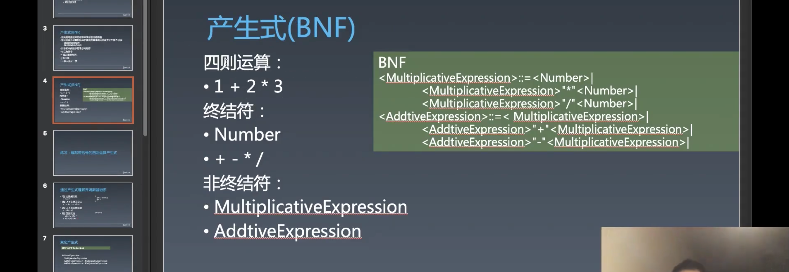
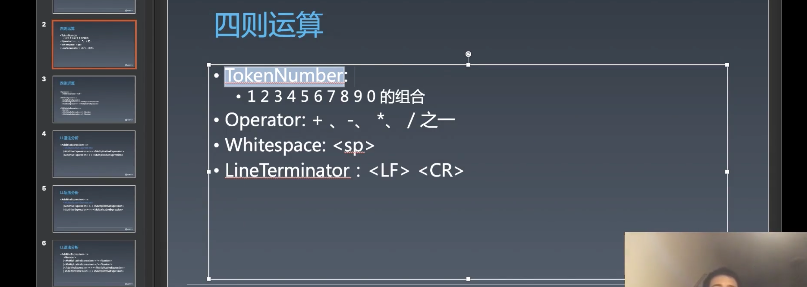
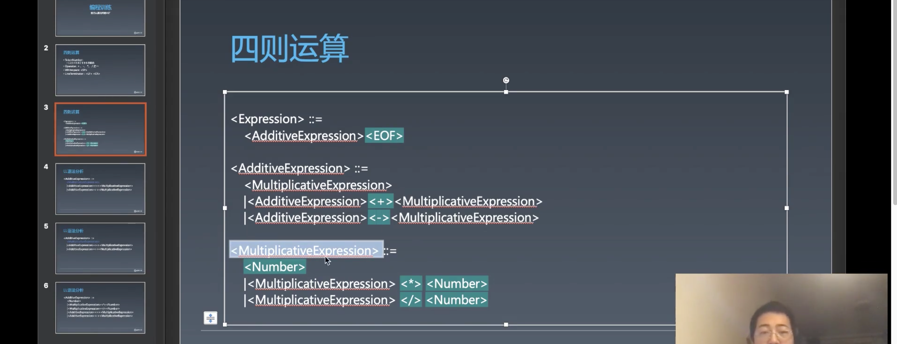
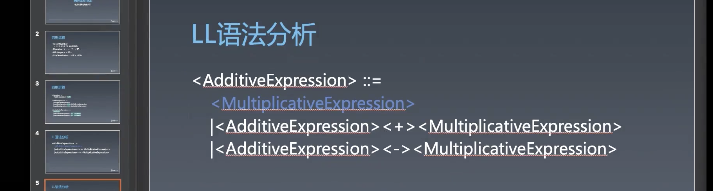
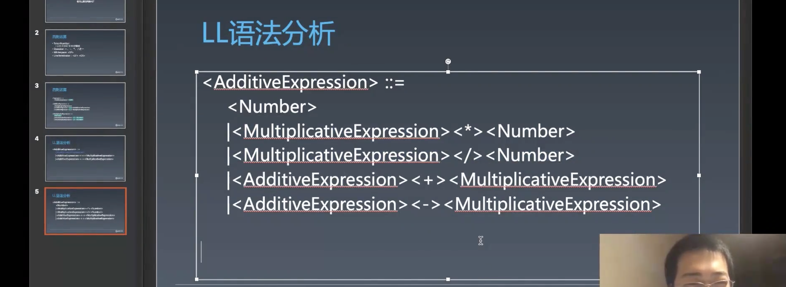

# 1.编程与算法训练 | 解析一个四则运算的表达式

[toc]

## 编程训练｜使用 LL 算法构建 AST

之前我们可以使用状态机来做词法分析，但是语法分析还做不了。我们可以将文本拆成一个个的词，要将词组成**更复杂的语法结构**时，使用状态机来实现这个就会感觉到捉襟见肘了，正则表达式也是这样，只能做词法分析。

> 正则不推荐学的太深，如果实在很复杂推荐使用状态机，想怎么玩怎么玩，想有什么逻辑有什么逻辑。

之前我们以四则运算为例讲了产生式（BNF）：



这节课我们将解析四则运算，将其变为一课抽象语法树（AST）

在进入到 BNF 部分之前，我们先来处理一下词法问题：



四则运算包含什么样的词法元素呢？

- `TokenNumber`
  - 表示十进制正则的 `number` ：
- `Operator`
- `whiltespace` : `<SP>` 
- `LineTerminator` `<LF>`  `<CR>`
  - 也就是 `\n` 和 `\r` 
  - 空格和换行可以存在，但是不产生真正的用途，在四则运算的表达式中是为了文本的美观整洁，方便阅读。不过对于 JS 来说，有些地方的空格是有效空格，比如 `function` 之后的空格。


首先要做的工作，是将一段输入中的词法元素拆分出来，比如：`10 + 2 * 1024`，拆分为 `10` `+` `2` `*` `1024` 

拆分词法我们有两种选择：

- 状态机
- 正则表达式

这里我们选择使用正则，代码量会少一些。


### 第一步：基于正则表达式的词法分析

```js
let regexp = /([0-9\.]+)|([ ]+)|([\r\n]+)|(\+)|(\-)|(\*)|(\/)/g;

let dictionary = ["Number", "Whitespace", "LineTerminator", "+", "-", "*", "/"];

function tokenize(source){
  let result = null;
  let lastIndex = 0;

  while(true) {
    lastIndex = regexp.lastIndex;
    result = regexp.exec(source);
    debugger
    if(!result) break;

    for(let i = 1; i <= dictionary.length; i++){
      if(result[i]){
        console.log('dictionary[i - 1]', dictionary[i - 1]);
      }
    }

    console.log('result[0]', result[0])
  }
}

tokenize("1024 + 10 * 25")
```

- `Number` 词法的部分不是很严谨，不过可以用。
- 正则中的小括号 `()` 可以理解为子表达式。
- 这样就可以很简单的实现词法分析分析。


接下来我们要对 `tokenize` 做一些处理。在之前玩具浏览器时处理 HTML 是使用了回调的方法 `emitToken(){}` 来一个一个将 `token` 吐出来，其实在 JS 中有一个更好的设施—— `yield` 


### 第二步：生成 token

```html
<script>
  let regexp = /([0-9\.]+)|([ ]+)|([\r\n]+)|(\+)|(\-)|(\*)|(\/)/g;

  let dictionary = ['Number', 'Whitespace', 'LineTerminator', '+', '-', '*', '/'];

  function* tokenize(source) {
    let result = null;
    let lastIndex = 0;

    while(true){
      lastIndex = regexp.lastIndex;
      result = regexp.exec(source);

      if (!result) break;

      if (regexp.lastIndex - lastIndex > result[0].length) {
        let unexpectedToken = source.slice(lastIndex, regexp.lastIndex - result[0].length);
        throw new Error(`Unexpected token ${unexpectedToken}!`);
      }

      let token = {
        type: null,
        value: null,
      };

      for (let i = 1; i <= dictionary.length; i++) {
        if (result[i]) {
          token.type = dictionary[i - 1];
        }
      }

      token.value = result[0];

      yield token;
    }
    
    yield {type: "EOF"}; // End Of File
  }

  for (let token of tokenize('1024 + 10 * 25')) {
    console.log('token =>', token);
  }
</script>

```

- 其实就是创建一个对象 `token` ，用两个属性 `type` 和 `value` 来存储其类型和值，最后打印出来。
- 这里使用了 `generator` 函数，说实话，此刻我还是不太明白为什么要用 `generator` ，因为如果只是打印，完全也可以在 `while` 语句块的内部执行打印操作。
- 第 16 ～ 19 添加了对于如果文本中出现了意外的 token 时的报错。原理如下：
  - 如果在匹配的文本中出现了意外的 `token` ，也就是没有在我们正则规则 `regexp` 中能够匹配到的 `token` 时，会发生一种情况，其本次的 `regexp.lastIndex` 减去上一次的 `lastIndex` 时会大于匹配出的文本的长度，所以利用这一点来抛出错误。因为做词法分析的情况时每一种词都应该被匹配出来，所以每一种词的长度应该和匹配出来的词长度是相等的，不相等代表着有多余的字符。
- 最后，当循环结束时，我们抛出带 `type: "EOF"` 的 `token` 表示解析结束。


### 回忆四则运算



- 绿色部分都是终结符，经过一个匹配之后所有的终结符我们都有了。  
- 非终结符都是由终结符组成，比如 `<MultiplicativeExpression>`
- `<MultiplicativeExpression>` 有三种不同的表达方式：
  - `<Numbe>` ，单独的 `Number` 也可以成为一个 `<MultiplicativeExpression>`
  - `<MultiplicativeExpression>` `<*>` `<Number>` ，然后是自己跟 * 跟 Number
    - 这里是递归的定义，意思是我们可以连乘或者连除，都会形成乘法的表达式
  - `<MultiplicativeExpression>` `</>` `<Number>`
- 这里的表达式是从下到上依次构建的，只有先将 `token` 处理产生为 `MultiplicativeExpression` 才能进一步的处理为 `AdditiveExpression` 然后再是 `Expression` 
- 注意：这个四则运算的产生式规则是由我们自己定义的，那么就需要按照这个定义来实现为 JS 函数形式。

 

### 第三步：实现 MultiplicativeExpression

我们在代码中，`source` 吐出来的 `token` 如果是一个 `<Number>` 我们应该怎么做？

- 既然是产生式，则产生一个 `<MultiplicativeExpression>` 表达式

`<MultiplicativeExpression>` 所要处理的 `source[0]` 有几种可能？

- 根据 PPT 的描述有两种可能—— `<Number>` 和 `<MultiplicativeExpression>` 

```js
function MultiplicativeExpression(source) {
  // 如果是一开始的 token 是 Number 则产生一个 MultiplicativeExpression 
  if (source[0].type === 'Number') {
    let node = {
      type: 'MultiplicativeExpression',
      children: [source.shift()],
    };
    source.unshift(node);
    return MultiplicativeExpression(source);
  }
  // 如果 source[0] 是 MultiplicativeExpression 并且 source[1] 的 token 类型是 * 则将消耗三个 token 产生一个 MultiplicativeExpression，因为 * 的后面必然是一个 Number
  if (source[0].type === 'MultiplicativeExpression' && source.length > 1 && source[1].type === '*') {
    let node = {
      type: 'MultiplicativeExpression',
      children: [source.shift(), source.shift(), source.shift()],
    };
    source.unshift(node);
    return MultiplicativeExpression(source);
  }
  // 如上同理，只是 token 换成为了 `/`
  if (source[0].type === 'MultiplicativeExpression' && source.length > 1 && source[1].type === '/') {
    let node = {
      type: 'MultiplicativeExpression',
      children: [source.shift(), source.shift(), source.shift()],
    };
    source.unshift(node);
    return MultiplicativeExpression(source);
  }  
  if (source[0].type === 'MultiplicativeExpression') return source[0];
}

for (let token of tokenize('1024 * 2')) {
  if (token.type !== 'Whitespace' && token.type !== 'LineTerminator') {
    source.push(token);
  }
}

let re = MultiplicativeExpression(source);
console.log('re', re)
```

- 产生一个 `<MultiplicativeExpression>` 表达式需要将之前我们所解析出的 token 数组 source 传给 `MultiplicativeExpression` 函数，然后根据产生式的规则，`<MultiplicativeExpression>` 有三种可能：
  - 单独的 `<Number>` 
  - `<MultiplicativeExpression>` `<*>` `<Number>`
  - `<MultiplicativeExpression>` `<\>` `<Number>`
- 所以我们需要使用递归来解析 `source` 直到不满足三种情况再将产生的表达式 `source[0]` 返回出去
  - 这里的递归除了要解决 `<Number>` 解析为 `<MultiplicativeExpression>` 之后遇到 `<*>` `<Number>` 再做解析之外，还需要解决再一次遇到 `<*>` `<Number>` 或 `</>` `<Number>` 的情况的再处理，也就是为了解决连乘以及连除的都要将其解析为 `<MultiplicativeExpression>` 
- 这里我们可以学习这样写递归的方式，在调用函数自身的前面使用 `return` ，这样就可以实现当满足了跳出条件时，直接将这个条件所返回的值返回出去。
- 这里递归的跳出条件是不满足于上面三种产生式的规则，比如当遇到 token 的 type 是 `+` 


### 第四步：实现 AdditiveExpression

接下来我们看看 `<AdditiveExpression>` 产生式规则



- `<AdditiveExpression>` 的开头有几种情况？
  - 两种——`<MultiplicativeExpression>` 和 `<AdditiveExpression>` 

不对，是三种，因为 `<MultiplicativeExpression>` 不是终结符，需要展开：



代码：

```js
function AdditiveExpression(source) {
    if (source[0].type === 'Number') {
      //这里会将 source 中的 MultiplicativeExpression 处理掉，包括了带有 * 和 / 的情况
      MultiplicativeExpression(source);
      return AdditiveExpression(source);
    }

    if (source[0].type === 'MultiplicativeExpression') {
      let node = {
        type: 'AdditiveExpression',
        children: [source.shift()],
      };
      source.unshift(node);
      return AdditiveExpression(source);
    }

    if (source[0].type === 'AdditiveExpression' && source.length > 1 && source[1].type === '+') {
      let node = {
        type: 'AdditiveExpression',
        children: [source.shift(), source.shift()],
      };
      // 非终结符还需要调用一次乘法的产生式，产生 MultiplicativeExpression
      MultiplicativeExpression(source);
      node.children.push(source.shift());
      source.unshift(node);
      return AdditiveExpression(source);
    }

    if (source[0].type === 'AdditiveExpression' && source.length > 1 && source[1].type === '-') {
      let node = {
        type: 'AdditiveExpression',
        children: [source.shift(), source.shift()],
      };
      // 非终结符还需要调用一次乘法的产生式，产生 MultiplicativeExpression
      MultiplicativeExpression(source);
      node.children.push(source.shift());
      source.unshift(node);
      return AdditiveExpression(source);
    }

    if (source[0].type === 'AdditiveExpression') return source[0];

    throw new Error();
  }
```

- 其实总体上和 `MultiplicativeExpression` 函数产生式差不多，就是将 token 根据产生式规则生产一个节点，节点类型就是产生式名称，节点的子节点就是产生式规则中的每一部分。
- 除了最后一个用于返回的 `if` 之外，每一个 `if` 都是一种类型的 `AdditiveExpression` ，可以和上面的图示一一对应。
- 在处理 `MultiplicativeExpression` 时，需要将 `source` 传入 `MultiplicativeExpression` 函数产生式之后再添加到 `node` 节点的子节点中（22 ~ 25）


### 第五步：实现 Expression

为什么最后要套一个 `Expression` ？

- 因为 `AdditiveExpression` 不一定最后能加到尾巴，我们在最后添加了一个 `EOF` 的 token 可以使用 `AdditiveExpression` 函数产生式可以停止，而 `EOF` token 只有 `Expression` 能够处理。

```js
// LL 写法，识别每种结构的函数，每种产生式对应一个函数
// LL 的处理方式可以是由小到大，这里最小的产生式函数是 MultiplicativeExpression
function Expression(tokens) {
  if(source[0].type === "AdditiveExpression" && source[1].type === "EOF"){
    let node = {
      type: 'Expression',
      children: [source.shift(), source.shift()]
    }
    source.unshift(node);
    return node;
  }
  AdditiveExpression(source);
  return Expression(source);
}

for (let token of tokenize('5 + 1024 * 2')) {
  if (token.type !== 'Whitespace' && token.type !== 'LineTerminator') {
    source.push(token);
  }
}

let re = Expression(source);
console.log('re', re);
```

- 我们最终是调用 `Expression` 函数产生式来产生 AST


### 补充

- 正则需要掌握 `[]` `()` `|` 和一些简易的写法 `\s` `\S` `[\s\S]` 
- `generator` `iterator` 组合之后会成为非常重要的语法，很多库的 API 都会是 `iterator` 风格。`iterator` 属于数组的超集，你可以将一个数组变成 `iterator` 吐出来，这个性能不会变坏，但是如果将 `iterator` 变为数组则会导致性能变差。`iterator` 还可以异步。它在语言层面已经准备好了，要影响到你们的工作，估计还需要半年左右。它会成为 API 设计的一种潮流。

## 课程相关涉及

### 课后作业：

- 选做：把正则风格的 tokenize 换成状态机
- 看完课程完成课上所有练习
- 选做：实现带括号的四则运算

### 代码截图：

- 链接: [https://pan.baidu.com/s/1ET3y5eexynf6xJKpNwHMRw ](https://pan.baidu.com/s/1ET3y5eexynf6xJKpNwHMRw)密码:nepb

### 答疑回放：

- 链接：[ https://pan.baidu.com/s/15kTTlXEcSSi4y-qsi_Bdpg](https://pan.baidu.com/s/15kTTlXEcSSi4y-qsi_Bdpg)
  提取码：bm2o