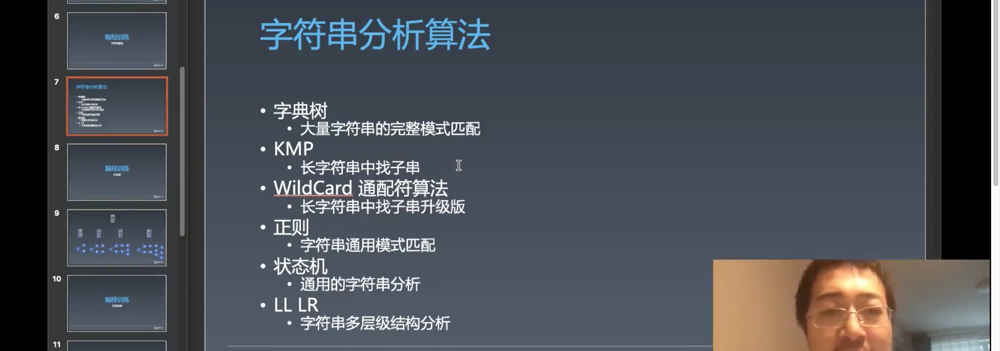
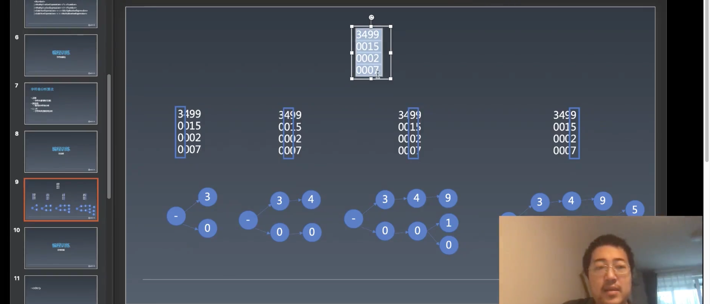
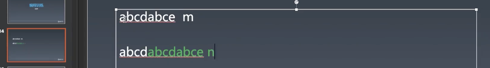
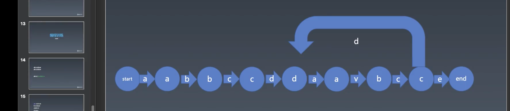

# 2.编程与算法训练 | 点击区域与括号匹配，wildcard

[toc]

## 字符串算法

这节课要将字符串相关的内容都讲完。



**字符串算法其实就一个特点——匹配字符串相不相同；在一个长字符串中找一个子字符串。**

- 字典树
  - 大量字符串的完整模式匹配。
  - 比如海量的十几万个字符的字符串，我们想要找出其中最大的前五十个，这种问题适合用字典树处理。
  - 字典树又是 hash 树的一种。
- KMP
  - 长字符串找子串
  - KMP 是字符串的基本算法
  - KMP 的时间复杂度可以做到 O(m + n)，也就是过一遍一定能将子串找到，写的不好就是 O(m * n)
- WildCard 通配符算法
  - KMP 的升级版，在 KMP 的基础上增加了两种通配符
  - 长字符串中找子串升级版
  - 也可以做到 O(m + n)——模式串和原串之和成正比
- 正则
  - 字符串通用模式匹配
  - 正则做不到 O(m + n)，正则的时间复杂度不好说，需要根据正则支持的 Feature 的多少
  - JS 正则的时间复杂度没法看，比如 Leetcode 上有一道 WildCard 通配符的题，你换成正则能匹配一定会超时。
  - 功能强大
- 状态机
  - 通用的字符串分析
  - 更通用灵活，但是手写代码的比例更高
- LL LR
  - 字符串多层级结构分析
  - LR 我们没有讲，难度太高
  - LL 算法其实就是去找标志性的非终结符，然后调用其子产生式函数去处理。

这节课我们主要讲 字典树、KMP、WildCard 三种处理字符串相对简单的算法。 


### 字典树（trie）

> 信达雅的翻译

什么是字典树？

> 我的理解，将一个巨大的字符串以某个需要查找字符串的长度分组，比如下面图中的 4，然后再以每个不同的字符作为一个节点形成一颗树的深度为分组长度的多叉树。

比如在英文字典中，有一个目录，目录是以 A-Z 的字母顺序进行排列。我们的字典树也是取了这个顺序，trie 的特定是每一个节点都有 A-Z 的二十六个分支（假设），这二十六个分支可能是空的也可能有。因为每一个节点都有二十六个分支，所以每一层就代表字符串的一位。例子：



假设我们要处理这段数字（这里是数字不是英文，不过都是一样的，只要字符的范围是有限的），然后按照每一个字符出现的顺序和可能性进行分叉，最终我们使用了以一个多叉树将这段字符串又存了一遍。

代码：

```js
// 字典树
class Trie {
  constructor() {
    // 这里使用 Map 是最好的，因为存数组的空间比较大，而 Map 会存的比较紧凑一些，取决于 Map 的实现。
    // 而这里使用了 Object 是因为 winter 准备的代码是 Object，不过和 Map 也差不多，也是可以用 string 来作为 key
    this.root = Object.create(null);
  }

  insert(word) {
    let node = this.root;
    // 将单词的每个字母作为树的分支属性保存
    for (let c of word) {
      // 没有这个分支就创建这个分支
      if (!node[c]) {
        node[c] = Object.create(null);
      }
      // 让当前分支 node 的位置移动到当前字母的分支
      node = node[c];
    }
    // 接着我们需要处理结束，比如 'ca' 或者 'cad' 在字符串的最后实际隐含有一个像是正则中的 `$` 符号的意思，也就是结束
    // 这里我们手动的给单词的最后节点添加一个 '$'，并且用 '$' 属性来表示此 word 出现的次数，因为会有重复的情况
    if (!('$' in node)) {
      node['$'] = 0;
    }
    node['$']++;
  }

  // 获取数量最多的字符串
  most() {
    let max = 0;
    let maxWord = null;
    // 用于递归的访问每个节点
    let visit = (node, word) => {
      if(node.$ && node.$ > max) {
        max = node.$;
        maxWord = word;
      }
      // 如果树的数组结构是由 Map 来实现则可以使用 for of
      for(let p in node){
        visit(node[p], word + p);
      }
    }
    visit(this.root, "");
    console.log('maxWord', maxWord);
  }

}

function randomWord(length) {
  let str = '';
  for (let i = 0; i < length; i++) {
    str += String.fromCharCode(Math.random() * 26 + 'a'.charCodeAt(0));
  }
  return str;
}

let trie = new Trie();
// 插入长度为 4 的 word 10000 次形成一棵比较大的 trie 树
for (let i = 0; i < 10000; i++) {
  trie.insert(randomWord(4));
}
```

- 除了实现了**将字符串以字典树的方式储存**，也实现了寻找树中出现最多次数的字符串。

- 为什么在 `insert` 去记录 `max` 和 `min` 没有用，因为需求有可能是获取前五十大的字符串，那么你没有办法在这个过程中去获取完整的 root 的结构从而知道结果。 

- `trie` 树归根结底还是需要去访问它的每个节点。

- `trie` 是空间换时间的数据结构，比如获取 10W 个数字中最大的那个数，也就是排序，它能够超过经典排序的 O(n log(n))，大概是 O(n) 的时间复杂度。之所以有这样的结果是因为它是可 hash 的。（hash 是一种散列，有大小的东西）

  >hash，离散数学概念。有一种数据类型互相之间是否可以比较，这个特性在离散数学中叫偏序性，偏序性代表着可比较，可 hash 不只是可以比较，并且可以比较出具体差的多少，这样就根据这种可 hash 的特性从而获得更好的算法。


#### 补充

- 四种经典排序——快排、归并、堆、谢尔——建立的假设都是在数据是有偏序性的，也就是可排，如果是可 hash 的，那么就可以使用字典树这样的数据结构去排。
- 现实生活中的数据几乎找不到不可 hash 的东西，除非对应了外部资源，比如文件，从内存存储的东西上看是不可 hash 不可比较的。
- 偏序性也可以简单的认为是给你一个数据结构的 class，你可不可以写一个 compare 方法来对数据进行比较。
- 我们的字符串就是可 hash 的，所以可以用字典树来处理。
- 字符串匹配算法——字典数、KMP、wildcard——的时间复杂度全都是 O(n)。
- 数字签名所用的 hash 算法是 sha 或者是 md5，是密码学上的特殊设计，人类无法逆向解读。 
- sha 或者 md5 都属于信息摘要的 hash 算法，这种 hash 算法的特点就是如果输入的字符串更改一个字符，其输出的结果跟之前的结果几乎完全不同。
- hash 的概念都是相同的——hash 表、hash 树、hash 算法
- 理论上可以也可以使用 md5 做 hash 算法，但是不会有人这样做，因为 md5 是避免碰撞，但是 hash 表还是希望有一定的聚拢的作用，也就是不同的 hash 算法的目标是不同的。
- `trie` 是首字母哈希，特点就是字符串越相似 hash 出来的结果越接近。
- `trie` 是可以用于排序的。
- 之前的寻路算法也可以使用字典树来做，其结果会更快。
- `binary heap` 取出的操作是 `O(log n)` 
- `trie` 树 `take` 的算法是 `O(1)` ，但并非真正的 O(1)，只是当你选对了 hash 的算法就接近于 `O(1)` ，因为实际上 `trie` 树是 `O(log n)` 但是根据不同的算法，其底数是可以改变的，如果底数越大则其结果越接近于 `O(1)` 
- 在 leetcode 中字符串的题非常多，当你听完——状态机、KMP、wildcard、字典树，字符串的题就无敌了，随便刷，除了个别的贪心算法做不出来以外。
- 寻路算法实际上已经将搜索算法讲完了，只不过只讲了一个例子。
- 全排列、全组合就是搜索算法，leetcode 有原题。

### 括号匹配

假设有三种括号，圆括号、方括号、花括号，然后检查它是否能够匹配成功。比如：`x[a(b)c]y` 就是一个合理的能够被匹配出来的结构，或者 `x[{a(b)}c]` 这样也是能够匹配的。不能匹配出来的结构：`(a[b)c])` 这种不同种类的括号之间有交叉的情况就不能匹配。

括号匹配和我们之前用于用 stack 匹配 html 语法时有关。

括号匹配实际上也是一种语法上的匹配，单纯的通过正则或者是状态机去处理是处理不了的。

我们用 stack 来做括号匹配的过程其实就是 LR 的过程，算法叫做 LR(0)。LR(0) 是一个没用多大用的算法，它只能处理最简单的语法过程。

> 

#### 补充

- LL 和 LR 没有全名，LL 是从左到右移物（遍历），从左到右合并，LR 是从左到右移物（遍历），从右到左合并。

  > 语法分析一般有两种算法，它们分别对应的就是 LL 和 LR。

  > [LL 分析器](https://zh.wikipedia.org/wiki/LL剖析器)是一种处理某些上下文无关文法的自顶向下分析器。因为它从左（Left）到右处理输入，再对句型执行最左推导出语法树（Left derivation，相对于 LR 分析器）。能以此方法分析的文法称为 LL 文法。

  > [LR 分析器](https://zh.wikipedia.org/wiki/LR剖析器)是一种自底向上（bottom-up）的上下文无关语法分析器。LR 意指由左（Left）至右处理输入字符串，并以最右边优先派生（Right derivation）的推导顺序（相对于 LL 分析器）建构语法树。能以此方式分析的语法称为 LR 语法。而在 LR(k) 这样的名称中，k 代表的是分析时所需前瞻符号（lookahead symbol）的数量，也就是除了目前处理到的输入符号之外，还得再向右引用几个符号之意；省略 （k）时即视为 LR(1)，而非 LR(0)。


### KMP

> 可以参考阮一峰老师的这篇文章——[字符串匹配的KMP算法](http://www.ruanyifeng.com/blog/2013/05/Knuth%E2%80%93Morris%E2%80%93Pratt_algorithm.html)
>
> 以下摘录来源：https://www.zhihu.com/question/21923021
>
> - KMP算法的核心，是一个被称为部分匹配表(Partial Match Table)的数组。
> - **PMT中的值是字符串的前缀集合与后缀集合的交集中最长元素的长度**。

KMP 是这样的，假设我们有一个模式串（匹配串）`abcdabce` ，有一个目标串 `abcdabcdabce` ：



- 目标串中有两个 `abcd` 
- 假设模式串的长度为 m，目标串的长度为 n，那么如果按照普通的匹配方式，我们会挨个去做检查，时间复杂度则为 `O(m * n)` ，而 KMP 是可以实现 `O(m + n)` 的算法。
- 以这个例子来看，当我们进行匹配的时候，会发现目标串在 `abcdabcd` 的最后一个 `d` 时和匹配串的 `e` 是不匹配的，所以就会想要重新从原串的第二个 `b ` 开始匹配，但是这个 `d` 的前面比较特殊，是 `abc` 那么这个和匹配串的前四个字符是相同的，所以当这个 d 出现的时候相当于已经走过了 `abc` 的距离，利用这个原理，去进行复用，我们只需要分析模式串。

我们来实现一个逐个匹配算法复杂度为 `O(m * n)` 的算法：

```js
function find(source, pattern) {
  for (let i = 0; i < source.length; i++) {
    let matched = true;
    for (let j = 0; j < pattern.length; j++) {
      if (source[i + j] !== pattern[j]) {
        matched = false;
        break;
      }
    }
    if(matched)
      return true;
  }
  return false;
}
```

- 也就是从目标串的第一个位置开始一个一个的和模式串进行匹配，如果不匹配则换到下一个位置，直到匹配到最后一个字符。
- 这里 winter 依然是使用反逻辑，也就是一开始认为是能够匹配的，然后去找不能匹配的情况。

优化一下，我们实现一个 `O(n)` 的算法：

```js
function find(source, pattern) {
  let j = 0;
  for (let i = 0; i < source.length; i++) {
    if(source[i] === pattern[j]){
      j++
    } else {
      j = 0;
    }

    if(j === pattern.length){
      return true;
    }
  }
  return false;
}
```

- 这其实是一个错误的算法，虽然能够匹配出像是 `find('abcxyd','xy')` 这样的目标串和模式串，但是对于 `find('abcabcae','abcae')` 则会返回 `false` ，原因是一旦目标串在被匹配过的字符中含有模式串头部字符的一部分则会在下次匹配中略过这一部分（`'ab'`）从而造成匹配的失败，之所以略过是因为在迭代的过程中被消费掉了。

winter 的 KMP 算法：

```js

function find(source, pattern) {
  // table 是用于存储 pattern 回溯到的 index 的值的
  let table = new Array(pattern.length).fill(0);

  // k 是指模式串所回到的索引位置
  let k = 0;

  for(let j = 1; j < pattern.length; j++){
    if(pattern[j] === pattern[k]){
      k++;
    } else{
      k = 0;
    }
    table[j] = k;
  }

  let j = 0;
  for (let i = 0; i < source.length; i++) {
    if(source[i] === pattern[j]){
      j++
    } else {
      while(source[i] !== pattern[j] && j > 0){
        j = table[j -1];
      }
      if(source[i] === pattern[j]){
        j++;
      } else{
        j = 0;
      }
    }

    if(j === pattern.length){
      return true;
    }
  }
  return false;
}
```

- 他所使用的方法是让 pattern 的当前字符串 index 跳到已经匹配过的字符的后面
- 但这个实现是有缺陷的，因为在 for 循环中套了 while，造成时间复杂度变成了 O(m * n)
- 但是 winter 认为 while 是可以移到外面的，但是 winter 老师有点被绕懵了，所以直播的时候就没有实现
- 不过按照之前我所看阮一峰老师的文章介绍，应该是根据 `table` 来快速的移动 source 的位置

状态机 + next 表也可以实现和 KMP 等效的结果：




### Wildcard

wildCard 也就是通配符，它可以用 `*` 表示若干个任意字符，用 `?` 来表示单个字符。

使用 Wildcard 的难点是，一开始你要在 `pattern` 中使用 `*` 和 `?` 来表示 Wildcard 怎么做？

- 我们可以先将这个问题拆解为只有 `*` 和只有 `?` 时的处理。
- 通配符看似要回溯，但实际上不需要，也是可以只在 `O(m + n)` 的复杂度内匹配出来。
- 有一个问题，`*` 是否贪婪，也就是尽量 `*` 尽量匹配多还是尽量匹配少。
  - 比如目标串 `abbbbbbbbb` 匹配串 `a*b` ，那么 `*` 是匹配多个 `b` 还是匹配一个 `b` ？
  - 又比如目标串 `abcbxcbbbbbbbbb` 匹配串 `a*c*x*b` ，那么这几个 `*` 是匹配多还是匹配少？
  - 当有多个 `*` 时的时候，是最后一个 `*` 匹配多，前面的 `*` 尽量匹配少，因为最后一个星可以将剩余的部分都匹配掉。


## 课程涉及内容

### 课后作业：

- 选做：带? 的 kmp
- 看完课程，完成 Trie 字典树、KMP、WildCard 算法

### 参考名词：

- LR：[ LR 分析器](https://zh.wikipedia.org/wiki/LR剖析器)是一种自底向上（bottom-up）的上下文无关语法分析器。LR 意指由左（Left）至右处理输入字符串，并以最右边优先派生（Right derivation）的推导顺序（相对于 LL 分析器）建构语法树。能以此方式分析的语法称为 LR 语法。而在 LR(k) 这样的名称中，k 代表的是分析时所需前瞻符号（lookahead symbol）的数量，也就是除了目前处理到的输入符号之外，还得再向右引用几个符号之意；省略 （k）时即视为 LR(1)，而非 LR(0)。
- LL：[ LL 分析器](https://zh.wikipedia.org/wiki/LL剖析器)是一种处理某些上下文无关文法的自顶向下分析器。因为它从左（Left）到右处理输入，再对句型执行最左推导出语法树（Left derivation，相对于 LR 分析器）。能以此方法分析的文法称为 LL 文法。