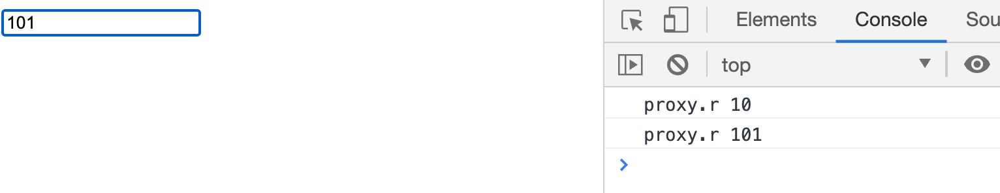
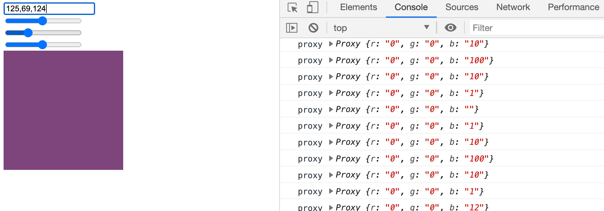

# 1.编程与算法训练 | Proxy 与双向绑定

[toc]

## Proxy 与双向绑定

这节课讲 Proxy，Proxy 是 JS 中非常强大的**语言特性**之一。

这节课会以 vue 的 reactivity 的设计的一些思路为核心，我们会讲一个 toy 版本的 reactivity ，toy 版本的东西适合教学（单一知识点），否则完整版的内容会涉及到工程相关的内容。

很多同学都没有使用过 Proxy，这是很正常的，毕竟 Proxy 的设计并非用于平时开发的业务代码。Proxy 这种语言特性是专为库和框架设计者所使用的。

业务代码中使用 Proxy 容易造成代码逻辑的不可控，比如设置属性不是设置属性，获取原型不是获取原型。**Proxy 几乎可以将对象的所有行为都改变**。

由于 Proxy 功能强大，所以其能够用于解决的问题或者创造一些用法的想象空间也足够大。

### Proxy API

MDN 示例：

```js
const target = {
  message1: "hello",
  message2: "everyone"
};

const handler1 = {};

const proxy1 = new Proxy(target, handler1);
```

- `Proxy` 构造函数结构两个参数
  - 第一个参数是要被代理的对象。
  - 第二个参数应该是一个 config 型的参数，是一个对象，该对象定义将拦截哪些操作以及如何重新定义拦截的操作。
    - 可以将这些拦截操作的方法理解为 hook
- 代理之后返回的 `proxy1` 是一个独立的对象，只是可以改变被代理对象的值，然后在此过程中可以添加很多自定义的行为。

## Vue - reactive

`reactive` 有点类似于 `observable` 的概念，只不过在 vue 中叫为 `reactive` 。

本节课我们只实现 `reactive` 的一部分功能——`effect`，看一个测试用例：

```js
it('should observe basic properties', () => {
  let dummy
  const counter = reactive({num: 0})
  effect(() => (dummy = counter.num))
  
  expect(dummy).toBe(0)
  counter.num = 7
  expect(dummy).toBe(7)
})
```

- 这里用 `reactive` 生成了一个对象 `counter` ，然后在 `effect` 中将 `counter.num` 赋值给 `dummy` ，这个时候 `dummy` 的值是 `0` ，当 `counter.num` 被赋值为 `7` 发生变化的时候，`dummy` 也会跟着变为 `7`
- 这个和观察者模式很像，但是比观察者模式更先进一些。观察者模式是针对于基于 class 的面向对象设计的基础设施。

- 我们要实现的功能也是如上这样。

### 创建 reactive 和 effect

`Proxy` 和 `Promise` 比较类似，创建 `Proxy` 的构造函数一般都是 `new Proxy` 然后返回给一个对象这样的结构，而会直接 `new Proxy` 再在之后调用一些方法这样去用，所以我们将其套进一个函数中。

```js
function reactive(obj){
  return new Proxy(obj, {
    get(obj, prop){
      return obj[prop];
    },
    set(obj, prop, val){
      return obj[prop] = val;
    }
  })
}
```

使用 `reactive` 返回一个代理对象：

```js
let object = {
  a: 1,
  b: 2,
};

function reactive(obj) {
  return new Proxy(obj, {
    get(obj, prop) {
      return obj[prop];
    },
    set(obj, prop, val) {
      return (obj[prop] = val);
    },
  });
}

// 将 object 包装为 proxy 对象
let proxyObj = reactive(obj);
```

创建 `effect` ，并使用 `effect` 来实现当发生赋值行为时执行 `effect` 中的行为：

```js
let handles = [];

let object = {
  a: 1,
  b: 2,
};

function reactive(obj) {
  return new Proxy(obj, {
    get(obj, prop) {
      return obj[prop];
    },
    set(obj, prop, val) {
      obj[prop] = val;
      for (let handle of handles) {
        handle();
      }
      return obj[prop]
    },
  });
}

function effect(handle) {
  handle();
  handles.push(handle);
}

let dummy;

// 将 object 包装为 proxy 对象
let proxyObj = reactive(obj);

effect(() => (dummy = proxy.a));
console.log('dummy', dummy); // => 1
proxy.a = 2;
console.log('dummy', dummy); // => 2
```

- `effect` 接收函数，会先在内部执行之后，push 到 `handles` 中，而 `handles` 中的每个函数会在被代理的 `set` hook 中被遍历执行，这样每当发生像 35 行中的赋值行为时就会执行。

- 不过以上会存在一个问题，`handles` 中可能会存在无关于 `proxy.a` 赋值行为之外的副作用，当 `handles` 中存放的方法过多时会造成性能问题，比如说有几百个 handle 的时候。
- 这里的关键问题是：依赖收集应该如何去做？

### 收集依赖

```js
// 使用 map 来存储不同对象的 effect，好处是可以用 obj 作为 key
const handlers = new Map();

let usedReactivities = [];

const object = {
  a: 1,
  b: 2,
};

function reactive(obj) {
  return new Proxy(obj, {
    get(obj, prop) {
      usedReactivities.push([obj, prop]);
      return obj[prop];
    },
    set(obj, prop, val) {
      obj[prop] = val;
      if(handlers.get(obj)){
        if(handlers.get(obj).get(prop)){
          for(let handler of handlers.get(obj).get(prop)){
            handler();
          }
        }
      }
      return obj[prop];
    },
  });
}

function effect(handle) {
  usedReactivities = [];
  handle();
  for (let usedReactivity of usedReactivities) {
    let [obj, prop] = usedReactivity;
    console.log({obj, prop});
    // 如果没有以 obj 为 key 的 map 则创建一个
    if(!handlers.get(obj)){
      handlers.set(obj, new Map);
    }
    if(!handlers.get(obj).has(prop)){
      // effect 是存储在以对象为 key 的 map 中的以属性为 key 的数组中，这样就可以在 set 时只执行与此属性有关的 effect，节省性能
      handlers.get(obj).set(prop, []);
    }
    handlers.get(obj).get(prop).push(handle);
  }
}

let dummy;

// 将 object 包装为 proxy 对象
let proxy = reactive(object);

effect(() => (dummy = proxy.a));
console.log('prev | dummy:', dummy);
proxy.a = 2;
console.log('later | dummy:', dummy);
```

- 我们首先要来回答一下「依赖收集应该如何去做？」也正好描述这段代码做了什么。
  - 在这里，首先要谈的依赖是什么依赖？我所理解的是，当发生某个对象的某个属性 set 的操作时所依赖的 effect。之所以这样认为，是因为为了节省性能，当某个对象的某个属性进行 set 时我们只去执行相应的 effect 就好，那在此之前就要收集 effect 到某个地方，当确定是这个对象的这个属性在进行 set 操作时便能够直接取出这个 effect 进行调用。
  - 在这段代码中的做法是在 `reactive` 和 `effect` 都能够访问到的作用域中创建一个临时的变量 `usedReactivities` 用于存放在调用传入 `effect` 的 `handle` 时所 `get` 过的对象和其属性，这个过程是在 `proxy` 的 `get` 钩子中完成的。
  - 然后再从 `usedReactivities` 中取出每个 `usedReactivity` 也就是对象和属性，从保存所有 `effects` 的 `handlers` 中去读取用于存储每一个 `effect` 的数组，如果没有则创建一个新的空数组。
    - 注意： `handlers` 及每个对象 key 所指向的数据结构都为 `Map` ，是因为我们需要使用对象来作为 key 存储值，之所以需要使用对象作为 key，是因为 `obj[prop]` 可能会是对象，如果使用 `Object` 来存储，则后来的 `obj[prop]` 会覆盖掉前面的，因为任何对象 key 在 `Object` 中存储都会 `toString` 为 
      `"[object Object]"`
  - 最后只需要在 `set` 钩子中去取这个对象的这个属性所对应的 `effects` 数组遍历执行即可。
- 实现的整个过程看似很函数式，实际却是过程式。

- 注意：`usedReactivities` 只是一个临时的数组，在每一个 `effect` 中都会被清空，然后再执行 `handle()` 去记录所涉及对象和属性，然后再根据对象和属性来收集 `effect` ，**那么就可以认为 `usedReactivities` 只是为了收集在 `handle` 执行过程中所执行 `get` 行为的对象属性。**

### 新的问题

```js
let object = {
  a: {
    x: 2
  }
}

let v;
let p = reactive(object);

effect(() => v = p.a.x);
console.log(v); // 2

p.a.x = 10;

console.log(v); // 2
```

- 如上代码，我们在 `effect` 中是将 `p.a.x` ，也就是 `p` 的对象属性的 `a` 的 `x` 赋给 `v` 的时候，当改变了 `p.a.x` 的值时，`v` 并没有发生变化。
- 原因是，我们虽然代理了对象 `object` 的 `set` 和 `get` ，但是并没有代理对象 `object.a` 的行为 `set` 和 `get` 


### 代理对象中的对象

```js
let reactivities = new Map();

function reactive(obj){
  // 解决重复代理的问题，否则每一次 obj 的 get 都有可能对其 Object 的属性进行代理
  if(reactivities.has(obj)){
    return reactivities.get(obj);
  }

  let proxy = new Proxy(obj, {
    get(obj, prop){
      usedReactivities.push([obj, prop]);
      // 如果属性是对象，则将其传入 reactive 进行代理
      if(typeof obj[prop] === 'object'){
        // 返回被代理之后的对象
        return reactive(obj[prop])
      }
      return obj[prop];
    },
    set(obj, prop, val) {
      obj[prop] = val;
      if (handlerMap.get(obj)) {
        if (handlerMap.get(obj).get(prop)) {
          for (let handler of handlerMap.get(obj).get(prop)) {
            handler();
          }
        }
      }
      return obj[prop];
    }
  })

  reactivities.set(obj, proxy);

  return proxy;

}
```

- 方法是在执行 `reactive` 中代理对象的 `get` 行为时，对对象的 `prop` 进行判断，如果是对象则对其代理。

- 这里也进行了性能上的优化，用 `reactivities` 来存储所有已经被代理过的对象，这样在做代理逻辑之前可以进行读取判断，如果已经存在则直接返回。

- 我想对上面 `get` 内的代码添加一个解释，解释其是如何对对象中的对象进行代理的，先看代码：

  ```js
  let object = {
    a: {
      x: 2
    }
  }
  
  let v;
  let p = reactive(object);
  
  effect(() => v = p.a.x);
  console.log(v); // 2
  
  p.a.x = 10;
  
  console.log(v); // 2
  ```

  - 在传入给 `effect` 的回调中，我们执行了 `v = p.a.x` 的操作，此操作并非看起来那么的简单，实际上整个过程是先执行 `p.a` 从而执行 `get` 中的代理行为，除了执行 `usedReactivities.push([obj, prop])` 将对象、属性存储到 `usedReactivities` 之中，还发现 `p.a` 是对象则将其传入 `reactive(p.a)` 中代理返回一个新的代理对象，假设返回的代理对象为 `proxyA` ，接下来则是读取 `proxyA.x` 的值，这时又会执行 `get` 中的代理行为，最终返回其值。
  - 所以这里最为需要注意的地方是， `p.a.x` 实际上要先执行 `p.a` 在这个过程中实现了对 `p.a` 的代理逻辑，而且返回了被代理的对象。
  - 能发现在 `get` 中做这个代理操作真的厉害，如果是我估计会想很久吧。

### 双向绑定

我们可以使用 `reactive` 和 `effect` 来实现 input 元素和对象属性的双向绑定。

先来一个简单的示例：

```html
<input id='r'>
```

- 添加一个 input

```js
let proxy = reactive({r});

effect(() => {
  document.getElementById('r').value = proxy.r;
});

document.getElementById('r').addEventListener('input', event => {
  proxy.r = event.target.value;
  console.log('proxy.r', proxy.r)
})
```

- 获取一个 `rective` 对象 `proxy` 
- 然后在 `effect` 中将 `proxy.r` 的值赋给 input，在 input 的 `input` 事件中将 input 的值赋给 `proxy.r` 
- 这样之后就形成一种双向绑定的关系，当 `proxy.r` 的值改变的时候 input 元素的 value 也会改变，当 input 的 value 改变的时候 `proxy.r` 也会改变。



rgb 调色盘🎨示例：

```html
<input id="text" type="text" /> <br />

<input id="r" type="range" min="0" max="255" /> <br />
<input id="g" type="range" min="0" max="255" /> <br />
<input id="b" type="range" min="0" max="255" /> <br />

<div id="color" style="width: 200px; height: 200px;"></div>
```

- 添加三个 range input 用于调整 rga 值和一个块用于显示 rga 的颜色

```js
let proxy = reactive({ r: 0, g: 0, b: 0 });

effect(() => {
  let { r, g, b } = proxy;
  document.getElementById('text').value =`${r},${g},${b}`;
});

['r', 'g', 'b'].forEach((id) => {
  let ele = document.getElementById(id);
  
  effect(() => {
    ele.value = proxy[id];
  });
  
  ele.addEventListener('input', (event) => {
    proxy[id] = event.target.value;
  });
});

effect(() => {
  let { r, g, b } = proxy;
  document.getElementById('color').style.backgroundColor = `rgb(${r},${g},${b})`;
});

document.getElementById('text').addEventListener('input', (event) => {
  let colors = event.target.value.split(',');
  proxy.r = colors[0];
  proxy.g = colors[1];
  proxy.b = colors[2];
  console.log('proxy', proxy);
});
```

- 一样传入 `{ r: 0, g: 0, b: 0 }` 获取一个 `reactive` 对象 `proxy`
- 然后先对 `input[type=text]` 进行数据绑定，这里绑定的形式有点特殊是将 rgb 值以逗号分隔传入，为了方便之后用 `,` `split` 取值。
- 然后是对每一个 `input[type=range]` 进行双向绑定，这里我使用 id 数组 `['r', 'g', 'b']` 进行遍历减少重复的复制粘贴工作。每个回调中首先都会先通过 id 获取元素，这里应该会形成一个闭包，这样之后在 `effect` 中的回调和在 `listener` 中的回调在访问 `ele` 时都不用再重新去获取元素。获取元素之后的操作就是简单的双向赋值。
- 接着就是在一个 `effect` 中使用 `proxy` 的属性更改 `div[id=color]` 的背景。
- 最后是监听 `input[type=text]` 改变时将其值拆分赋给 `proxy` 的不同属性。
- 最终就可以实现一个可以用滑块和输入框来实现更改颜色的小应用。





### 补充

- 看库或者框架的源码可以直接去看测试用例来了解其用法，比如 Vue。
- toy-reactivity 是去掉了大量逻辑的简化版。 
- 当你熟悉一段代码之后你就可以自由去优化去改变去尝试。
- Vue2 中没有 `reactivity` 这个东西，虽然在内部实现双向绑定的原理上相同，但是并没有将其拆出来成为一个单独的 API 供使用 Vue 的开发者使用。
- `Proxy` 比 `getter` 和 `setter` 更加完备，几乎支持对象的所有行为收集，而且更加方便，比如当你新添加一个属性的需要进行行为更改的时候，`getter` 和 `setter` 需要重新设置，因为其需要固定的属性名。
- `Proxy` 从理论上讲像是元编程的入口。
- Vue2 到 Vue3 winter 最喜欢的是 monopack，也就是把 vue2 框架中隐藏的能力变成了开发者可以直接使用的切面。比如上面我们所讲到的 `reactive` 就算脱离的 vue 也是非常优质的 library 
- 为什么说 `reactivity` 在 Vue 中是一个非常重要的特性，因为你既可以将其用在 React 中也可以用在 Vue 中。
- `reactivity` 不只像我们上面使用的那样和 `input` 元素相绑定，我们还可以和鼠标和陀螺仪相绑定，这样带有输入能力的设备相互绑定来实现一些功能和效果。
- `reactivity` 也可以代理 `rxjs` 的一些东西。
- winter 觉得像 `reactivity` 这样的基础的有数据操作的能力的能够提高编程体验的东西才有成为库的价值，而像 `underscore` 提供的那些一辈子都用不上几次的破玩意儿不值得被做成一个库。


## 课程涉及内容

### 课后作业：

- 看完课程，完成 reactive 和 effect

### 答疑回放：

- 链接：[ https://pan.baidu.com/s/1IXOqM459WG-nKj7FlByOOg](https://pan.baidu.com/s/1IXOqM459WG-nKj7FlByOOg)
  提取码：paqp