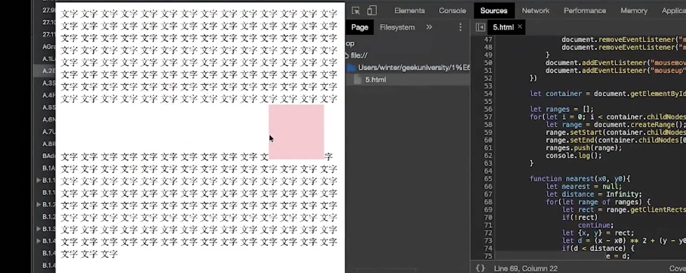
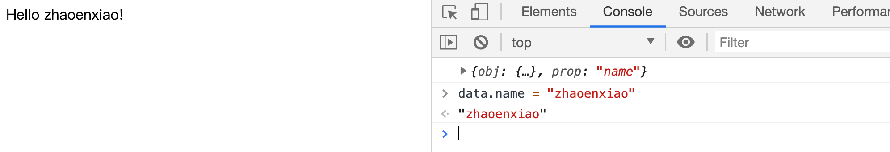

# 2.编程与算法训练 | 使用 Range 实现 DOM 精确操作

[toc]

## 使用 Range 实现 DOM 精确操作

这节课做一个 Range 和 CSSOM 的综合练习——一个特殊的拖拽。

我们一般的拖拽是将元素拖到哪里就到哪里的操作，它并不是会影响它周围的元素，而我们要实现的特殊的地方是可以将元素放到其他元素之中，如下：



像上图中这样方块和文字之间是混合排版的，我们在做一些富文本的时候可能会涉及到这个需求。

### 实现简单拖拽

那么我们应该如何实现拖拽？

在这里我们使用鼠标事件——`mousedown` `mousemove` `mouseup` ：

```html
<div id="dragable" style="width: 100px; height: 100px; background-color: pink;"></div>
<script>
  let dragable = document.getElementById('dragable');
  
  dragable.addEventListener('mousedown', () => {

  })

  dragable.addEventListener('mousemove', () => {
    
  })

  dragable.addEventListener('mouseup', () => {
    
  })
</script>
```

- 不过如果直接将事件绑定在 `dragable` 元素上会出问题，当我们的鼠标没有在 `dragable` 上时则鼠标事件会失效，比如当浏览器的窗口很小，然后拖拽元素到浏览器外面时。所以对于 `mousemove` 和 `mouseup` 我们需要将其在 `doucment` 上监听（`document` 上监听鼠标事件有一个特性，当你的鼠标离开浏览器窗口范围也依然会生效），并且要在 `dragable` 的 `mousedown` 事件中进行监听，因为需要在 `mousedown` 的时候移除事件，否则每一次 `mousedown` 都会添加新的事件，当添加过多的事件后会造成程序的卡顿。

```html
<div id="dragable" style="width: 100px; height: 100px; background-color: pink;"></div>
<script>
  let dragable = document.getElementById('dragable');

  dragable.addEventListener('mousedown', () => {
    let move = (event) => {
      console.log('event',event);
    };
    let up = () => {
      document.removeEventListener('mousemove', move);
      document.removeEventListener('mouseup', up);
    };

    document.addEventListener('mousemove', move);

    document.addEventListener('mouseup', up);
  });
</script>
```

接着我们来让拖拽生效：

```js
dragable.addEventListener('mousedown', (event) => {
    let move = (event) => {
      // event 中有很多表示鼠标位置的值，推荐使用 `clientX` 和 `clientY`，相当于可视区域的坐标，非常准确并且没有歧义，和浏览器窗口里面的可渲染区域一一对应。
      let x = event.clientX;
      let y = event.clientY;
      dragable.style.transform = `translate(${x}px,${y}px)`;
    };
    let up = () => {
      document.removeEventListener('mousemove', move);
      document.removeEventListener('mouseup', up);
    };

    document.addEventListener('mousemove', move);

    document.addEventListener('mouseup', up);
  });
```

- `event` 中有很多表示鼠标位置的值，推荐使用 `clientX` 和 `clientY`，相当于可视区域的坐标，非常准确并且没有歧义，和浏览器窗口里面的可渲染区域一一对应。

- 会有一个问题，当我们在方块的内部点击鼠标进行拖拽的时候，方块会发生瞬间的移动，并将其左上角移到鼠标的下方。这是由于方块的移动距离是鼠标当前位置距离左上角原点的距离，那么一开始鼠标就和左上角有一段距离的话，方块也会移动这个距离，所以我们需要在点击方块触发 `mousedown` 的时候获取鼠标距离原点的距离，然后在方块移动时，用移动时离远点的距离将其减掉来获取移动量：

  ```js
  dragable.addEventListener('mousedown', (event) => {
      let startX = event.clientX;
      let startY = event.clientY;
      let move = (event) => {
        let x = event.clientX - startX;
        let y = event.clientY - startY;
        dragable.style.transform = `translate(${x}px,${y}px)`;
      };
  }
  ```

  - 但是这样依然会有问题，只能拖拽一次，第二次的拖拽就会造成方块又回来初始位置移动。这是因为方块的位置是由 `translate` 决定，而 `translate` 只是 `move` 的移动量，那么无论是第一次还是之后的移动都只是以移动量为准，所以第二次移动也是和第一次移动时的情况相同——从初始位置改变的感觉。

- 那么为了解决这个问题，我们需要一个记录当前方块位置的数据——位置值，并且在每一次移动的时候将这个位置值添加上去，这样就可能保证方块每一次的移动都是以当前位置量 + 移动量来实现的：

  ```js
  let baseX = 0;
  let baseY = 0;
  
  dragable.addEventListener('mousedown', (event) => {
    // 点击鼠标时开始位置
    let startX = event.clientX;
    let startY = event.clientY;
    let move = (event) => {
      // 移动量
      let moveX = event.clientX - startX;
      let moveY = event.clientY - startY;
      let x = baseX + moveX;
      let y = baseY + moveY;
      dragable.style.transform = `translate(${x}px,${y}px)`;
    };
    let up = (event) => {
      // 放开鼠标时的结束位置
      let endX = event.clientX;
      let endY = event.clientY;
      baseX = baseX + endX - startX;
      baseY = baseY + endY - startY;
      document.removeEventListener('mousemove', move);
      document.removeEventListener('mouseup', up);
    };
  
    document.addEventListener('mousemove', move);
  
    document.addEventListener('mouseup', up);
  });
  ```

  - 用 `baseX` 和 `baseY` 来记录当前位置，也就是方块目前距离初始位置的距离
  - 在放开鼠标 `mouseup` 的时候通过 `endX - startX` 来获取移动量（改变量）然后加上 `baseX` 来获取当前位置值。
  - 移动 `mousemove`  的时候通过位置量 `baseX` 和 移动量 `moveX` 的相加来获取方块距离初始位置的距离，从而实现我们想要实现的拖拽。

 

#### 问答

- 为什么改变 `translate` 来实现方块的移动，而使用 `top` `left`
  - 当然 `top` `left` 也可以实现，只是 `top` `left` 会涉及 `Layout` 的步骤从而性能上没有 `translate` 好，而且会改变原来的布局，而且也需要给元素添加 `position: absolute` ，而 `translate` 无论什么元素都可以拖，很方便。

#### 补充

- 什么叫 JS 里函数是一等公民，因为函数可以当普通的数值类型来写，并赋值给一个变量：

  ```js
  let move = () => {};
  ```


### 字符中插入方块

接下来我们添加一些文字节点，然后实现拖拽方块时可以将其拖拽到其中，让周围的文字围绕它重排。

如果我们想要将方块拖到文字中间，我们就需要对这些字符建立一个 range 的矩阵，将每个字符之间的空隙都存起来。

```js
let ranges = [];

let container = document.getElementById('container');
for (i = 0; i < container.childNodes[0].textContent.length; i++) {
  let range = document.createRange();
  // 选择文字之间的缝隙
  range.setStart(container.childNodes[0], i);
  range.setEnd(container.childNodes[0], i);
  ranges.push(range);
}
```

- 创建一个 `ranges` 数组存储遍历 `container` 文字节点中的每个字符，然后将字符与字符之间的空隙添加到这个数组中。
- 这里最为神奇的是真的可以将空隙也获取到，并且添加到 range 中。

接着，我们需要声明一个函数 `nearest` 来获取离某个位置最近的 `range` ：

```js
// 获取能够拖进去的位置，离当前鼠标位置最近的 range
function nearest(x0, y0) {
  let nearestRange = null;
  // 初始距离设置为 Infinity，这样当有距离的时候就会比 distance 小（这也是一个常见技巧，当我们找最小值的时候，就可以将初始值设为正无穷，找最大值的时候就将其设置为负无穷）
  let distance = Infinity;
  for (let range of ranges) {
    // range 也可以获取元素的大小位置信息
    let { x, y } = range.getBoundingClientRect();
    let d = (x0 - x) ** 2 + (y0 - y) ** 2; // 计算直线距离应该是要开平方的，但是开平方并不影响比较大小，所以就没有开

    if (d < distance) {
      nearestRange = range;
      distance = d;
    }
  }
  return nearestRange;
}
```

- 几点需要强调：
  1. 初始距离设置为 Infinity，这样当有距离的时候就会比 distance 小（这也是一个常见技巧，当我们找最小值的时候，就可以将初始值设为正无穷，找最大值的时候就将其设置为负无穷）
  2. range 也可以获取元素的大小位置信息（甚至是这里的空隙）
  3. 计算直线距离应该是要开平方的，但是开平方并不影响比较大小，所以就没有开

最后在 `mousemove` 的事件处理的方法中添加获取最近 `range` 的逻辑，并将方块放入空隙之中：

```js
let move = (event) => {
  let range = nearest(event.clientX, event.clientY);
  range.insertNode(dragable);
  // 移动量
  // let moveX = event.clientX - startX;
  // let moveY = event.clientY - startY;
  // let x = baseX + moveX;
  // let y = baseY + moveY;
  // dragable.style.transform = `translate(${x}px,${y}px)`;
};
```

- 很简单的逻辑，就是先获取离鼠标最近的空隙，然后将方块插入即可。
- 这里是将改变 `translate` 的逻辑注释掉的，否则会使方块的位置偏移。
- 所以目前只是让方块在这些缝隙之中移动而已，而并不是随意的拖动然后遇到有空隙才进入。

有一个问题需要注意，方块需要设置为 `display: inline-block` 否则会自己占一排：

```js
<div id="dragable" style="width: 100px; height: 100px; background-color: pink; display: inline-block;"></div>
```

还有一个问题是，我们通过阻止选择的默认事件来防止拖动的时候选择文本：

```js
 dragable.addEventListener('mousedown', (event) => {
    let handleSelectstart = (event) => event.preventDefault();
    // 去掉鼠标框选文字
    document.addEventListener('selectstart', handleSelectstart);
 //...
   
   let up = (event) => {
      //...
      document.removeEventListener('selectstart', handleSelectstart);
    };
```

- 在 `mousedown` 的时候添加选择事件处理，然后在 `mouseup` 时删除。


## 基于 Range 的 DOM 模版分析

像 vue 中会有一些模版语法，比如：

```html
<span>Message: {{ msg }}</span>
```

- 数据绑定最常见的形式就是使用“Mustache”语法 (双大括号) 的文本插值。
- Mustache 标签将会被替代为对应数据对象上 `msg` property 的值。无论何时，绑定的数据对象上 `msg` property 发生了改变，插值处的内容都会更新。

我们可以使用 `Range` 配合 `reactivity` 来实现一个这样的模版语法分析。

首先，我们创建需要一个 DOM：

```html
<div id="text">Hello {{name}}!</div>
```

- 使用 “Mustache” 语法将 `name` 作为一个动态值包裹其中。

接着，我们需要将 `div[id=text]` 元素中 `{{name}}` 文本放到 `range` 中：

```js
let textEle = document.getElementById('text');

let range = document.createRange();
range.setStart(textEle.childNodes[0], 6);
range.setEnd(textEle.childNodes[0], 14);
```

- 这里地方应该需要优化一下，`{{name}}` 这一段文本是用的静态值 `6` 和 `14` 来选择的，在实际使用中，我们应该动态的获取，比如：

  ```js
  let textEle = document.getElementById('text');
  let textContent = textEle.textContent;
  
  let leftIndex = textContent.indexOf('{{');
  let rightIndex = textContent.indexOf('}}');
  let propName = textContent.slice(leftIndex + 2, rightIndex);
  
  let range = document.createRange();
  range.setStart(textEle.childNodes[0], leftIndex);
  range.setEnd(textEle.childNodes[0], rightIndex + 2);
  ```

  - 这只是一个非常粗糙简易的实现，就是通过 `indexOf()` 去获取其 index 值
  - 这里也通过 index 获取到了 `Mustache` 中的属性名称 `propName` 

接着，就是创建一个 `reative` 值配合 `effect` 来实现动态改变 DOM 内容：

```js
let data = reactive({ name: 'World' });

effect(() => {
  range.extractContents();
  range.insertNode(document.createTextNode(data[propName]));
});
```

最终效果：



- 在控制台中更改 `data.name` 的值也会在 DOM 中响应并更改。


以上通过 `range` 实现了一个 DOM 模版语法的分析更改，不需要去单独设置 innerText。所以，range 这个东西在我们不做富文本编辑器这么复杂的东西的情况下，也是非常有用的。


#### 补充

- 我们可以认为上面获取的 `ranges` 是埋在 DOM 树中的一些空位。

- 上面实现的 `nearest` 没有做分区的判断所以性能很差。

- `move` 中也需要控制频率，防抖或者节流，从而节省性能。

- 对于上节课中实现 `reactivity` 的问题可以参考 vue-next 的逻辑。

- 有些时候功能的不完备性是来源于需求的定义，需求的不同其结果的可接收度也不同。

- 如果不想让方块移动的那么细，可以在获取空隙时隔几个字符获取一个空隙：

  ```js
  let ranges = [];
  
  let container = document.getElementById('container');
  for (i = 0; i < container.childNodes[0].textContent.length; i +=3 ) {
    let range = document.createRange();
    // 选择文字之间的缝隙
    range.setStart(container.childNodes[0], i);
    range.setEnd(container.childNodes[0], i);
    ranges.push(range);
  }
  ```

  - 更改 `i` 每次增值的大小，从 `1` 改变为更大的值，比如 `3` 
  - `reactivity` 不算是 `observer` 的 `pattern`  ，因为 `observer` 特指面向对象部分，不过它们解决的是同一类问题。