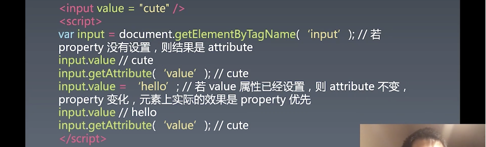

# 3.组件化 | 组件的基本知识，轮播组件

[toc]

## 组件的基础知识

组件化是接下来要讲的三大体系中的一个重点。

前端架构的问题 80% 是要解决组件化的问题，其他就是 UI 架构模式和一些零零碎碎的基础库的需求，这基本构成了前端架构的需求主体。

当然，如果我们要去做更多的，往底层去做，像 flutter 那样基于 webGL 去做就不太一样了。

**我们前端主要做 UI，UI 里面基本上都是靠组建堆积出来的。** 

### 对象和组件

> 其实从某个角度来讲，对象应该是一个抽象的概念，是帮助我们编程的一种理念——面向对象——的一部分。而我们前端开发者平时所说的对象，实际上是指 `{}` 这样一种数据结构，并带有基于 `property` 的继承能力。


对象中会有三种特性或机制：

- Properties 属性
- Methods 方法
- Inherit 继承

而组件在此基础上多了如下特性或机制：

- Attribute 
- Config(组件构造时的设置) & State(组件内部的状态)
- Event
- Lifecycle
- Children（由于组件一般是用组件树来进行描述，所以会有 Children 机制）


### 组件


可以使用这张图来理解组件，它阐明了组件的各个部分的作用。

组件的内部：

- State
  - 状态只会受到一种来源的改变，终端用户的输入，比如当前的 Tab，是用户所点击的那个。一般是不会受到外部的影响的。
- Children

剩下的 `Attribute` `Method` `Property` `Event` 都是**组件的使用者和组件的作者之间交互的一种方式**。可以理解为组件外部的参数。

- Attribute
  - 是像 JSX、HTML 这样的标记语言中所添加给元素的特性。
  - 一般的所接受的值只允许字符串，React 的 JSX 中是可以传入非字符串值的。
  - React 的 Attribute 和 Property 是完全互通的，这是一种设计方式。
- Method
  - Method 和 Property 是任何一个对象都会有的东西，组件一般我们使用对象去进行抽象。
  - 之后我们会讲到 Hooks，Vue 叫 composition API，使用这种特性的时候，跟组件的交互方式就会和之前不同。
- Property
- Event
  - component 是通过事件来将内部的状态传出去，和之前其他特性的数据流向不同。

### Attribute

#### Attribute vs Property


`Attribute` 和 `Property` 在中文中我们都会翻译为「属性」，但是在他们同时出现时，会将 `Attribute` 翻译为「特性」或「特征值」。

在讲 JS 的时候也有涉及到这部分——`property` 的 `attribute` ，有两种 `property` ，一种是 `getter` `setter` ，一种是 `data` ，不过都是有四个 `attribute` 属性存储的 `descriptor` 。

所以在中文翻译中这两个词有点尴尬，我们都想将其翻译为属性。但是它们也会有一些不同：

- `Attribute` 主要是强调描述性的属性。比如这个帅不帅，这种能够看到的外部感觉。或者是 `xml` 中添加的一些属性 `attribute` 来描述元素。
- `Property` 在英文中有财产、所有权的意思，就会是强调从属关系的属性。 比如对象中的属性 `property` ，其就是属于这个对象的，毕竟在面向对象中属性是对象的部分。


在语言层面上，`Attribute` 和 `Property` 也会有一些区别。

`HTML` 中：


`Property` 在 HTML 中是无法设置和更改，而 `Attribute` 在 HTML 中是可以设置和更改。

而在 JS 中，两个都可以更改。不过更改 `Attribute` 是使用 `setAttribute` 这个方法，而更改 `Property` 是使用面向对象基本语法 `myComponent.a = 'value'` 的方式。

所以`Attribute` 无论是在 HTML 还是 JS 中都可以设置，而 `Property` 只能在 JS 中设置。


有些 `Attribute` 和 `Property` 在 html 和 js 中是完全重叠的，比如 `id` ，完全一样的意思。但也有一些例外：

- 
  名称不同，比如 `class` 和 `className` 名称不同，**现在也多了一个和 `className` 等效的 `classList` API，让我们可以在 JS 中更方便的去更改 `class`** 。而为什么 `class` 在 JS 中是以 `className` 作为属性名，是因为 `class` 在 JS 中是关键字，而早期的 JS 语言是不允许关键字作属性名，如今新版是可以的。
- 
  应用方法的不同，第二种是 `style` ，是因为其值是很复杂的语法结构——冒号分割的键值对，在 JS 中 `style` 是则是一个对象。无论是在 JS 还是在 HTML 中的 `style` 语义是完全相同的，但是实现的方式不同。


接着说几个特殊的属性：

- `href` 
  - 当你在 JS 中通过 DOM 获取 `Property` 时得到的是 resolve 后的结果：
    
  - url 的 resolve 一般翻译为决议，但是也不怎么翻译。
  - **Resolve url 之后，就会将相对的 url 变成绝对的路径，http 不加也会加上。**
  - 如果使用 `getAttribute('href')` 获取的 `Attribute` 属性 `href` ，得到的就是和 HTML 代码中所写的值完全一致。
  - `Property` 的 `href` 设置并不会改变 `Attribute` 上的 `href` ，但是会生效。这是一种单向的反射关系。（经过我在 chrome 的尝试，会改变，应该是之前的浏览器版本不会改变吧）

- `value`
  - 
  - input 元素的 `value` 属性，`attribute` 和 `property` 很容易搞混，看上去是两者等效，但其实是一种单向的同步关系，如果 `property` 没有设置，则结果永远为 `attribute` 。但一旦设置过一次之后，则 `property` 会改变，但是 `attribute` 不会，而改变 `attribute` 的 value 虽然会更改特性 value，但是页面上所显示的依然是 `property` 的 value ，因为元素上实际的效果是 `property` 优先。 
  - 这样的特性可以认为 `attribute` 实际上是初始默认值，一旦被 `property` 覆盖之后，则不会起效。
  - 当年很多人使用 `jQuery` 时，`attr` 和 `prop` 不分，则会造成很多问题。


**如今 vue 中也有 `attr` 和 `prop` 的区别，需要注意，否则容易踩坑。**

**React 不会有这个问题，它的 `prop` 和 `attr` 是一回事，是一致的。**


#### 如何设计组件状态


- 用户输入有可能会改变 `property`
- `attribute` 是都能够去改变
- `state` 只能被用户输入设置（这一点我不是很明白，这里的 state 到底指什么？用户的当前界面的整体状态吗？）
- 构造函数传入的 `config` 只能在 `JS set` 中设置，JS 不能改变，也就是说 config 是一锤子买卖，初始化的时候设置。


组件基本结构：

```jsx
class MyComponent {
  // config
  constructor(config){
    // 私有变量 state
    this.state = {
      i:1
    }
  }
  
  // property
  get prop1(){
    
  }
  set prop1(){}
  
  // attribute
  setAttribute(attr,value){
    
  }
  
  getAttribute(attr){
    
  }
  
  get children(){
    
  }
  
  set children(){
    
  }
}

let myComponent = new MyComponent({});
myComponent.attr1 = '33'

// attribute
<MyComponent attr1="33"/>
  
// children
<MyComponent >
	<div>children</div>  
</MyComponent>
```

- 任何组件体系基本上都是以上面为基础来构建的。
- 作为开发者在使用组件的时候，一般是通过在组件（JSX）上写一些属性传值来实现一些功能或改变一些东西，一种声明式的方式。而不是在组件构造函数上去命令式的更改。
- `config` 也可以理解为在项目中配置的 env 或是常量。
- 并不是任何一个组件体系都需要像 `React` 那样让 `Attr` 和 `Prop` 一致。
- 当我们在 `React` 中创建一个组件不使用 JSX 而是使用构造函数的方式时，就可以传入 `config` ，但是 React 不提倡使用构造函数来使用组件。


#### 补充

- ```jsx
  let myComponent = <MyComponent  />
  let myComponent = new MyComponent();
  ```

  - 在 React 中实际上是有这么一层转义的。

  - 当然 Vue2 中实际上也是有的，只是它通过一种模版方式的写法来写而已：

    ```jsx
    let myComponent = (
    	<template>
      	<my-component></my-component>
      </template>
    )
    ```

- 组件是 UI 范畴上的东西，但是**任何一个组件化框架最后都是等价于用 JS 来实现的**，只不过我们一般用组件去干 UI 的事情。

- 我们是在学习设计组件的体系，而不是在教怎么使用某个框架的组件，怎么使用可以看文档。 （这已经基本上可以认为是在讲如何设计一个前端框架体系了）

- 这个课程不会讲 `webpack` ，因为 `webpack` 是前端开发所要使用的一个工具，重学前端课程的学习者应该具备使用这种工具的能力。

问答

- `webpack` 的 `loader` 和 `plugin` 有什么区别？
  - `loader` 就是 load 一种文件，比如 `js` 
  - `plugin` 就是截取 webpack 过程中的一个步骤，比如拷贝 html 的 plugin
    -  当然每个 `loader` 也可以有单独的 `plugin` 	  


### Lifecycle


组件都会有生命周期的定义。

为什么有生命周期？

- 因为组件有几个生不由己的时刻，比如创建、销毁，而其中也会有其他的时刻做一些事情。


- 比如 `mount` 和 `unmount` 可以做很多事情，最为重要的两个生命周期。
- 当我们使用 JS 去改变 `Property` 或是 `Attribute` 的时候，会导致组件做一些相应的变更，比如像 React 就会有一个 `render` 方法。
- 还有就是用户的输入也会触发更改，在 React 中都是调用 `render` ，这样写代码会比较舒适，你不需要去处理变哪、改哪这样的事情。
- 用户的输入就会发现一些事情，比如下节课做的轮播，鼠标拖拽或者 touch 导致状态的变化，然后导致 UI 上的变化。这些都可以经过生命周期中的节点。
- 生命周期的设计往往会加入 `before` 或者 `after` ，比如 React 。
- React 的 `constructor` 等价于上面的 `created` 


模拟代码：

```jsx
class MyComponent extends Component {
  // config
  constructor(config){
    super(config)
    // 私有变量 state
    this.state = {
      i:1
    }
  }
  
  // property
  get prop1(){
    
  }
  set prop1(){}
  
  // attribute
  setAttribute(attr,value){
    
  }
  
  getAttribute(attr){
    
  }
  
  get children(){
    
  }
  
  set children(){
    
  }
  
  mounted(){}
  
  render(){}
}
```

- 会去继承一个基类 `Component` ，然后在内部遵循约定写一些生命周期钩子方法，这样在组件对象的生命周期过程中就会调用，比如上面的 `mount` 或者 `render`
- 如果我们是基于 `class` 来创建组件，基本上写法和 React 很像。
- React 中的 `props` 等价于 `config` 

#### 补充

- 上面所讲的内容是为了让我们在脑子中建立起对这些组件中所会涉及到的内容和基本概念的理解—— `attribute` `property` `config` `lifecircle` 等等，至于 API 设计，无论是 Hooks composition API，还是 class base API，还是像 Angular 那样基于 decorator 去区分，你也可以将其中的一些概念像 React 那样把 `Property` 和 `Attribute` 合并在一起。而我们所讲的是所有组件化的框架，都离不开的这些概念本身。

- 这个课程在这里就会比较难讲，因为无法具体落到代码上，代码的形式可以千变万化，但是概念是固定的。不管你的 `getAttribute` 还是 `setAttribute` 这样 JS 中的语法，还是 jQuery 所使用的 `attr` ，其实表达的都是同一个意思，只是在 API 的设计上大家会有**不同的美学追求**而已。
- Vue2 到 Vue3 的变化不是很大，只是 Vue3 在主动一种新的 API 形式，老的写法也还在。


### Children

Children 有两种形式：

- Content 型

  ```jsx
  <my-button>{{title}}</my-button>
  ```

  - 和 HTML 中相同，放多少个 img 就是多少个 img。
  - 可以通过 `Mustache` 语法挖一个洞来放一些变量 `icon` `title` ，这个实现可以使用之前所讲的 Range

- Template 型

  ```jsx
  <my-list data>
  	<li></li>
  </my-list>
  ```

  - Vue 中没有这样设计
  - 比如有一种 list，里面有一个模版，有一个 li，但是它里面的数量和传入的 `data` 有关系，所以就有可能出现 3 组和模版相同的标签，那么实际 DOM 树的显示就和写到这个模版中的标签可能不同，会有区别。

  

  ### 练习——设计淘宝轮播组件

  地址：https://main.m.taobao.com

  

  为这个组件 `Carousel` 设计一下它的特性（在此需求下）：

  - `state` 
    - `activeIndex`

  - `property` 
    - `loop` `time` `imglist` `autoplay`  `forward`
  - `attribute` （只能够设置一次）
    - `startIndex` `loop` `time` `imglist` `autoplay` `forward`
  - `children` 
    - `CarouselView` 
  - `event` （站在这个组件的角度去看它能够经历哪些事件）
    - `change` `click` `hover` `swipe` `resize` `dbclick`
  - `method` （组件实例的方法）
    - `next()` `prev()` `goto()` 
    - `play()` `stop()` 这组方法，如果有 property `autoplay` 的情况下可以没有，你可以通过改变此 prop 来实现播放和暂停，但是 `attribute` 中还应该有，用于设置初始状态。
      - 同理，如果我们将 `activeIndex` 放到 `property` 中，则可以将 `next` `prev` `goto` 三个方法也可以移除掉。因为可以通过 `activeIndex` prop 来实现这三个方法。
      - 所以，组件中的 API 设计这几大特性相互之间都会有一些影响。
  - config（和业务本身没有关系的可以放在 config 中）
    - 可以在全局配置一个设置，设置这两个值 `useRAF` `useTimeout` 其中的一种，来决定其动画实现使用具体的方法。
      - `setInterval(tick,16)` 
      - `setTimeout()` 递归
      - `requestAnimationFrame()`

  当你设计一个组件，在你决定用 Vue 还是用 React 之前可以将这个组件所需要的业务部分的东西给描述出来，这和你使用什么样的框架没有关系（但其实还是有关，框架本身提供给你的 API 决定了你组件实现的完成度和难易程度）

  组件化的本质就是考虑清楚上面这些东西， 组件化的方案就是用代码去实现这些东西，给组件设计一个好看的 API，无论是 Hooks 模式还是 class 模式还是 JSON 配置，还是设计一个语言去做解析都没问题。

  所以之前所教的 LL 可以用于设计一个叫做 component 的语言。

  ### 补充（winter 观点）

  - 看空 Redux 和 web component
  - reactivity 会抢占 redux 和 vuex 的部分用户
  - mobx 现在很多人的接受度比 redux 高
  - React 自己定义自己为一个 library（库），因为它只管数据渲染那一层（MVC 中的 V），对于界面回来的数据它不管。（其实并非不管，只是比较局限，如果想要全局管理，目前只使用 React 也可以做到，只是相对比较麻烦）
  - winter 他比较喜欢 `MVVM` 架构，觉得数据和视图就是应该双向的关系。Vue 实际上也不完全是一个 `MVVM` 的东西，而实际上是否是 `MVVM` 需要开发者者自己去写，而 `reactivity` 这个东西会督促大家将 `VM` 写的更好。
  - `Redux` 使用「中间件（middleware）」这个概念来形容数据处理中一个细节的步骤，但在技术圈中这个概念并不是用于形容这么细节化的一个东西的，比如 JAVA 中用于做一个库来处理「消息队列」。「中间件」也是处于数据流动的中间位置的处理程序。


