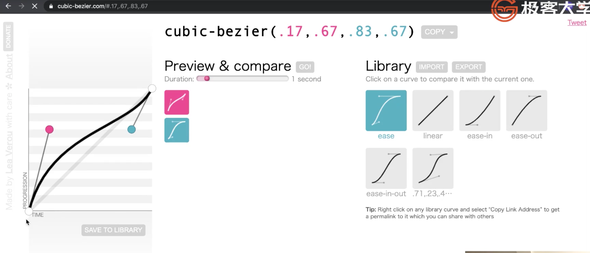
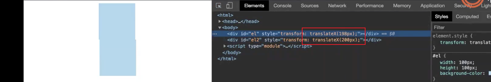

# 2.组件化 | 动画

[toc]

这节课继续解决组件化的问题。

### 停止 CSS 动画

如果要停止 CSS 动画，可能一开始我们会想将 `transition` 的值设为 `none` ，不过这样的方式只是取消的动画的过程，元素依然会在下一桢瞬间移动到最后一帧的位置。就像如下代码这样：

```html
<style>
  div{
    width: 100px;
    height: 100px;
    background-color: lightgreen;
    transition: 5s all ease;
  }
</style>

<div></div>

<script>
  let ele = document.querySelector('div');
  function start(){
    ele.style.transform = 'translate(300px, 300px)';
  }

  function stop(){
    ele.style.transition = 'none';
  }
</script>
```

- 先调用 `start()` ，开始动画，再调用 `stop()` 停止动画，会发现瞬间移动到所设置的位置上。

虽然真的「停止了动画」，但是并不是我们想要的效果，我们真的想要实现的是元素停止在我们执行命令的那一刻。

那么为了实现停在那一刻，则需要在停止的那一刻，将元素移动的位置更改为执行命令那一刻的位置，这样才会使元素真正的停止下来。这就需要解决一个问题：如何获取元素当前的位置？

使用 `getComputedStyle(element[, pseudoElt])` 是一个非常好的方法，它能够帮助我们获取到元素的所有 CSS 属性值的对象，从而我们能够获取到此刻 `transform` 的值（我们是更改 `transform` 来移动元素的），然后我们将此值再重新设置给元素即可实现停止：1

```js
function stop(){
  let { transform } = getComputedStyle(ele);
  ele.style.transform = transform;
  // ele.style.transition = 'none';
}
```

- 获取的 `transform` 是 `matrix` 值，我们可以认为其他像是 `rotate` `translate` 等都是 `matrix` 其中的一种特殊情况。

- 其实这里可以不用设置 `transition` 为 `none`，因为你已经设置为当前位置了，那么就会立刻停止。

- 注意，如果把设置 `transition` 为 `none` 的操作放到最前面，则会出现元素瞬间移动到最后一帧的情况，如下代码：

  ```js
  function stop(){
    ele.style.transition = 'none';
    let { transform } = getComputedStyle(ele);
    ele.style.transform = transform;
  }
  ```

  - 这里肯定和浏览器在执行 JS 和执行 computed 操作的先后顺序有关。可能是这样的情况，虽然设置 `style` 的操作因为性能考虑会将设置完成之后再 computed，但当执行设置 style 的操作之后是调用函数的操作时，则会将此次设置 style 的操纵立即交给处理样式的引擎去 computed，然后当我们执行`getComputedStyle(ele)` 获得的 `transform` 值已经是又一次新的 `computedStyle` 之后的结果了，也就是瞬间移动到最后一帧的结果。
  - winter 也在这里翻车了，他说之前都可以通过 `getComputedStyle` 来实现停止动画，这次不行了。


虽然说可以通过以上的方式来停止 CSS 动画，但是 CSS 动画在很多情况下可控性还是很差的，想要实现一些特殊的动画效果也是非常困难的，所以我们需要寻找另外一条实现的动画的路径——JS 动画。

### 设计 JS 动画库

我们会在新的项目环境（animation 目录）中来实现动画库，因为**动画功能是可以独立测试以及独立开发，并不需要跟着我们之前组件化的体系去实现**。 

我们要在此节课所要实现的动画库具备能够随时暂停（pause）并且随时能够在中断后重新开始（resume 继续）的能力。

强有力的动画库也是组件能够依赖于实现 fancy 动画的基础能力。

接下来将具体实现一个动画库。

一个库肯定会 `export` 出去一些东西，动画库按业界的常识来说，最重要的是 `Timeline` 和 `Animation` 这两个类。所以我们一般来说，只要 `export` 这两个类就行。

在实际实现之前，我们先要**考虑用户会如何去使用这个类库**，这个对于类库的设计非常的重要。

可能会这样来用：

```js
let animation = new Animation(object, property, start, end, duration, delay, timingFunction);

animation.start();

animation.stop();

animation.pause();

animation.resume();
```

- 首先，作为一个类库，那么用户在使用的时候肯定会进行实例化，在实例化时我们就需要考虑用户会用到哪些「要素」，这些「要素」肯定是会决定动画的整体效果的，那么大概有如下这些：
  - `object` 
  - `property`
  - `start`
  - `end`
  - `duration`
  - `delay`
  - `timingFunction`
- 那么「要素」在实例化时实际上就是传入类的参数，而这些参数我们如何让用户去传，则有很多种组合方式，比如只接收一个对象参数 `config` ，然后将以上这些参数作为对象的属性进行传入，也可以就像上面事例代码那样直接依次平铺传入，当然也可以将这些参数进行分组，等等。这里我们采用平铺的方式。（可是我个人觉得使用平铺不太好，因为需要用户对传入参数的顺序非常的清楚，而且像这么长一串也很容易传错，而使用对象的方式则可以不用在意参数传入的顺序问题）
- `duration` 和 `delay` 在这里默认的单位是 ms
- 这个时候会发现 JS 就没有 TS 那么友好了，因为使用 TS 用户在传入参数使用的时候就知道是什么类型的参数就不容易出错。
- 接着，我们就是需要一些 method 来动态的控制动画，比如 `start()` `stop()` `pause()` `resume()` 


现在有一个问题，如果一个元素有多个动画实例 animation，我们想要同时去控制 `start()` `stop()` ，那么这个时候我们应该怎么做？

我们可以会将多个 animation 进行编排，我们也不知道当前播到哪个 animation 的时候，这个 animation 是不是已经结束，因为 duration 和 delay 的设置不同会有时间差，所以这个时候会发现单纯的使用一个 `Animation` 类是不容易管理动画执行的。

而且还有一个问题，我们在实现动画的时候不可避免的会使用到 `setTimeout` `setInterval` `requestAnimationFrame` 这三个方法中的一个，那么当我们去做多个 animation 的时候，多次调用这些方法产生多个函数，在执行的过程中是一件非常消耗性能的一件事，比如一帧就产生一个函数调用，那么性能是肯定不过关的。


所以，我们就需要 `Timeline` ：

```js
let animation = new Animation(object, property, start, end, duration, delay, timingFunction);
let animation2 = new Animation(object, property2, start, end, duration, delay, timingFunction);

let timeline = new Timeline;

timeline.add(animation);
timeline.add(animation2);

timeline.start();

timeline.stop();

timeline.pause();

timeline.resume();
```

- 我们将 `animation` 实例添加到 `timeline` 中，这样我们就可以通过 `timeline` 来控制整体的动画。算是把 `animation` 的特性集成到了 `timeline` 中。
- 同时，`timeline` 也成为了我们管理多个动画，像是多个小人的编排工具。
- 控制多个时间线，比如在做游戏的时候，可以实现只暂停其中某些时间线的动画，而另外时间线的动画依然进行的效果，在植物大战僵尸中，暂停游戏僵尸依然会在原地做一些动作但是并不往前移动。


#### 补充

- 时间线是一个非常基础的抽象，任何一个动画库都会有时间线这个概念，web Animation 也有时间线这个概念。
- 仔细解释时间线？
  - 我们是将多个动画排进时间线里，然后每一个时间可以暂停或者是重回等动作。
  - 时间线其实也可以理解为同时控制多个动画的对象。
- 多个 `animation` 在时间线中是并列的关系，而动画的先后是通过 delay 来实现。
- 使用时间线的因素
  - 一是同时管理和控制多个动画的需求。
  - 二是在时间线中我们可以每一帧只调用一个函数，这是性能上的需求。
- 如果使用剪辑软件就可以很清楚的看出软件的时间线是如何抽象。时间线其实和编程本身没有关系，所有做动画的都有时间线这个概念。所以时间线和我们代码没有太大的关系，我们只是将这个领域知识通过代码进行了抽象。


### 实现 Timeline 和 Animation

#### Animation

Animation 在这个类库中只是作为存储用户设置动画相关配置项的工具，使动画运行起来的计算和控制动画的逻辑都会放到 Timeline 中，先来看看 Animation 的代码：

```js
export class Animation {
  // 由于有了 Timeline，我们可以将 Animation 当作接收数据并存储在内部的工具
  constructor(object, property, template, start, end, duration, delay, timingFunction) {
    this.object = object; // 动画作用的 DOM 对象的 style
    this.property = property; // style 改变的 css 属性
    this.template = template; // 用于转换 css 属性
    this.start = start; // 属性的开始状态
    this.end = end; // 属性的结束状态
    this.duration = duration; // 动画持续时间
    this.delay = delay ?? 0; // 延迟时间
    this.timingFunction = // 动画函数，决定动画的改变过程
      timingFunction ??
      ((start, end) => {
        // (t / this.duration) * (end - start) 这一帧所要改变的值
        return (t) => start + (t / this.duration) * (end - start);
      });
  }
}
```

- 就是将实例化时传入的配置项参数都存储到实例自己的属性中。

- 这些配置中，需要稍微理解的是 `template` 和 `timingFunction` 

  - `template` 是将改变 `property` 的值再做一层包装，因为我们计算出来的是一个数值，需要转换为一个字符串，而这个字符串并非固定的，所以需要 `template` 来自定义设置 CSS 属性值，可以参考一下如下代码：

    ```js
    tl.add(new Animation(el.style, 'transform', v => `translateX(${v}px)`, 0, 200, 5000, 1000));
    ```

    由于我们要改变的是 `transform` ，如果直接将数值传入是不会有任何效果的，需要通过一层转换进行包装，将其放到一串字符串的某个位置来设置 `transform` ，这样元素的样式才能真正发生改变，从而形成动画。

  - `timingFuntion` 为什么要传入返回函数的函数，用像是柯里化的东西来返回值，这一点之后会有讲到。这里先说明整个算法具体做了什么，函数是接收 `t` 返回一个值，`t` 是动画开始过后的时间，所以 `t/this.duration` 代表是此刻动画时间占总动画时间的比例，`* (end - start)` 之后便可以获得此刻属性应该改变到的某个值，然后 `start +` 这个值便是动画执行到的此刻元素样式应该改变到的值。

#### Timeline

```js
export class Timeline {
  constructor() {
    this.animations = [];
    this.requestID = null;
  }

  // tick 是🕙走一格所发出的滴答声的意思，一般将每帧执行的函数都用这个名称
  tick() {
    console.log('tick');
    // 开始之后所经过的时间
    let t = Date.now() - this.startTime;
    console.log('t', t);
    for (const animation of this.animations) {
      let { object, property, start, end, duration, delay, timingFunction, template } = animation;
      // 如果小于延迟则跳过动画
      if (t <= delay) continue;

      // 如果动画开始到现在的时间已经超过了动画时间和延迟动画时间之和，那么我们停止此动画
      if (t > duration + delay) {
        continue;
      }
      
      object[property] = template(timingFunction(start, end)(t - delay));
    }

    // 经过测试，传入的回调会在下一帧，也就是 16ms 之后执行，而不是立即执行。
    this.requestID = requestAnimationFrame(() => {
      // 为了解决 this 问题，需要放到箭头函数中调用
      this.tick();
    });
  }

  start() {
    this.startTime = Date.now();
    this.tick();
  }

  stop() {
    cancelAnimationFrame(this.requestID);
  }

  add(animation) {
    this.animations.push(animation);
  }
}
```

- 2 ~ 5 行，我们需要一个 `this.animations` 来存储所有的动画，`this.requestID` 来接收 `requestAnimationFrame`返回的 ID，用于停止动画。
- 42 ~ 44 行，用 `add` 方法来接收动画实例。
- 33 ~ 35 行，`start` 方法来开始动画，这个时候我们可以存储一个开始时间，之后会用于计算当前帧的动画时间。
- 8 ～ 24 行，`tick` 动画的重头戏，整个动画的执行全依靠这个方法。
  - 11 行，先计算出 `t` ，注意这个 `t` 是 `start` 之后也可以认为是动画开始后的时间，但是并非动起来的时间，因为这个时间包含了延迟的时间，而真正动起来的时间是 `t - delay` 
  - 13 ~ 24 行，遍历 animations 来设置此帧元素应该改变后的样式。
    - 16 行，首先要判断 `start` 之后的时间是否小于 `delay` 如果小于则不让此次更改样式执行。
    - 19 ~ 21，判断是否已经超过了延迟和动画执行的时间，如果大于则也不应让动画继续。
    - 23，对元素设置样式，需要注意的就是 `t` 要减去 `delay` 才是动画时间。
  - 27 ～ 30，调用 `requestAnimationFrame` 方法再次执行 `this.tick()` 实现动画。

- 38 ~ 40，`stop` 调用 `cancelAnimationFrame` 停止动画。


#### 执行动画

接下来就是在浏览器环境中调用这些工具来实现动画了。

```html
<style>
  #el {
    width: 100px;
    height: 100px;
    background-color: skyblue;
  }
</style>

<div id="el"></div>

<script type="module">
  import { Timeline, Animation } from './animation.js';

  let el = document.getElementById('el');
  let tl = new Timeline();

  tl.add(new Animation(el.style, 'transform', v => `translateX(${v}px)`, 0, 200, 5000, 1000));

  tl.start();

  setTimeout(() => {
     tl.stop();
  }, 3000);
</script>
```

- 11 行，注意这是 `module` ，需要启一个服务器才能从 `./animation.js` 中引入模块，否则会报跨域错误。我估计和协议有一定的关系。
- 17 行传入 Animation 的第一个参数是 DOM 元素的 style 属性而不是 DOM


#### 补充

- JS 中每帧去改 CSS 的属性性能会有问题吗？
  - 性能有没有问题，主要拒绝于改的属性会不会触发重排，如果只改 `transform` 在大部分情况下是没有问题的。并且也可以通过改变 `template` 函数返回值，比如返回为 `translate3d` 来让 GPU 参与运算提高性能。


### timingFunction

接下来讲一下 timingFunction 这个配置项。

首先我们来参照一下 CSS 的 timingFunction



上图左边的坐标系中，横轴是时间（Time），纵轴是进展（progression 从一个阶段或状态逐步发展到另一个阶段的过程）。这两个指标在 timingFunction 中实际上都是 `0` ~ `1` 的比例值，所以一个设计较好的 timingFunction 会是以 `time` 为入参数，`progression` 为返回值的函数。所以我们之前所设计的 `timingFunction` 也不好，需要重新设计。

回到调用 `timingFunction` 的 `tick` 方法中，我们先将整个过程拆分一下：

```js
let progression = timingFunction((t - delay) / duration); // 0 ~ 1 之间的比例
// `(end - start)` 是变化区间的最大值
let value = start + progression * (end - start);
// t - delay 是动画时间
object[property] = template(value);
```

- 我们将之前一行的表达式拆分为了三部分：
  - 首先是通过 `timingFunction` 计算出 `progression` 的比例，传入的是这一帧动画时间所占整体动画时间的比例，然后返回的动画的值要改变的比例 `progression`
  - 接着是计算这一帧动画要改变的值，通过 `progression` 来 `* (end - start)`  这一变化区间的最大值获得此时变化的值，然后再加上初始值则得出最终值。
  - 最后给 `style` 的某一属性设置值，通过 `template` 包装一下数值为一个自定义的字符串形式。


接着就是考虑应该传入什么样的 `timingFunction` 函数：

- 如果传入的函数是 ` t => t` ，那么就是 CSS 中的 `linear` ，变化的值和时间呈线性关系。

  ```js
  let linear = t => t;
  tl.add(new Animation(el.style, 'transform', v => `translateX(${v}px)`, 0, 200, 5000, 1000, linear));
  ```

- 那么如果要实现 CSS 中的 `ease` 怎么办呢？

  这样要使用到贝塞尔曲线方法了，因为 `ease` `linear` 都是三次贝塞尔曲线的其中一种情况。

  winter 通过对浏览器中 webkit 代码的分析，直接将其中实现三次贝塞尔曲线部分的 C++ 代码拷贝转换为 JS 版本。然后我们便可以通过 cubicBezier 方法来计算出 `ease` 函数：

  ```js
  import { cubicBezier } from './cubicBezier.js';
  let ease = cubicBezier(.25, .1, .25, 1);
  ```

- 甚至你可以使用其他的函数来实现动画，像是三角函数等等。这也是我们使用 JS 来实现动画的一个好处，动画的变化效果是不固定的。


#### 补充

- 我们在设计一个库的时候，其中的一些设计细节会随着实现库的过程中思路变得清晰而改变。winter 的思路也在教学的过程中发生变化。
- cubicBezier 虽然是 winter 所写，但是完全是抄过来改的，他也不知道具体是怎么实现的，因为设计到牛顿方法。
- 到目前为止，我们只是实现了一个能够跑起来的库的架子，还没有实现库的一些 feature


### 解决问题

#### 错位问题



如上图中，上面的蓝色方块使用的 JS 动画，下面的蓝色方块使用的 CSS 动画，两个方块停留在了最终动画结束的位置，但是却发生了错位。从右侧红框内的 css 属性值可以看出，JS 动画最终停留在了 `198px` 的位置而非我们所设置的 `200px` ，甚至有些时候 JS 动画块会停留在 `195px` 的位置，那这是怎么出现这个问题的呢？

这个问题的出现和时间 `t` 有关，我们先来回过去看一下设置样式值的算法：

```js
let progression = timingFunction((t - delay) / duration); // 0 ~ 1 之间的比例
let value = start + progression * (end - start);

object[property] = template(value);
```

值 `value` 是由 `start + progression * (end - start)` 决定，我们希望值最终是 `end` 所以要使 `value` 等于 `end` ，则 `progression` 得为 `1` ，而 `progression` 为 `1`，则 `t` 要等于 `delay + duration` 而我们之前跳过动画执行的逻辑是这样的：

```js
if (t > duration + delay) {
  continue
}
```

这样就有可能造成 `t` 没有等于 `duration + delay` 就结束动画。因为 `t` 的变化是由 `requestAnimationFrame` 执行时决定的，而 `requestAnimationFrame` 每一次执行会相隔一帧，那大概就是 `16ms` ，所以这种变化会有 `16ms` 的误差，假设 `duration + delay` 等于 `1000ms` ，`t` 就会在 `985ms` 执行一次动画，然后下一帧 `t` 为 `1001ms` 大于了 `1000ms` 停止了动画，那么最终的 `value` 则为 `start + timingFunction(985/1000) * (end - start);` ，而不会是最终我们想要的 `end` 结果。

解决这个问题的办法就是在当 `t > duration + delay` 时手动更改 `value` 就可以了。比如：

```js
if (t > duration + delay) {
  t = duration + delay;
}

let progression = timingFunction((t - delay) / duration); // 0 ~ 1 之间的比例

if (t > duration + delay) {
  progression = 1;
}

let value = start + progression * (end - start);

if (t > duration + delay) {
  value = end;
}

object[property] = template(value);
```

- 上面三种改变方式都可以，不管是先直接将 `progression` 设置为 `1` 也好，还是直接将 `value` 设置为 `end`，还是将 `t` 设置为 `duration + delay` 
- 不过我个人比较喜欢 `t = duration + delay` 因为这是问题的源头。


#### 不断的调用 `tick`

我们的 `tick` 函数还有一个问题，就算动画执行完成，`tick` 函数依然会不断的调用造成额外的资源消耗。

解决这个问题的办法是给 `animation` 添加 `finished` 状态，从而用这个状态来做停止动画的处理：

```js
if (t > duration + delay) {
  t = delay + duration;
  animation.finished = true;
}
```

- 首先是在超出动画持续时间和延迟时间的逻辑中为 `animation` 添加 `finished` 状态

```jsx
let animations = this.animations.filter((animation) => !animation.finished);

for (const animation of this.animations) {
//..
```

- 接着在进入遍历 `animations` 执行动画计算之前将 `finished` 状态的 `animation` 过滤掉。这样就能保证已经执行完毕的动画不会再做计算操作。

```jsx
if (animations.length) {
  // 经过测试，传入的回调会在下一帧，也就是 16ms 之后执行，而不是立即执行。
  this.requestID = requestAnimationFrame(() => {
    // 为了解决 this 问题，需要放到箭头函数中调用
    this.tick();
  });
}
```

- 最后是通过判断 `animations` 中是否有元素来决定是否继续调用 `requestAnimationFrame` 从而实现当所有动画都 `finished` 之后便停止 `this.tick()` 的调用。


### 添加功能

#### 暂停 pause

这个其实我之前已经实现了，不过稍微改一下吧：

```js
pause() {
  if(this.requestID){
    cancelAnimationFrame(this.requestID);
  }
}
```

- 首先把名称改为了 `pause` 暂停而非 `stop`，我想 `stop` 应该是会回到原位吧。。。
- 对 `this.requestID` 做了一下检测，注意 `requestID` 是非零值，所以不逼担心会有 0 的问题。
- 这里 winter 老师又翻车了，他不知道 `cancelAnimationFrame` 接收的是 `requestAnimationFrame` 返回的 ID，以为像是 `removeEventListener` 这样接收的是传入 `requestAnimationFrame` 的回调。


#### 暂停后的重新开始 resume

实现重新开始的关键点在于，点击 `resume` 执行 `this.tick` 时 `t` 得是暂停时时间点，这样才能使接下来计算获得的值是元素暂停的位置。那首先我们来看一下 `t` 是如何计算的：

```js
let t = Date.now() - this.startTime;
```

- 是通过用此次的 `this.tick` 的时间戳去减去 `this.startTime` ，那么我们便可以在 `resume` 时改变 `this.startTime` ，从而给 `t` 补偿上之前动画开始到暂停的时间。

首先我们需要在 `pause` 时记录一个暂停时的时间戳：

```js
pause() {
  this.pauseTime = Date.now();
  if (this.requestID) {
    cancelAnimationFrame(this.requestID);
  }
}
```

接着在 `resume` 重新计算 `this.startTime` ：

```js
resume() {
  if (this.pauseTime) {
    this.startTime = Date.now() - (this.pauseTime - this.startTime);
    this.tick();
  }
}
```

- `this.pauseTime - this.startTime` 得到的便是点击 `start` 到点击 `pause` 之间的时间，我们只需要在这里用此刻的时间戳去减去这个时间就能得到补偿。

- 如果觉得不好理解，也可以这样思考，我们在 `resume` 中调用 `Date.now()` 获得的时间戳和接下来第一次调用 `this.tick()` 中的 `Date.now()` 是同一个值，那么我们将这一次的 `this.tick()` 中计算 `t` 值的算式重新替换一下：

  ```js
  let t = Date.now() - Date.now() + (this.pauseTime - this.startTime);
  // =>
  let t = this.pauseTime - this.startTime;
  ```

  也就是第一次的 `t` 实际上就是之前暂停到最开始开始的时间。接下来通过 `requestAnimationFrame` 执行的 `this.tick()` 只会每次在此基础上递增 `16ms` ，那这个结果就正式我们想要的。


#### 添加状态

以上也会有一些问题，比如连续的点击 `resume` 和连续的点击 `pause` 有出现意外的情况，所以我们借助状态来解决这个问题。

到目前为止我们的时间线会有三种交给用户的操作，开始、暂停、重新开始。这三种操作是交替出现的，为了让时间线更易控制并减少 bug，保证程序的健壮性，我们在实例中添加一个属性来表示时间线处于的状态（state）。

```js
class Timeline{
  constructor() {
    this.state = 'initialized';
    //...
  }

  start() { 
    if(this.state !== 'initialized') return;

    this.state = 'playing';
    //...
  }
  
  pause() {
    if(this.state !== 'playing') return;
    
    this.state = 'paused';
  	//...
  }
  
  resume() {
    if(this.state !== 'paused') return;

    this.state = 'playing';
    //...
  }
}
```

- 状态描述：
  - 初始状态为 `initialized` 
  - 只有处于 `initialized` 状态才能 `start` ，`start` 的执行会将状态切换为 `playing`
  - 只有处于 `playing` 状态才能 `pause` ，`pause` 会将状态切换为 `paused`
  - 只有处于 `paused` 状态才能 `resume`，`resume` 依然会将状态切换为 `playing`
- 这样的状态设置及状态相关的逻辑保证了时间线在预期中的可控。
- 这里需要说一下 `start` ，`start` 这个动作或者操作的设定，让其只能在最开始的时候可以执行，而这个设定其实挺好的，一开始我认为需要使用 `start` 来执行重新开始这样的操作，但我们可以通过另外的方法来执行重新开始（比如 `restart`），而不需要使用 `start` ，我们就认为 `start` 是指时间线的第一次开始就好，这样可以将一些操作上的逻辑分割开来，避免发生一些问题，比如在动画进行的过程中再此点击 start 的话就会无法停止通过 `pause` 来停止动画，因为这个时候就有两个 `requestAnimationFrame` 调用 `this.tick()` 而 `pause` 只能停止其中一次。


#### 重新开始 restart

```js
restart(){
  if(this.state === 'playing'){
    this.pause();
  }
  this.state = 'playing';
  this.animations.forEach((a) => (a.finished = false));
  this.requestID = null;
  this.startTime = Date.now();
  this.pauseTime = 0;
  this.tick();
}
```

- 如果动画在播放中则需要先将之前的动画暂停之后将用的值清空了，再执行动画。
- `animations` 中的每个 `animation` 也需要将其完成状态改为非完成，这是针对执行完成之后的情况。


### add 方法的扩展

目前我们的 add 方法只是简单的将一个动画 push 到 `animations` 中，这样无法做到控制在动画过程中 add 新的动画时的动画是重新开始还是以动画已经进行的时间开始。目前的情况是以动画进行的时间开始，因为 `t` 是一个 timeline 中所有动画共用的。所以，我们需要一个参数来控制新添加的动画从什么时候开始。

```js
add(animation, addTime) {
  this.animations.push(animation);
  if (this.state === 'playing' || this.state === "paused") {
    animation.addTime = addTime != undefined ? addTime : Date.now() - this.startTime;
  } else {
    animation.addTime = addTime != undefined ? addTime : 0;
  }
}
```

- 添加 `addTime` 参数来控制动画开始时元素的动画状态。默认情况下，如果是播放中（playing）或者是暂停（paused）则将其设置为动画已经进行的时间，否则设置为 0。

- 区别在于设置为动画已经进行的时间则会从头开始，设置为 0 则是从此刻动画已经进行的时间开始。可以根据以下计算来确定此结果：

  ```js
  if (t > duration + delay + addTime) {
    t = delay + duration + addTime;
    animation.finished = true;
  }
  
  // t - delay 是动画时间
  let progression = timingFunction((t - delay - addTime) / duration); // 0 ~ 1 之间的比例
  ```

  - 第 7 行，我们需要让动画时间减去 `addTime` 可以认为是添加时间，这样就可以来制元素开始时的状态（位置，颜色等）。
  - 同时在第一行，我们也需要将这一值添加到结束时间之中，否则会提前结束。

`addTime` 也可以手动的传入，比如想在动画进行时添加的动画跟着现在的时间走，那么传入 `0` 即可。当传入 `0` ~ `Date.now() - this.startTime` 之间时，则状态在初始时间 ～ 进行时时间之间。甚至可以传入负数或者超过现在进行时的时间，来使动画的状态超过动画进行时状态或者相反状态开始。

> 我在这里更倾向于传入一个 boolean 值来控制是否是重新开始，因为元素的初始位置也可以通过 `start` 值来控制，而简单的传入一个 boolean 来控制动画开始状态是比较容易被开发者理解。不过动画改变的过程可能会不同。

#### 补充

- 整个动画的主要工作是由 `tick()` 来完成的，其他的控制方法只是在改变 `tick` 中所用到的变量从而达到某种效果。


### 处理颜色动画

我们的 TimeLine 到现在是不能处理颜色的，只能处理元素位置上发生变化的动画，因为计算 `value` 的算法只是一个简单的最终值减去开始乘以一个比例的方式，这样是不能计算颜色值的：

```js
let value = start + progression * (end - start);
object[property] = template(value);
```

那么为了能让时间线能够处理动画值，我们需要将计算 `value` 的固定表达式替换为一个函数，这样就可以动态的自定义计算 `value` 的方法了。像是这样：

```js
let value = animation.valueFromProgression(progression);
```

而此函数我们决定放到 `Animation` 中，然后动画的 `Animation` 单独的使用一个是的类别 `ColorAnimation` ：

```js
export class Animation {
  constructor(object, property, template, start, end, duration, delay, timingFunction) {
    //...
  }

  valueFromProgression(progression) {
    return this.start + progression * (this.end - this.start);
  }
}

export class ColorAnimation {
  constructor(object, property, start, end, duration, delay, timingFunction, template) {
    this.object = object; // 动画作用的 DOM 对象的 style
    this.property = property; // style 改变的 css 属性
    this.start = start; // 属性的开始状态
    this.end = end; // 属性的结束状态
    this.duration = duration; // 动画持续时间
    this.delay = delay ?? 0; // 延迟时间
    this.timingFunction = timingFunction; // 动画函数，决定动画的改变过程
    this.template = template || (v => `rgba(${v.r}, ${v.g}, ${v.b}, ${v.a})`); // 用于转换 css 属性 
  }

  valueFromProgression(progression) {
    return {
      r:this.start.r + progression * (this.end.r - this.start.r),
      g:this.start.g + progression * (this.end.g - this.start.g),
      b:this.start.b + progression * (this.end.b - this.start.b),
      a:this.start.a + progression * (this.end.a - this.start.a),
    };
  }
}
```

- 两个不同的 `Animation` 不同的 `valueFromProgression` 
- `ColorAnimation` 也有默认的 `template` 方法帮助我们将值转换为 `rgba` 字符串
- 可以优化的地方：
  - 只用一个 `Animation` 类，但有不同的 `valueFromProgression` 方法，会根据不同的 `property` 选择调用不同的方法，当然也需要处理 `template` ，这个时候需要考虑的就是用户使用类库方便还是自由度更高，实际上内部的 `template` 我们是可以根据 `property` 来自己设定的。
  - 传值改为 `config` 对象的形式，这样就可以不用考虑传参的顺序。

既然有了 `ColorAnimation` 那么我们来创建一个实例：

```js
  tl.add(new ColorAnimation(el.style, 'backgroundColor', { r: 0, g: 0, b: 0, a: 0.5 }, { r: 255, g: 0, b: 255, a: 1 }, 3000, 0, linear));

```

- `start` 和 `end` 参数的值都是带有 `r g b a` 属性的对象，这里我们是否可以考虑让用户传入 CSS 值 `rgba`字符串，然后我们内部做解析再计算，这样可能也比较符合用户设置颜色值的习惯。


### 课后问答

- 在你熟悉整个类库的设计时，就可以添加一些新的 feature，比如播放速率（二倍速，或者反向动画），是否可以重复动画
- `worker` 有两个作用：
  1. `worker` 是真的多线程，可以和主线的 JS 中并行执行。（并行计算能力）
  2. `worker` 是一个独立的干净的环境，除了 `possMessage` 之外其他的没法做。（沙箱环境作用）
- 组件团队的建议，从目标出发，业务难度决定资深程序员的数量，是否有一些特殊的需求，则需要招特殊的人才。（图形、3D）
- 前端架构。客户端架构是最先出现的岗位，他要解决的问题是代码模块之间复杂性的问题。服务端架构的代码复杂性较低，就需要解决高访问量并发的复杂性。前端架构，没有并发的复杂性，页面天然解耦，所以前面两个问题都不存在，前端架构要解决的问题是当有大量的重复页面时，跨页面所带来的复杂性，也就是业务是大量重复的，该如果去抽象，抽象好了团队能够以一个相对正常的方式来写，如果抽象不好则会造成团队资源上的过度使用（拼体力）。阿里中就有一些糟糕的团队就靠堆人，而好的前端架构可以将人数控制下来。架构不好学习，因为业务上的差异，但可以去学习极客时间上老徐的课，有些共性还是可以学习的。


## 课程涉及内容

### 课后作业：

- 跟上课程进度，完成 animation，并完善 component

### 参考链接：

- 代码截图链接：[ https://pan.baidu.com/s/1UOPTL-wYTWCAudYkvg2tGg](https://pan.baidu.com/s/1UOPTL-wYTWCAudYkvg2tGg)
  提取码：p6zx
- https://trac.webkit.org/browser/trunk/Source/WebCore/platform/animation
- [http://en.wikipedia.org/wiki/Newton’s_method](http://en.wikipedia.org/wiki/Newton's_method)
- https://cubic-bezier.com/#.25,.1,.25,1