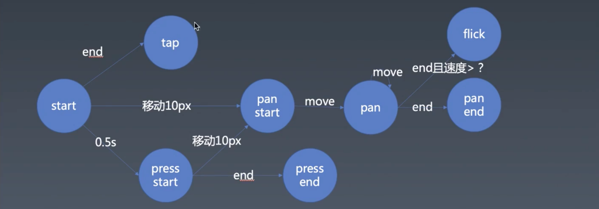
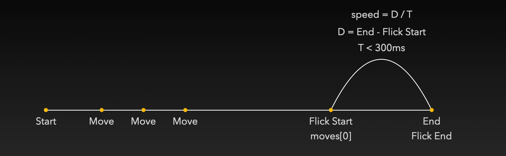

# 1. 组件化 | 手势

[toc]

这节课我们实现「手势」，做 Carousel 这个组件最重要的基石就是「动画」和「手势」。

### 轮播组件需求的进一步研究

#### 点击跳转问题

我们轻触 Carousel 的其中一张图片可以触发页面的跳转，但是当我们用手去点击的时候大多数情况下是会触发 `move` 事件，那么就可能造成页面不跳转的问题，虽然这在使用鼠标进行点击的时候发生的概率不大。

还有就是在手机上如果不做兼容是没有 `mouse` 系列事件的。

#### 拖拽行为研究

- 快速滑动触发翻页效果，即使并没有超过整个图片的一半，这是提高用户体验上的设计。
- 复杂的组合拖拽行为，一旦触发纵向的滚动，那么在 Carousel 中横向的滑动就不会再触发。也可以理解为只能是横向的滑动才能滑动 Carousel。

#### 移动兼容问题

[TouchEvent](https://developer.mozilla.org/en-US/docs/Web/API/TouchEvent ) 中没有像 [MouseEvent](https://developer.mozilla.org/en-US/docs/Web/API/MouseEvent) 中的第一层属性就有 `clientX` `clientY` ，而是在 [TouchEvent.changedTouches](https://developer.mozilla.org/en-US/docs/Web/API/TouchEvent/changedTouches) 列表的每一个对象中（因为手机有多点触控的设计），所以鼠标事件和触碰事件有本质的区别，那么在这个地方需要我们做一层统一的抽象，否则就需要写两份代码。

### 手势介绍

介绍一下业界中所使用的抽象，我们将和屏幕发生关系的事件抽象为反映我们人类操作意图的手势，比如：

- `Tap` 手在屏幕上一点。
- `Pan` 用手去拖拽一个物体，这个单词的原意是用摄像机拍摄一个场景时**平移**摄像机来形成场景的变化。
- `Flick` 和 `Pan` 类似，只是速度非常的快，并且会立刻离开屏幕。（`swipe` 是其别名）
- `Press` 是将手较长时间的按在屏幕上，然后再松开。

有了这些抽象的定义，便可以反映我们人在和屏幕发生交互时的绝大多数操作意图。

那么，首先就是用 `touch` 和 `mouse` 的事件将 `start` `move` `end` 三个阶段中抽象出来。


#### 补充

- 在手机上，如果手势被识别为系统手势则有可能会退出程序怎么办？
  - 系统手势是可以关闭的，后面会讲到如何关闭的方法。另外，系统手势在 IOS 上主要是三指操作这样我们不太常用的手势，而我们这节课要实现的手势只支持一根手指，所以在 IOS 基本上不会和系统手势有冲突。
- 多指操作最多的情况就是双指操作，而双指操作会形成 `transform` ，而且这个 `transform` 能够实现既有 `translate` `rotate` 和 `scale` ，所以双指操作的关键就在于如何将这三种 `transform` 有机的组合在一起形成 `magic transform` ，这一部分会涉及很多图形学的知识，然后以及一点数学知识。


## 实现 gesture

### 抽象事件

#### 如何监听鼠标事件？

```js
let ele = document.body;

ele.addEventListener('mousedown', () => {
  let move = (event) => {
    let {clientX, clientY} = event;
    console.log({clientX, clientY});
  };

  let end = (event) => {
    document.removeEventListener('mousemove', move);
    document.removeEventListener('mouseup', end);
  };

  document.addEventListener('mousemove', move);
  document.addEventListener('mouseup', end);
});
```

1. 在需要监听的元素上监听 `mousedown` 。

2. 在 `mousedown` 的事件处理函数中定义 `mousemove` 和 `mouseup` 的事件处理函数 `move` 和 `end` 并监听 `document` 上的 `mousemove` 和 `mouseup` 事件。
   - 如果不在 `mousedown` 中去监听 `mousemove` 事件会出现当你从元素的外部点击鼠标然后移入元素内部依然会触发 `mousemove` 事件。
   - 如果监听 `document` 上的 `mousemove` 则会出现当鼠标已经移出元素时 `mousemove` 失效的问题。
3. 在 `mouseup` 中移除对 `mousemove` 和 `mouseup` 的监听。

#### 如何监听手机触碰事件？

它和鼠标事件的监听完全不同。

```js
// touch event
// touch 天然就有目标锁定的能力
ele.addEventListener('touchstart', (event) => {
  console.log('event', event);
  console.log('event.changedTouches[0]', event.changedTouches[0]);
  console.log('touchstart');
});

ele.addEventListener('touchmove', (event) => {
  console.log('event.changedTouches[0]', event.changedTouches[0]);
  console.log('move');
});

ele.addEventListener('touchend', (event) => {
  console.log('touchend');
});

// touchend 和 touchcancel 有且只会触发一个
// 屏幕上突然的弹窗或着手势被识别为系统手势就会触发 touchcancel
ele.addEventListener('touchcancel', (event) => {
  console.log('touchcancel');
});
```

- 直接在元素上监听 `touchstart` `touchmove` `touchend` `touchcancel` 事件即可，因为就算移出了屏幕之外 `move` 也依然能够继续监听。
- `touchstart` 上的 `event.changedTouches[0]` 和 `touchmove` 上的 `event.changedTouches[0]` 有可能不是同一个手指所在的一些参数，所以需要用到其内部的 `identifier` 属性来作为区别。
- `touchend` 和 `touchcancel` 有且只会触发一个。而 `touchcancel` 的触发是非正常情况下的抬手，比如屏幕上突然的弹窗或着手势被识别为系统手势。


#### 将行为 `start` `move` `end` 进行抽象

虽然鼠标和手机触碰监听的事件上有所不同，但是行为的逻辑相同，所以可以将其进行抽象。

首先我们将行为抽象为如下的方法：

```js
let start = (point) => {
  console.log('start', point.clientX, point.clientY);
};
let move = (point) => {
  console.log('move', point.clientX, point.clientY);
};
let end = (point) => {
  console.log('end', point.clientX, point.clientY);
};
let cancel = (point) => {
  console.log('cancel', point.clientX, point.clientY);
};
```

- 分别是 `start` `move` `end` `cancel` ，它们都接收一个 `point` 对象，这在 `mouse` 事件中就是 `event` 而在 `touch` 事件中则为 `event.changedTouches` 数组中的其中一个对象。
- `cancel` 方法是只在 `touch` 事件中才有的。

先为 `mouse` 事件添加抽象的行为：

```js
ele.addEventListener('mousedown', (event) => {
  start(event);
  let mousemove = (event) => {
    move(event);
  };

  let mouseup = (event) => {
    end(event);
    document.removeEventListener('mousemove', mousemove);
    document.removeEventListener('mouseup', mouseup);
  };

  document.addEventListener('mousemove', mousemove);
  document.addEventListener('mouseup', mouseup);
});
```

- `start` 是在点击鼠标时的 `mousedown` 中调用。
- `move` 是在移动鼠标时的 `mousemove` 中调用。
- `end` 是在放开鼠标时的 `mouseup` 中调用。

接着是为 `touch` 事件添加抽象的行为：

```js
ele.addEventListener('touchstart', (event) => {
  for (let touch of event.changedTouches) {
    start(touch);
  }
});

ele.addEventListener('touchmove', (event) => {
  for (let touch of event.changedTouches) {
    move(touch);
  }
});

ele.addEventListener('touchend', (event) => {
  for (let touch of event.changedTouches) {
    end(touch);
  }
});

ele.addEventListener('touchcancel', (event) => {
  for (let touch of event.changedTouches) {
    cancel(touch);
  }
});
```

- `start` 是在手指触摸屏幕时的 `touchstart` 中调用。
- `move` 是在手指在移动屏幕时的 `touchmove` 中调用。
- `end` 是在手指离开屏幕时的 `touchend` 中调用。
- `cancel` 是在意外的手指离开屏幕时的 `touchcancel` 中调用。
- 除了以上调用行为方法之外，我们还需要注意传给方法们的 `point` 对象参数是从 `event.changedTouches` 中遍历得到的 `touch` 对象。


#### 补充

- `mousedown` 事件时也需要区分左右键，不过在这个项目中就先忽略了。
- `point` 已经是两种不同事件中传入的拥有比较一致 API 的参数了。
- 也可以监听 `pointerevent` 相关事件来替代同时监听 `touch` 和 `mouse` 事件，但需要注意的是兼容性。


### 判断四种手势

接下来，就是通过 `start` `move` `end` `cancel` 来判断当前与屏幕的交互属于四种手势的哪种事件：

- `tap` 只有一个事件
- `pan` 有三个事件—— `panstart` `panmove` `panend`
- `flick` 只有一个事件
- `press` 两个事件—— `pressstart` `pressend` 

 

#### 基础手势的状态转换图



- `start` 之后很快的（0.5 秒内）发生了 `end` ，那么就是 `tap` 事件。
- `start` 之后过了 0.5 秒之后就认为发生了 `press start` 事件。此时，如果触发了 `end` 则触发 `press end` 事件。此时，如果超过 `10px` 的移动则会发生了 `pan start` 事件。
- `start` 之后移动超过 `10px` 则认为发生了 `pan start` 事件，如果继续移动则会触发 `pan` 事件（也可以称为 `pan move`），`pan` 之后如果继续移动依然触发 `pan` ，最后需要触发 `end` 则触发 `pan end` 事件，如果触发 end 并且速度大于某个临界值则触发 `flick` 
- `0.5s` 和 `10px` 是 winter 根据经验觉得比较合理的临界值。
- 手势的基本架构是：监听——识别——分发


#### 获取移动后距离

像之前我们做 Carousel 时一样，如果想要知道当鼠标点击之后鼠标移动后的距离，则需要用移动后的坐标减去开始位置的坐标。而此次手势的抽象，获得开始位置的坐标需要在 `start` 函数中，而计算移动距离需要在 `move` 函数中，而二者是在同一作用域环境，所以我们可以在此环境中创建 `startX` 和 `startY` 变量，然后在 `start` 函数中获取值，再拿到 `move` 中进行计算。但是，由于 `touch` 事件可能出现多指触屏的情况，那么一对 `startX` 和 `startY` 是肯定不够的，所以我们需要创建一个对象来存储多对 `startX` 和 `startY` 的值。并且我们可以使用每个 `touch` 中所提供的 `identifier` 作为 key，这样也就不用担心多点触碰时怎么确定哪一对值是哪个手指的初始位置值的问题。


创建上下文环境对象和鼠标事件 key

```js
let contexts = Object.create(null);

let MOUSE_SYMBOL = Symbol('mouse');
```

- 用 `MOUSE_SYMBOL` 作为 mouse 事件存储的上下文的 key ，避免与 touch 事件中用 `identifier` 作为上下文的 key 产生冲突。（这里 `Symbol` 也发挥了唯一性的作用，就算 `contexts` 中存在使用完全相同的`Symbol('mouse')` key，使用 `MOUSE_SYMBOL` 也不会将其覆盖掉，同理，只有 `MOUSE_SYMBOL` 能够获取到该 key 所存储的对象。  ）
- 相较于手机手指的对点触碰，鼠标只需要考虑一个初始位置即可，因为只有一个指针，所以只用 `MOUSE_SYMBOL` 来表示即可。


在鼠标事件中创建空对象并传入不同的阶段事件函数

```js
ele.addEventListener('mousedown', (event) => {
  // 下一次的开始会将之前的覆盖掉
  contexts[MOUSE_SYMBOL] = Object.create(null);

  start(event, contexts[MOUSE_SYMBOL]);

  let mousemove = (event) => {
    move(event, contexts[MOUSE_SYMBOL]);
  };

  let mouseup = (event) => {
    end(event, contexts[MOUSE_SYMBOL]);
    document.removeEventListener('mousemove', mousemove);
    document.removeEventListener('mouseup', mouseup);
  };

  document.addEventListener('mousemove', mousemove);
  document.addEventListener('mouseup', mouseup);
});
```

- 在鼠标事件 `mousedown` 时，创建一个空对象放到 `contexts[MOUSE_SYMBOL]` 中，然后将此对象传入 `start` `move` `end` 这三个阶段事件函数中。


在触屏事件中创建空对象并传入不同的阶段事件函数

```js
ele.addEventListener('touchstart', (event) => {
  for (let touch of event.changedTouches) {
    // 创建上下文时，要在行为最开始的创建
    contexts[touch.identifier] = Object.create(null);
    start(touch, contexts[touch.identifier]);
  }
});

ele.addEventListener('touchmove', (event) => {
  for (let touch of event.changedTouches) {
    move(touch, contexts[touch.identifier]);
  }
});

ele.addEventListener('touchend', (event) => {
  for (let touch of event.changedTouches) {
    end(touch, contexts[touch.identifier]);
    // 删除的时候，需要在行为结束的地方删除
    delete contexts[touch.identifier]
  }
});

ele.addEventListener('touchcancel', (event) => {
  for (let touch of event.changedTouches) {
    cancel(touch, contexts[touch.identifier]);
    delete contexts[touch.identifier]
  }
});
```

- 和 `mouse` 不同，要将创建的空对象放到 `touch.identifier` 作为 key 的上下文中。
- 接着就可以在不同的事件中通过 `contexts[touch.identifier]` 来获取此对象传入到对应的阶段事件函数。
- 最后是在结束阶段 `end` 和 `cancel` 中将其删除，可以节省空间。
- 记住，在开始的阶段创建，在结束的阶段删除。


计算移动距离

```js
let start = (point, context) => {
  context.startX = point.clientX;
  context.startY = point.clientY;
};

let move = (point, context) => {
  let {startX, startY} = context;
  let dx = point.clientX - startX; // 移动的距离
  let dy = point.clientY - startY;
};
```

- 在开始阶段 `start` 中从 `point` 中获取开始时的坐标再将其存储到 `context` 中
- 在移动阶段从 `context` 中获取开始坐标，然后再计算出移动后的距离。


> 可以认为 `context` 是作为这几个阶段函数所共享的存储数据的空间，所以可以通过这个空间来将各自函数环境中的值相互传递共享。


#### 设置手势事件的状态

既然我们已经有了移动距离这一数值，那么就可以利用这一数值与时间来设置手势事件状态。

```js
let start = (point, context) => {
  context.startX = point.clientX;
  context.startY = point.clientY;
  //三个分支，三个状态
  context.isTap = true;
  context.isPan = false;
  context.isPress = false;
  // 0.5s 之后如果还处于开始阶段则将其状态切换为 Press
  context.timeoutID = setTimeout(() => {
    // 如果已经是 pan 状态则直接中断后面的状态切换，因为一旦进入 pan 状态也就无法再切换到 press
    if (context.isPan) return;
    context.isTap = false;
    context.isPan = false;
    context.isPress = true;
    console.log('pressStart');
  }, 500);
};
```

- 在 `start` 阶段中，一开始肯定是 `tap` 状态，而 `pan` 和 `press` 状态需要之后另外的情况才能触发，比如接下来，如果在 `start` 中保持了 0.5 秒，就会切换到 `press` 状态。
- 在 `setTimeout` 的回调中，判断 `isPan` 来决定是否执行之后的逻辑，虽然是为了解决当切换到 pan 时，则不再会切换到 press，但我觉得这样的处理方式不够好，我觉得更好的方式是在 `move` 中通过当改变为 `pan` 状态时去 `clearTimeout` 来实现。


```js
let move = (point, context) => {
  let { startX, startY } = context;
  let dx = point.clientX - startX; // 移动的距离
  let dy = point.clientY - startY;

  // 这里是计算直角三角形斜边的公式，a**2 + b**2 = c**2
  if (!context.isPan && dx ** 2 + dy ** 2 > 100) {
    context.isTap = false;
    context.isPan = true;
    context.isPress = false;
    console.log('panStart');
  }

  // 如果已经移动超过 10px
  if (context.isPan) {
    console.log('pan');
  }
};
```

- 接着就是在 `move` 阶段，需要通过判断是否超过 `10px` 来决定是否切换到 `pan`，并且如果已经是 `pan` 也不需要再判断是否超过 `10px` 的逻辑。
  - 这里用到了直角三角形斜边的公式 `a**2 + b**2 = c**2` 来计算移动的距离是否超过 10px
- 然后就是判断如果已经是 `pan` 的状态，那么就进入 `pan move` 


```js
let end = (point, context) => {
  if (context.isTap) console.log('tap');
  if (context.isPan) console.log('panEnd');
  if (context.isPress) console.log('PressEnd');
  clearTimeout(context.timeoutID);
};
```

- 在 `end` 阶段我们则可以判断具体是在哪个手势事件中，`tap` `panEnd` 还是 `PressEnd` 


```js
let cancel = (point, context) => {
  console.log('cancel');
  clearTimeout(context.timeoutID);
};
```

- `cancel` 阶段就直接执行 `cancel` 的逻辑就好，因为这是非预期的被终止的情况。


#### 补充

- 上面通过各个 `isXXX` 变量来记录状态，实际上是可以通过一个变量传入 `string` 来记录的。

- 可以通过如下代码来粗糙的关闭鼠标或是手势默认的行为：

  ```js
  document.addEventListener('contextmenu',(e) => e.preventDefault());
  document.addEventListener('selectstart',e => e.preventDefault());
  // 这里需要手动将 `passive` 可选项设置为 false，因为在某些浏览器中（fireFox 和 chrome）会默认设置为 `true`，从而使监听方法中无法调用 preventDefault
  document.addEventListener('touchmove', e => e.preventDefault(), {passive: false});
  ```

  - 这里的处理方式很粗糙，实际上应该在手势库的某些节点中进行处理。
  - `contextmenu` 事件是右键弹出浏览器默认菜单。
  - `selectstart` 是选择文本
  - `touchmove` 是了解决浏览器滑动时的问题，注意需要将 `passive` 设置为 `false` 否则无法阻止浏览器的默认行为。

- 阻止移动端中绑定鼠标事件：

  ```js
  // 不等于 null 则为 undefined ，说明没有 touchstart 事件，是 pc 端。只在 pc 端绑定 mouse 事件
  if (document.ontouchstart !== null)
    ele.addEventListener('mousedown', (event) => {
      //...
    });
  ```

  - 由于在移动端，默认情况下 `ontouchstart` 事件为 `null` ，而在 PC 端为 `undefined` ，所以可以利用这一差异来解决移动端也绑定了鼠标事件的问题。
  - 当然这样的方式是有问题的，比如如果在执行这个逻辑之前，执行 `document.ontouchstart = null` 这个赋值操作，那么在 PC 端也无法绑定鼠标事件了，并且当 `ontouchstart` 绑定了事件方法，移动端也依然会绑定鼠标事件。正确的方式应该是通过一种通用的方式来检查是否为移动端，再根据这个逻辑来做处理。

- 10 px 的移动临界值算是业界的标准，但是有时候需要去计算 DPR


### 判断 flick

flick 在用户实际操作过程中就是很快的用手指或是鼠标在屏幕上快速的滑动一段距离并且离开屏幕，那么有两种情况需要考虑，一种是从触摸到屏幕再到离开屏幕就是一次 flick，还有一种情况是手指放在屏幕上停留了一段时间，可能放在上面不动，也可能在做 pan 手势，然后再做 flick。而判断 flick 的关键在于速度，第一种情况获取速度相对容易，直接用结束点移动距离除以滑动的时间即可，但是第二种情况就很麻烦了，无论是停留的时间或是做 pan 的距离我们都不能用于计算 flick 的速度，因为这两个手势动作并不属于 flick 之内，那么我们就需要考虑如何获取 flick 的距离和时间的问题。

无论是第一种情况还是第二种情况，我们都可以认为 flick 是在结束之前相对时间内的一次快速滑动，那么就可以只去获取这个相对时间内的距离和时间即可。

我们先定相对时间为 300ms，只要去判断在这 300ms 内的开始位置到结束位置的速度达到了 flick 的速度临界值，那么就认为是 `flick` 手势。

```js
let move = (point, context) => {
  let { startX, startY } = context;
  let dx = point.clientX - startX; // 移动的距离
  let dy = point.clientY - startY;

  // 这里是计算直角三角形斜边的公式，a**2 + b**2 = c**2
  if (dx ** 2 + dy ** 2 > 100 && !context.isPan) {
    context.isTap = false;
    context.isPan = true;
    context.isPress = false;
    console.log('panStart');
  }

  // 如果已经移动超过 10px
  if (context.isPan) {
    context.moves.push({ dx, dy, t: Date.now() });
    // 过滤掉 300ms 之前的移动记录
    context.moves = context.moves.filter((record) => Date.now() - record.t < 300);
    console.log('pan');
  }
};
```

- 在 `move` 的 `pan` 手势事件中不断的记录每一个 `move` 的距离和时间戳。
- 接着会过滤掉其中已经超过 300ms 的记录。


```js
let end = (point, context) => {
  // 离开屏幕时移动的距离
  let dx = point.clientX - context.startX;
  let dy = point.clientY - context.startY;

  if (context.isTap) console.log('tap');

  if (context.isPan) {
    // index 为 0 的 record 是 300ms 的最开始的位置
    let record = context.moves[0];
    // 用 300ms 内移动的距离 / 移动的时间，来获取 300ms 内的速度
    let time = (Date.now() - record.t);
    let distance = Math.sqrt((record.dx - dx) ** 2 + (record.dy - dy) ** 2)
    let speed = distance / time;
    if(speed > 2.5){
      console.log('flick');
      return;
    }
    console.log('panEnd');
  }

  if (context.isPress) console.log('PressEnd');
  clearTimeout(context.timeoutID);
};
```

- 接着在 `end` 中计算 300ms 内移动的速度，用结束时的距离和 300ms 开始时的距离来获取 300ms 内移动的距离，用结束时的时间减去 300ms 开始的时间获取 300ms 内的移动时间，最后用这两个值来获取速度。
- 这次计算手指滑动的直线距离要用 `Math.sqrt` 了。
- 这里根据打印 `speed` 和尝试手指滑动的感觉，大概预估 `speed > 2.5` 触发 `flick` 比较合理。

这样就算实现了判断 `flick` 的整个流程，实际上这里真的需要花费一些时间来思考为什么要这样做，也可以参考我在 keynote 上所画图示：



这算是假设已经触发了 `flick` 手势的示意图，我们所计算的 `speed` 就是最后一段 300ms 以内的速度。当然这里的图示是之前所说的第二种情况，第一种情况可以认为是这一图示中的最后 300ms 内的过程，省去了前面 `pan` 或是 `press` 停留的过程。


到目前我们已经完成了所有「识别」的工作，接下来要开始「派发」的工作。


补充

- 在这里所讲的实现手势库的方式和之前的 animation 都是一种通用的套路。
- `flick` 可以多人测试之后再决定一个 speed 的临界值，这跟每个人的对于 `flick` 这种手势操作的体感有关。


### 创建手势事件-监听-派发

这些判断手势之后的打印逻辑肯定不是我们的最终形态，我们是要将这些手势分发出去给事件对象用的。给事件对象用的最基础的方式，就是模仿一个 DOM 事件给发出去，当然也可以让使用库的人传入一些 config 来在内部调用。 

这里通过 DOM 事件进行派发，那么我们就需要自定义 Event，可以参考 [Creating and triggering events](https://developer.mozilla.org/en-US/docs/Web/Guide/Events/Creating_and_triggering_events) 中的示例代码：

```js
const event = new Event('build');

// Listen for the event.
elem.addEventListener('build', function (e) { /* ... */ }, false);

// Dispatch the event.
elem.dispatchEvent(event);
```

- 创建事件 - 监听事件 - 派发事件
- 这里派发事件 `event` 可以理解为，将此 `event` 发送给监听此事件的回调，回调遍可取得这个 `event` 来做一些事情。

#### 创建手势事件和派发

假设我们要实现 drap-and-drop 那么就要用到 `pan`（pan move）手势事件，那么尝试创建一个 `pan` 事件并派发：

```js
// 如果已经移动超过 10px
if (context.isPan) {
  context.moves.push({ dx, dy, t: Date.now() });
  // 过滤掉 300ms 之前的移动记录
  context.moves = context.moves.filter((record) => Date.now() - record.t < 300);
  let event = new CustomEvent('pan');
  Object.assign(event, {
    // pan start 时要存储开始位置，因为已经移动了 10px 的距离
    startX,
    startY,
    clientX: point.clientX,
    clientY: point.clientY,
  });
  ele.dispatchEvent(event);
}
```

- 第 6 行，在已经确定是 `isPan` 事件后，通过 `new CustomEvent('pan')` 创建 `pan` 事件

- 7 ～ 13，通过 `Object.assign` 方法向 `event` 中添加一些自定义数据。（这里也可以在 `CustomEvent` 的第二个参数位置传入一个对象，在对象的 `detail` 属性中传入自定义数据，像这样：

  ```js
  if (isFlick) {
    ele.dispatchEvent(
      new CustomEvent('flick', {
        detail: {
          // pan start 时要存储开始位置，因为已经移动了 10px 的距离
          startX: context.startX,
          startY: context.startY,
          clientX: point.clientX,
          clientY: point.clientY,
          speed,
          isFlick,
        },
      }),
    );
  }
  ```

  其实也可以想成通过 `Object.assign` 我们能想自定义数据放到 `event`上，而不是 `event.detail` 上。同样，也可以直接通过 `.` 操作符来赋值来添加属性，但不能用展开运算符的方式：

  ```js
  event = {
    ...event,
    startX: context.startX,
    startY: context.startY,
    clientX: point.clientX,
    clientY: point.clientY,
  }
  ```

  因为这样会让 `event` 成为一个普通对象，而不是 `Event` 对象，当 `dispatchEvent` 时会报错：

  ```
  Failed to execute 'dispatchEvent' on 'EventTarget': parameter 1 is not of type 'Event'.
  ```

- 14 行，将此事件派发。（传递数据）

#### 监听事件

接着就是监听事件了，在让某个事件对象监听事件之前，我们需要改造一下我们的手势库，让其作为一个函数来调用：

```js
function enableGesture(ele) {
  let contexts = Object.create(null);

  let MOUSE_SYMBOL = Symbol('mouse');

  if (document.ontouchstart !== null)
    ele.addEventListener('mousedown', (event) => {
      // 下一次的开始会将之前的覆盖掉
      contexts[MOUSE_SYMBOL] = Object.create(null);
      //...
    }
```

- `enableGesture` 接收要使用手势库的元素，并会给元素绑定鼠标和触摸事件，然后再根据用户具体的操作情况来派发具体的手势事件。

接着，让元素能够监听手势事件，并且监听手势：

```js
let x = 0,
    y = 0;

enableGesture(ele);

ele.addEventListener('pan', (event) => {
  ele.style.transform = `translate(${x + event.clientX - event.startX}px,${y + event.clientY - event.startY}px)`;
});

ele.addEventListener('panend', (event) => {
  x = x + event.clientX - event.startX;
  y = y + event.clientY - event.startY;
});
```

- `x` `y` 是记录元素被拖动之前的初始位置。
- 4 行，调用 `enableGesture(ele)` 便可使元素 `ele` 在监听手势事件时，只要满足的触发条件便能有效的执行监听回调，并用回调中接收的 `event` 来做一些处理。
- 6 行，监听 `pan` 事件，在回调中计算 `transfrom` 的值，这和我们之前用 `mouse` 做 `drag and drop` 的方式基本相同。
- 10 行，需要监听 `panend` 来计算 `x` `y` 否则下一次的拖动会出现非预期的情况。（这个我在好考虑是否可以在 `enableGesture` 内部来实现，但好像又不是特别需要，有些时候并非约简约越好（只想绑定一个事件），这需要和你做的事情本身的概念有关，比如手势库是否应该记录每一次拖动的初始位置，我想这不应该是手势库的工作，而应该是 `drag and drop` 的工作。）


### 课后补充

- 我们所追求的是在工程上完整的思路实现，所以一些细节上可能会有不同。


## 课程涉及内容

### 课后作业：

- 把新的手势应用于 carousel

### 参考链接：

- https://developer.mozilla.org/en-US/docs/Web/Guide/Events/Creating_and_triggering_events

### 代码截图：

- 链接：[ https://pan.baidu.com/s/1zvGDGBecIzM5UdH1K3tFbA](https://pan.baidu.com/s/1zvGDGBecIzM5UdH1K3tFbA)
  提取码：srfy