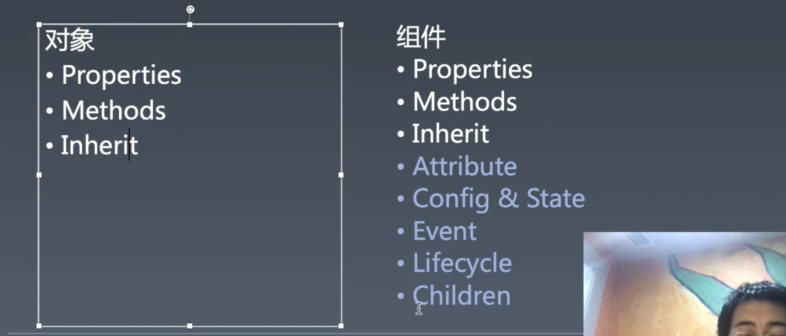

# 1. 组件化 | Tab组件和List组件

[toc]

在之前我们所实现的 `Carousel` 组件中，并没有用到 `children` 这一组件化的特性，只是将 `data` 转化为了内部的图片，而这一课我们将通过利用 `children`实现  `Tab` 组件。

## Tab 组件

### 使用 children 的雏型 Panel

```jsx
export class Panel {
  constructor(config) {
    this.children = [];
    this.props = {};
    this.attr = new Map();
  }

  setAttribute(name, value) {
    //attribute
    this.props[name] = value;
    this.attr.set(name, value);
  }

  appendChild(child) {
    this.children.push(child);
  }

  render() {
    return (
      <div class='panel'>
        <h1>{this.attr.get('title')}</h1>
        <div>{this.children}</div>
      </div>
    );
  }

  mountTo(parent) {
    this.render().mountTo(parent);
  }
}
```

- 22行，主要是在 `render` 中使用了 `this.children` 数据
- 其余部分和 `Carousel` 差不多
  - 需要用 `appendChild` 将 `children` 添加到 `this.children` 中保存
  - 需要 `setAttribute` 将属性和值保存在 `this.attr` 和 `props` 中
  - 需要 `mountTo` 来挂载 DOM。


在 `main.js` 中实例 `Panel` 组件并挂载

```jsx
let component = <Panel title="i'm panel">
  我是children
</Panel>;

component.mountTo(document.body);
```

- 这里就和之前实例 `Carousel` 有所不同，使用到了 `children` 
- 在这里可以认为 `Panel` 是 `children` 的一个**容器**


### 实现能够通过 tab 进行切换的 TabPanel 组件

既然我们可以通过使用 `children` 来显示内容，那么就可以利用这一特点来实现一个 `TabPanel` 

首先来看一下 JSX 部分的 children 

```html
let component = (
  <TabPanel>
    <span title='title1'>This is content1</span>
    <span title='title2'>This is content2</span>
    <span title='title3'>This is content3</span>
    <span title='title4'>This is content4</span>
  </TabPanel>
);
```

- 我们像 `TabPanel` 中传入了多个 `span` ，有 `title` 属性和 `content`

接着就是利用 `content` 和 `title` 来显示不同内容：

```jsx
export class TabPanel {
  select(i) {
    for (let view of this.childViews) {
      view.style.display = 'none';
    }
    this.childViews[i].style.display = ''; // 使用默认 display

    for (let view of this.titleViews) {
      view.classList.remove('selected');
    }
    this.titleViews[i].classList.add('selected');
    // this.titleView.innerText = this.children[i].props.title;
  }

  render() {
    this.childViews = this.children.map((child) => <div style='width: 300px;min-height: 300px;'>{child}</div>);
    // 没有 ref 机制所有只能手动获
    this.titleViews = this.children.map((child, i) => (
      <span style=' background-color: lightgreen;margin:10px' onClick={() => this.select(i)}>
        {child.getAttribute('title') || ''}
      </span>
    ));
    // 每次重新 render 都让其选择 0
    setTimeout(() => this.select(0));

    return (
      <div class='panel' style='width: 300px'>
        <h2 style='width: 300px;margin:0;'>{this.titleViews}</h2>
        <div style='border: solid 1px lightgreen;'>{this.childViews}</div>
      </div>
    );
  }

  mountTo(parent) {
    this.render().mountTo(parent);
  }
}
```

- 16 行，`render` 方法中首先要将 `this.chilren` 中的每个 `span` 放到一个 `div` 中并存储到 `this.childviews` 
- 18 行，`title` 被放到了 `this.titleViews` 中，并绑定了点击事件。
- 2 ～ 13行的 select 方法就是一个手动控制 DOM 来显示 `View` 的方法。

虽然是很简单的实现，但其中需要为 `Wrapper` 类添加一些方法，以便我们在使用普通元素的实例时能更直接的获取属性、设置 `class` ：

```js
class Wrapper {
  constructor(type) {
    this.children = [];
    this.root = document.createElement(type);
  }

  get style() {
    return this.root.style;
  }

  get classList(){
    return this.root.classList;
  }

  set innerText(text) {
    return (this.root.innerText = text);
  }

  getAttribute(name){
    return this.root.getAttribute(name);
  }
}
```

- `get style` 方法和 `get classList` 方法可以直接拿到 `root` 的 `style` 和 `classList` 
- `set innerText` 可以直接向 `root.innerText` 设置内容


像 `TabPanel` 这样内容型的组件的特点，每一个子元素即一个 `Panel` 那么对于我们之前实现的 `Carousel` ，实际上也可以通过这种内容型的方式来实现，而不是传入 `data` 来渲染图片。


#### 补充

- 如果做一个组件抽象才是好的？如果你是用户的话你想用到一个什么样的东西？这两个问题才是组件化学习后应该清楚的。 
- 组件实际上是有之前所列举的 properties methods inheirt attribute config&state event lifecycle children 这些东西的对象。通常被用来描述 UI 元素。组件可以认为是可复用可组合的 UI 元素。
  
- 为什么要做组件？
  - 组件的 `Attribute` 带来了声明式编程相关的特性。
  - `Config` 带来的全局能力
  - `State` 带来了组件内部状态变化的管理 
  - `Event` 能够能让我们从组件中接收东西
  - `Lifecycle` 能够定义组件的方式
  - `Children` 能够用树形的结构去描述复杂的界面

- 所以组件**相对比一个非以上特点的对象来说，组件提供了下一层次的抽象能力**，组件是最适用 UI 的抽象概念，它是最现代编程中处理 UI 最好的一种抽象的方式。 
- 组件化的方案如何承载是非常自由的事情，不管是用一门语言去描述一个组件系统，还是多门语言去访问同一个组件系统都是可以的。JSX 如今选择的 hooks，就是用函数来将组件的这些特点都描述清楚，省去了 `properties` `methods` 
- winter 希望这门课程带给我们的是对组件的基础理论和灵感。组件系统不光只是有 Vue 和 React，从一开始就有非常多的分支，不同的人设计的组件系统差异都非常大，而这些差异就在组件相关概念的机制上。
- 组件系统学来有什么用？
  - 主要作用是自己可以实现一个组件系统，次要作用是当我们再去看 React、Vue 的时候不再需要去理解组件概念，或者你新学一个 UI 框架或是学习安卓开发都是一样的，这些组件相关概念都是可以直接用于理解，因为你知道重点在哪里。
- 我们所写的组件和 React 的组件化有一个很大的不同，不会重新 render。
- 组件化是工程化的一部分。
- 虽然我们知道了「组件可以认为是可复用可组合的 UI 元素」，但并不清楚清楚该如何设计组件，而设计组件的关键就在于上面学习组件的相关概念。
- 基本上所有的 UI 都是以组件系统为基础实现的，组件是做 UI 的工程师骨子里就具备的东西。
- 前端中的大部分概念都是从客户端里面来的。
- 后端中的「组件」和前端中的「组件」概念完全不同，只是使用了相同的词。后端更多的说法是「模块」


## List 组件

`children` 除了上面实现 `TabPanel` 树形结构的方式之外，也可以使用传入函数的方式来实现 `List` 组件：

```jsx
let data = [
  { title: '蓝猫', url: 'https://static001.geekbang.org/resource/image/bb/21/bb38fb7c1073eaee1755f81131f11d21.jpg' },
  { title: '橘猫加白', url: 'https://static001.geekbang.org/resource/image/1b/21/1b809d9a2bdf3ecc481322d7c9223c21.jpg' },
  { title: '狸花加白', url: 'https://static001.geekbang.org/resource/image/b6/4f/b6d65b2f12646a9fd6b8cb2b020d754f.jpg' },
  { title: '橘猫', url: 'https://static001.geekbang.org/resource/image/73/e4/730ea9c393def7975deceb48b3eb6fe4.jpg' },
];

let list = (
  <ListView data={data}>
    {(record) => (
      <figure>
        
        <figcaption>{record.title}</figcaption>
      </figure>
    )}
  </ListView>
);
```

- 可以认为是一种向组件的 `children` 中传一个函数，利用回调的方式来获取 `data` 中每一项的值来渲染不同的 UI 的组件形式。当然这是在 JSX 中的一种特殊写法，因为不能像 Vue 那样可以直接在内部写 html 来获取 data 中每一项的值，当然这也是因为 vue 的 SFC 有做过特殊的处理，JSX 并没有的缘故，比如：

  ```jsx
  let list = (
    <ListView data={data}>
      <figure>
        
        <figcaption>{title}</figcaption>
      </figure>
    </ListView>
  );
  ```


### 实现 List 组件

```jsx
export class ListView {
  constructor(config) {
    this.children = [];
    this.props = {};
    this.attr = new Map();
    this.state = Object.create(null);
  }

  setAttribute(name, value) {
    //attribute
    this.props[name] = value;
    this.attr.set(name, value);
  }

  appendChild(child) {
    this.children.push(child);
  }

  render() {
    let { data } = this.props;
    return <div class='list-view' style='width: 300px'>
      {
        data.map(this.children[0])
      }
    </div>;
  }

  mountTo(parent) {
    this.render().mountTo(parent);
  }
}
```

- 非常简单，在最外层的 `div` 内部返回 `data.map(this.children[0])` 的数组即可。


## CSS

在拥有了通过内容来渲染 UI 的内容型组件和通过属性来渲染 UI 的常规组件之后，基本上我们可以认为是一个可以正常工作的组件系统就比较完善了，但是还有一个关键问题没有解决——CSS。

之前我们所写过的 `Carousel` 组件中有使用到 class，而 class 所应用的 CSS 则是写在了 `index.html` 中：

```html
<style>
  .carousel {
    width: 300px;
    height: 180px;
    white-space: nowrap;
    overflow: hidden;
    outline: solid 1px salmon;
    margin: auto;
  }
.carousel > img {
  width: 100%;
  height: 100%;
  display: inline-block;
  /* transition: 1s ease transform; */
}
</style>

<body></body>

<script src="./main.js"></script>
```

那如果我们要像将这段 css 写在一个单独的 `carousel.css` 中并且引入到 `Carousel.js` 中使用（因为 `Carousel.js` 和 `carousel.css` 是一个整体）该怎么办？

那当然就需要使用到 `loader` 来帮助我们解析 css 中的代码并添加到页面中。

### css-loader

最直接的方式是使用 `css-loader` 然后再在 css 文件中的内容放到一个 `<scrip>` 中

`webpack.config.js` ：

```js
{
  test: /\.css$/,
    use: {
      loader: 'css-loader',
    },
}
```

- 添加一个 `rule` 使用 `css-loader` 来加载解析 css

`./Carousel.js`：

```js
import css from './carousel.css'

let style = document.createElement('style');
style.innerHTML = css[0][1];
document.documentElement.appendChild(style);
```

- 将 `css-loader` 解析的 css 对象中的文本取出来放到 `style` 中并将 `style` 添加到文档中。

通过以上的方式我们便可以使用 `.css` 文件并和组件结合在一起使用。

但是如果我们想要修改 `.css` 文件中的内容，比如想要将 `carousel.css` 中与 `carousel` 无关的样式规则过滤掉，那么就需要我们单独来写一个 `css-loader` 来实现这个能力。

### my-css-loader

```js
let css = require('css'); // parser

module.exports = function (source, map) {
  // let styleSheet = css.parse('body { font-size: 12px }');
  let styleSheet = css.parse(source);

  // 从 path 获取 name
  let name = this.resourcePath.match(/([^/]+).css/)[1];

  for (let rule of styleSheet.stylesheet.rules) {
    rule.selectors = rule.selectors.map((selector) => {
      return selector.match(new RegExp(`.${name}`)) ? selector : `.${name} ${selector}`;
    });
  }

  return `
    let style = document.createElement('style');
    style.innerHTML = ${JSON.stringify(css.stringify(styleSheet))}
    document.documentElement.appendChild(style);
`;
};

```

- 需要用到 `css` 这个模块来帮我们将 css 中的代码解析为 AST 
- 5 行，`source` 就是 `.css` 文件中的文件，传入 `css.parse` 返回 AST object
- 8 行，通过 `this.resourcePath` 可以获取路径绝对路径，然后再通过 `match` 配合 `()` 来拿到 `/` 之后 `.css` 之前的字符，也就是 css 文件的名称。
- 12 行，通过获取的 `name` 我们就可以对 `selector` 做一些改动，如果是带有 `.name` 开头的选择器，那么就不改动，如果不是则添加 `.name` 在其前面。
- 16 ～ 20 行，将返回一段 JS 代码，用于添加 `style` 标签，并将更改后的 AST object 转换为文本代码添加到 `style` 中。注意，这里需要用到 `JSON.stringify` 来为 `css.stringify(styleSheet)` 返回的字符串外添加 `""` 字符，否则会将 `css.stringify(styleSheet)` 认为是 JS 代码。 


### 课后问答

- 之后讲工具链的模块我们会和各种各种的工具打交道，会讨论工具的各个环节。
- class name 的混淆也是一种 scope 的方法，最好的方案是给组件的元素添加 attribute，目前好的 scope 方案一定使用 loader 来做，这个事情毋庸置疑，一定是对 css 有侵入式修改。
- 上面处理 CSS 的 loader 算是给大家提供一种思路。


## 课程涉及内容

### 课前讨论

- 一代框架解决了什么问题？
  - 1.API 应用程度问题
  - 2.代码兼容性问题

### 课后作业：

- 跟上课程进度，完成 cssloader.js 代码