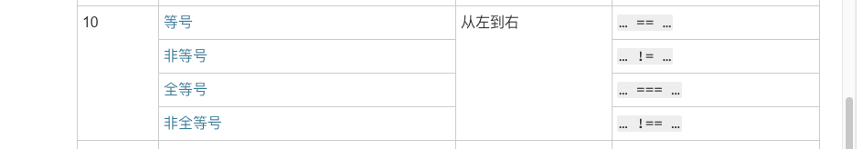

# 每周总结可以写在这里

原始代码：

```js
var a = 'sss'
console.log(a != 'a' != 'b' == 'sss') // => false
```

表达式 `a != 'a' != 'b' == 'sss'` 中的二元操作符 `!=` 和 `==` 运算符优先级都为 10，所以整个表达式的执行过程是从左往右执行，这个可以在 MDN 上找到：



那么接下来我们一步一步将这个表达的过程进行拆解：

1. `a != 'a'` 等价于 `'sss' != 'a'` 相同类型比较不需要强制类型转换，由于不相同返回 `true` 
2. 接着 `true != 'b'` 按照规范 11.9.3.6-7 所描述如果非全等的某一方是布尔，则会强制将其转换为 `Number` 类型，则表达式变为 ` 1 != 'b'` ，根据规范 11.9.3.4-5 所描述，如果非全等双方是数字和字符串，则字符串一方会转换为数字，则表达式变为 `1 != NaN` ，结果返回 `true` 
3. 最后 `true == 'sss'` 根据第二步所述，最终转换为 `1 == NaN` 结果为 `false` 

