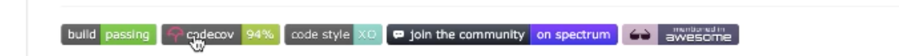

#   2. 工具链 | 设计并实现一个单元测试工具

[toc]

> 测试实际上是对可能会发生的情况的预测，然后通过模拟这些预测的情况来检验代码是否存在问题。
>
> 你 case 的情况越细微测 bug 之后去修改的成功率越高。

这节课将用业界比较流行的测试工具 `Mocha` 来讲解单元测试，并试图用来实现一个。

测试最主要的不是你用哪个测试框架，因为**测试是为检验对错**，而工具是提供了一些方便你进行测试的东西。

winter 不太推荐大家将 UI 搞成单元测试，单元测试一般覆盖基础库或是组件层的代码。


在我们之前课程中开发过 `animation` 动画库，而当时开发动画库的时候有写过 `animation.html` 用于演示动画库的效果，事件，而 `animation.html` 中的 JS 代码就可以认为是测试代码。其实单元测试并非一个高大上的东西，在 `animation.html` 中，我们的**测试方式相对简陋**，对**测试的 case 缺乏管理**，对**测试结果非自动化产出**，虽然没有满足**工程上**对测试方式的完备，对测试 case 的管理，对测试结果的自动化，但这段代码或在页面上的操作依然属于单元测试这个行为。


单元测试的意义是什么？

- 从广义上讲，没有人能拒绝单元测试，因为人本身的局限，你总会疏忽一些细节而造成 bug，所以需要单元测试来自动帮助检测 bug。特别是在写复杂组件、大型项目的时候，单元测试更能帮助我们减少 bug。


工程化的单元测试目标：

1. 自动化的结果评判，非自动化的单元测试是指人要去查看代码去操作去检查结果。

2. case 需要管理


我们要将 `toy-browser` 中的 `html-parse` 作为单元测试的目标。选择 `Mocha` 作为单元测试的框架，使用 [nvc](https://www.npmjs.com/package/nyc) 来实现 code  coverage 这种比较高级的方案来检测单元测试的测试用例和目标代码的覆盖程度，以此衡量单元测试编写的质量。


**测试报告和 coverage 报告是不同的**，测试报告是要求 100%，而 coverage 搞到 90% 以上就非常高。


## 测试练习

> `mocha` 官网：https://mochajs.org/

创建 `test-demo` 目录用于测试，在根目录中创建 `src` 目录用于存放开发代码，`test` 目录用于存放测试代码。

安装 `npo i - Dmocha` 并在 `test` 目录中创建一个 `test.js` 文件运行一下 `mocha` 官方的例子：

```js
var assert = require('assert');
describe('Array', function () {
  describe('#indexOf()', function () {
    it('should return -1 when the value is not present', function () {
      assert.equal([1, 2, 3].indexOf(4), -1);
    });
  });
});
```

回到终端，通过如下命令执行 `mocha` ：

```shell
./node_modules/mocha/bin/mocha
```

结果会在终端中显示：

```shell
  Array
    #indexOf()
      ✓ should return -1 when the value is not present


  1 passing (9ms)
```

当然我们也可以在 `package.json` 设置脚本运行：

```js
"scripts": {
  "test": "mocha"
}
```

然后使用以下命令运行测试：

```shell
npm run test
```


接着，我们来尝试测试一下自己写的代码。在 `src` 目录中创建 `add.js` ：

```js
function add(a,b){
  return a + b;
}

module.exports = {
  add,
}
```

然后在 `text` 目录中创建 `add.test.js` ：

```js
var { add } = require('../src/add.js');
var assert = require('assert');

describe('Array', function () {
  it('add(4 + 5) should be 9', function () {
    assert.equal(add(4, 5), 9);
  });
});
```

- 描述要写的稍微简介清晰

运行测试，结果：

```shell
 Array
    ✓ should return 9

  1 passing (6ms)
```


### 升级 node

这里在引入我们自己写的模块中的函数时也在使用 CommonJS 模块系统，如果我们想要 ES6 的模块系统，则需要升级 node 到 current 版本，到此是 `14.7.0` 。

安装完成之后，我们就可以在 `package.json` 为添加一个 `type` 字段然后将其值设为 `module` ：

```json
{
  "type": "module"
}
```

之后我们便可以项目中使用 ES6 模块语法来导入导出模块中的内容。


### 使用 nyc 检测覆盖率

> npm 包地址：https://www.npmjs.com/package/nyc

安装 `nyc` 并在 `package.json` 中添加新的脚本：

```json
{
 "scripts": {
    "test": "mocha",
    "coverage": "nyc mocha"
  }
}
```

运行一下 `npm run coverage`：

```shell
  Array
    ✓ add(4 + 5) should be 9


  1 passing (6ms)

Waiting for the debugger to disconnect...
----------|---------|----------|---------|---------|-------------------
File      | % Stmts | % Branch | % Funcs | % Lines | Uncovered Line #s 
----------|---------|----------|---------|---------|-------------------
All files |       0 |        0 |       0 |       0 |                   
----------|---------|----------|---------|---------|-------------------
Waiting for the debugger to disconnect...
Waiting for the debugger to disconnect...
```

虽然测试用例已经测试通过，但显示的覆盖缺为 0，这是因为没有添加 `.nycrc` 配置文件：

```json
{
  "all": true,
  "include": [
    "src/**/*.js"
  ],
  "exclude": [
    "**/*.spec.js"
  ]
}
```

- 以上 nyc 配置将为 src 目录中的每个文件收集覆盖率，而不管测试中是否需要require()。它还将排除扩展名为.spec.js的所有文件。

接着我们再次运行 `npm run coverage` ：

```shell
----------|---------|----------|---------|---------|-------------------
File      | % Stmts | % Branch | % Funcs | % Lines | Uncovered Line #s 
----------|---------|----------|---------|---------|-------------------
All files |       0 |      100 |       0 |       0 |                   
 add.js   |       0 |      100 |       0 |       0 | 2                 
----------|---------|----------|---------|---------|-------------------
Waiting for the debugger to disconnect...
Waiting for the debugger to disconnect...
```

这一次虽然找到了测试模块 `add.js` 但是依然显示测试的行覆盖率为 0，这一次的问题是我们使用了 ES6 模块的导入导出，而这使得 `nyc` 无法检测。

如果我们想要继续使用 ES6 模块当然也是可以，我们只需要用 babel 将其转义为 CommanJS 模块即可。

安装 `babel` ：

```shell
npm i -D babel-loader @babel/core @babel/preset-env
```

添加 `.babelrc` ：

```js
{
  "presets": ["@babel/preset-env"]
}
```

转移：

```shell
babel ./src/add.js > ./dist/add.js
```

然后删掉 `package.json` 中的 `type` 字段，然后更改 `.nycrc` 中的 `include` 要包含的文件目录为 `dist` ，修改 `add.test.js` 中引入模块的方式：

```js
var { add } = require('../dist/add.js');
var assert = require('assert');

describe('Array', function () {
  it('add(4 + 5) should be 9', function () {
    assert.equal(add(4, 5), 9);
  });
});
```

运行测试：

```shell
  Array
    ✓ add(4 + 5) should be 9


  1 passing (5ms)

----------|---------|----------|---------|---------|-------------------
File      | % Stmts | % Branch | % Funcs | % Lines | Uncovered Line #s 
----------|---------|----------|---------|---------|-------------------
All files |     100 |      100 |     100 |     100 |                   
 add.js   |     100 |      100 |     100 |     100 |                   
----------|---------|----------|---------|---------|-------------------
```

- 结果终于正确了。

但这里是手动进行了转义，并且在导入模块时依然使用的 CommonJS 模块，为了能自动让 nyc 帮我们进行 babel 转义，我们需要配置两个插件。

在 `.babelrc` 中：

```json
{
  "presets": ["@babel/preset-env"],
  "plugins": ["babel-plugin-istanbul"]
}
```

- 添加 `babel-plugin-istanbul` 

在 `.nycrc` 中：

```json
{
  "all": true,
  "include": [
    "src/*.js"
  ],
  "extends": "@istanbuljs/nyc-config-babel"
}
```

- 添加 `@istanbuljs/nyc-config-babel` 

在添加并安装之后，运行 `npm run coverage` 之后就能正常检测出覆盖率的情况。我们没有添加 `type: module` 

但其实最终还是没有使用 ES6 模块，只是通过 babel 将我们的源代码中进行的转移。


### 使用 ava

> npm 包地址：https://www.npmjs.com/package/ava

`ava` 是在 `mocha` 的基础上更改的框架，和 `mocha` 没有太大区别，我们来尝试一下。

在 `package.json` 中添加 `ava` 配置：

```json
{
  "ava": {
    "files": [
      "test/*.js"
    ],
    "require": [
      "@babel/register"
    ],
    "babel": {
      "testOptions": {
        "babelrc": true
      }
    }
  }
}
```

- 这里需要安装 `@babel/register` 这个包。

其他的和 `mocha` 差不多，只是测试用例的 API 不同：

```js
var { add } = require('../dist/add.js');
const test = require('ava');

test('foo', (t) => {
  if (add(4, 5) === 9) t.pass();
});
```


### 补充

- 测试框架只是 API 不同，实际上做的事情相同。
- 代码覆盖率有多种指标，我们一般参考行覆盖率，行覆盖率比较高基本上就说明你的测试比较稳定，除此之外，还有分支覆盖率、函数覆盖率，这两个指标的参考性不大，分支覆盖率太过严格，函数覆盖率太宽松。
- 能在公司中跑单元测试，能覆盖公司中的一些基础库就很不错了。
- winter 他自己不强求单元测试，因为项目大了自然会做这件事，否则无法进行开发。


## 测试 html-parser

创建 `html-parser` 目录用于开发和测试，使用 `npm` 初始化项目之后，将 `test-demo` 中 `.nycrc` 和 `.babelrc` 、`package.json` 中的内容拷贝过来。

添加 `./scr/parser.test.js` 测试用例：

```js
import { parseHTML } from '../src/parser.js';
import assert from 'assert'

describe('Array', function () {
  it('add(4 + 5) should be 9', function () {
    parseHTML("<div></div>");
  });
});
```

运行 `npm run coverage`：

```shell
-----------|---------|----------|---------|---------|------------------------------------------------------
File       | % Stmts | % Branch | % Funcs | % Lines | Uncovered Line #s                                    
-----------|---------|----------|---------|---------|------------------------------------------------------
All files  |   24.74 |    16.11 |      25 |   24.74 |                                                      
 parser.js |   24.74 |    16.11 |      25 |   24.74 | 36,42-49,65-69,83-87,93,95,97-98,108-231,245-427,436 
-----------|---------|----------|---------|---------|------------------------------------------------------
```

- 可以看到，我们只是添加了一个简单的测试用例，测试的行覆盖已经 24.74&


接下来就是不断的添加 test case，然后去查看代码的行覆盖率。

### 测试用例

首先我们来简单写两个测试用例：

```js
import { parseHTML } from '../src/parser.js';
import assert from 'assert';

it('parse a single element', () => {
  let doc = parseHTML('<div></div>');
  let div = doc.children[0];
  assert.equal(div.tagName, 'div');
  assert.equal(div.children.length, 0);
  assert.equal(div.type, 'element');
  assert.equal(div.attributes.length, 2);
});

it('parse a single with text content', () => {
  let doc = parseHTML('<div>hello</div>');
  let text = doc.children[0].children[0];
  console.log('text', text)
  assert.equal(text.content, 'hello');
  assert.equal(text.type, 'text');
});
```

- 第一个测试用例测试的是 `parser` 解析一对空白标签之后返回的对象中的值是否正确。这里有一个问题， `attributes` 中有 `tagName` 和 `type` 值，这从严谨的角度说是不应该有的，因为 `attributes` 在这里仅代表在 `startTag` 中写的属性。

- 第二个测试用例测试的是标签中内容节点是否是预期值。这里有一个问题，当两个测试用例一起运行的时候，第二个测试用例无法通过，这是因为我们的 `parser` 中没有对 `stack` 进行重置：

  ```js
  export function parseHTML(html) {
    let state = data;
    stack = [{ type: 'document', children: [] }];
    for (let c of html) {
      state = state(c);
      if (stack[stack.length - 1].tagName === 'script' && state == data) {
        state = scriptData;
      }
    }
    state = state(EOF);
    return stack[0];
  }
  ```

  - 第 3 行将其重置为默认值。


最后我们来看一下通过测试用例之后的覆盖率表格：

```shell
-----------|---------|----------|---------|---------|------------------------------------------
File       | % Stmts | % Branch | % Funcs | % Lines | Uncovered Line #s                        
-----------|---------|----------|---------|---------|------------------------------------------
All files  |   28.21 |    18.79 |      25 |   27.84 |                                          
 parser.js |   28.21 |    18.79 |      25 |   27.84 | 34,80-84,90,92,94-95,105-213,225-404,414 
-----------|---------|----------|---------|---------|------------------------------------------
```

根据表格中 `Uncovered Line` 列的信息，可以得知哪些行的代码没有被测试用例覆盖到，所以利用这一信息查看源代码，根据源代码来编写相应的测试用例来增加覆盖率。


#### 测试抛错

```js
it('tag mismatch', () => {
  try {
    let doc = parseHTML('<div></vid>');
  } catch (e) {
    console.log(e);
    assert.equal(e.message, "Tag start end doesn't match!");
  }
});
```

- 当测试执行的代码会抛出错误错误时，需要使用到 `try...catch` 捕获到错误之后再 `assert` 


#### 测试解析内容中带有 `<` 的 html

```js
// cover tagOpen
it('text with < ', () => {
  let doc = parseHTML('<div>a < b</div>');
  let text = doc.children[0].children[0];
  assert.equal(text.message, "a < b");
  assert.equal(text.type, 'text');
});
```

- 这是一种特殊情况的测试，当遇到 `<` 字符之后并非英文字符而是空格。

但是这里有一个 bug 需要修复，会报错 `state is not a function` ，这是由于没有正确的进行处理，更改一下：

```js
function tagOpen(c) {
  if (c == '/') {
    return endTagOpen;
  } else if (c.match(/^[a-zA-Z]$/)) {
    currentToken = {
      type: 'startTag',
      tagName: '',
    };
    return tagName(c);
  } else {
    emit({
      type: 'text',
      content: '<',
    });
    emit({
      type: 'text',
      content: c,
    });
    return data;
  }
```

- 在接收到非 `/` 和非英文字符时，则返回 `data`


#### 测试解析带有属性的 html

只有一种属性

```js
// cover beforeAttributeName
it('with property', () => {
  let doc = parseHTML('<div id=a></div>');
  let div = doc.children[0];
  
  for (let attr of div.attributes) {
    if (attr.name === 'id') {
      assert.equal(attr.value, 'a');
      return;
    }
  }
  
  assert.ok(false);
});
```

- 这里去循环判断是否有 `id` 属性，如果有则去 `assert` 它的值，否则会执行 `assert.ok(false)` 导致该测试用例不通过，因为 `assert.ok` 接收 `true` 表示通过，接收 `false` 表示不通过。


多个属性

```js
it('with property', () => {
  let doc = parseHTML('<div id=a class="cls" data="abc" ></div>');
  let div = doc.children[0];

  let count = 0;

  for (let attr of div.attributes) {
    if (attr.name === 'id') {
      count++;
      assert.equal(attr.value, 'a');
    } else if (attr.name === 'class') {
      count++;
      assert.equal(attr.value, 'cls');
    } else if (attr.name === 'data') {
      count++;
      assert.equal(attr.value, 'abc');
    }
  }

  assert.ok(count === 3);
});
```


#### 测试属性值结束标志 `"` 之后是 `<` 而非空格

```js
// cover beforeAttributeName
it('with property 2', () => {
  let doc = parseHTML('<div id=a class="cla" data="abc"></div>');
  let div = doc.children[0];

  let count = 0;

  for (let attr of div.attributes) {
    if (attr.name === 'id') {
      count++;
      assert.equal(attr.value, 'a');
    } else if (attr.name === 'class') {
      count++;
      assert.equal(attr.value, 'cla');
    } else if (attr.name === 'data') {
      count++;
      assert.equal(attr.value, 'abc');
    }
  }
  assert.ok(count === 3);
});
```

- 这一 case 和上面那个 case 基本上差不多


#### 测试解析自封闭标签

```js
/ cover selfClosingStartTag
it('with property 3', () => {
  let doc = parseHTML('<div id=a class="cla" data="abc" />');
  let div = doc.children[0];

  let count = 0;

  for (let attr of div.attributes) {
    if (attr.name === 'id') {
      count++;
      assert.equal(attr.value, 'a');
    } else if (attr.name === 'class') {
      count++;
      assert.equal(attr.value, 'cla');
    } else if (attr.name === 'data') {
      count++;
      assert.equal(attr.value, 'abc');
    }
  }
  assert.ok(count === 3);
});
```


#### 测试解析 script 标签

```js
// cover script
it('script', () => {
  let doc = parseHTML(`<script>
    <div>abcd</div>
    <span>x</span>
    /script>
    <
    </s
    </sc
    </scr
    </scri
    </scrip
    </script
  </script>`)
})
```

- 这里只是保证了处理 script 标签的逻辑运行了，但并没有相关的 case 去测试其处理结果是否正确。不过可以提高覆盖率。
- 里面处理了很多特殊的情况，这在源代码中也有相关的逻辑处理，所以需要 case 包含这些情况。


#### 测试没有属性值的属性

```js
it('attribute with no value', () => {
  let doc = parseHTML('<div class />');

});
```


```js
it('attribute with no value', () => {
  let doc = parseHTML('<div class id/>');

});
```


### 补充

- 对于复杂的逻辑，使用单元测试去执行代码比肉眼去查看更容易发现错误。不复杂的逻辑也不一定要用单元测试，但对于基础库最好都用单元测试。
- DOM 测试非常难搞，不过 React 的虚拟 DOM 是可以进行单元测试的。
- Mocha 并不是一个健壮的测试框架，因为单元测试主要是做比对的问题，比如 srpiteJS 这个库中的单元测试是用了 image diff 算法用于图片比对，或者需要做 DOM 位置的比对，这些都需要对应的算法的帮助，而 Mocha 本身是不带这些方法的。今天我们课程中单元测试只是演示了最基础的部分。
- 社区方案很全，基本上你需要的工具都能找到，但是并不一定用着舒服。
- 咨询服务，级别够了有问题可以去问 winter 
- 如果以后要做开源产品，一定要加上测试，并搞上一些标签用于显示产品的特点：
  
  - 只需要在 MD 中添加一些特定的代码即可，可以去查看别人 README 中的源码。
- 要了解一个包可以去看 `package.json` 中的依赖。
- `nyc` 是 `IstanbulJS ` 命令行的部分内容。
- 可以去帮一些大的框架贡献 test-case，比如 `vue` ，不过一般测试库的需要单独的测试框架，因为有些边缘 case 需要有特有的情况需要处理。
- `rc` 可以理解为是 config


## 课程涉及内容

### 课后作业：

- 跟上课程进度，将 parser.js 的 test case 补充完整，并将它的 coverage 做到 90 以上

### 参考代码：

```json
  {
    "all": true,
    "include": [
      "src/*.js"
    ],
    "extends": "@istanbuljs/nyc-config-babel"
  }
```

```json
{
    "presets": ["@babel/preset-env"],
    "plugins": ["babel-plugin-istanbul"]
}
```