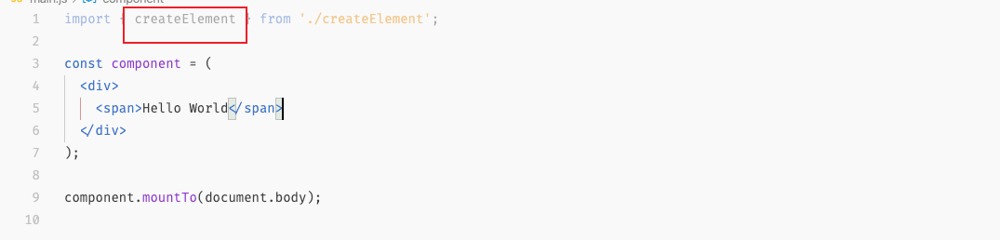

# 1. 发布系统 | lint与PhantomJS

[toc]


这节课讲 `Lint` 和 `PhantomJS` 


`PhantomJS` 无头浏览器这个东西对于前端来说非常重要，比如检查、质量保证基本上都需要 `PhantomJS` 

无头浏览器是指没有界面的浏览器，可以在命令行中运行，比如官网例子：

```js
var page = require('webpage').create();
page.open('http://www.google.com', function() {
    setTimeout(function() {
        page.render('google.png');
        phantom.exit();
    }, 200);
})
```

- 这里使用了 `node` 回调的方式访问了 `google` ，收到页面信息之后会渲染一张图片。


`PhantomJS` 无头浏览器的作用非常多：

- 持续集成
- 单元测试
- 爬虫
- 编程中的其他环节


`ESlint` 用于检测 JS 的编码风格，`PhantomJS` 用于检查最终渲染出来结果。


## PhantomJS

### 安装

`PhantomJS` 是一个类似于 node 的环境，下载之后将解压之后的目录中的 `bin` 中的文件移到 `node` 所在的目录下，可以通过如下命令获得 `node` 所在的 `bin` 目录：

```shell
which node
```

然后通过 `open /usr/local/bin` 打开目录，再将 `phantomjs` 这个可执行文件放进去。

winter 认为 `phantomjs` 是基于 `node` 的变体，可以认为它的环境和 `node` 是高度一致的。

### 使用

> 跟着官方快速入门做一边 https://phantomjs.org/quick-start.html

我们创建 `check` 目录作为使用 `phantomJS` 进行检查的目录。

> `PhantomJS` 的环境是比较麻烦的，我们没有办法通过 `yeoman` 构建的模版进行安装。不过我们依然可以使用 `copy` 的方式去执行它。

#### 加载页面（Page Loading）

在目录中创建文件 `page-loading.js` 编写如下代码：

```js
var page = require('webpage').create();
page.open('https://baidu.com/', function(status) {
  console.log("Status: " + status);
  if(status === "success") {
    page.render('time.png');
  }
  phantom.exit();
});
```

然后在目录中执行 `phantomjs page-loading.js` 则会在目录中得到一张绘制出来的图片。

> 最后我们会有一些组合的命令启动一个 web server，然后我们再调用 `phantomJS` 来做检查。

#### 代码执行（Code Evaluation）

> 由于对 Evaluation 这个单词有一些不理解，所以特意去查了一下，如下：
>
> In some [programming languages](https://en.wikipedia.org/wiki/Programming_language), **`eval`** is a [function](https://en.wikipedia.org/wiki/Subroutine) which **evaluates** a string as though it were an [expression](https://en.wikipedia.org/wiki/Expression_(programming)) and returns a [result](https://en.wikipedia.org/wiki/Return_value); 在某些编程语言中，eval是一个函数，它将字符串当作表达式来**求值**并返回结果。
>
> From https://en.wikipedia.org/wiki/Eval
>
> 表面上看是有评估、评价、求值的意思，求值比较接近代码层面，计算机执行代码实际上就是在做运算，运算会获得结果，而结果可以认为是一种值。但在翻译的时候将 Code Evaluation 翻译为「代码求值」或是「代码评估」是很奇怪的，因为实际上是在执行代码，所以我在这里暂时翻译为「代码执行」

目录中创建文件 `code-evaluation.js` 编写如下代码：

```js
var page = require('webpage').create();
page.open('https://baidu.com/', function(status) {
  console.log("Status: " + status);
  if(status === "success") {
    var title = page.evaluate(function() {
      return document.title;
    });
    console.log('Page title is ' + title);
  }
  phantom.exit();
});
```

然后再执行 `phantomjs code-evaluation.js` 便可以在终端中看到打印百度的 title：

```shell
phantomjs code-evaluation.js
Status: success
Page title is 百度一下，你就知道
```


如果要使用 `PhantomJS` 进行测试，我们可以需要启动两个步骤：

1. 启动一个本地的服务器
2. 对用 `PhantomJS` 访问页面之后返回的一些数据进行断言。


### 测试 component

我们将之前编写的 `component` 目录拷贝过来，安装好依赖，启动开发开发服务器。然后再在 `check` 目录中编写代码用 `PhantomJS` 来进行检查。比如，对于我们 `component` 中的 `carousel` 组件，可以写一个算法来检查其 DOM 结构是否正确。

我们先来试着打印一下 `baidu.com` 的 DOM 结构：

```js
var page = require('webpage').create();
page.open('http://baidu.com/', function (status) {
  console.log('Status: ' + status);
  if (status === 'success') {
    // 可以认为传入 evaluate 的回调中的代码是在浏览器中执行的，所以这个回调中的环境和外部的 phantomjs 的环境是隔离的,因此也无法访问外部的变量
    var body = page.evaluate(function () {
      var toString = function (pad, element) {
        var childrenString = '';
        for (var i = 0; i < element.children.length; i++) {
          childrenString += toString("    " + pad, element.children[i]) + '\n';
        }
        return pad + element.tagName + (childrenString ? '\n' + childrenString : '');
      };
      return toString('', document.body);
    });
    console.log(body)
  }
  phantom.exit();
});
```

执行这段代码之后会得到大概如下打印：

```shell
BODY
    SCRIPT
    TEXTAREA
    TEXTAREA
    DIV
        SCRIPT
        DIV
            DIV
                DIV
                DIV

            DIV
                A
                A
                    I
                    //...
```

除了对 `document.body` 进行检查之外，我们也可以对特定的某个元素进行检查。

然后，我们再来对 component 组件进行 DOM 检查，这里我们先检查一个简单的组件，如下：

```jsx
import { createElement, Text, Wrapper } from './createElement.js';

let component = (
  <div>
    <span>Hello World</span>
  </div>
);

component.mountTo(document.body);
```

然后通过 `webpack-dev-server` 启动一个服务器，接着稍微更改一下 `phantomjs` ：

```js
page.open('http://localhost:8080/', function (status) {
  console.log('Status: ' + status);
  if (status === 'success') {
    // 可以认为传入 evaluate 的回调中的代码是在浏览器中执行的，所以这个回调中的环境和外部的 phantomjs 的环境是隔离的,因此也无法访问外部的变量
    var body = page.evaluate(function () {
      var toString = function (pad, element) {
        var childrenString = '';
        for (var i = 0; i < element.childNodes.length; i++) {
          childrenString += toString("    " + pad, element.childNodes[i]) + (i === element.childNodes.length - 1 ? '' : '\n');
        }
        var name = '';
        if(element.nodeType === Node.TEXT_NODE){
          name = '#text ' + JSON.stringify(element.textContent);
        }
        if(element.nodeType === Node.ELEMENT_NODE){
          name = element.tagName
        }
        return pad + name + (childrenString ? '\n' + childrenString : '');
      };
      return toString('', document.body);
    });
    console.log(body)
    // console.log('Page title is ' + title);
  }
  phantom.exit();
});
```

- 这和之前不同是现在会打印元素的子节点 `childNodes` ，而非元素的子元素 `children` 

- 对字符串再执行 `JSON.stringify` 然后和字符串进行拼接可以打印出带有引号的字符串。比如：

  ```js
  console.log('a ' + JSON.stringify('hello world'))
  // 打印如下：
  a "hello world"
  ```

  - 这是因为会在外层再添加一对引号，这和直接在外层添加引号没有太大区别。

执行 `phantomjs check.js` 便会获得如下内容：

```js
BODY
    #text "\n\n"
    SCRIPT
    DIV
        SPAN
            #text "Hello World"
    #text "\n"
```

`phantomjs` 做检查的方式就是这样，将 DOM 结构转换为特征字符串（这里是 `body` ），然后去查看特征字符串是否正确。

### 补充

- 之后会介绍基于 `phantomjs` 的测试库。
- 这个课程主要讲解原理，理解了这个东西，然后自己写了一些基础的代码之后，之后就可以根据自己的理解去找一些库来帮助完成这部分的工作。
- `phantomjs` 一般用于持续集成中的检测，因为页面是否显示正确也需要一个测试。
- 如果想要检测页面最终呈现的样子，可以用 `phantomjs` 来做。
- 虽然这个检测工作属于测试的范畴，但课程也需要讲到，因为毕竟也是工程链路中的一环。而且你也可以将这一环放到前端体系之中。
- 如果想要使用 `mocha` 来测试页面中的内容可以使用 [mocha-phantomjs](https://github.com/nathanboktae/mocha-phantomjs) （不过这个库没有进行维护了，如果有这方面的需求可以去找别的库来代替）

## ESLint

我们就在 `componet` 目录中添加一下 `ESLint` ，依然跟着[官方文档](https://eslint.org/docs/user-guide/getting-started)来使用。

安装：

```shell
npm install eslint --save-dev

# or

yarn add eslint --dev
```

添加配置文件：

```shell
npx eslint --init
```

- 这里我们选择了使用 `airbnb` 的团队的代码风格来强制我们的项目也是用此风格。
- 没有选择任何框架

配置文件如下：

```js
module.exports = {
  env: {
    browser: true,
    es2020: true,
  },
  extends: [
    'airbnb-base',
  ],
  parserOptions: {
    ecmaVersion: 12,
    sourceType: 'module',
  },
  rules: {
  },
};
```

执行检查：

```shell
npx eslint main.js
```

打印信息：

```shell
/Users/harry/Documents/GeekTime-courses/Frontend-01-Template/week20/component/main.js
  4:3  error  Parsing error: Unexpected token <

✖ 1 problem (1 error, 0 warnings)
```

- 由于 `main.js` 中使用了 `JSX` 语法，但并没有为 `ESLint` 添加相关扩展。

添加扩展：

```js
module.exports = {
  //...
  extends: ['airbnb-base', 'plugin:react/recommended'],
  //...
};
```

再执行检查：

```shell
/Users/harry/Documents/GeekTime-courses/Frontend-01-Template/week20/component/main.js
  1:10  error  'createElement' is defined but never used                       no-unused-vars
  1:25  error  'Text' is defined but never used                                no-unused-vars
  1:31  error  'Wrapper' is defined but never used                             no-unused-vars
  1:46  error  Unexpected use of file extension "js" for "./createElement.js"  import/extensions
  3:5   error  'component' is never reassigned. Use 'const' instead            prefer-const
  4:3   error  'React' must be in scope when using JSX                         react/react-in-jsx-scope
  5:5   error  'React' must be in scope when using JSX                         react/react-in-jsx-scope

✖ 7 problems (7 errors, 0 warnings)
  1 error and 0 warnings potentially fixable with the `--fix` option.
```

- 发现 `JSX` 语法的问题没有了而多出来很多其他的风格问题。

上面的提示中，有说当使用 `JSX` 时必须引入 `React` ，但由于我们虽然使用了 `JSX` 的语法，但并没有使用 React 库，我们的 `pragma` 是使用我们自己所编写的 `createElement` 方法。所以需要更改一些关于 `React` 的设置：

```js
module.exports = {
  //...
  settings: {
    react: {
      createClass: 'createReactClass', // Regex for Component Factory to use,
      // default to "createReactClass"
      pragma: 'createElement', // Pragma to use, default to "React"
      version: 'detect', // React version. "detect" automatically picks the version you have installed.
      // You can also use `16.0`, `16.3`, etc, if you want to override the detected value.
      // default to latest and warns if missing
      // It will default to "detect" in the future
      flowVersion: '0.53', // Flow version
    },
  },
  //...
};
```

- 将 `pragma` 更改为 `createElement` 

再次执行检查：

```shell
/Users/harry/Documents/GeekTime-courses/Frontend-01-Template/week20/component/main.js
  1:25  error  'Text' is defined but never used                                no-unused-vars
  1:31  error  'Wrapper' is defined but never used                             no-unused-vars
  1:46  error  Unexpected use of file extension "js" for "./createElement.js"  import/extensions

✖ 3 problems (3 errors, 0 warnings)
```

- 第三个错误是在引入文件时，不要使用 `js` 后缀。除此之外就是两个没有使用的方法引入，删掉就好。

这样处理之后我们的 `main.js` 在现有的配置下就没有问题了。

这样需要说明一个问题，我们的 VSC 对于没有使用过的变量会以透明的样子显示，比如：



但是对于这里而言，其实这个模块使用了 `createElement` 方法，由于 VSC 并不知道 `JSX` 在编译之后会使用，所以依然是以灰色显示，但这个应该是可以通过配置来解决的。

这些代码风格的问题可以在 `ESLint` 的 `rules` 字段中进行具体的设置。但修改 `rules` 在团队中是一件非常严肃的事情，所以需要整个团队讨论并统一决定。

`rules` 是可以进行自定义的，你可以自己编写自己的 `rule` ，具体可以查看官方文档：https://eslint.org/docs/developer-guide/working-with-rules，也可以直接去包里查看官方是如何编写的。

> winter 觉得社区给的 ESLint 的规则已经足够使用。（不过我觉得如果有什么特殊的需求也可以自己去写）

## 补充

- 在发布和持续集成方面有什么推荐的框架之类的吗？
  - 像 `jenkins` 这样的框架会涉及到一些。但重要在于前端持续集成检查什么，这一部分没有任何框架能帮你去做。
- 这两个工具之后都会集成到 `yeoman` 中，并且也会添加 `package.json` 中添加对应的 `script` 命令。

### 简历

- 期望薪资不需要写在上面，之后 HR 会和你谈。
- 简历上写技术栈没有太大作用，因为没有办法通过简单的技术描述来评价一个人的水平。
- 一般面试官通过题库来考核你，而不是现场根据你的情况出题考核，说明这个面试官的水平有点问题。
- 面试官一般会留意那些吸引他眼球的内容。
- 是公司的脑无派遣、外包还是全职需要问清楚，但是如果这个公司都是劳务派遣也没有办法。

- 你用技术为业务带来了哪些贡献，这里有两个重要点：
  - 1.如何证明你的技术和业务之间的联系
  - 2.怎么衡量你业务上的贡献
  - 不过这个事情也不是很严谨，但是你要讲这个你做出的东西带来的影响，可以从侧面来讲，比如产品经理对这个东西的反馈很高，或是设计了一个产品没有考虑到的问题。其实也可以说是讲故事的能力。你要讲清楚你所做的贡献和最终的结果之间的逻辑关系。总之要证明你有自我思考的能力。
- 做业务一定要对业务熟悉，因为这是你的工作，不要因为觉得是程序猿只需要管程序的事情，其他不管。
- 例子——团队初期 10 个人，前端我带一个新人干。
- 业务有几种衡量的方式，有的业务是以钱为衡量的标准，有些业务是增长用户的 UV，这是不同的。UV 也分日活和月活，日活怎么做？月活怎么做？
  - 日活和产品的关系比较大，月活和市场的关系比较大，非常不同。比如，淘宝做日活，是如何让用户去使用这个产品（每日签到，每日任务），而月活是要做拉新。 
- 要把自己做成企业中的 star！
- 面试官一般需要得到的是一个合理的答案，而不是标准答案。
- 很多问题是干过就知道，没干过就觉得很难。
- 做回归测试（上线之后的测试）的时候想通过一些自动化手段定位一些节点然后触发交互验证一些关键的 story 流程，想问的是一般用什么手段去标记这些页面组件的位置？
  - 一般来说使用位置不对，因为在不同尺寸的浏览器上位置不同。
  - 对于标记（标示）一是使用路径，一是使用 id
- 简历就写实际的具体的情况，不要写一些容易让人产生误会的东西，免得在面试中出现意外的事情。并且不要写的过于抽象，比如有管理经验，有管理经验这一条实际上应该是面试官根据你简历上的描述进行总结的，你只需要把你干了什么事情做清楚就可以了。比如有架构经验，那么你就应该把做的什么架构如何做的写清楚。不要对自己的简历下结论，面试官可能会产生逆反的心理。得过什么奖、做过什么项目，项目中使用了什么技术，创造了什么东西，有无难点。写出来的东西就是实际的工作内容。
- 看你有没有管理经验不是看你带多少人，而是看你是否对这件事有思考。比如，P6 和 P7 是看你这个人会不会培养接班人，会不会去考虑团队中这些人的成长和团队的发展，如果不站在这个角度去思考，就是 P6，P6 是带着这些人保质保量的完成任务，而不是去考虑团队的长期发展。管理能力并且不是看你是否有简单的思考，还要考虑你的思考是否能够经得住推敲，比如明显有什么问题，而你自己却没有识别出来的地方。

- 阿里是怎么判断一个人能否晋升？
  - 两条，能力和业绩。晋升时，你和你的 leader 都是在论证这两条。

## 课程相关内容

### 参考链接：

- PhantomJS 下载地址：[ https://phantomjs.org/download](https://phantomjs.org/download)
  （也可在课程 PC 端页面底下下载附件压缩包)

