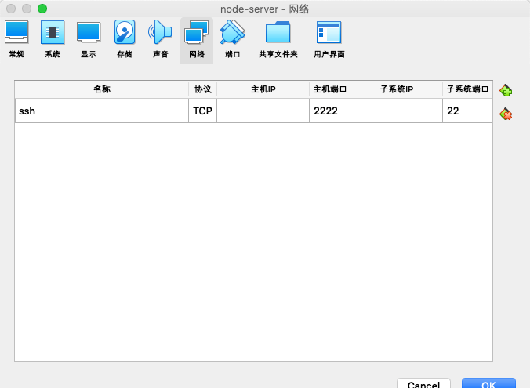
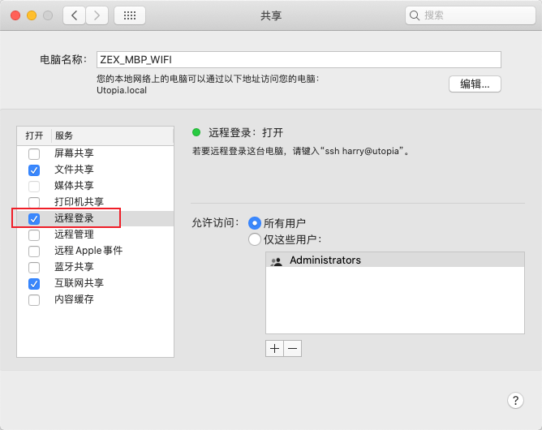
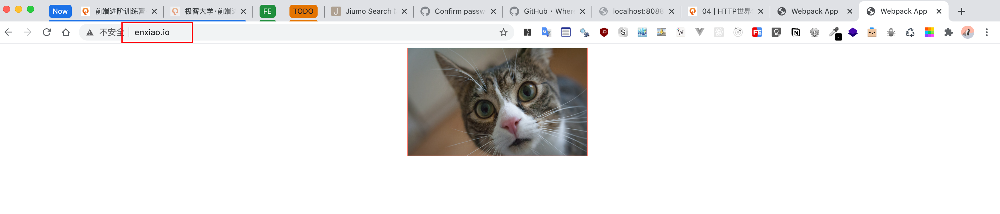

# 2. 发布系统 | 使用无头浏览器与DOM检查

[toc]

安装 SSH 否则无法将文件拷贝到 linux server 中

```shell
sudo apt install openssh-server
```

启动：

```shell
sudo service shh start
```

查看状态：

```shell
sudo service status
```


用本地机器链接 linux 虚拟机将文件拷贝到服务器，如果是一台真的 linux 机器，只需要知道它的 IP 地址就可以去链接，不过可能会遇到硬件防火墙阻止你访问某个 port，需要让防火墙将这个 port 开通。

这里我们先设置一下 `virtual box` 的端口转发，位置在：「设置」-> 「网络」->「高级」->「端口转发」：



我们将本地的 2222 端口转发到子系统也就是虚拟机上的 server 的 22 端口上。

接着，在 Mac OS 上我们需要将共享中的「远程登录」打开：



然后，我们再执行一下命令：

```shell
scp -P 2222 -r ./server enxiao@127.0.0.1:~
```

- `scp` 工具可以将文件从一台机器上拷贝到另一台机器中
- `-P 2222` 是要链接的端口
- 注意看用户名称是 `enxiao` 这个可以在 Ubuntu 虚拟机的终端中看到。
- `-r` 是可以将 `./server` 目录中的所有文件都拷贝过去


接着，我们在 linux 系统中 cd 到 `server` 目录，通过 `npm start` 启动服务器，服务器启动的默认端口地址是 `3000` ，我们需要在 `virtual box` 中设置一下端口转发，这里我们设置为 `80` 。


最后，我们在 mac 上通过浏览器访问 `localhost` 便可访问到在 linux 虚拟机中启动的服务器。（默认访问 80 端口）


### 使用自己的域名

接着我们来做个有趣的事情，用我们自己的域名来访问服务器，在系统根路径中，执行：

```shell
sudo vim /etc/hosts
```

打开系统 hosts 文件，在文件中添加一行：

```
127.0.0.1 enxiao.io
127.0.0.1 localhost
```

- 这里可以看到 `localhost` 实际上也是一个域名，映射的是 `127.0.0.1`

接着执行 `:wq` 保存并退出。

然后我们就可以在浏览器中，通过 `enxiao.io` 这个域名来访问位于 linux 中的服务器了。

当然，在公司或个人项目中，域名需要去单独购买，而不是像这样在用户的机器上直接更改 hosts


### 在 linux 上启动 publish-server

方法和之前启动 server 相同，先需要通过 `scp -P 2222 -r ./publish-server-vanilla enxiao@127.0.0.1:~` 发送到 linux 虚拟机，然后在 linux 下进入 `publish-server-vanilla` 目录执行 `node index.js` ，服务会启动在端口 `8081`，接着就是到 `virtual box` 中设置端口转发，比如 `8088` 端口。

好了，我们在 mac 上运行 tool，这时会在浏览器器中打开一个页面，页面中会有「publish」文本的超链接，这个页面是由 tool 访问 github 的 OAuth 鉴权之后重定向到 publish-server 之后返回的页面内容，点击超链接便可以将我们在 mac 上准备好的部署文件部署到 `server` 中。（目前是将 publish-server 中用 token 向 github 请求用户数据的逻辑删除了，因为出现了一些问题，这个之后真的要自己去研究 OAuth 的时候再去看看怎么解决）


### 将发布工具集成到工具链并创建项目 demo

先将 `publish-tool` link 到全局，在 `publish-tool` 目录中执行 `npm link` ，会得到如下信息：

```shell
$ npm link
npm WARN toy-publish-tool@1.0.0 No description
npm WARN toy-publish-tool@1.0.0 No repository field.

up to date in 0.37s

1 package is looking for funding
  run `npm fund` for details

/usr/local/lib/node_modules/toy-publish-tool -> /Users/harry/Documents/GeekTime-courses/Frontend-01-Template/week19/publish-tool
```

- 可以看到已经将 `publish-tool` 链接到全局的 `node_modules` 中了，之所以目录名称不是 `publish-tool` 是因为名称是以 `package.json` 中的 `name` 作为链接之后的名称。

然后在`toy-tool/templates/package.json` 的 `script` 字段加上 `publish` 命令：

```js
"scripts": {
    "start": "webpack-dev-server",
    "test": "mocha --require @babel/register",
    "coverage": "nyc mocha",
    "build": "webpack",
    "publish": "node /usr/local/lib/node_modules/toy-publish-tool/publish.js",
    "lint": "eslint ./src"
  },
```

接着，我们找一个新的空目录，执行 `yo toytool` 来生成新的带有 `publish` 工具的项目。

进入项目，在项目中执行 `npm run build` 构建要发布的文件。

最后执行 `npm run publish` 便可以将 `dist` 中的文件发布到位于 `linux` 的 `server` 中。


### 在项目 demo 中进行开发

既然我们有了项目，那么就可以模拟开发一下的过程，假设我们要开发一个之前在组件化部分已经做过的 Carousel。

我们将之前开发的东西都复制到 demo 项目中，这个过程会需要更改一些内容，比如引入像是 `createElement.js` `animation.js` `gesture.js` `cubicBezier.js` `my-css-loader.js` 等模块的时候，我们需要先将这些模块放到 `demo/lib` 中表示这些都是引入的库中的模块，因为像正式开发的时候，这些模块都是对于很多项目而言可以共用的，不应该见它们放在 `src` 作为项目本身的模块来使用：

```js
import { createElement, Text, Wrapper } from '../lib/createElement.js';
import { Timeline, Animation } from '../lib/animation.js';
```

如上这样，实际开发过程中引入应该是这样的：

```js
import { createElement, Text, Wrapper } from 'createElement.js';
import { Timeline, Animation } from 'animation.js';
```

这些模块都可能是位于 `node_modules` 中，可以是社区提供的库中引入，也可以是我们自己开发放到 npm 上的，也可以是公司开发放到公司内部的 npm 中的。

OK，最后我们按照流程在本地服务器中开发完毕之后执行 `npm run build` 进行打包，再执行 `npm run publish` 发送到服务器，我们就可以在自己的域名下看到新发布的页面了：



至此，我们从组件化到工具链的课程就完美的衔接了起来，同时，我们的所有课程内容也都结束了。


我们的课程选择从组件化到工具链到发布的授课顺序，是因为它正好完整的覆盖了**前端必要的工作流程**，这三个工程体系是前端工作中晋升或想要拿到一个比较资深的岗位所需要掌握的技能，因为这些是每个公司都能用上的技术。


## 课后补充

- 看合同是否承担你的五险一金
- 现在没有什么辅助阅读源码的书籍，因为源码的变化太快，书籍的出版跟不上源码的变化。
- 通过**天眼查**查看公司是否靠谱，上市公司看市值，非上市公司看融资情况还有公开的业务数据。
- 阅读源码这件事，是你对于其中某一块非常有兴趣可以去阅读，否则没有必要去读源码，比如 React 的 fiber 架构，其实对于全国来说都基本上没有公司在使用这种架构来写框架。
- 前端可视化方向是否可以花精力去投入？
  - 这个问题并非可视化这个方向怎么样，而是要考虑你个人在这个方面是否有兴趣和天赋。因为可视化比普通的前端要困难很多，需要对数据、图形、数学都有一定基础知识，并且任何方向都会有人去投入去做，而自己的选择非常的重要。
- 面试的时候你想要所有的问题都答到没有问题这是基本不可能的，面试的时候有不会的题很正常，有些连面试官都不知道，比如懂 fiber 的人就很少，但是有人要问。
- 面试中级前端，要问什么好？
  - 面试实际上是挖掘这个人身上最懂的地方和比较薄弱的地方。作为面试官你脑子里应该有一张前端知识体系的脑图，你可以先让这个人说我擅长什么地方，比如他说他擅长 HTML，你就可以顺着 HTML 分支去问，比如 JS，你就顺着 JS 去问，JS 可以去问一些语法的细节，你问一下来差不多就知道他的语法是否很熟练了。但是要记住，要问客观的，别问一些偏难怪的平时基本上用不到的问题。语法问了，就可以问下运行时的东西，比如闭包的运行时是什么样子的，可以用具体的代码去问，这样对应聘者比较友好。 
  - 然后就是要问一下编程相关的通用技能，你总得让面试者写点代码看看，就算是写最简单的冒泡排序也可以，或者是让面试者写一下自己比较熟悉的算法，然后让他讲一讲也可以。
  - 归根结底就是通过不断的提问了解面试者并知道面试者能够做什么样的工作。
- 去大厂怎么自我营销？
  - 我们课程第一节就在讲什么是业务性成就，什么是工程性成就，什么是技术性成就，你得先把成就做出来。成就是要有背景、目标、方案、实施、总结，这才是比较完整的成就。这样的成就越多，你能做的自我营销的效果就比较好。
- 腾讯喜欢用 leetcode 面试，那就刷 leetcode，leetcode 真的非常的贴心。
- 在公司里带人带团队需要懂些什么？
  - 带人带团队有不同的层次，比如 p6 说带人带团队，实际上是带人搞定业务，p7 带人带团队是将一个方向一个领域搞定，将一个领域内的所有问题和基础设施都搞定，比如工具链、组件化、持续集成和发布这些都是单独的领域。你搞定了一个领域，那么你这个团队就是一个 p7 级别，你能搞定整个前端就是 p8。
  - P6 搞定业务，是要将业务中的所有问题都要搞定，可以用各种各样的方法，甚至是和 PM 去聊需求。（这里也侧面说说明，实际上作为业务开发者不一定要将 PM 的所有需求都实现，要根据各方面的问题去思考是否应该实现？实现成什么样？或者是否有其他的方式去实现？还是说可以不实现？）
- 软技能和能力是需要训练的。
- 对于前端，上网的时候如果看到某种交互的效果可以去仿造，然后写写 blog 什么的。人不要给自己设限，人家阮一峰老师学前端学算法，你也可以。
- 衡量一个人要客观全面的看，不要总觉得有些东西是遥不可及的。要学习好的东西，看到别人做的不好的东西要共勉。
- 鼓励大家去掘金、B 站、infoQ 分享内容。
- 如果觉得 leetcode 已经很简单可以上 poj.org 
- 蚂蚁和阿里可以算是两个公司


