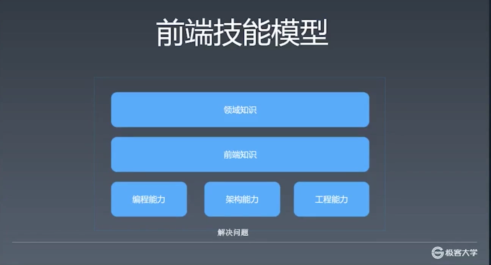

# 01 | 学习方法

[TOC]

学习方法是学习任何事物的一种方式，有效的学习方法能够提高学习成果，如果一门关于一个学科的进阶课程只讲这门学科的知识点，那其实并不能对大家非常有帮助，所以先来讲一讲学习方法。

## 思考问题

### 关于前端，你都会什么？

这个问题实际上是在问你的前端知识是否成体系。这就好比问你家叫前端的屋子里有什么东西，在没有整理分类东西杂乱无章的屋子里，可能看到什么就会说有什么。但如果屋子里的东西你时常都在整理，以某种体系将不同的东西划分到不同的柜子里、箱子中，架子上，甚至箱子里也有小盒子来装一些更特别更细小的东西。那么在回答这个问题的时候可能就会从这几个大块物件开始讲起，然后再说这些大块物件中的东西，这样的好处是，当你要寻找某个东西的时候你知道应该去哪里拿，而不是到处乱找。

同样的，任何领域或是专业的知识，也可以在某种体系之下进行分类整理，这整理的过程实际是在整理你大脑中对这一领域或专业知识的认识。

并且，整理和构建体系并不是做一次就够了，而是要不断的去整理，否则整理干净的屋子慢慢又会变得混乱。

> 其实，整理的前提是理解，如果不理解是没有办法将东西放到适合它的位置的。

## 前端技能模型

最下层肯定是为了解决问题，这是作为工程师在项目中时常要面对的。

作为前端工程师，解决前端项目中的问题就需要具备相关的能力，最基础的能力是：

- 编程能力
  - 这一部分包含了算法、数据结构以及使用语言本身的特性来解决特定的程序问题。比如是否能使用 JS 的 promise 来实现异步编程；或是能不能将一个复杂的逻辑梳理清楚进行分拆，最后实现。
  - 编程能力也是计算机岗位的基础。
- 架构能力
  - 架构能力与编程能力有一些模糊不清的界限，编程能力解决的是困难无法实现的问题，而架构能力是解决大而无法实现的问题。因为一个系统就算每一部分都能实现，但不代表系统本身是稳定可用的。架构能力包含了你对一个复杂系统进行分析，包含了你对复杂系统进行软件设计，以及多个程序员在代码实现上的管理。
- 工程能力
  - 如果说编程能力是解决难的问题，架构能力是解决大的问题，那么工程能力解决的就是人的问题，解决的是人多该怎么协作的问题。因为一般大型项目不会只安排一个程序员来开发，而是将多个程序员组织起来一起开发。那么面对多人开发时就会遇到如何管理如何协作的问题，比如我们用什么样的代码样子，用什么工具来管理代码，用什么工具来发布代码，如何保证在多人开发的情况下，代码的可维护性、稳定性的问题。工程问题如果处理不好，就算能够解决困难或大的问题，依然可能因为某个人的管理不当而造成项目开发延迟、搁置。

其实上面三种基础能力，不只是针对前端程序员，对于客户端、服务端或是游戏的程序员来说都是适用的。

那么前端程序员与其他程序员有什么不同呢？

主要的不同在于前端这个技术相关的知识，比如我们用的语言基本都是 JS，我们的界面描述会用 HTML，样式会用 CSS，还有很多浏览器 API 的知识。除了这些与编程本身有关的知识之外，还有比如如何精确的还原设计稿这样的软能力。

除了前端知识之外，再上面是「领域知识」。比如做电商（新零售），你除了了解新零售本身，还需要了解「埋点」，也叫「数据统计埋点」，像这样要做特定的工作领域时才能知道的知识，我们就叫「领域知识」。（如果想要了解领域知识，可以去 Qcon）

## 该如何提高？

知道了前端这些知识、能力之后，那该如何提高？

三块基础能力需要通过**刻意练习**来提高。

- 编程能力，刷题、练！
  - 前端一定用不到红黑树，但不一定就不去学，因为这是锻炼编程能力的一次练习。
  - 某个阿里程序员一个周末就能学会多种排序。
  - 刻意练习，不一定是用到才去练，如果有机会有时间就可以去练习\。
  - 练习忘记就忘吧，很正常，不要觉得要忘就不学，这也是一种非常功利的想法，学习的过程比学习的结果在某些时候更重要、更有趣。
  - （这里我想提一下，其实 winter 主要想说的是不要太过于功利的看待学习的问题，如果你真的对某一些东西感兴趣就去学，无论是否会用到。因为至少以我经验来看，学习某些东西的过程实际上是在激发自我的过程，并且有时也很开心，并且还会感到兴奋、好奇，整个过程是很积极的。）
- 架构能力
  - 读源代码，参与开源项目。
  - 不推荐通读源代码，建议带着目的去读。比如将项目跑起来去解决一个一个的 issue，这个过程其实对提高是最有效的。
- 工程能力
  - 选择合适工作，在公司中争取。

这门课程是教你建立前端知识体系，而不是要教你前端知识，就像是在杂乱的屋子里放上置物架，教你如何管理、分类、整理你的屋子。

在「重学前端」这门课程中，每一节都会有个小问题，比如 0.1 + 0.2 为什么不等于 0.3，这个问题本身是没有多大价值的，但要解决这个问题就需要运用到很多别的知识。如果你能很快说清楚这个问题，那么说明你的前端知识体系已经足够强壮。如果不能，那么就可以借助解答这个问题的过程来**建立前端知识体系**，而这个问题则成为了促进你构建知识体系的线索，而不是一个单独的知识点。

领域知识在这门课程中是不讲的，如果想要学习领域知识则需要到工作和实践中去学习和总结，当然也可以看一下别人的分享，像是在 Qcon 上的分享。

## 关于前端训练营

- 不教追新追热点的技术
  - 比如 vue 3.0 ，不如去看文档
  - 这里不教别处很难能找到的知识
- 不教包装建立应付面试的技巧
  - 真正的提高
  - 对企业、对社会要**负责任**
  - 不建议将课程中所做的模拟练习放到简历中，而是建议将课程中学到的知识运用到工作或个人项目中并产生的成果放到简历中，这个过程虽然很长，但很有价值。
- 不教找捷径图省事的本领
  - 只教会使你感到痛苦的知识，并且此课程是**帮助你应付痛苦**。

- 前端技术不是武林秘籍，**真正的能力是练出来的**
  - 这个课程的提高取决于自己，而不是 winter，投入的时间越多回报越高，**要努力**。（😭，现在回过头来看，自己只是简单的跟着学完了整个课程，虽然其中有些感兴趣的内容稍微多用了一些力气，但实际上整个过程并没有真正做到「努力」）

## 学习方法

### 整理法

整理知识其实是**建立关系**，将这些知识串联起来的时候，就不容易忘。

- 顺序关系
  - 每一个子节点是父节点的一个步骤，并有顺序。
  - 比如，编译
    1. 词法分析（对每一个词做分析）
    2. 语法分析（语法树到抽象语法树）
    3. 代码优化（对 AST 结构做一些优化）
    4. 代码生成
- 组合关系
  - 比如 CSS rules
    - 选择器（selector），比如包含 `*` `#`  `>`  `<`  `~` （符号）
    - 属性
    - 值
  - 父节点在描述一个事物，子节点描述事物的某一部分
- 维度关系（角度）
  - 比如 JS
    - 文法
      - 语法
      - 词法
    - 语义
    - 运行时（最终的效果）
- 分类关系
  - 比如 css 简单选择器
  - 特点是父类是一个集合，而每一个子类是父类的一个子集，属于父类。

### 完备性

建立知识体系除了关系之外还有**完备性**，不多也不少，一旦知识体系缺失一部分，就可能会导致整个知识体系的错误建立。

#### 工具：脑图

不要将脑图和脑图工具等同起来，写在纸上或是画在黑板上都是可以的。

（一些学习和思考方式可能也是错误的，比如 google 工程师，只需要英语和搜索，实际上能**够记住和理解更重要**）

- w3.org（最全的 html 文档网站）
  - w3.org/tr（所有技术索引页面）
- whatwg.org（参考人家是如何对 html 进行分类）
  - html 在 whatwg 才是一个比较有约束力的地方。
- mdn（文档网站，不太具有权威性，权威性需要去看标准）

### 追溯法

如何完备？比如这三个有差异怎么办？

追溯源头去查证知识，我们学习他人所说内容，不可不信也不可全信，自己需要对这些内容进行查证。追溯法其实就是要寻找线索。

比如 closure

- 首先 google
- 看一个看得过去的网站 ➡️ wiki
- 会发现有很多种意思
- 不要去看 wiki 本身，去看 history ，然后会发现是谁在什么时间定义的
- 然后给这个人发个邮件问他这个到底是什么意思。。。。。不是，是去 google scholar 搜索找到论文，打开，搜索 closure，ok，你开始会觉得很累，虽然你可能看不懂，但是这个**过程会很有收获**。

#### 大师

- 除了图片中大师 [Tim Berners-Lee](https://en.wikipedia.org/wiki/Tim_Berners-Lee) 、[Brendan Eich](https://en.wikipedia.org/wiki/Brendan_Eich) 、[Bjarne Stroustrup](https://en.wikipedia.org/wiki/Bjarne_Stroustrup) 以外，还有 TS 的创造人。
- 大师是把一辈子都投入其中的人。
- winter 和一些网红并非大师，因为他们是工程圈中的人，对很多东西缺少深刻的理解，不像大师几年几十年一辈子都投入其中专研某个特定的领域或是问题，更具有权威性。
- 学术圈和工程圈的人不同，学术圈才是定义这些概念的源头。 

#### 追溯法的案例1 - 面向对象的概念

- [Alan Kay](https://en.wikipedia.org/wiki/Alan_Kay) 面向对象之父
  - 在他眼中 C++ 的不是一个理想的面向对象语言。 
- 大师之间的言论是有冲突的，需要你去斟酌。**注意语境，注意是在什么情况下的所说的内容和所定义的概念**。不要去追求谁说的就是对的，要放在某种语境和角度去看待。

#### 追溯法的案例2 - MVC

- MVC 更复杂
- 不说正确的，只说来历
  - 右下，苹果的定义
  - 右上，MSDN（微软）
  - 左下，MVP 作者，某公司 CEO
  - 左上，最原始的 MVP 的论文作者
- MVC 实际上是历史上的公案，怎么做的都有。
- 有些事不是追求结论，错误还是对的，而是在**追溯的过程中获取知识**，对本质的理解。

#### 追溯法作业：面向对象

- 记录追溯的过程

> **整理**和**追溯**是建立知识体系的两种方法。在建立知识体系的过程中，两者都需要结合起来使用。

### 知识体系整理

- 自己去先建立，然后再对照，思考差异和原因。

> 多问为什么是了解[知识](https://wiki.mbalib.com/wiki/%E7%9F%A5%E8%AF%86)、获得[知识](https://wiki.mbalib.com/wiki/%E7%9F%A5%E8%AF%86)的途径。

## 面试

理解面试这件事，从而更好的学习和面试。

### 什么是好的面试题

三要素

- 区分度
  - 大草原算法题，所有人都不会。不好
  - 所有人都会的，也不好。
  - 区分度是指特别好的人答得特别好，中等好的人答得中等好，不好的人答得不好。
- 覆盖面
  - 如果要写一本前端的书，你的目录是什么样的。这个比较难，全覆盖。
  - 在浏览器中输入网站敲击回车到页面显示整个过程中涉及的内容。
- 深度

> 知乎 hax，面试题本身差，但是通过提示，引导，分解来让考察面试者。

> 网络上有很多偏难怪的题，这些题都不好，还有一些变态题也是。其实并不能很好的反应面试者的能力。

### 面试过程

- 打断

  - 打断意味着不感兴趣
  - 可能意味着离题，帮你节省时间
  - 打断是一种提示

- 争论

  - 面试官设计，和你争论的环节，是一种压力面试（管理岗）

  - 面试官不成熟

  - 想争论赢，用追溯法，论点、论据、论证

    - 克制情绪，既坚持又礼貌
    - 观点不重要，论据和论证更重要
    - 比如闭包，1964 年 某某人在某某杂志上发表的论文上，讲**来源信息**（这只是一个角度——来源），JS 中有 scope 这个私有属性（另一个角度——在 JS 中是如何表现的）
- 执行上下文，当初**在 TC39 上是如何讨论的**，因为现在邮件这些都是公开的。
    - 其实就算错了也没有关系，关键是为了证明自己的观点去寻找资料的方式是一种很难得而且很珍贵的态度。

- 难题

  - 展现分析过程，态度问题。
  - 缩小规模
    - 比如从计算机能完成的能力缩小到人能完成的问题，也就是人能够通过思考来获得解答的问题，在这个过程中获得一些灵感，说不定就能帮助你解答原题。

### 题目类型

- 项目型问题
  - 问你做过什么东西
- 知识型问题
  - 根据项目所做的东西问你相关知识点
- 开放型问题
  - 没有绝对正确的答案
- 排序问题
  - 是为了测验写代码和解决问题的能力，排序这种不算难但稍微有点绕的代码面试者是否能写出，用 sort 不香吗？
- 有趣的问题 
  - 微软问题：为什么下水井盖是圆的？有很多答案。希望你的开发性思维，有这样的问题说明面试官对你有期望。

### 面试官如何评判？

- 可能会因为一个问题否决一个人，也可能直接通过。这样的方式是错误的，造成很多人去学很多垃圾知识，然后屋子里很乱。
- 面试是展示一个人的过程，是否有知识体系的过程。
- 这也是为什么要建立知识体系，因为建立知识体系，你才能在面对不同的问题时从不同的角度去回答，并且只有在拥有知识体系的情况下，面对曾经没有面对过的问题时，能将其放入自己的知识体系中。
- 有些时候会遇到很差的面试官。

## 补充

- **建立知识体系并不是一蹴而就的，但是需要完备性，需要小修小改。**

- 学完之后，能够自己建立知识体系，自己去追溯，独门的理解。

- 微服务去听听 qcon

- 没有一个技术是需要学的，也没有一个技术是不需要学的，根据目的来说。

- 在一个好的公司，有问题都找你，P6，项目的核心和骨干。

- 至于最后是否是 P6，不取决于课，而取决于你自己这个人。

- 将来有什么打算？你要学什么东西？职业规划做的好，则职位也会按照这个走。是做纯技术，还是做技术管理。

- 你的职业目标是挣钱就好好挣钱！但是一般这样的职业目标的结果都不是很好。

- 年龄问题是 HR 搞出来的，重要的是学的怎么样，学的多久。

- 持续集成是工程管理中的一个很重要的一部分人，几个人来写专门的工具做检测。

- 选好领域，但要有价有市，而不是选择了一个没有市场需求的领域，毕竟你还是得先填饱肚子的。

- 组件化落地：原型 -> 领导 ->小团队落地 -> 领导 -> 大规模落地

## 涉及

### 参考链接：

- https://www.w3.org/
- http://w3school.com/
- https://whatwg.org/
- https://scholar.google.com/
- https://developer.mozilla.org/
- https://docs.microsoft.com/
- https://developer.apple.com/

### 随堂作业：

- 把面向对象这个概念用**追溯法**写一篇博文，写在自己的博客中，例如：博客园、稀土、掘金等，不限平台；你也可以写到 GitHub 的 Issues 里。把链接发到班级群里，跟大家分享。（不作为日常作业统计）
- 把**预习内容**的前端目录整理出来，和 winter 老师课件里的脑图或者课程目录做对比，思考一下为什么会有差别？

### 讲师提到的名词：

- QCon：全球软件开发大会（[ https://qcon.infoq.cn/2020/beijing/）](https://qcon.infoq.cn/2020/beijing/）)
- Closure：闭包（[ https://en.wikipedia.org/wiki/Closure_(computer_programming) ](https://en.wikipedia.org/wiki/Closure_(computer_programming))）
