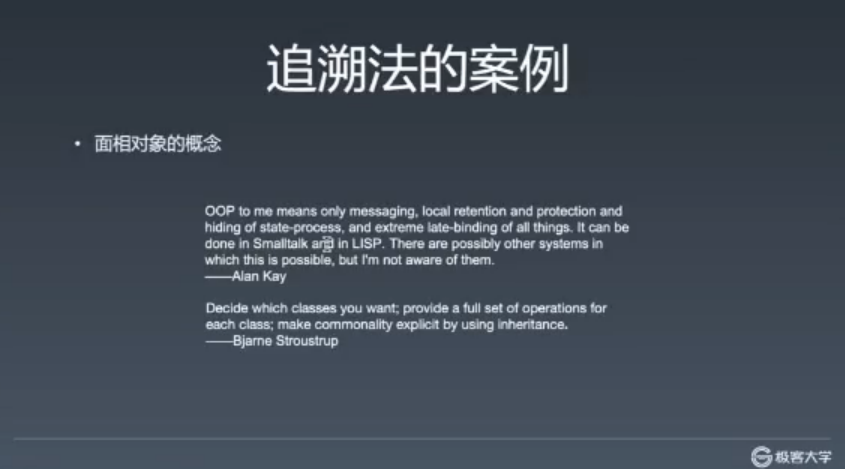
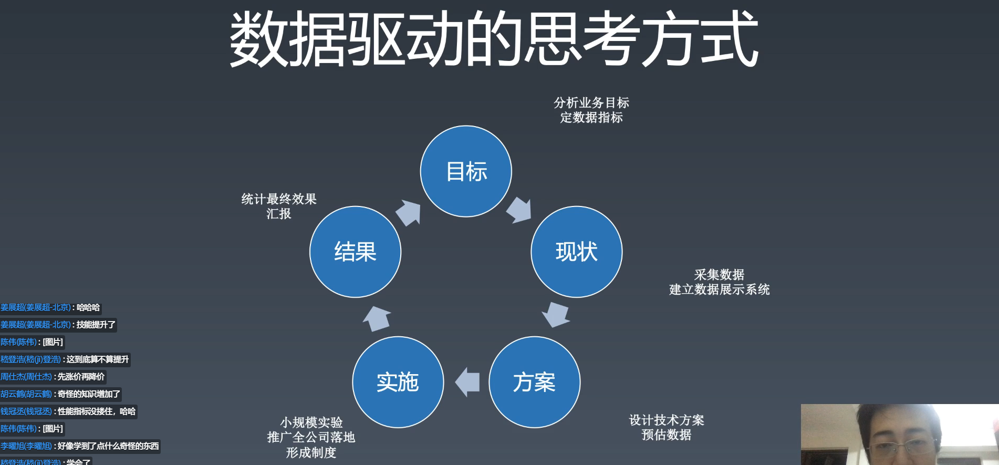
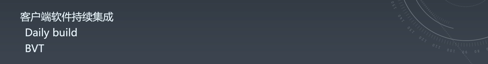

# 01 | 学习方法

[TOC]

学习方法是学习任何事物的一种方式，有效的学习方法能够提高学习成果，如果一门关于一个学科的进阶课程只讲这门学科的知识点，那其实并不能对大家非常有帮助，所以先来讲一讲学习方法。

    - 复杂问题的分拆、实现

  - 解决小而难的问题
- 能解决细小的问题，但是不一定能解决大的系统性问题。

- 架构能力
  - 对于复杂系统进行分析、设计，多个程序员的协同等
  - 解决大的问题
- 工程能力
  - 解决人的问题
    - 人多的时候该如何协作的问题
- 前端知识
  - 语言：TS、JS、HTML、CSS
  - 浏览器 API
  - 还原设计（CSS 是其他非前端程序员最难受的部分）
- 领域知识
  - 比如新零售
    - 埋点（数据统计埋点）
  - 极客邦 Qcon 学习领域知识


## 该如何提高？

知道了前端这些知识、能力之后，那该如何提高？

- 编程能力，刷题、练！
  - 前端一定用不到红黑树，但不一定就不去学，从不会到会。
  - 某个阿里程序员一个周末就能学会多种排序
  - 刻意练习，不一定是用到才去练
  - 忘，练习忘记就忘很正常，不要觉得要忘就不学
  - 不要工作中可能会用到的才学，而是有机会就去学
- 架构能力
  - 看源码，看项目
  - 不推荐通读源代码，建议带着目的去读。比如通过去解决一个一个的 issue 来逐步了解、熟悉项目（可以是开源项目）
- 工程能力
  - 选择合适工作，在公司中争取


建立知识体系，教你如何整理你的房间。

0.1 + 0.2 为什么，是**建立前端知识体系的线索**，而不是一个知识点。


## 关于前端训练营


- 不教追新追热点的技术
  - 比如 vue 3.0 ，不如去看文档
  - 这里不教到处都能找到的知识
- 不教包装建立应付面试的技巧
  - 真正的提高
  - 对企业、对社会要**负责任**
- 不教找捷径图省事的本领
  - 只教会使你感到痛苦的知识，并且此课程是**帮助你应付痛苦**

#### 前端技术不是武林秘籍，真正的能力是练出来的

- 这个课程的提高取决于自己，而不是 winter，投入的时间越多回报越高，要努力。

## 学习方法

### 整理法


整理知识**是建立关系**，将这些知识串联起来的时候，就不容易忘。

- 顺序关系
  - 每一个子节点是父节点的一个步骤，并有顺序。
  - 比如，编译
    1. 词法分析（对每一个词做分析）
    2. 语法分析（语法树到抽象语法树）
    3. 代码优化（对 AST 结构做一些优化）
    4. 代码生成
- 组合关系
  - 比如 CSS rules
    - 选择器（selector）* # > < （符号）
    - 属性（）[]
    - 值
  - 父节点在描述一个事物，子节点是事物的一部分
- 维度关系（角度）
  - 比如 JS
    - 词法
    - 文法
    - 语义
    - 运行时（最终的效果）
- 分类关系

### 完备性

建立知识体系除了关系之外还有**完备性**，不多也不少，一旦知识体系缺失一部分，就可能会导致整个知识体系的错误建立。


### 工具：脑图

- 写在纸上或是黑板上都无所谓


（一些学习和思考方式可能也是错误的，比如 google 工程师，只需要英语和搜索，实际上能**够记住和理解更重要**）

- w3.org（最全的 html 文档网站）
  - w3.org/tr（所有技术索引页面）

- whatwg.org（参考人家是如何对 html 进行分类）
- mdn


### 追溯法

如何完备？比如这三个有差异怎么办？


追溯源头去查证知识

比如 closure

- 首先 google
- 看一个看得过去的网站 ---》 wiki
- 会发现有很多种意思
- 不要去看 wiki 本身，去看 history ，然后会发现是谁在什么时间定义的
- 然后给这个人发个邮件问他这个到底是什么意思。。。。。不是，是去 google scholar 搜索找到论文，打开，搜索 closure，ok，你开始会觉得很累，虽然你可能看不懂，但是这个**过程会很有收获**。


#### 大师

- 除了图片中大师以外，还有 TS 的创造人。
- 大师是把一辈子都投入其中的。
- winter 和一些网红并非大师，因为他们是工程圈中的人，对很多东西缺少深刻的理解，不像大师几年几十年都投入其中专研某个特定的领域或是问题。

#### 追溯法的案例1 - 面向对象的概念



- Alan Kay 面向对象之父
  - 在他眼中 C++ 的不是一个理想的面向对象语言。
- 大师之间的言论是有冲突的，需要你去斟酌。**注意语境，注意是在什么情况下的概念**。


#### 追溯法的案例2 - MVC


- MVC 更复杂
- 不说正确的，只说来历
  - 右下，苹果的定义
  - 右上，MSDN（微软）
  - 左下，MVP 作者，某公司 CEO
  - 左上，最原始的 MVP 的论文作者
- MVC 实际上是历史上的公案，怎么做的都有。
- 有些事不是追求结论，错误还是对的，而是在**追溯的过程中获取知识**
- 本质的理解，本质是个人的理解，世界只存在其表象。


#### 追溯法作业：面向对象

- 记录追溯的过程


### 知识体系整理


- 自己去先建立，然后再对照，思考差异和原因。


> **整理**和**追溯**是建立知识体系的两种方法。


## 面试


理解面试这件事，从而更好的学习和面试。

### 什么是好的面试题


三要素

- 区分度
  - 大草原算法题，所有人都不会。不好
  - 所有人都会的，也不好。
- 覆盖面
  - 如果要写一本前端的书，你的目录是什么样的。这个比较难，全覆盖。
- 深度


> 知乎 hax，面试题本身差，但是通过提示，引导，分解来让考察面试者。


### 面试过程


- 打断

  - 可能意味着离题，帮你节省时间
  - 打断是一种提示

- 争论

  - 面试官设计，和你争论的环节，是一种压力面试（管理岗）

  - 面试官不成熟

  - 想争论赢，用追溯法，论点、论据、论证

    - 克制情绪，谦虚
    - 论点不重要，论据和论证更重要
    - 比如闭包，1964 年 某某人在某某杂志上发表的论文上，讲**来源信息**

    - 执行上下文，当初**在 TC39 上是如何讨论的**，因为现在邮件这些都是公开的

- 难题

  - 展现分析过程
  - 缩小规模
    - 比如从计算机能完成的能力缩小到人能完成的问题

### 题目类型


- 排序问题
  - 是为了测验写代码和解决问题的能力，用 sort 不香吗？
- 有趣的问题
  - 微软问题：为什么下水井盖是圆的？有很多答案。希望你的开发性思维，有这样的问题说明面试官对你有期望。

### 面试官何评判？

- 可能会因为一个问题否决一个人，也可能直接通过。这样的方式是错误的，造成很多人去学很多垃圾知识，然后屋子里很乱。

- 面试是展示一个人是否有知识体系的过程。

- 有些时候会遇到很差的面试官。


## 零碎小点

- 建立知识体系并不是一蹴而就的，但是需要完备性，需要小修小改。

- 学完之后，能够自己建立知识体系，自己去追溯，独门的理解。

- 微服务去听听 qcon

- 没有一个技术是需要学的，也没有一个技术是不需要学的，根据目的来说。

- 在一个好的公司，有问题都找你，P6，项目的核心和骨干。

- 至于最后是否是 P6，不取决于课，而取决于你自己这个人。

- 将来有什么打算？你要学什么东西？职业规划做的好，则职位也会按照这个走。是做纯技术，还是做技术管理。

- 你的职业目标是挣钱就好好挣钱！但是一般这样的职业目标的结果都不是很好。

- 年龄问题是 HR 搞出来的，重要的是学的怎么样，学的多久。

- 持续集成是工程管理中的一个很重要的一部分人，几个人来写专门的工具做检测。

- 选好领域，但要有价有市，而不是选择了一个没有市场需求的领域，毕竟你还是得先填饱肚子的。

- 组件化落地：原型 -》 领导 -》小团队落地 -》 领导 -》 大规模落地


## 涉及

### 参考链接：

- https://www.w3.org/
- http://w3school.com/
- https://whatwg.org/
- https://scholar.google.com/
- https://developer.mozilla.org/
- https://docs.microsoft.com/
- https://developer.apple.com/

### 随堂作业：

- 把面向对象这个概念用**追溯法**写一篇博文，写在自己的博客中，例如：博客园、稀土、掘金等，不限平台；你也可以写到 GitHub 的 Issues 里。把链接发到班级群里，跟大家分享。（不作为日常作业统计）
- 把**预习内容**的前端目录整理出来，和 winter 老师课件里的脑图或者课程目录做对比，思考一下为什么会有差别？

### 讲师提到的名词：

- QCon：全球软件开发大会（[ https://qcon.infoq.cn/2020/beijing/）](https://qcon.infoq.cn/2020/beijing/）)
- Closure：闭包（[ https://en.wikipedia.org/wiki/Closure_(computer_programming) ](https://en.wikipedia.org/wiki/Closure_(computer_programming))）


# 02 | 构建知识体系

[TOC]

### ECMA-262 标准：

- 下载地址：https://www.ecma-international.org/publications/standards/Ecma-262.htm
- 最新的 draft ：https://tc39.es/ecma262/
- 如果对不需要了解新特性，也可以下载阅读 5.1 稳定版本。而且新版内容过多，可能造成阅读上的困难。

除了通过 ECMA 官网来查看关于 ECMAScript 的标准之外，也可以通过以下的途径：

- MDN：https://developer.mozilla.org/en-US/docs/Web

- Whatwg：https://whatwg.org/
- w3c：https://www.w3.org/TR/?tag=css&status=wd

英文问题：

- 好一点的资料基本都是英文的

- 外语好坏没差别，一开始都很费劲，需要你不断的查和理解，比如 ECMA-262 这个规范的 4.3 节可以看到定义了很多词，这些词很多跟英文原来的词没有太大的关系，这个东西靠你读的多了就慢慢知道了。

## 前端技术

### HTML

**继承**了三个方面的内容

#### 1. 通用的计算机语言

##### 语法

可以直接在 https://html.spec.whatwg.org/multipage/syntax.html#syntax 找到语法的实现

```HTML
<html lang=en lang="en" leng='en'>
  text
</html>
```

以上的像是 `<` `html` `lang` `=` `en` `"en"` `'en'` `>` `</html>` 都会变为词，都会有不同的语义，如果想要知道 HTML 中有多少种词，可以去规范种搜索 `Emit` ，比如 tag token

##### 词法

#### 2. SGML

很早，诞生于计算机软件时代，用于做图书管理的语言。这里并不是要研究 SGML，而是要知道 SGML 对 HTML 带来了什么特点。

##### DTD

在 google 搜索：“html4 dtd” 可以查看到 DTD 在 html 中的使用：

```HTML
<!DOCTYPE HTML PUBLIC "-//W3C//DTD HTML 4.01//EN"
            "http://www.w3.org/TR/html4/strict.dtd">
    <html>
    <head>
    ...
    </head>
    <body>
    ...
    </body>
    </html>
```

打开：http://w3.org/TR/xhtml1/DTD/xhtml1-strict.dtd 可以看到一份对于当前 html 文档的定义，也就是可以使用哪些标签和哪些实体（Entity）

##### Entity

实体（在 HTML 语境下就是 & 符后边的东西）

虽然 DTD 定义标签的部分已被 HTML5 所抛弃，但是其中关于 Entity 的定义也可以作为一个参考，访问这个地址https://www.w3.org/TR/xhtml1/DTD/xhtml-special.ent可以下载．大概内容如下：

```html
<!-- C0 Controls and Basic Latin -->
<!ENTITY quot    "&#34;"> <!--  quotation mark, U+0022 ISOnum -->
<!ENTITY amp     "&#38;#38;"> <!--  ampersand, U+0026 ISOnum -->
<!ENTITY lt      "&#38;#60;"> <!--  less-than sign, U+003C ISOnum -->
<!ENTITY gt      "&#62;"> <!--  greater-than sign, U+003E ISOnum -->
<!ENTITY apos	 "&#39;"> <!--  apostrophe = APL quote, U+0027 ISOnum -->
```


#### 3. XML

##### Namespace

html 中允许出现的 namespace 有如下：

- svg
- mathml
- aria
  - Accessible Rich Internet Applications（[ https://www.w3.org/TR/html-aria/）](https://www.w3.org/TR/html-aria/）)
  - 在国外如果缺少 aria 可能被告，aria 给标签添加了 role，用于其他无障碍阅读

##### Tag

- 可以在这里找到所有 Tag：https://developer.mozilla.org/zh-CN/docs/Web/HTML/Element，
- 也可以在 https://html.spec.whatwg.org/multipage/semantics.html#semantics 的第 4 章中找到，可以学习其分类。

### JS

#### Grammar

Grammar 分 lexical 和 syntax

##### lex

所有的语言都有 inputElement ，也就是输入的最小元素，JS 有四种 inputElement（具体去看 ECMA-262 文档）

```
InputElement
	WhiteSpace 空格
	LineTerminator 换行符（回车）
	Comment 注释
	Token 有效的输入（比如上面的注释、空格、换行符都是会被忽略的）
    Identifier 标识符（变量名、函数名、属性名等）
    Keywords （class、function、if 等）
    Punctuator （+、-、*，其中 / 被单独拿出，为了与正则解决语法冲突）
    NumericLiteral（数字字面值、字面量、直接量，比如 2.3等）
    StringLiteral（字符串字面量，""、'1'等）
    RegularExpressionLiteral（正则表达式直接量）
    Template（字符串模板）
```

##### Syntax

 ECMA-262部分：A2 - A5

```js
if(a < 100)
  b += a++

会将上面语句分析为下面这样的数据树，为计算机所理解：
IfStatement
	Expression
  Statement
  	Expression
    	=
      	b
				Expression
        	a++
```

- Atom
- Expression
- Structual
- Script & module

#### runtime 运行时

##### Type

- 七种基本类型

- 内部类型

  - Reference

  - ```js
    a.b = 3
    
    delete a.b
    delete 3 //这里不合理，虽然 a.b === 3 但是 a.b 和 3 并不是同一种类型，a.b 是 Reference 类型
    ```

- ...

##### 执行过程

```
Job
	Script/Module
		Promise
			Function
				Statement
					Expression
						Literal
						Identifier
```

执行过程的边界：大到 Job，小到 Literal 和 Identifier

#### semantics 语义

### CSS

凡是严格定义的计算机语言都有“语法”和“词法”，包括 css

```
stylesheet
	:	[ @charset STRING ';']?
		[ @import ]*
		[ [ ruleset | @media | @page ]]
	;
```

Selector 是独立的标准，而非 CSS 独有，不在 CSS 标准内

### API（环境）

#### Brower

前端最重要的一块环境

#### Node

#### Electron

#### 小程序

web platform API - 这些 API 既不属于 DOM 也不属于 BOM

## 其他

脑图的关键：

- 思路
- 以及自己的补全

### 英文

因为来源是英文，所以需要多看英文来理解，中文的翻译反而可能要重新去理解，或是要借着英文来理解。英文的专业名称很多也是临时想的，也不是很好查找。

架构能力

- 只要你能实现大的应用，无论使用什么土方法都是可以

## 涉及

### 参考链接：

**主要参考网站：**

- https://www.ecma-international.org/
- https://developer.mozilla.org/en-US/docs/Web
- https://whatwg.org/

**课上涉及网址：**

- https://www.ecma-international.org/publications/files/ECMA-ST/ECMA-262.pdf
- https://www.w3school.com.cn/html/html_entities.asp
- https://www.w3.org/1999/xhtml/
- https://html.spec.whatwg.org/multipage/
- https://developer.mozilla.org/zh-CN/docs/Web/HTML/Element

### 参考文件：

**请学员们在课件中查看**（链接: [https://pan.baidu.com/s/1ET3y5eexynf6xJKpNwHMRw ](https://pan.baidu.com/s/1ET3y5eexynf6xJKpNwHMRw)密码:nepb）

- 前端技术 2.xmind
- ECMA-262.pdf
- html-standard.pdf

### 参考名词：

- XMind：思维导图软件（[ https://www.xmind.cn/）](https://www.xmind.cn/）)
- DTD：Document Type Definition（[ https://www.w3.org/TR/xhtml1/DTD/xhtml1-strict.dtd）](https://www.w3.org/TR/xhtml1/DTD/xhtml1-strict.dtd）)
- Entity：实体（在 HTML 语境下就是 & 符后边的东西）
- ARIA：Accessible Rich Internet Applications（[ https://www.w3.org/TR/html-aria/）](https://www.w3.org/TR/html-aria/）)
- Token：有效的输入元素
- Comment：注释
- WhiteSpace：空白符
- Line Terminator：行终止符
- Atom：原子
- Semantics：语义
- Runtime：运行时

### 其他有助于你理解的知识（选看）：

- 计算机组成原理
- 操作系统
- 编译原理
- 学员给出的课上参考代码：

> Array.prototype.map.call($0.querySelectorAll(‘code’), e => e.innerText).join(’\n’)


# 03 | 工程体系

[toc]

## 问答

#### 看开源项目（这部分要重新看)

1. 帮写文档
2. fix bug

3. 单步追踪
4. 提交作者review

数据->线性表

- 每个人的学习方法论不同

#### 数据结构

- 学会使用 hash 是解决排序的一个很有效的方式
- 不可用 hash 的可用二叉树
- 练 leetcode 是锻炼思维的方式，有些题没有实用性，有些有。


## 正式课程

### 数据驱动的思考方式



#### 目标

很多人有一个毛病，一来就出发，没有目标。

首先应该要有一个目标而不是方案，而目标是分析业务目标和指标。比如促进用户活跃和提高营收，单这两个业务不具体，那就应该用某个指标来具化。那“用户活跃”是“日活/月活”（互联网公司的很多财报会使用这个指标数据），月活是指这个用户这个月用过你的产品一次。要保持这种活跃度的方法有签到、游戏等。

淘宝指标三要素：

- 流量
- 转化率
- 客单价

所以要知道这个公司所认可的指标是什么，这样才能够获得晋升。所以，你的一切成果都要和这些指标牵扯上关系才行。

技术好，**业务敏感度高**。

告诉增长的公司可以掩盖一切的问题，而营收业务等不提高，老板就会感到不安，就会采取很多不合理的方案，比如加班、“节约用纸”等。

#### 现状

采集数据，并用这些数据进行对比，对比是一个非常好的汇报方式。

#### 方案

方案的提出需要一个预估的数据，而非各种“一定”等非常不具化的非数据的说法。

#### 实施

当你不确定这个方案的影响时，那就先小规模实验，拿到一部分实现结果数据，再决定是否继续使用这个方案。

#### 结果

老黄牛就是做了很多事情但是不汇报，其实最好是都要给老板汇报，不正式就说一下，正式就需要约个时间。汇报是非常重要的，不汇报等于没有做。（这里的老板一般是上级或是上上级）

很多时候不是老板没时间，而是你不敢做，或者你觉得做的没价值。


> 信任是逐渐建立起来的。


误区：不是只有产品才和业务之间有直接关系。

好的工程师需要非常了解业务，因为你是用技术来为业务创造价值的。

### 前端技能模型


#### 领域知识

你的公司和你公司业务所再得领域知识。

#### 架构能力

- 组件化

#### 工程能力

- 工具链
- 持续集成


### 工具链


工具链中四个有价值的工具：

- 脚手架（init）
- 本地调试（run）
  - 本地跑起来
  - build 是隐藏在run 和 publish 之中的
- 单元调试（test）
- 发布（publish）

工具链体系设计的两个问题：

- 版本问题
  - 同一个团队用相同的工具版本
- 数据统计
  - 比如每个组件使用和报错的比例
  - run、test、publish 等的时间和次数
  - 将这些数据可视化，可以很容易发现问题

### 持续集成

#### 客户端



客户端软件（比如office系列）是需要 `build` 的，一次 build 可能需要七八个小时，所以就少 build。

早期就有各自做各自的模块，最后集成。（最终集成）

持续集成是很短的时间一次集成，比如每天（Daily build），当初提出是非常先进的概念。有一台专门用于 build 的机器，用一个软件，比如 BVT（检查这个build好不好，一般是测试工程师来写的）。

客户端软件架构复杂，软件模块依赖容易出问题。

前端有一个特点：页面间自然解耦，因为两个页面很难耦合，可能会用 postMessage 造成耦合。

#### 前端


到了前端持续集成会有调整，比如 Daily build 改为每一次更改就 build 一次。


> 无头浏览器（看不见的浏览器），不渲染，但可以生成为 DOM 树，不消耗渲染资源。


### 技术架构


客户端架构师会去做：

- 模块
- 解耦
- 分层
- 模块与分层上设计大量的测试用例，保证解耦。

服务端架构的业务不复杂，但是需要解决大量的用户带来的复杂性，这会涉及到物理架构和逻辑架构。对于淘宝，就算是下单也有一百多种逻辑。

#### 前端架构解决的问题

大量页面需求带来的重复劳动问题。


提高复用率！！！

#### 如何复用


三个层次

- 库 - 有复用价值的代码

  - URL
    - 将 URL 拆分成不同的部分
    - 解析 url 的正则，根据 [url 标准文档](https://tools.ietf.org/)（IETF 组织）来统一写
  - AJAX
    - 由于各个公司的不同会有不同的库
    - 各种开源的 ajax 其实对于大公司而言都不可用，因为要防止很多网络攻击，所以需要写大量的代码来进行防止。
  - ENV
    - 判断环境，是否是处于微信的环境里，是否是在某个浏览器里，ipad 或是 iphone 里。
    - 如果要用正则会使用到太多的知识了，因为有很多各种奇怪的垃圾知识（没有太多作用的知识，不过这个也不一定）

- 组件 - UI 上多次出现的元素

  - 比如
    - 轮播
    - Tab
  - 组件化，需要一定的规范来规划的，而不是随便写，这样会导致各种不同的调用方式。
  - 遵循一定的规则，组件之间可以很容易的组合在一起使用。
  - 现在都是基于框架的规范的组件，比如 React 和 Vue，React 会有 class 的和使用 hook 的 function 的

- 业务模块 - 经常被使用的**业务区块**

  - 登录
  - （比如我们公司的 UDFramework，快速搭建一个搜索列表页面）

  

## 问答

#### vue 组件怎么在 react 中使用？

- 这个问题很复杂，不行就看源码重新吧。

#### 如何判断是垃圾知识？

- 空间：这个知识在另一个地方就完全用不到。
- 时间：这个知识随着某个技术过期可能再也用不到。

#### 打好基础，具体指什么？

- 上学阶段是训练编程能力，因为可以有很多时间刷题，毕竟刷题也是很有意思的。
- 过了大学就可能需要几倍的时间去补。


> 看一个人有没有潜力，就是眼里有没有活，找到一个业务做出来。

#### 设计模式

Java 很需要，JavaScript 不是很需要，如果没有感觉到设计模式对你的呼唤可以不用去学，不用刻意的去追求。

####  AB 测试

两部分：

- AB 发布
- AB 埋点

#### 好的组件需要满足条件

这个后面

#### 单元测试

mocha，参考开源项目，比如：[spriteJS（360 的项目）](https://github.com/spritejs/spritejs)

#### 基础和功能实现的时间分配

- 小孩子才做选择，成年人都要。
- 投入更多的精力，少睡点觉去学，现实就是这么的残酷。

#### node 

- node 写工具非常好。
- 但是要作为服务器，与线上用户有关需要小心。

#### 怎么看待重构的代码

- 老代码，等业务更新才重构，业务改动时顺手改。

#### 阿里的 code view 怎么进行的

- 阿里没有严格流程，想做没有做好的东西

#### 如何提升代码质量

1. 实践，写的多了就能慢慢提升水平。
2. 开源项目的参与和学习，学而不思则罔，思而不学则殆。

#### 前端优化 = 性能优化

- 看上面“数据驱动的思考方式“的图，这张是做事的思考方式。
- 阿里手淘有 40 多条 check lish 用于性能优化，是五个循环做出来的，而非一次性做出来的。
- 例子
  - DNS 很多时候会消耗请求时间

#### 内存泄漏

内存泄漏与前端没有太大关系，而是内存占用太多的问题，一般是图片太多。如今比较多的是浏览器或是客户端的 bug 造成的内存占用问题。去分析一般是内存中图片展开的问题。

### 进阿里

关键是能力要够而不是年限


#### 面试

面试就是以上这些问题，你是要用能力来证明。

#### spa 导致内存占用过多

- 开发者工具 - momory

#### 确定问题的方法

二分法确认问题，删一半的代码去确认内存占用。

#### 如何千星 github

- 做一个能够帮助到大家的项目，而不是为千星而写项目

#### 推广项目

- 去各种网站推广，比如 staoverflow

### 作业

- 写一下 url 的解析库。


## 课程涉及

### 参考链接：

- https://fed.taobao.org/blog/taofed/do71ct/fed-learning-quizzes-apply/?spm=taofed.blogs.blog-list.9.44fe5ac8p6qg66
- https://tools.ietf.org/html/rfc3986
- https://svn.apache.org/repos/asf/labs/webarch/trunk/uri/rev-2002/issues.html
- https://tools.ietf.org/
- https://github.com/spritejs/spritejs
- https://spritejs.org/#/

### 随堂作业：

- 把库里边的 URL 解析代码写一下

### 参考名词：

- UV：（Unique Visitor）独立访客，统计 1 天内访问某站点的用户数 (以 cookie 为依据)，如果清除了 cookies 或者更换设备访问，计数会加 1。按用户算的，比较真实一点。
- PV：（Page View）访问量, 即页面浏览量或点击量，在一定统计周期内用户每打开或刷新一个页面就记录 1 次。
- ctr：点击率（click-through rate）
- 判断用户活跃度：日活除以月活
- CICD：持续集成 (Continuous Integration) 和持续部署 (Continuous Deployment) 简称。
- SpriteJS：是跨平台的高性能图形系统，它能够支持 web、node、桌面应用和小程序的图形绘制和实现各种动画效果。
- 前端之巅：InfoQ 旗下关注大前端的技术社群
- 龙书：《编译原理》