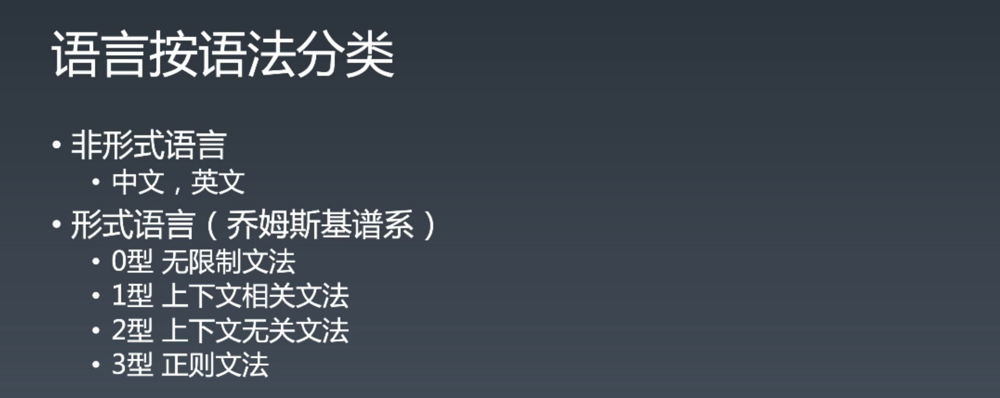
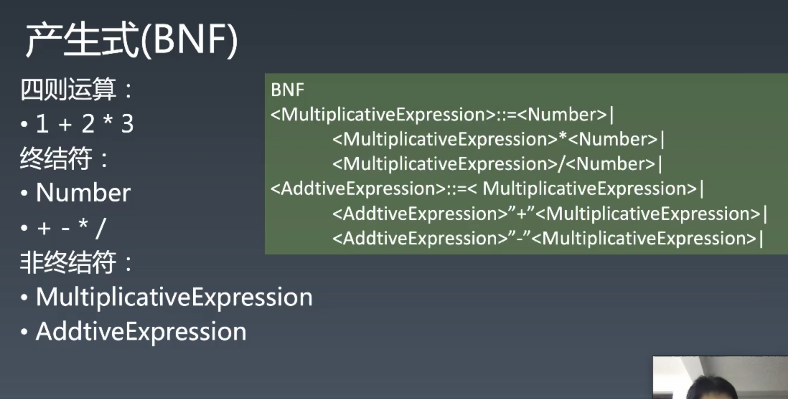
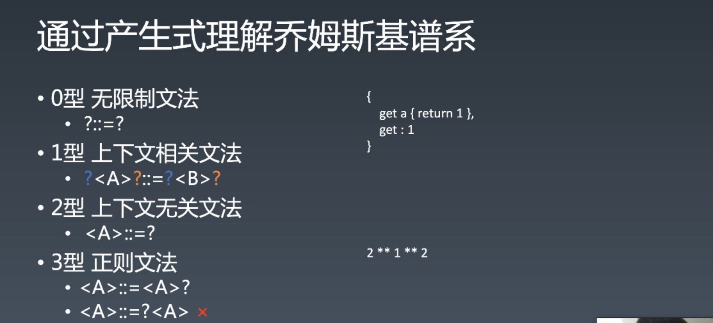
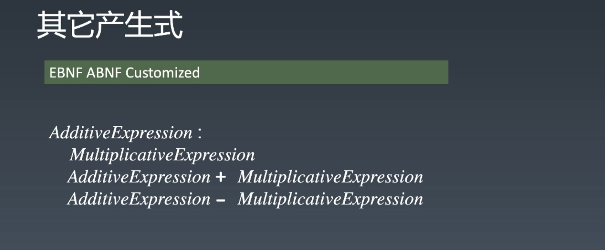
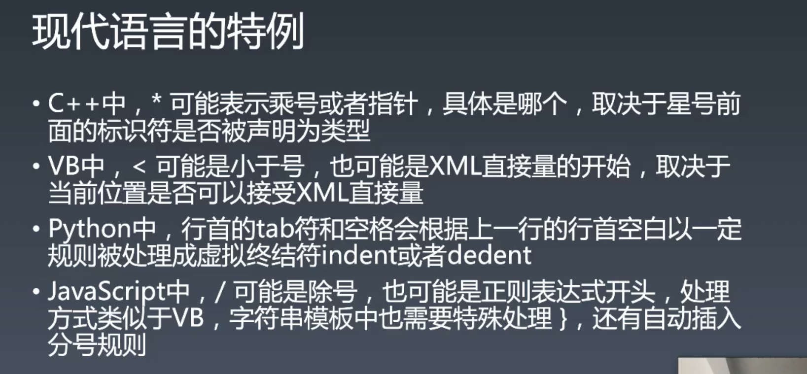
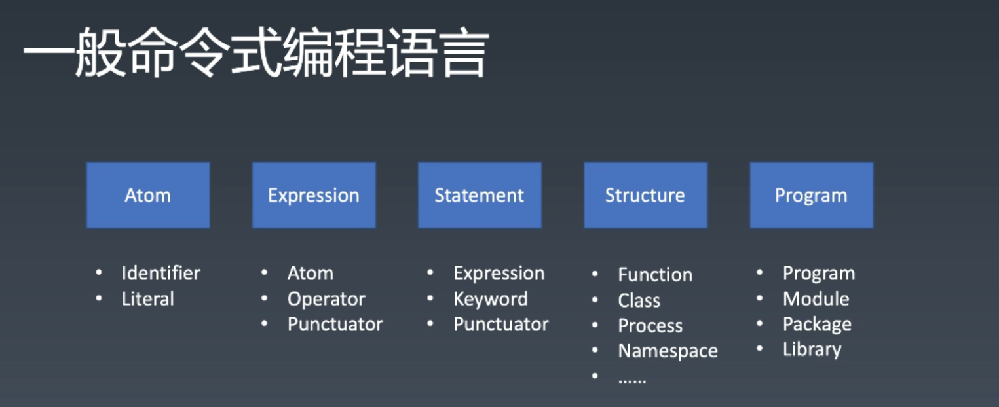
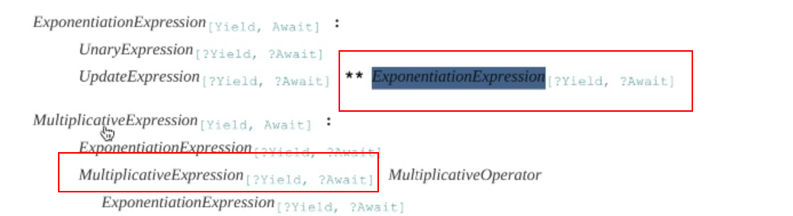

# 重学 JavaScript | 编程语言通识与JavaScript语言设计

[TOC]

这门课程与极客时间上**重学前端**重合度很高，也就是说可以看**重学前端**来进行预习。

## 编程语言通识

> 「编程语言通识」来源于多门语言的学习和总结。

编程语言通识实际上也是在讲如何定义一门语言。

### 语言按语法分类



- 人类语言是**非形式语言**且非严格的，与之相比，计算机语言是**形式语言**且严格的。

#### 什么是形式语言（乔姆斯基谱系）

- 50 年代是计算机时代的黄金期，函数式也是在那个时期提出的。
- [乔姆斯基谱系](https://zh.wikipedia.org/wiki/%E4%B9%94%E5%A7%86%E6%96%AF%E5%9F%BA%E8%B0%B1%E7%B3%BB)已经过了 50 年了，但乔姆斯基谱系依然是可以帮助我们定义语言的谱系。

##### 0型 无限制文法

##### 1型 上下文相关文法

##### 2型 上下文无关文法

计算机语言基本上是**大部分**上下文无关文法，比如 JS ，这样让做编译器（引擎）的也会相对好实现一些。

##### 3型 正则文法

概括：能用正则表达式表示的文法。对表达能力的限制非常强。


现代语言基本上会采取一种折中的办法，会把所有的文法分为词法和语法两部分，先将文本变为单独的词，再将词作为输入流做语法分析。


### 产生式-BNF

要理解形式语言需要了解产生式，产生式是通过一种文本符合的形式来描述和定义语言的方式，有多种，这里介绍[巴科斯范式（BNF）](https://zh.wikipedia.org/wiki/%E5%B7%B4%E7%A7%91%E6%96%AF%E8%8C%83%E5%BC%8F)：


> 英文中的符号都叫：symbol


做一个练习，假设一种语言只能用 a 和 b 两种字符组成，在这里引号为终结符，尖括号为非终结符：

```
一种能用 a 和 b 两种字符组成
终结符 "a"
终结符 "b"

非终结符：<Program>
<Program> ::= "a"+ | "b"+
BNF 最重要的技巧是可以递归：
<Program> ::= <Program> "a"+ | <Program> "b"+
```

- 这里有两个终结符：`"a"` `"b"` ，一个非终结符 `<Program>` 
- 通过递归可以形成更复杂的结构
- 比如可以是 `aaaa` 和 `bbbbb` ，递归则可以实现 `ababab` `bababab` 这样的结构


定义加法，并且可以连加，整数加法：

```
定义number
<Number> ::= "0" | "1" | "2" | ... | "9"

<DecimalNumber> ::= "0" | (("1" | "2" | ... | "9") <Number>*) 
- 十进制：对应的是 0 | 1~9 0~9*
- 比如 123812738912 但 01 不合法

<Expression> ::= <DecimalNumber> | <Expression> "+" <DecimalNumber>
```

定义四则运算：



> ```
> winter:
> 
> <Number> = "0" | "1" | "2" | ..... | "9"
> 
> <DecimalNumber> = "0" | (("1" | "2" | ..... | "9") <Number>* )
> 
> <PrimaryExpression> = <DecimalNumber> |
>     "(" <LogicalExpression> ")"
> 
> <MultiplicativeExpression> = <PrimaryExpression> | 
>     <MultiplicativeExpression> "*" <PrimaryExpression>| 
>     <MultiplicativeExpression> "/" <PrimaryExpression>
> 
> <AdditiveExpression> = <MultiplicativeExpression> | 
>     <AdditiveExpression> "+" <MultiplicativeExpression> | 
>     <AdditiveExpression> "-" <MultiplicativeExpression>
> 
> <LogicalExpression> = <AdditiveExpression> | 
>     <LogicalExpression> "||" <AdditiveExpression> | 
>     <LogicalExpression> "&&" <AdditiveExpression>
> ```

- 这里最需要注意的是替代关系，比如 `<PrimaryExpression>` 可以是 `<DecimalNumber>` 所以可以认为 `<MultiplicativeExpression> = <PrimaryExpression>` 也就是 `<MultiplicativeExpression> = <DecimalNumber>` ，用 `<DecimalNumber>` 替换掉 `<PrimaryExpression>` 

当计算机拿到写好的代码字符，要怎么去执行这些代码所安排的运行任务？

- 这是一个很复杂的过程，解析代码的过程叫做语法分析，语法分析最常见的算法是 LR 和 LL，之后会有相关练习让大家感受。


### 通过产生式理解乔姆斯基谱系



#### 无限制文法

等号左边与右边可以有多个非终结符，比如：

```
<a> <b> ::= "c" <d>
```

- 以这种文法为基础创作的语言几乎没有限制

#### 上下文相关文法

与无限制相对的，有限制文法——上下文相关文法

```
"a" <b> "c" ::= "a" "x" "c"
也就是说在 "a" 和 "c" 的中间才会被理解为文法，此时的上下文 "a" 和 "c" 不会动
```

- 虽然这样的产生式可以是多个，但是真正有变化的是中间的。比如上面例子的意思大概是说在 `"a"` 和 `"c"` 这样的上下文环境中， `<b>` 才是 `"x"` 

#### 上下文无关文法

与上下文相关文法很相似，只是缺少周围的环境，非终结符与终结符不需要环境的情况下的一一对应。


#### 正则文法

只允许**左递归**，自身一定出现在左边。

思考题：能不能将上面的产生式用正则来解析，比如：

```
<Number> = "0" | "1" | "2" | ... | "9"
<DecimalNumber> = "0" | (("1" | "2" | ... | "9")+ <Number>+)
<DecimalNumber> = /0|[1-9][0-9]*/ 十进制数正则表达式
```

- 这里的处理方式是将不同的非终结符用单一的一个正则表示出来，然后再一起处理。


下面的 get 是几型文法

```
{
	get a {return 1}
	get: 1
}
```

- 1 型，上下文相关文法，因为 `get` 在遇到不同的文法上下文时会有不同的表现，比如上面的 `get` 是关键字，表示要声明一个 `getter` `a` ，而下面是值为 `1` 的  `get` 属性。
- 这也是 JS 中为数不多的上下文相关文法，JS 中大部分文法都符合上下文无关文法。


```
2 ** 1 ** 2
```

上面的 `**` 是 2 型

> 正则并不高效，JS 的正则更不高效，因此正则不会用来处理**大型字符串**，不会用它产生递归和回溯。


#### 补充

- 我们接触的大多数计算机语言，比如 JS，都是以 2 型为主，偶尔给你来个惊喜会来个 1 型，比如 a.class 与 class，还有 get

- JS 规范并不是由 BNF 定义，但是很像。
- 这些都是由科学家所发明的东西，由于他们**抽象水平高**，所以不太好理解，但内容本身并不是特别的困难。而像 npm 这样的工具是由工程师搞出来的，让我们更容易的进行开发。
- 产生式有什么用？
  - 你要以一种更严格的方式去理解 JS 语言更本质的东西，你就需要一个基础性的定义，而这个位于规范中以产生式的方式来描述的定义是需要你了解产生式的，否则大家会读不懂。如果以一种感性的方式去理解 JS，这会造成理解的偏差出现问题，而且也会导致记忆的不闹考。
  - 其实就是为了让我们能够读懂标准，否则无法精确的理解语法，就会遇到语言上的问题，你没有办法去记忆和理解，缺少一种语言去描述 去理解语言，还有和通行的交流也是不顺畅的，没有用他们想要的语言去描述。 


### JS 中的产生式

JS 规范中使用的产生式并不是 BNF，不过很像，比如 

- BNF 的 `::=` 在 JS 中就是 `:` 
- 而每一行相对于一个 `|` 
- 终结符是加粗表示



JS 中产生式的自定义写法：

- 词法定义：双冒号
- 语法定义：单冒号
- 终结符是以加粗的方式


通过实例学习 JS 比较适合入门，但是会漏掉完备性。


### 现代语言的特例



C++ 编译器非常复杂


### 图灵完备性

图灵完备性的概念很模糊，说是和图灵机等效的，都可以说是具有图灵完备型。如果用一个比较感性的方法去描述，就是凡是可计算出的东西都可以计算出来。

所有的编程语言都必须具有图灵完备性。


图灵机的实现现在有三种：

- goto，他可以去任何的地方，与图灵机等效。C 语言具有 goto，可以打标签执行任意一行。
- 由于现代的语言不允许你用 goto，所以我们用 if 和 while 来代替，也就是有分支和循环他就是图灵完备的。if 和 while 的限制性更高，所以受到绝大多数现代语言的青睐。
- 基于 lambda 的递归具有图灵完备。
  - 一旦一个东西能够递归，你就需要关心它是否具有图灵完备性。比如 C++ 中有一种模版，有人后来发现这种模版具有图灵完备，也就是可以将这个模版作为一种语言来生成 C++ 代码，也因此出现了 C++ 模版元编程，我们平时写代码叫编程，而写一个程序来写代码就是元编程。（借此也可以理解 html 中的 `<meta>` 标签，html 是用于描述网页内容的，而 `<mate>` 是用于描述 html 文档。   

从某种意义上讲，编程语言都是将图灵机上面的那些命令做了一些包装才生了新的语法糖。语法糖属于编程便捷和易用性问题。编程语言很大程度上决定了**编程的开发体验**。


### 动态与静态


#### 动态

- 空间：动态一般是指在用户的设备或是在线服务器上。
- 时间：产品实际的运行时。
- runtime（运行时）就是产品运行时的一些设施。

#### 静态

- 空间：在程序员的设备上，程序员编程写代码的时候。
- 时间节点：产品开发时，产品还未上线，还在程序员的手上。
- compiletime


所以，我们的语言为了少出 bug 是更动态好，还是更静态好？

- 更静态，否则要到了用户的设备上才会发现问题。
- 语言的静态特性越多，这门语言就越适合大规模的开发。
- 静态语言中最重要的一个功能——类型检查。


### 类型系统


- 不是说只有 TS 才有类型系统，而是 TS 才有静态类型系统。（**语言本身是为了让我们开发程序，只是不同的语言开发体验不同**）
- **强类型与弱类型**
  - 弱类型，在 JS 中，如果我们用一个 string 和一个 number 相加会产生一个 string，又比如用 string 和 boolean 判断是否相等，boolean 会先转换为 number。在这些过程中会产生很多很奇特的现象，比如 `"0" == false` 而 `"false" != false` ，这很不符合人的直觉。
  - 弱类型让你在开发阶段让你更爽，但是调试问题更困难。
  - C++ 也是弱类型，因为 C++ 有隐式转化，有隐式转化都是弱类型，反之为强。
  - 强类型与弱类型，与静态类型和动态类型这两组特性容易搞混。

- **复合类型**有两种类型：
  - 结构体，对象就是一种结构体。
  - 函数签名（翻译不好的术语）
    - 函数中的参数的数量、类型、位置不同都会产生函数签名类型的不匹配。
- 子类型
  - 一个类型系统要是有了继承则会变得比较复杂。比如一个函数本来需要传入一个父类型的数组，但你给他传一个子类型的数组的实例可以吗？
    - 可以，因为子类型数组也有父类型的方法，所以没有问题。这个时候 `Array<Child>` 自然的继承了 `Array<Parent>` ，这个就叫斜变，同向为斜变。
    - ...


### 一般命令式编程语言 



- 一般的命令式编程语言会由一个五层的结构组成：
  - Atom 词
    - 变量名、直接量、符号
  - Expression 表达式
  - Statement 语句
  - Structure 结构
    - Namespace 帮助我们整理代码
    - 有些语言会将 Function 和 Process 两个概念分开，Function 不允许有副作用，Process 不允许有返回值。今天的 C 系语言，Function 和 Process 不区分，Function 也可以有副作用，这样的好处是简化理解，往不好的地方讲就是是这个 Funtion 不再是 pure Function。
  - Program 程序集
    - JS 中只有两个程序集——Program 和 Module，而其他的语言也有叫 Package 和 Library 的东西，不过都差不多。

以上也是一般的编程语言的结构，课程也会以这个结构从小到大（粒度的不同）的来讲。

这也是另外的视角来看待语言。


### 重学 JavaScript


任何一个编程语言都是用语法通过语义来定义和描述运行时。


### 课后问答

`**` 指数运算符有什么不同：

```JS
2 ** 2 => 4
2 ** 2 ** 3 => 256 (2 ** (2 ** 3)) 右结合
```



可以看到 `**` 其自身在右侧，也由此 JS 变成了二型文法，右结合（与正则不同，正则只能左结合）


- 重学前端中有一个原型运行时的概念

  - 原型发生在运行时，每个对象都有一个原型，除了唯一一个没有原型的东西——`Object.prototype`：

    ```js
    Object.prototype.__proto__
    // => null
    ```

- TS 和 less 这样的语言放在体系中的哪里？

  - 这都属于工程运用中的基础设施。

- buffer 用于哪里？
  - buffer 是二进制操作，与其他语言进行高效的通讯需要。
  - 跟 webGL 的交互都需要使用 buffer
  - 高性能的对内存追求极限的场景都需要用到 buffer 
  - 对内存极致的追求都会使用到 buffer
- cookie
  - cookie 可以带路径，当域名，存登录信息
  - 今天如果不做跨域 cookie，完全可以用 localStorage 和 http 的 header 来替代 cookie 的作用。不过现在的 cookie 主要是用于商业广告。

- 全局变量的对象属性会被释放吗？
  - 只要没有被设置为 null 就不会被释放，能访问就没有被释放。

- 写的越舒服，约束就越弱，就不太适合大型项目，因为容易出 bug

- 有两个很大的对象或数组如何高效的对比它们是完全相同的？
  - 没有什么好的办法，可以去递归的比较是否一致，如果想要追求极限的性能就不能考虑代码的可读性。


### 课程补充

- JS 规范做了很多工程上的妥协，因为 JS 引擎工程师需要照着这个规范去实现去写测试用例。只是规范的写法用了一些严格的定义方法，让你感性的认知不舒服，你希望通过实例的方式去理解。虽然实例的方式去理解初期是非常好的，但是要学会一门知识通过实例的方式去理解总会漏掉一些细节。这也是这门课程为什么是重学的，如果是初学则不会以这样的方式来学习。我们要换一个视角来看待所学过的知识，增强其完备性，形成知识图谱。（我在想平时所看的一些文章都是以实例的方式来讲解的，如果要真正的搞清楚，我想要是要去追本溯源）


## 课程涉及内容

### 随堂练习：

- 编写带括号的四则运算产生式
- 尽可能寻找你知道的计算机语言，尝试把它们分类

### 助教笔记：

- 链接：[ https://pan.baidu.com/s/1ZXlGGg6ev3Kq4udTR-mwqg ](https://pan.baidu.com/s/1ZXlGGg6ev3Kq4udTR-mwqg)提取码：ae7t

### 参考名词：

- [乔姆斯基谱系](https://zh.wikipedia.org/wiki/乔姆斯基谱系)：是计算机科学中刻画形式文法表达能力的一个分类谱系，是由诺姆·乔姆斯基于 1956 年提出的。它包括四个层次：
  - 0- 型文法（无限制文法或短语结构文法）包括所有的文法。
  - 1- 型文法（上下文相关文法）生成上下文相关语言。
  - 2- 型文法（上下文无关文法）生成上下文无关语言。
  - 3- 型文法（正规文法）生成正则语言。
- [Brainfuck ](https://zh.wikipedia.org/wiki/Brainfuck)：一种极小化的程序语言，它是由 Urban Müller 在 1993 年创造的。由于 fuck 在英语中是脏话，这种语言有时被称为 Brainf*ck 或 Brainf***，或被简称为 BF。
- [巴科斯诺尔范式](https://zh.wikipedia.org/wiki/巴科斯范式)：即巴科斯范式（英语：Backus Normal Form，缩写为 BNF）是一种用于表示上下文无关文法的语言，上下文无关文法描述了一类形式语言。它是由约翰·巴科斯（John Backus）和彼得·诺尔（Peter Naur）首先引入的用来描述计算机语言语法的符号集。
  -[ 图灵机（Turing machine）](https://zh.wikipedia.org/wiki/图灵机)：又称确定型图灵机，是英国数学家艾伦·图灵于 1936 年提出的一种将人的计算行为抽象掉的数学逻辑机，其更抽象的意义为一种计算模型，可以看作等价于任何有限逻辑数学过程的终极强大逻辑机器。
- [图灵完备性](https://zh.wikipedia.org/wiki/圖靈完備性)：在可计算性理论里，如果一系列操作数据的规则（如指令集、编程语言、细胞自动机）可以用来模拟单带图灵机，那么它是图灵完全的。这个词源于引入图灵机概念的数学家艾伦·图灵。虽然图灵机会受到储存能力的物理限制，图灵完全性通常指“具有无限存储能力的通用物理机器或编程语言”。
- [Bjarne Stroustrup（比雅尼·斯特劳斯特鲁普）](https://zh.wikipedia.org/wiki/比雅尼·斯特劳斯特鲁普)：1950 年 12 月 30 日生于丹麦奥胡斯郡，计算机科学家。他以创造 C++ 编程语言而闻名，被称为“C++ 之父”。

## 有助于你理解的知识：

- 终结符： 最终在代码中出现的字符（[ https://zh.wikipedia.org/wiki/ 終結符與非終結符）](https://zh.wikipedia.org/wiki/終結符與非終結符）)
- 产生式： 在计算机中指 Tiger 编译器将源程序经过词法分析（Lexical Analysis）和语法分析（Syntax Analysis）后得到的一系列符合文法规则（Backus-Naur Form，BNF）的语句
- 静态和动态语言：[ https://www.cnblogs.com/raind/p/8551791.html](https://www.cnblogs.com/raind/p/8551791.html)
- 强类型： 无隐式转换
- 弱类型： 有隐式转换
- 协变与逆变：[ https://jkchao.github.io/typescript-book-chinese/tips/covarianceAndContravariance.html](https://jkchao.github.io/typescript-book-chinese/tips/covarianceAndContravariance.html)
- Yacc 与 Lex 快速入门：[ https://www.ibm.com/developerworks/cn/linux/sdk/lex/index.html](https://www.ibm.com/developerworks/cn/linux/sdk/lex/index.html)
- 关于元编程：[ https://www.zhihu.com/question/23856985](https://www.zhihu.com/question/23856985)
- 编程语言的自举：[ https://www.cnblogs.com/lidyan/p/6727184.html](https://www.cnblogs.com/lidyan/p/6727184.html)
- 推荐阅读：ECMA-262 Grammar Summary 部分