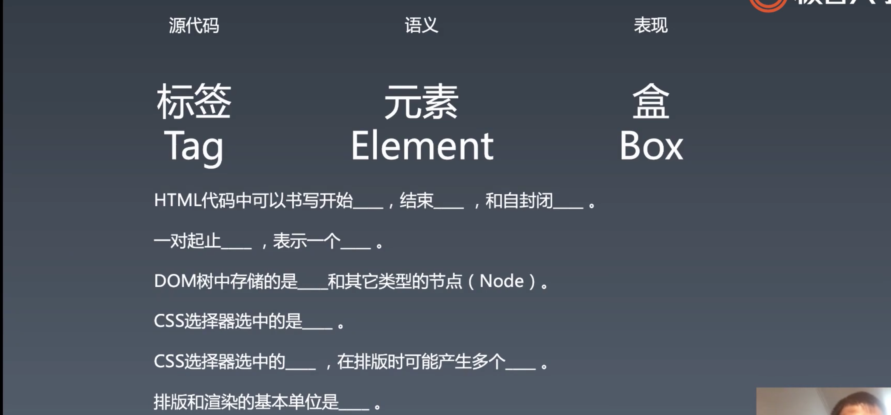
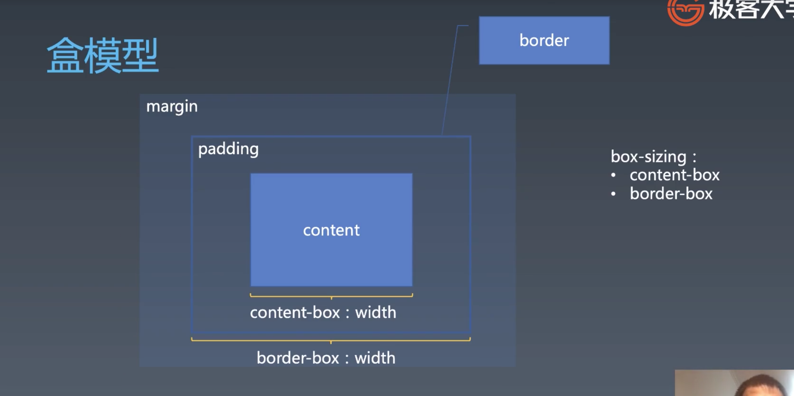

# 2.重学CSS | 排版与排版相关属性,绘制与绘制相关属性

[toc]

## 重学 CSS —— 属性

属性总的来看就是三大类：

- 排版
- 渲染
- 交互
  - 交互类的属性往往是比较新的属性，因为早期的 CSS 并不太管交互


### 排版属性

有三代排版

#### 盒（Box）

在讲排版之前，我们要首先要介绍一个概念 —— 盒（box）

box 是我们 CSS 中所使用的基础概念。CSS 中从排版到渲染的基本单位就是 box 和文字，没有别的东西。


做个填空题：



因为 box 这个概念会和标签（tag）、元素（element）混淆。

- HTML 代码中可以书写开始 <u>tag</u>，结束 <u>tag</u>，和自封闭 <u>tag</u> 
- 一对起止 <u>tag</u>，表示一个 <u>element</u> 
  - 脑子里记的是元素，写出来的是标签，看到的就是盒
- DOM 树中存储的是 <u>element</u>，和其他类型的节点（Node）
  - 其他节点有文本节点、注释节点、docu type 等等
- CSS 选择器选中的是 <u>element</u> 
  - 因为 CSS 选择器是在 DOM 结构中去选择
- CSS 选择器选择中的 <u>element</u>，在排版时可能产生多个 <u>box</u> 
  - 产生多个盒主要有两种情况：一是 inline 元素会多产生多个盒（分行），二是伪元素，一个元素带着两个伪元素
- 排版和渲染的基本单位是 <u>box</u> 
  - 我们的 toy-browser 直接使用元素当作盒来进行排版和渲染了，其实这样是不对的。

脑子里记的是**元素**，写出来的是**标签**，看到的就是**盒**
书面语：源代码里的是标签，语义里的是元素，表现在浏览器中的就是盒

> 可以从上面两句话中获得一种理解，语义实际上是不存在于现实的抽象概念，是一种对事物的定义，用于帮助人们理解事物。

之后我们所讲的排版和渲染的部分都是针对盒。

#### 盒模型

盒模型是盒一种抽象概念，用于描述盒具体是什么样的。

网络上有很多讲盒模型的文章，但是问题是一开始讲盒模型但是不讲盒，这就有点本末倒置了，毕竟你得先有盒才能有盒模型。



基础的盒分为四层：

- 最里面的叫做 content（内容），有可能是文字，也有可能是别的盒。
- content 的外层一圈叫做 padding（内边距）
- border ，有边框
- margin

我们所熟悉的 width，在现代浏览器中默认表示的是 content width，但这有点不符合人的直觉，所以后来有一个属性 `box-sizing` 用于调整这个 `width` 到底表示的是什么 `width` 

- `border-box` 就包含 border 和 paddding content 
  - 需要注意，一个盒的完全宽度实际上应该还包括 `margin` 

盒模型本身并不是复杂，复杂的是如何将这些盒子进行排版。

> 再次提醒，计算机是一门抽象技艺，在做任何的「表现」之前都是一种抽象的数据结构和这些数据的运算。

#### 问答


## 课程涉及

### 预习内容：

- [CSS 排版：从毕升开始，我们就开始用正常流了](https://time.geekbang.org/column/article/85745)
- [CSS Flex 排版：为什么垂直居中这么难？](https://time.geekbang.org/column/article/90148)
- 课件链接：[ https://pan.baidu.com/s/1pP6znwGPXicnHBMmVdHniQ](https://pan.baidu.com/s/1pP6znwGPXicnHBMmVdHniQ)
  提取码：0f8k

## 参考链接：

- https://www.w3.org/TR/2018/CR-css-flexbox-1-20181119/#flex-items

## 参考代码：

复制代码

```html
<div style="font-size:50px;line-height:100px;background-color:pink;">
    <div style="vertical-align:text-bottom;overflow:visible;display:inline-block;width:1px;height:1px;">
        <div style="width:1000px;;height:1px;background:red;"></div>
    </div>
    <div style="vertical-align:text-top;overflow:visible;display:inline-block;width:1px;height:1px;">
        <div style="width:1000px;;height:1px;background:red;"></div>
    </div>
    <span>Hello Hello Hello Hello Hello Hello Hello Hello Hello Hello Hello </span>
    <div style="vertical-align:text-bottom;line-height:70px;width:100px;height:150px;background-color:aqua;display:inline-block">1</div>
    <div style="vertical-align:top;line-height:70px;width:100px;height:50px;background-color:aqua;display:inline-block">1</div>
    <div style="vertical-align:base-line;line-height:70px;width:100px;height:550px;background-color:plum;display:inline-block">1</div>
</div>
```

### 思考题：

- 我们如何写字？
  本周作业：

### 参考名词：

- IFC：inline formatting context
- BFC：block formatting context

### Tips：

- 大家请记住下面这个表现原则：如果一个元素具有 BFC，内部子元素再怎么翻江倒海、翻云覆雨，都不会影响外部的元素。所以，BFC 元素是不可能发生 margin 重叠的，因为 margin 重叠是会影响外部的元素的；BFC 元素也可以用来清除浮动的影响，因为如果不清除，子元素浮动则父元素高度塌陷，必然会影响后面元素布局和定位，这显然有违 BFC 元素的子元素不会影响外部元素的设定。
- block-level 表示可以被放入 bfc
- block-container 表示可以容纳 bfc
- block-box = block-level + block-container
- block-box 如果 overflow 是 visible， 那么就跟父 bfc 合并