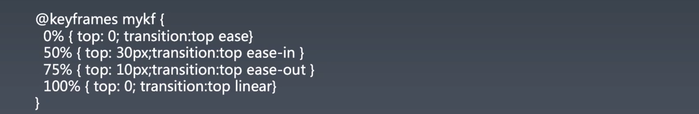

# 1.重学CSS | CSS动画

[toc]

## 重学CSS —— 动画与绘制

我们之前已经学完了排版相关的属性，CSS 除了一些零零碎碎的属性之外基本上就三类：

- 排版
- 绘制
- 交互（动画）

零零碎碎的其他属性，比如 `will-change` 辅助类属性。

### Animation

使用 `at-rules` 的 `@keyframs` 来定义，可以将 `@keyframs` 理解为声明变量，然后将这个声明之后产生变量传入 `animation` 中便得到了一个 `animation`

`keyframes` 被称为「关键帧」，这里讲解一下定义。

当我们看显示器的时候，感觉显示器很稳定感觉不到其在刷新，但其实无论你是在看电影还是玩游戏，显示器都是在不断的刷新。只有一类显示器不刷新——电子纸屏，这个玩意儿电断了之后屏幕所显示的内容也不会消失。

显示器是通过不断的闪动来实现刷新显示内容，只是闪动的屏幕高于你人眼能够识别、感觉到这个闪动的频率。

只要刷新的频率在每秒 60 次以上就会人眼就会感觉很平滑，电影一般 24 48（李安 - 120，高速运动也能表现的很真实、顺畅），游戏会选择 60，24 在物体并非高速运动的情况下会比较顺畅，48 在物体非操作的情况下比较顺畅，60 就是你玩游戏操作也会感觉很顺畅

「关键帧」的意思是我们在定义时只需要去设置关键的那些帧，其他帧所显示的内容都是由这么关键帧所算出来的。

那么如何去计算呢？

我们先假设这些帧的变化是均匀的，那么计算就会比较容易，你知道在这个相同时间内，元素的属性值是如何变化的。当然实际的属性中可以通过设置其贝塞尔曲线来控制其变化的方式，从而计算的方式也会发现变化。

#### Animation 属性

- `animation` 属性实际上是一个 `shorthand`  快捷、简写的属性，是由一下属性组成：

  - [`animation-name`](https://developer.mozilla.org/en-US/docs/Web/CSS/animation-name): 
  - [`animation-duration`](https://developer.mozilla.org/en-US/docs/Web/CSS/animation-duration): 快慢控制
  - [`animation-timing-function`](https://developer.mozilla.org/en-US/docs/Web/CSS/animation-timing-function):  决定中间桢的计算方式
  - [`animation-delay`](https://developer.mozilla.org/en-US/docs/Web/CSS/animation-delay): 
  - [`animation-direction`](https://developer.mozilla.org/en-US/docs/Web/CSS/animation-direction): 
  - [`animation-iteration-count`](https://developer.mozilla.org/en-US/docs/Web/CSS/animation-iteration-count): 
  - [`animation-fill-mode`](https://developer.mozilla.org/en-US/docs/Web/CSS/animation-fill-mode): 
  - [`animation-play-state`](https://developer.mozilla.org/en-US/docs/Web/CSS/animation-play-state): 

   

#### @keyframe 

- 关键帧是可以通过设置 `transition` 来单独控制 `timing-function` 的
- `0%` ～ `100%` 可以用 `from` `to` 来代替

### Trasition

#### transition 属性

- `transition` 也是一个 `shorthand` 简写属性
- `transition` 的好处是可以很精细的控制每一个属性的变化，所以我们很多时候不指定 `animation` 的 `timing-function ` 而是通过 `transition` 的 `timing-function` 来精确的控制每一个属性的变化规律。

### cubic-bezier（3次方贝塞尔曲线）

`timing-function` 实际上是一个以时间为 x 轴，以你要变换的属性为 y 轴的 

## 课程涉及

### 预习内容：

- [CSS 动画与交互：为什么动画要用贝塞尔曲线这么奇怪的东西？](https://time.geekbang.org/column/article/91325)

### 参考链接：

- https://cubic-bezier.com/#.17,.67,.83,.67
- [https://zh.wikipedia.org/wiki/ 貝茲曲線](https://zh.wikipedia.org/wiki/貝茲曲線)

### 课后作业：

- 打开一个空白页面，找到它的 body，把它的 ComputedStyle 取出来，会得到大概 280 个属性。把这些属性进行归类，用脑图的方式写到学习总结里。（作业描述具体参考视频最后的内容）

### 答疑回放：

- 链接：[ https://pan.baidu.com/s/12fo1ph3y6ebv0nA5NxXdsQ](https://pan.baidu.com/s/12fo1ph3y6ebv0nA5NxXdsQ)
  提取码：ryz8

