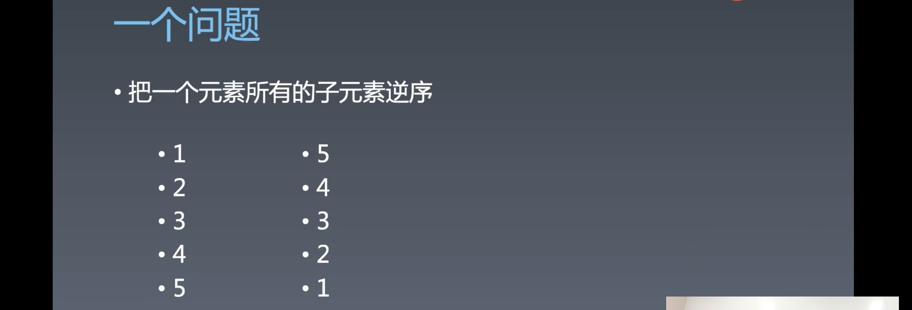

# 重学浏览器API | 其它API，总结

[toc]

## 重学浏览器 API

### 一个问题



```html
<div id="a">
  <span>1</span>
  <p>2</p>
  <a>3</a>
  <div>4</div>
</div>

<script>
	let element = document.getElementById("a");
  
  function reverseChildren(element) {
    let children = element.childNodes;
  }
</script>
```

- 答案参考 `reverseChildren.html` 文件


### Range API


Range API 比 DOM 节点 API 更强的一组 DOM API，注意 Range API 隶属于 DOM API，也是 DOM API。

Range 代表了 DOM 树中的一个片段，其不需要遵循 DOM 的层级关系。比如，你可以是第一个元素的某个子元素到第二个元素的某个子元素。

Range 有一个起点有一个终点，可以大致认为 Range 和 HTML 代码中的一个区段是完全等效的。

创建一个 Range 一般会使用 `setStart` 和 `setEnd` 来设置其起点和终点。这两个 API 构成了 Range 的完备性，可以设置 DOM 树上的任何一个起点和一个终点，甚至可以设置文本节点中某个文字的前或者后，这个能力非常强大，我们在操作的时候可以不用单个节点的去操作，可以将一个节点切割为半个，类似于将一个文本节点中间挖一个洞。（精确的手术）

Range 的另外一种获取方法是利用 `getSelection()` ，如果我们写一个网页在页面中可以用鼠标来进行选择，而这个段选择是可以使用 `getRangeAt` 这个 API 来获取其 Range。


#### Range 用于辅助的快捷 API


- 前四个 API 可以让我们在某个节点的前或者后设置 range 的起点或者终点。
- `range.selectNode` 可以直接选中节点
- `range.selectNodeContents` 选中节点的内容

下面这组 API 是属于方便使用的，而上面那两组 API 是基础且完备的，其实只需要使用上面那两组 API 就完全够用了。


#### 选中 Range 可以干什么？


- `range.extractContents()` 将里面的内容摘出来，摘出来之后会创建 `fragment` ，我们之前也讲过 `fragment` 是文档的片段，当 `append` 一个 `fragment` 到一个节点的时候，它 `append` 上去的是 `fragment` 的内容，而自己是不用 `append` 到 DOM 上的。
- 另外一个能力是可以在 `range` 的位置插入一个元素，这个就很厉害了。因为我们使用 `insertBefore` 和 `appendChild` 我们只能在元素与元素之间的缝隙里插入，而使用这个能力，我们是可以在文本与文本之间插入元素。
- `insertNode` 和 `fragment` 配合使用会有奇效。


#### 实战

开始的题目——「一个问题」，做这个题时有一个目标，当我们去 `reverse` 时，是希望重排的次数尽可能的少，因为理论上如果子元素有 1w 个，当你每一次的重排都会卡很久，因为你每一次的操作都会改变一次 DOM 结构。

通过 range 我们只需要两次操作，第一次将子节点移除，第二次把已经排列好的子节点 `append` 上去，这个时候我们的 `reverseChildren` 的结果就是完美的。

```js
let element = document.getElementById('a');

function reverseChildren(element) {
  let range = new Range();
  range.selectNodeContents(element);

  let fragment = range.extractContents();
  let l = fragment.childNodes.length;
  while (l-- > 0) {
    fragment.appendChild(fragment.childNodes[l]);
  }
  element.appendChild(fragment);
}

reverseChildren(element);
```

1. 创建一个 `range` 
2. 使用 `selectNodeContents` 选中 `element` 这个元素的所有子元素
3. 使用 `extractContents` 将位于 `range` 上的 `element` 元素的子元素摘出来放到 `fragment` 中
4. 然后在 `fragment` 上进行逆序的操作，由于 `fragment` 只是零时暂存的节点集合，所以不会造成页面重排的情况
5. 最后再将 `fragment` 中的元素添加到 `element` 中

以上对于 DOM 的操作造成的重排只有两次，第一次是 `range.extractContents()` ，第二次是 `element.appendChild(fragment)`


精细操作文本节点中的文本：

```html
<div id="a">123456789</div>
<script>
  let textNode = document.getElementById('a').childNodes[0];
  let range = new Range();
  range.setStart(textNode, 3);
  range.setEnd(textNode, 6);
	range.extractContents();
</script>
```

- 通过 `range.setStart(textNode, 3);` 和 `range.setEnd(textNode, 6);` ，选到文本中 index 3 ~ 6 ，然后使用 `extractContents` 将其摘取出来。
- 在页面中的效果就是 `456` 文本不见了。


更为精细的操作：

```html
<div id="a">123<span>456</span>789</div>
<script>
  let textNode = document.getElementById('a').childNodes[0];
  let range = new Range();
  range.setStart(document.getElementById('a').childNodes[1].childNodes[0], 2);
  range.setEnd(document.getElementById('a').childNodes[2], 2);
	range.extractContents();
</script>
```

- 我们将起点设置为 `<span>` 中的某个文本点，终点设置为 `div` 上最后的文本节点中的点，当我们进行 `extractContents()` 操作时，会将 `span` 中的一部分文本和 `div` 上最后文本节点中的一部分文本移除，而不会将 `span` 也移除掉。

- 但如果我们想要将 `span` 移除，则需要将起点设置在开始 `div` 开始文本节点 `123` 之后：

  ```js
  range.setStart(document.getElementById('a').childNodes[0], 3);
  ```

  

#### 什么时候使用 Range API

1. 做比较消耗性能的 DOM 操作时，比如海量节点的批量操作，或者多次执行的操作。
2. 当我们需要精确去操作元素的内容时


#### 问答

- `Range` 和 `doucment.fragment` 有什么区别？
  - 两者没有直接的关系，只是可以配对进行使用，使用 `range.extractContents()` 将 DOM 进行切割然后返回 `fragment` 
- 做文字限制的时候，是否可以用 range API
  - 这个需要看你是做什么文字限制，如果是 `input` 中的文字是没有办法使用 range API
- 可以用 range API 来实现在不使用 escc comand 修改选中文本的样式吗？
  - 可以
- `fragment.childNodes.length` 会把文本节点也算上吗？
  - 当然会啦，像 `childNodes` 这样的 API 对应的有 `children` 这些只算上元素节点的 API。


#### 补充

- 当我们要做一个富文本编辑器或者 content editable 时就非常需要使用到 `range` ，如果只使用 `content editable` 就会使页面上留很多废标签，另外很多操作也会造成非预期的行为。所以，做富文本编辑器是一个在前端中独立的、需要高超技艺的领域，需要设计到 copy paste，还有特殊格式等，阿里到 P7 深入的可以到 P8。但是大家如果不是专门做富文本编辑器实际上不需要掌握那么多东西，大家只需要将 range API 当作自己武器库中的一个终极武器就可以了。
- range 的兼容性很好，是出现在 HTML5 之前的一个特性。
- 这节课我们学习的 API 都是非常实用的 API，比如接下来要学习的 CSSOM ，只要学会了就可以给开发带来好处。


## 课程涉及内容

### 预习内容：

- [浏览器 CSSOM：如何获取一个元素的准确位置](https://time.geekbang.org/column/article/86117)

## 参考链接：

- https://spec.whatwg.org/

### 参考代码：

```HTML
<link rel="stylesheet" title="x" href="data:text/css,p%7Bcolor:blue%7D">
```

- apis.html：
  链接：[ https://pan.baidu.com/s/1m_-Z_NPjrwpJxzppcRuBEQ ](https://pan.baidu.com/s/1m_-Z_NPjrwpJxzppcRuBEQ)提取码：irgz

### 课后作业：

- 把所有的 API 画进脑图里

### 答疑回放：

- 链接：[ https://pan.baidu.com/s/1ciT-D-v5RAtw6tLDYyjhfQ](https://pan.baidu.com/s/1ciT-D-v5RAtw6tLDYyjhfQ)
  提取码：tsgd