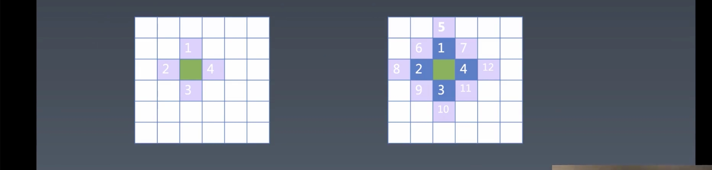

# 2.编程与算法训练 | 寻路问题（搜索）

[toc]

## 编程训练 ｜ 寻路问题

定义寻路问题：


在一个大的地图中，创建一个迷宫，迷宫中有一些障碍，然后在地图中找一个起点和一个终点，然后让程序自己在迷宫中找到一条路径，能够从起点走到终点。

规定：



只能上下左右走，不能斜着走。（之后我们再谈其他走向的问题）


寻路：从起点到终点，那么是怎么的一个过程？

- 当一个点能够知道周围有哪些点可以走时，就会继续去到这个点去检查在这个点的周围是否有可以走的点。这也就是搜索过程。


### 编辑器

在做寻路之前我们需要做一个编辑器，能够编辑哪些路不能走，是一个 100 * 100 的地图。


功能：

- 鼠标点击左键去画。
- 保存。


我们应该用什么样的数据结构来表示这张 100 * 100 的地图？

- 虽然二维数组也可以实现，但是在模型比较大的情况下还是推荐使用一维数组。

需要创建一个什么样的一位数组？

- 有 10000 项数字的数组。

如何创建？

```js
let map = new Array(10001).join(0).split('').map(s => Number(s));
```

- 这是在没有 `fill` API 的情况下，老一辈前端所使用的方法。

```js
let map = new Array(10000).fill(0);
```

- 如今的创建方式。


#### 如何实现鼠标在地图上画线的效果？

```js
let map = new Array(10000).fill(0);
let container = document.getElementById('container');
for (let y = 0; y < 100; y++) {
  for (let x = 0; x < 100; x++) {
    let cell = document.createElement('div');
    cell.addEventListener('mouseover', () => {
      if(mousedown){
        cell.style.backgroundColor = 'black';
      }
    })
    cell.classList.add('cell');
    container.appendChild(cell);
  }
}

// 标志位
let mousedown = false;
// 在 mousedown 和 mouseup 上放置一个标识位
// 在 document 上监听事件是为了能够实现从 map 之外点击左键滑进去
document.addEventListener('mousedown', (e) => {
  mousedown = true;
  clear = (e.which === 3);
})
document.addEventListener('mouseup', () => mousedown = false);
```

- 需要监听 `document` 的 `mousedown` 和 `mouseup` 事件来设置标志位——`mousedown`——表示鼠标是否已经点击了左键。
- 然后再监听每一个 `cell` 的 `mouseover` 事件，根据标志位——`mousedown`——来确定是否更改颜色。


#### 添加橡皮擦功能：

```js
let map = new Array(10000).fill(0);
let container = document.getElementById('container');
for (let y = 0; y < 100; y++) {
  for (let x = 0; x < 100; x++) {
    let cell = document.createElement('div');
    cell.addEventListener('mouseover', () => {
      if (mousedown) {
        if (clear) {
          cell.style.backgroundColor = 'grey';
          map[y * 100 + x] = 0;
        } else {
          cell.style.backgroundColor = 'black';
          map[y * 100 + x] = 1;
        }
      }
    });
    cell.classList.add('cell');
    container.appendChild(cell);
  }
}

// 标志位
let mousedown = false;
let clear = false;
// 在 mousedown 和 mouseup 上放置一个标识位
// 在 document 上监听事件是为了能够实现从 map 之外点击左键滑进去
document.addEventListener('mousedown', (e) => {
  mousedown = true;
  // which 是鼠标的位置 1 2 3
  clear = e.which === 3;
});
document.addEventListener('mouseup', () => (mousedown = false));
document.addEventListener('contextmenu', (e) => e.preventDefault());
```

- 禁止 `contextmenu` 的默认行为以免右键菜单的影响。

- 添加一个新的标志位 `clear` 表示是否清除，其值是由 `mousedown` 时是否是 `whice === 3` 的值也就是右键来决定的。

- 也分别将 `map` 中的值更改了。

  > 这里我想插一句，我们现在使用的是一位数组，一般一位数组的遍历我们只会只用一层 for 循环，这样就可以遍历出所有的元素了，可这样就无法使用坐标系的方式来访问数组中的值，也无法使用坐标系带来的解题方法。


#### 添加保存功能：

```html
<button onclick="localStorage.map = JSON.stringify(map)" id="save">save</button>

<script>
  let map = localStorage.map ? JSON.parse(localStorage.map) : new Array(10000).fill(0);
  
  for (let y = 0; y < 100; y++) {
    for (let x = 0; x < 100; x++) {
      let value = map[y * 100 + x];
      let cell = document.createElement('div');
      if (value === 1) {
        cell.style.backgroundColor = 'black';
      }
      cell.addEventListener('mouseover', () => {
        if (mousedown) {
          if (clear) {
            cell.style.backgroundColor = 'grey';
            map[y * 100 + x] = 0;
          } else {
            cell.style.backgroundColor = 'black';
            map[y * 100 + x] = 1;
          }
        }
      });
      cell.classList.add('cell');
      container.appendChild(cell);
    }
  }
</script>
```

- 在 `save` 按钮上添加 `click` 事件，然后绑定一个事件处理函数，将 `stringify` 的 `map` 存储在 `localStorage` 中
- `localStorage` 可以使用访问普通对象属性的存取方式。
- 在渲染的部分，也需要判断值来设置背景颜色。（10 ～ 12 行）


### 补充

- 这个课程所写的代码都有一个特点，不一定是在算法上很困难，算法只占了其中一小部分，而课程的重点是如何使用 JS 的特性去解决实际问题。
- 在编程解决问题的时候，往往需要的是多种程序赋予能力的组合方案，而不是其中的一种就能够解决。
- 下节课讲寻路算法，会有几种寻路的策略，从单边的寻路到双边的寻路到 A start（A 星）寻路
- `localStorage` 只能存储字符串，虽然很方便能够直接访问属性的方式存取，但是可能会覆盖掉位于原型上的属性和方法，所以还是推荐使用提供的 API 

## 课程涉及

### 参考代码：

```css
.cell {
    display:inline-block;
    width:6px;
    height:6px;
    background-color: gray;
    border-bottom:solid 1px white;
    border-right:solid 1px white;
    vertical-align: middle;
}
#container{
    width:701px;
}
```

- 链接：[ https://pan.baidu.com/s/1tHVyJGIPZkqfBLcUgjKRMA](https://pan.baidu.com/s/1tHVyJGIPZkqfBLcUgjKRMA)
  提取码：mqz3

### 课后作业：

完成路径编辑器（下节课使用）

