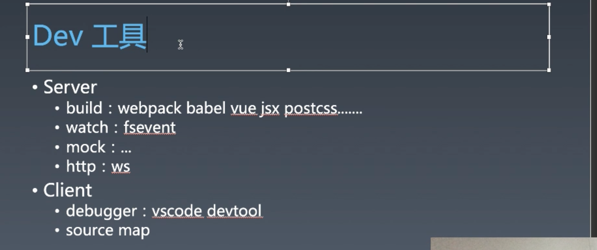

# 1. 工具链 | Dev工具

[toc]

今天这节课讲「调试」，所用到的就是 Dev tool——开发工具。

## Dev工具

淘宝最早设计了 6 个命令：

- init
- add
  - 添加模块或是页面，算是 init 的补充
- dev
- build
- test
- publish

publish 特别重要，init 是肯定有的，接着就是 dev ，而 add build test 很少有人用，但 test 也非常重要的。

dev 工具要做的事比较简单，启动一个 server，启动一个 client（不一定是浏览器），然后进行调试。



### Server

#### build

贯穿两个领域的就是 `build` ，不过 `build` 更偏向于 `server` ，`build` 算是非常主体的工具，大部分的前端工具都是通过 `build` 来实现的，今天基本上所有的前端设施都依赖于 `build` 这个过程。比如 `webpack` `babel` `vue` `jsx` `postcss` ...

#### wactch

`wactch` 实际上可以认为和 `build` 是一体的，`watch` 会讲到一个底层的能力，是由一个非常基本的模块提供的，几乎所有的 `watch` 工具到最后都会依赖这个模块， nodeJS 没有提供这个模块，但 winter 认为此模块应该隶属于 fs 模块，但结果被搞成了单独的 fsevent 模块。早期 npm 不稳定的时候，fsevent 非常容易出问题， 

#### mock

本地服务器跑起来之后，如果需要本地访问 API，则需要使用。

#### http

http-server 之前在 toy-browser 中也有写过，不过一般我们都是直接使用现成的 server，比如 ws 这个包。

### Client

#### debugger

我们不写 debugger，因为工作量比较大，但是会去学习它是如何工作的。

#### source map

`source map` 也算是隶属于 `dev tool` 这一类的东西。


今天我们会做大一堆的 demo 来了解这些工具，因为在实际工作中我们去做 dev tool，大部分时候也是在做选择题，或者在某个工具上进行包装，而不是做**问答题**，比如缺一个什么工具然后跑去做一个。要知道，我们做工具链并不是做工具，而是选择工具。在设计好 dev tool 体系之后，就可以用 yeoman 将它们包装进一个初始化的工具之中。

最终工具链部分的课程会通过 `yeoman` 生成一个像 node 这样的一个调试工具，而且在这个工具体系中也会有比较新颖的工具，比如 vat，随着 vue 3 的发布，小尤刚做出来的既有 server 也有 client 成分的综合性工具，它打破了 server 与 client 之间的边界使调试体验更好。

## 试用工具

### Webpack

 `webpack` 最早是由 v-node 设计的，所以其 API 是基于 node 去做的，也就是支持 `requre` 语法：

```js
const path = require('path');
```

而 `require` 由很大的问题，`require` 并不是固定路径，它是可以产生动态的路径，所以当 `webpack` 在调用动态的 `import` 或是带拼接字符串的 `require` 的时候就会产生非预期行为。所以比较推荐大家使用 `import` 这个语法，因为根据 `ESMA-262` 的规范（A.5），`import` 有一个很明显的特点，一个模块是支持 `ModuleBody` ，而 `ModuleBody` 中的 `ModuleList` 中的每一个 `ModuleItem` ，需要在最外层有 `ImportDeclaration` ，从而方便了我们静态分析，我们不需要将 `js` 模块完整的解析就可以拿到模块的 `import` 内容。所以，如果我们以最新的 JS 标准去做类似 webpack 这样的工具，会比以前的 webpack 更加容易。

### babel

`babel` 其实既可以独立的使用又可以和 `webpack` 结合的工具。之前我们有在 `webpack` 中使用过，这里我们尝试单独使用。

> 使用指南：https://babeljs.io/docs/en/usage

babael 最典型的安装是安装三件套：

```js
npm install -g @babel/core @babel/cli @babel/preset-env
```

- 这样安装之后在全局环境下都可以调用 `babel` 命令

接着创建目录 `babel` 并通过 `npm init -y` 初始化目录为 npm 包，再在目录内创建 `demo.js` ：

```js
for(let i of [3,2,1]){
  console.log(i)
}
```

- 写一个 ES6 的语句

接着安装一些依赖：

```js
npm install --save-dev @babel/core @babel/cli @babel/preset-env
npm install --save @babel/polyfill
```

添加 `babel.config.json` 配置文件：

```json
{
  "presets": ["@babel/preset-env"]
}
```

接着运行命令 `babel demo.js` 便可以对 `demo.js` 中的代码进行转换，结果会打印在控制台中：

```js
"use strict";

for (var _i = 0, _arr = [3, 2, 1]; _i < _arr.length; _i++) {
  var i = _arr[_i];
  console.log(i);
}
```

由于 `babel` 在这里使用了比较原始的方式显示结果，为了能够将转换后的代码指定到一个文件之中，需要使用 `>` 对标准输出进行重定向：

```shell
babel demo.js > after.js
```

这个和 `babel` 本身没有关系，而是基本上很多命令行工具都需要这样才能输出到一个文件之中。


除了以上这样简单的用法之外，`babel` 还有一种用法是直接 `import`   `@babel/core` 这个包中有很多 API 可以用，不过这种方式在我们不写 `babel-plugin` 的情况下是用不到的。


### Vue complier

接着我们看看 `vue` 3.0 的 complier，我们先来单独看一下 [@vue/compiler-sfc](https://github.com/vuejs/vue-next/tree/master/packages/compiler-sfc)，用于编译 sfc 的包。

这个包可以单独安装：

```js
npm i -D @vue/compiler-sfc
```

一个非常好的实践，当你不会用一个东西的时候可以看它的测试，比如看一下 [compileTemplate.spec.ts](https://github.com/vuejs/vue-next/blob/master/packages/compiler-sfc/__tests__/compileTemplate.spec.ts) 来学习一下它是如何编译一个模版的：

```js
test('should work', () => {
  const source = `<div><p>{{ render }}</p></div>`

  const result = compileTemplate({ filename: 'example.vue', source })

  expect(result.errors.length).toBe(0)
  expect(result.source).toBe(source)
  // should expose render fn
  expect(result.code).toMatch(`export function render(`)
})
```

那么我们就创建一个目录 `vue-compiler` 来试用 vue 的 `@vue/compiler-sfc` 

接着我们创建目录 `tools` 用于存放 tool，这是以前流行的做法，如今都是将工具做成单独的包通过依赖使用，不过如果你的工具是和你的项目耦合在一起的，那么也可以将其放到 `tools` 目录。

创建文件 `run-vue.js` 并通过 node 运行：

```js
const compiler = require('@vue/compiler-sfc');

const result = compiler.compileTemplate({filename: 'example.vue', source: "<div>Hello World!</div>"});

console.log('result', result);
```

`result`:

```js
{
  code: "import { createVNode as _createVNode, openBlock as _openBlock, createBlock as _createBlock } from \"vue\"\n\nexport function render(_ctx, _cache) {\n  return (_openBlock(), _createBlock(\"div\", null, \"Hello World!\"))\n}",
  source: "<div>Hello World!</div>",
  errors: [
  ],
  tips: [
  ],
  map: {
    version: 3,
    sources: [
      "example.vue",
    ],
    names: [
    ],
    mappings: ";;;wBAAA,aAAuB,aAAlB,cAAY",
    sourcesContent: [
      "<div>Hello World!</div>",
    ],
  },
}
```

- 返回的编译结果是一个对象，里面有编译相关的内容，`map` 很重要之后会讲到。


这就是第三方社区去写的 `compiler` ，包括之前我们用的比较熟练的 `JSX` 的 transformer，还有 `css` 这个包，这些都可以用于构建的工具，我们自己也写过 `HTML-parser` ，所以最终我们会在社区方案和自研方案之间做一些选择和拼接，然后形成一套属于我们自己的项目方案。

然后 `build` 工具中的 `postcss` 基本上是以 `webpack` 插件的形式去搞的。


### 在 JS 中使用 NPM

上节课在自研 `yeoman` 部分我们还剩下 npm 和模版的内容没有做，这节课我们先来做 npm。

`npm` 作为我们经常使用的工具，基本上都是以命令行的方式来使用，但实际上 npm 也可以作为 JS 的包来使用，而且是官方写的。

创建 `npm-in-js` 目录，执行 `npm init -y` 将目录默认初始化为包，然后执行 `npm i npm` 安装 `npm` 

> 为什么 `yeoman` 要自己将这个包再包装一遍，是因为这个包的 API 很反人使用的习惯而且没有关于如何使用 API 的文档，都是关于命令行的文档。

 然后创建 `main.js`：

```js
const npm = require('npm');

let config = {
  name: 'npm-in-js',
  version: '1.0.0',
  description: '',
  main: 'index.js',
  scripts: {
    test: 'echo "Error: no test specified" && exit 1',
  },  
  keywords: [],
  author: '',
  license: 'ISC',
  dependencies: {
    npm: '^6.14.7',
  },
};

// node 标准的 callback
npm.load(config, (err) => {
  npm.install('webpack', (err) => {
    console.log(err);
  });
});
```

- 运行以上的代码之后便可安装 `webpack` 
- 这里使用了比较老旧的 `node` callback 的方式，需要不断的通过 `callback` 来依次执行代码。

我们打印 `npm` 对象看一下：

```js

let keys = Object.getOwnPropertyNames(npm);

console.log('keys', keys);

keys (396) ['_events', '_eventsCount', '_maxListeners', 'config', 'commands', 'limit', 'lockfileVersion', 'rollbacks', 'name', 'version', 'fullList', 'deref', 'load', 'prefix', 'bin', 'globalBin', 'dir', 'globalDir', 'root', 'cache', 'tmp', 'ac', 'acc', 'acce', 'acces', 'access', 'add', 'add-', 'add-u', 'addU', 'add-us', 'addUs', 'add-use', 'addUse', 'add-user', 'addUser', 'addu', 'addus', 'adduse', 'adduser', 'ap', 'api', 'apih', 'apihe', 'apihel', 'apihelp', 'aud', 'audi', 'audit', 'aut', 'auth', 'autho', 'author', 'bi', 'bu', 'bug', 'bugs', 'c', 'ca', 'cac', 'cach', 'ci', 'cit', 'clean-install', 'cleanInstall', 'clean-install-', 'cleanInstall-', 'clean-install-t', 'cleanInstallT', 'clean-install-te', 'cleanInstallTe', 'clean-install-tes', 'cleanInstallTes', 'clean-install-test', 'cleanInstallTest', 'com', 'comp', 'compl', 'comple', 'complet', 'completi', 'completio', 'completion', 'con', 'conf', 'confi', 'cr', 'cre', 'crea', 'creat', 'create', 'dd', 'ddp', 'ded', 'dedu', 'dedup', 'dedupe', 'dep', 'depr', 'depre', …]
```

- 可以看到里面有许多允许你简写名称的 API，这与命令行 npm 是相同的。


构建(build)工具这个部分结合之前课程中写 loader 或 parser 的经历，以及大家比较熟练的正则表达式和状态机，到这里大家对构建这件事应该非常清楚了。


### 补充

- 正则熟练不熟练不是看你知不知道正则那些稀奇古怪的语法，主要是看你 `exec` 这个东西用的怎么样，如果你能到 leetcode 上把解 `wildcard` 这道题 AC（通过），那就说明你的正则水平非常不错了，正则不是说你知道多少，而是是否能够解决问题。
- **构建实际上是对文本的操作**，我们之前课程中学过的四则运算、KMP、wildcard、http 解析、html 解析，这些都可以帮助你去理解现成的工具，从而你基本上可以构建任何东西，想将什么样的字符转化为什么样的字符都可以。这也是为什么课程之前学习了那么多关于字符串的内容，因为到最后工程化的部分，这些本事都是要用到的。可以尝试写一个转义 `yaml` 的编译器。
- JS 的 AST 构建和转义还是得靠 `babel` 因为这块很偏编译原理，非常高难度，没有教。
- 构建这件事情现在最流行的方式是以 `webpack`为核心的构建，因为 `webpack` 它构建产物和入口都是 JS，现在也有基于 HTML 的构建工具并且试图做到 0 config
- 工具链我们主要还是做选型，选择组合。
- 如果使用 `webpack` 就很简单了，因为基本上这些构建工具都做了 `webpack` 的 `loader` ，所以这个课程是会讲到的。
- `fsevent` 是用于 `watch` 的，完全是 `c` 写的东西，`js` 给其套了一层皮。`fsevent` 也一样也没有文档，不过在 github 上有一些说明。 
- 根据 winter 的观察，现在这些 build init 工具，它会选择绕过 npm init，它会将 `package.json` 给你生成好，你自己去做 `npm i` 然后再跑，帮你节省 init 过程。

## hfsevents

文档：https://github.com/fsevents/fsevents

`fsevents` 的作用是监听文件的变化。如果我们不写工具本事是不需要用到这个包的。它的 API 设计对于 Winter 来说比较反人类（winter 觉得反人类的工具还真多。。）macos 系统中的监听文件也是基于这个包，windows 是用的其他的。

而平时我们最常见的就是热更新带来的文件变化之后的重新构建。

### 试用一下

创建 `watcher` 目录，初始化 `npm init -y` ，创建 `watcher.js` ：

```js
const fsevents = require('fsevents');
const stop = fsevents.watch(__dirname, (path, flags, id) => {
  const info = fsevents.getInfo(path, flags, id);
  console.log('info', info)
  stop(); // To end observation
}); // To start observation
```

通过 node 运行之后便可监听当前项目目录下的文件变化，比如新建一个 `new.js` 就能得到一个这样的 info 对象：

```js
info：
{
  path: '/Users/harry/Documents/GeekTime-courses/Frontend-01-Template/week18/watcher/new.js', 
  flags: 65792, 
  event: 'created', 
  type: 'file', 
  changes: {…}
}
```

我们来看一下 `fsevents` 这个包 `node_modules/fsevents/fsevents.js` ：

```js
'use strict';
const Native = require('./fsevents.node');
const events = Native.constants;
//...
exports.watch = watch;
exports.getInfo = getInfo;
exports.constants = events;
```

- 引入了一个本地的 C 包 `fsevents.node` ，然后中间的各种方法都是使用 JS 进行了包装，最后再导出这些方法。


字符串处理和事件是最重要的底层依赖，`build` 中除此之外还有缓存、增量处理、依赖关系计算，会是一个比较复杂的流程。

## mock

阿里内部做了很多 mock，对于 mock 工具，公司内部自己做的可能比社区做的更适合于公司。因为 mock 和公司内部所使用的 API 绑定程度比较高，比如模拟鉴权，所以不太容易产生比较好用的社区产品。

## http

http 推荐一个比较好用的 http 的工具 —— `ws`  或者 `http-server` ，与之对应的有 `webpack-dev-server` ，`webpack-dev-server` 同时整合了 `build` `watch` `http` 这三种 server 工具，非常厉害。

> Winter 是 hot-reload 的坚定反对者，因为他认为这个东西很容易出问题。

## debugger 调试程序

这里所讲的 debugger 是 JS 的 debugger，调试 html 和 css 的东西叫做 `inspector`，打开 chrome 的开发者工具界面，Elements 标签对应的面板就是。而 JS 的 debugger 是在 Sources 标签下的面板。chrome 的 dev tools 是一个综合性的工具，比如 Application 中的内容就是浏览器中存储的数据模型的可视化展示。

到底什么是 debugger？

- 当我们用 VScode 写一段代码并在其中打上一个断点，然后通过 node 运行程序，当程序运行到断点的时候会暂停运行，那么这里到底是如何暂停的呢？

  - 这段代码是运行在 JS 虚拟机，node 环境的 V8 中， 那为什么在 vscode 的代码中打的断点能给让 node 调用？node 为什么会相应 vscode 代码。

    ```shell
    /usr/local/bin/node /Users/harry/Documents/GeekTime-courses/Frontend-01-Template/week18/watcher/watcher.js
    Debugger listening on ws://127.0.0.1:57971/299779eb-8348-4856-abaf-20f11adc184f
    For help, see: https://nodejs.org/en/docs/inspector
    Debugger attached.
    ```

    - 我们 vscode 中通过 node 来调用这段代码的时候，实际上监听了一个 `websocket` 的服务，并通过此服务来互相通信。
    - 在一次 debugger 行为中，有两个对象，第一个是 node 启动的 debugger server，这个 server 跟 V8 在同一个进程中，所以他能够控制 V8，然后 VScode 作为 client，它会去跟 websocket server 互相通信，它们之间传递我们在客户端上打断点或是写 debugger 这些代码或是命令，V8 在执行到这些被命令标记过的语句时就会在 websocket 中发送对应的事件，vscode 这边就能够进行显示停止位置、显示变量具体数据，或是单步追踪、跳进跳出函数、终止等操作命令。
    - 详细信息可以查看：https://nodejs.org/en/docs/inspector

  -  按照这种思路，我们有几种 server？

    - node
    - browser
    - electronic

  - 以上这些是提供 server 的，然后我们可以在同进程或者不同进程中有一个 debugger 的 client，这个 client 有一个明显的特点，有打点的能力和调试的界面给我们使用。

- 那么我们现在知道，debugger 是有 client 和 server 的。那么 chrome 的 devtools 是 client 还是 server？

  - 是 client，而 webkit 中跑的东西才是 server

- 接下来我们看看 [devTools](https://developers.google.com/web/tools/chrome-devtools) ，devTools 作为一个 client，它也有自己的协议，server 只要实现了 client 的协议，那么就可以使用 devTools 去调试 server 中的代码。所以，你只需要去实现它的 debugger 的协议就可以了，[协议地址](https://chromedevtools.github.io/devtools-protocol/)。只要实现了协议中的命令就可以接受 devTools 的控制。这其中有 `Methods` 和 `Events` ，`Methods` 是 client 往 server 传递信息，`Events` 是 server 往 client 传信息，默认是用 websocket 。

- 了解这个的目的是，如果未来要自己搞 debugger 就需要去看一下这个协议来进行实现。

## source map

> 相关链接：
>
> - [将预处理代码映射到源代码](https://developers.google.com/web/tools/chrome-devtools/javascript/source-maps?hl=zh-cn)
> - [JavaScript Source Map 详解](https://www.ruanyifeng.com/blog/2013/01/javascript_source_map.html)
> - 或者用 google 搜索 `javascript source map` 

`source map` 也是隶属于 devTool 这块的东西，`source map` 肯定是构建的过程中生成的，构建过程中转移、编译之后的代码都应该提供 `source map` 文件以方便开发人员进行调试。

`webpack` 会自动将每个步骤生成的 `source map` 文件合成一份总的 `source map` 文件。


## 结合使用

下面我们将 build、http、watch 三部分做一个结合使用。我们就在 `watcher` 项目中进行。

首先我们需要在全局中安装 `http-server` 和 `webpack` `webpack-cli` 

接着在项目根目录中创建 `src` 目录，并在 `src` 目录中创建 `watcher.js` ：

```js
const fsevents = require('fsevents');
const { exec } = require('child_process');

exec("http-server");

const stop = fsevents.watch(__dirname, (path, flags, id) => {
  const info = fsevents.getInfo(path, flags, id);
  console.log('info', info);
  exec('webpack');
  stop();
});
```

- 通过 `child_process.exec` 在 `shell` 中调用命令
  - 首先是调用了 `http-server` 起了一个开发服务器，这个开发服务器用于浏览器访问资源。
  - 然后是在监听的内部执行 `webpack` 

由于在 `shell` 中执行了 `webpack` 命令需要 `webpack.config.js` 文件，则在根目录中添加一个：

```js
module.exports = {
  entry: './src/a.js',
  module: {
    rules: [
      {
        test: /\.js$/,
        use: {
          loader: 'babel-loader',
          options: {
            presets: ['@babel/preset-env'],
          },
        },
      }
    ],
  },
  mode: 'development',
  optimization: {
    minimize: false,
  },
}
```

- 这里只是简单的对 JS 进行转义

由于入口文件是 `./src/a.js` 所以我们需要创建 `a.js` 文件：

```js
for (let a of [1, 2, 3]) {
  console.log('a', a)
}

console.log('hello')
```

- 简单的写点代码用于转义即可

最后我们用 node 运行 `watcher.js` ，然后更改 `a.js` 就能发现 `webpack` 又重新打包了文件。我们通过 `http-server` 启动的服务器也能访问新改变的文件。

好了，差不多就是这样，只是我们没有实现热更新等功能，需要手动刷新。


##  课后问答

- 工具链的课程很多时候是对社区方案的熟悉和背后原理的理解，然后就是选型搭建。而自己要去做每一个工具是很麻烦的很困难的，你做一个 debugger-client 或者 debugger-server 这样东西都是 P8 P9 的水准。
- 打包出来的 souce map 如何使用？
  - 根据 chrome 的 devtool 的规定，是在文件最后使用 `//#` 的语法：
    
- DevTool 这些调试工具实际上是相互关联的。
- Hot reload 的问题是跑了一段额外的 JS，而这段 JS 不知道 reload 的合适时机，比如你随便改两个字然后保存它也会帮你 reload，winter 不喜欢只是觉得开发体验上的不喜欢，其实并不太影响开发。
- souce map 不涉及文件压缩，是文件压缩涉及到 source map，因为你压缩了文件之后如果进行调试，那么你需要一个 map，否则 devtool 帮你找出的问题代码是压缩之后不易阅读的代码，或者是错误位置的代码。所以，我们一般是在开发阶段使用 souce map，而在上线前在 publish 阶段将 souce map 去掉，但是这样有个问题是没法在线上进行调试，那么可以用另一种方案，将 souce map 放到一个只有内网能够访问的地址，这样公司内的人打开 devtool 查看代码都是有 souce map 的，而公司外的人只能看到混淆压缩之后的代码。
- 我们以上所学习的「调试」是指发布之前的「调试」，而上线之后的「调试」是有另外一套体系的。
- 面试的时候要看人，有些人只是来面试你技术的，其他的什么都不管，而有的人在面试的时候会问你家庭问题、人的问题等、技术、对他们是否感兴趣，这样的人一般就是面试主管，这样的人一样要留他的微信，然后问他面试之后的情况。
- 简历要有规划
- 公司付你钱不是为你帮助你成长，而是帮助公司成长，如果想要成长，只有自己找机会找事情做。
- 写做的东西比写参加前端训练营有用，因为可以增加话题，能够在面试的时候交流，比如 toy-browser 大体流程，面试官很多时候就是在简历上找关键词然后聊这个话题
- 其他的所有事情都不是个事儿，唯一问题是你自己有没有核心竞争力

## 课程涉及内容

### 参考链接：

- https://github.com/fsevents/fsevents/

