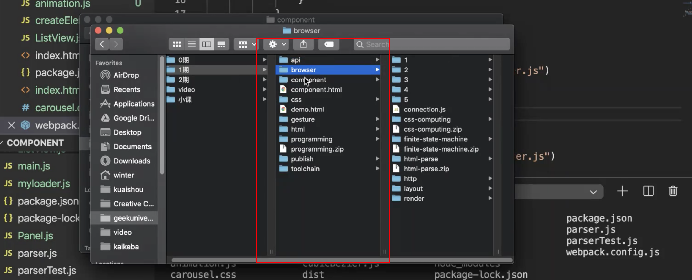

# 1. 发布系统 | Git Hook 与lint

[toc]

下一次的课会用虚拟机把之前教过的工程相关的内容串起来形成一个完整的发布系统。

我们已经做过了如下主要模块：



- 浏览器
- 编程练习
- 工具链
- 发布系统
- 组件化

## Git Hook

发布系统包含了一些持续集成相关的知识，但持续集成我们设计成了一个相对独立的工具，如果我们真的想要做一个完善的检查，需要在一些节点上进行处理，但如果不使用我们的工具，而使用 git push 这样的操作时，会发现我们没有办法控制，因为 git 是我们最常见的版本管理软件，而我们没有办法做一个替代 git 的工具，就算你做了，团队的人也不一定爱用。这个时候就面临一个挑战，怎么样让像是 ESLint 这样的工具在某些节点一定能够运行，也就是如何确保我们所提交的代码都通过了 Lint 检查。这节课，我们学习 Git Hook 来解决这个问题。

Git Hook 有两种，一种是客户端 Git Hook，这个 Hook 基本上是信任性检查（防君子不防小人），你依然可以提交没有通过 Lint 检查的代码。但大多数同学还是会自觉运行带有 Lint 的 Hook 进行提交。 

Git Hook 是什么

### 创建 Git Hook

创建目录 `hook` ，然后进行初始化——`git init` & `npm init` （这一部分到最后都会用 `yeoman` 集成在一起）

我们先来看一下 `.git` 目录中的文件，在控制台中查看需要输入 `ls -a` 才能显示默认隐藏的以 `.` 开头的文件或是目录。

`.git` 目录存储着 `git` 的管理信息、历史记录信息，`object` 目录存储的是历史、分支等信息。`hooks` 目录中有很多 hook：

```
.
├── applypatch-msg.sample
├── commit-msg.sample
├── fsmonitor-watchman.sample
├── post-update.sample
├── pre-applypatch.sample
├── pre-commit.sample
├── pre-push.sample
├── pre-rebase.sample
├── pre-receive.sample
├── prepare-commit-msg.sample
└── update.sample
```

但我们主要用到的是 `pre-commit` 和 `pre-push`，其他的在本节课中不会过多的讲解。

我们打开 `pre-commit-sample` 看一下：

```shell
#!/bin/sh
#
# An example hook script to verify what is about to be committed.
# Called by "git commit" with no arguments.  The hook should
# exit with non-zero status after issuing an appropriate message if
# it wants to stop the commit.
#
# To enable this hook, rename this file to "pre-commit".

if git rev-parse --verify HEAD >/dev/null 2>&1
then
	against=HEAD
else
	# Initial commit: diff against an empty tree object
	against=$(git hash-object -t tree /dev/null)
fi

# If you want to allow non-ASCII filenames set this variable to true.
allownonascii=$(git config --bool hooks.allownonascii)
 
# Redirect output to stderr.
exec 1>&2

# Cross platform projects tend to avoid non-ASCII filenames; prevent
# them from being added to the repository. We exploit the fact that the
# printable range starts at the space character and ends with tilde.
if [ "$allownonascii" != "true" ] &&
	# Note that the use of brackets around a tr range is ok here, (it's
	# even required, for portability to Solaris 10's /usr/bin/tr), since
	# the square bracket bytes happen to fall in the designated range.
	test $(git diff --cached --name-only --diff-filter=A -z $against |
	  LC_ALL=C tr -d '[ -~]\0' | wc -c) != 0
then
	cat <<\EOF
Error: Attempt to add a non-ASCII file name.

This can cause problems if you want to work with people on other platforms.

To be portable it is advisable to rename the file.

If you know what you are doing you can disable this check using:

  git config hooks.allownonascii true
EOF
	exit 1
fi

# If there are whitespace errors, print the offending file names and fail.
exec git diff-index --check --cached $against --
```

- 这是一大段 `shell` 脚本

虽然我们不会写 `shell` 脚本，但是我们也可以用 `node` 脚本来代替，hook 文件只要是可执行的文件就行。在 `linux` 或是 `UXD` 或是 `Unix` 体系下想把一个脚本文件变成可执行脚本，只需要在文件的开头使用 `#!` 的规则就可以了。


我们在 `hook/.git/hooks` 中创建一个脚本文件 `pre-commit`  ，然后编写如下代码：

```js
#!/usr/bin/env node

console.log('hook is running');
```

- 第一行的代码是参考 `node_modules/.bin/eslint` ，业界常见写法，当前环境的 node


然后，在 `hook` 目录中 `commit` ，会提示以下信息：

```
hint: The '.git/hooks/pre-commit' hook was ignored because it's not set as executable.
hint: You can disable this warning with `git config advice.ignoredHook false`.
```

- 意思是该文件没有设置为可执行文件


先通过命令 `ls -l .git/hooks/pre-commit` 查看该文件的权限：

```
-rw-r--r--  1 harry  staff  0  8 30 11:21 .git/hooks/pre-commit
```

- 第一列种有三部分，分别对应当前用户、组和其他。
- 可以看到该文件无论是哪一类用户没有可执行权限，这是因为默认创建的文件没有可执行的权限。


再通过命令 `chmod +x .git/hooks/pre-commit` 添加执行权限，然后再查看权限：

```
-rwxr-xr-x  1 harry  staff  0  8 30 11:21 .git/hooks/pre-commit
```

- 现在有了可执行权限。
- 在 `Linux` `Unix` 这一系的文件体系中，文件都有可读可写可执行的权限，通过 `chmod`  可以更改文件的权限。三种权限对应的简写字母是 `r` `w` `x` 
- 更过关于 `chmod` 的内容可以看这篇文章：[How to Use the chmod Command on Linux](https://www.howtogeek.com/437958/how-to-use-the-chmod-command-on-linux/) 
- `chmod 777 [file]` 添加所有权限，`744` 就只有当前用户拥有全部权限，而组和其他用户只能读。`666` 是能读写而不能执行。


接着，我们再次 `commit` ：

```shell
hook is running
[master 2ef173c] fourth
 1 file changed, 1 insertion(+), 1 deletion(-)
```

- 可以看到终端中打印了我们在 `pre-commit` 中写的打印信息，说明执行了提交脚本。


### 阻止提交

对于通过一些检查的代码文件我们不应该让其提交，要实现这一能力，只需要在 `pre-commit` hook 中添加如下代码：

```js
const process = require('process');
process.exit(1);
```

> 工具链是组件化和持续集成的承载，`Generator` 是工具链的承载，如果想要实现一个非常自动化的大工程体系，所有的点都会归结到 `Generator` 上。
>
> 通过 `Generator` 生成一个项目之后，所有要用的技术、约定、Lint 规则、往哪里提交这些都会存在于项目之中。


### 执行 ESLint

 s