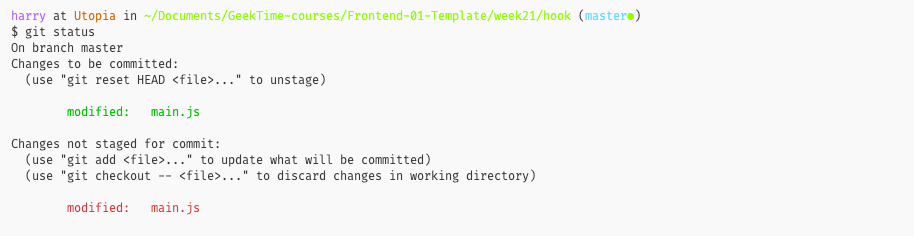
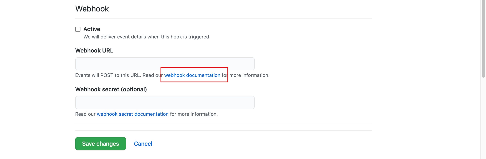

# 1. 发布系统 | Git Hook 与 Lint

[toc]

下一次的课会用虚拟机把之前教过的工程相关的内容串起来形成一个完整的发布系统。

我们已经做过了如下主要模块：


- 浏览器
- 编程练习
- 工具链
- 发布系统
- 组件化

## Git Hook

发布系统包含了一些持续集成相关的知识，但持续集成我们设计成了一个相对独立的工具，如果我们真的想要做一个完善的检查，需要在一些节点上进行处理，但如果不使用我们的工具，而使用 git push 这样的操作时，会发现我们没有办法控制，因为 git 是我们最常见的版本管理软件，而我们没有办法做一个替代 git 的工具，就算你做了，团队的人也不一定爱用。这个时候就面临一个挑战，怎么样让像是 ESLint 这样的工具在某些节点一定能够运行，也就是如何确保我们所提交的代码都通过了 Lint 检查。这节课，我们学习 Git Hook 来解决这个问题。

Git Hook 有两种，一种是客户端 Git Hook，这个 Hook 基本上是信任性检查（防君子不防小人），你依然可以提交没有通过 Lint 检查的代码。但大多数同学还是会自觉运行带有 Lint 的 Hook 进行提交。 

Git Hook 是什么

### 创建 Git Hook

创建目录 `hook` ，然后进行初始化——`git init` & `npm init` （这一部分到最后都会用 `yeoman` 集成在一起）

我们先来看一下 `.git` 目录中的文件，在控制台中查看需要输入 `ls -a` 才能显示默认隐藏的以 `.` 开头的文件或是目录。

`.git` 目录存储着 `git` 的管理信息、历史记录信息，`object` 目录存储的是历史、分支等信息。`hooks` 目录中有很多 hook：

```
.
├── applypatch-msg.sample
├── commit-msg.sample
├── fsmonitor-watchman.sample
├── post-update.sample
├── pre-applypatch.sample
├── pre-commit.sample
├── pre-push.sample
├── pre-rebase.sample
├── pre-receive.sample
├── prepare-commit-msg.sample
└── update.sample
```

但我们主要用到的是 `pre-commit` 和 `pre-push`，其他的在本节课中不会过多的讲解。

我们打开 `pre-commit-sample` 看一下：

```shell
#!/bin/sh
#
# An example hook script to verify what is about to be committed.
# Called by "git commit" with no arguments.  The hook should
# exit with non-zero status after issuing an appropriate message if
# it wants to stop the commit.
#
# To enable this hook, rename this file to "pre-commit".

if git rev-parse --verify HEAD >/dev/null 2>&1
then
	against=HEAD
else
	# Initial commit: diff against an empty tree object
	against=$(git hash-object -t tree /dev/null)
fi

# If you want to allow non-ASCII filenames set this variable to true.
allownonascii=$(git config --bool hooks.allownonascii)
 
# Redirect output to stderr.
exec 1>&2

# Cross platform projects tend to avoid non-ASCII filenames; prevent
# them from being added to the repository. We exploit the fact that the
# printable range starts at the space character and ends with tilde.
if [ "$allownonascii" != "true" ] &&
	# Note that the use of brackets around a tr range is ok here, (it's
	# even required, for portability to Solaris 10's /usr/bin/tr), since
	# the square bracket bytes happen to fall in the designated range.
	test $(git diff --cached --name-only --diff-filter=A -z $against |
	  LC_ALL=C tr -d '[ -~]\0' | wc -c) != 0
then
	cat <<\EOF
Error: Attempt to add a non-ASCII file name.

This can cause problems if you want to work with people on other platforms.

To be portable it is advisable to rename the file.

If you know what you are doing you can disable this check using:

  git config hooks.allownonascii true
EOF
	exit 1
fi

# If there are whitespace errors, print the offending file names and fail.
exec git diff-index --check --cached $against --
```

- 这是一大段 `shell` 脚本

虽然我们不会写 `shell` 脚本，但是我们也可以用 `node` 脚本来代替，hook 文件只要是可执行的文件就行。在 `linux` 或是 `UXD` 或是 `Unix` 体系下想把一个脚本文件变成可执行脚本，只需要在文件的开头使用 `#!` 的规则就可以了。


我们在 `hook/.git/hooks` 中创建一个脚本文件 `pre-commit`  ，然后编写如下代码：

```js
#!/usr/bin/env node

console.log('hook is running');
```

- 第一行的代码是参考 `node_modules/.bin/eslint` ，业界常见写法，当前环境的 node


然后，在 `hook` 目录中 `commit` ，会提示以下信息：

```
hint: The '.git/hooks/pre-commit' hook was ignored because it's not set as executable.
hint: You can disable this warning with `git config advice.ignoredHook false`.
```

- 意思是该文件没有设置为可执行文件


先通过命令 `ls -l .git/hooks/pre-commit` 查看该文件的权限：

```
-rw-r--r--  1 harry  staff  0  8 30 11:21 .git/hooks/pre-commit
```

- 第一列种有三部分，分别对应当前用户、组和其他。
- 可以看到该文件无论是哪一类用户没有可执行权限，这是因为默认创建的文件没有可执行的权限。


再通过命令 `chmod +x .git/hooks/pre-commit` 添加执行权限，然后再查看权限：

```
-rwxr-xr-x  1 harry  staff  0  8 30 11:21 .git/hooks/pre-commit
```

- 现在有了可执行权限。
- 在 `Linux` `Unix` 这一系的文件体系中，文件都有可读可写可执行的权限，通过 `chmod`  可以更改文件的权限。三种权限对应的简写字母是 `r` `w` `x` 
- 更过关于 `chmod` 的内容可以看这篇文章：[How to Use the chmod Command on Linux](https://www.howtogeek.com/437958/how-to-use-the-chmod-command-on-linux/) 
- `chmod 777 [file]` 添加所有权限，`744` 就只有当前用户拥有全部权限，而组和其他用户只能读。`666` 是能读写而不能执行。


接着，我们再次 `commit` ：

```shell
hook is running
[master 2ef173c] fourth
 1 file changed, 1 insertion(+), 1 deletion(-)
```

- 可以看到终端中打印了我们在 `pre-commit` 中写的打印信息，说明执行了提交脚本。


### 阻止提交

对于通过一些检查的代码文件我们不应该让其提交，要实现这一能力，只需要在 `pre-commit` hook 中添加如下代码：

```js
const process = require('process');
process.exit(1);
```

> 工具链是组件化和持续集成的承载，`Generator` 是工具链的承载，如果想要实现一个非常自动化的大工程体系，所有的点都会归结到 `Generator` 上。
>
> 通过 `Generator` 生成一个项目之后，所有要用的技术、约定、Lint 规则、往哪里提交这些都会存在于项目之中。


### 执行 ESLint

 先来看一下 api 文档：https://eslint.org/docs/developer-guide/nodejs-api

我们会使用到 [CLIEngine#executeOnFiles()](https://cn.eslint.org/docs/developer-guide/nodejs-api#cliengineexecuteonfiles) 这个 api 方法，它可以使我们检查一个或多个文件并返回报告对象，根据这个报告结果便可判断是否通过检查。（不过这个 API 方法处于 deprecated（不建议使用）的状态，所以用另外的 API 代替）

这里我们使用 [ESLint class](https://eslint.org/docs/developer-guide/nodejs-api#eslint-class) 代替，可以看下官方示例用法：

```js
const { ESLint } = require("eslint");

(async function main() {
  // 1. Create an instance.
  const eslint = new ESLint();

  // 2. Lint files.
  const results = await eslint.lintFiles(["lib/**/*.js"]);

  // 3. Format the results.
  const formatter = await eslint.loadFormatter("stylish");
  const resultText = formatter.format(results);

  // 4. Output it.
  console.log(resultText);
})().catch((error) => {
  process.exitCode = 1;
  console.error(error);
});
```

我们将这段代码修改一下其检查的路径放到 `pre-commit` 中：

```js
#!/usr/bin/env node

console.log('hook is running');

const process = require('process');
const { ESLint } = require("eslint");

(async function main() {
  // 1. Create an instance.
  const eslint = new ESLint();

  // 2. Lint files.
  const results = await eslint.lintFiles(["./main.js"]);

  // 3. Format the results.
  const formatter = await eslint.loadFormatter("stylish");
  console.log('results', results);
  const resultText = formatter.format(results);

  // 4. Output it.
  console.log(resultText);
})().catch((error) => {
  process.exitCode = 1;
  console.error(error);
});
```

接着执行 `git commit` 之后便会对 `./main.js` 文件根据 `.eslintrc.js` 配置文件的规则做检查，检查的结果会放到 `results` 中：

```js
results [
  {
    filePath: '/Users/harry/Documents/GeekTime-courses/Frontend-01-Template/week21/hook/main.js',
    messages: [ [Object], [Object] ],
    errorCount: 2,
    warningCount: 0,
    fixableErrorCount: 1,
    fixableWarningCount: 0,
    source: 'let a = 10;\n',
    usedDeprecatedRules: [Getter]
  }
]
```

我们再根据 `results` 的结果来判断是否应该提交，比如可以根据 `errorCount` 的值，如果不等于 0 则执行 `process.exit(1)` 停止 git 提交的进程。如下：

```js
#!/usr/bin/env node

console.log('hook is running');

const process = require('process');
const { ESLint } = require("eslint");

(async function main() {
  // 1. Create an instance.
  const eslint = new ESLint();

  // 2. Lint files.
  const results = await eslint.lintFiles(["./main.js"]);

  // 3. Format the results.
  const formatter = await eslint.loadFormatter("stylish");
  const resultText = formatter.format(results);
  console.log(resultText);

  for(let result of results){
    if(result.errorCount > 0){
      console.log('没有通过 lint 禁止提交')
      process.exit(1);
    }
  }

  // 4. Output it.
})().catch((error) => {
  process.exitCode = 1;
  console.error(error);
});

// process.exit(1);
```

不过现在有个问题，`pre-commit` 中的 `eslint` 检查的是当前目录中的没有被 `add` 到暂存空间的代码，所以当我们将要检测的代码 add 之后，发现检查的代码有代码书写规则有问题，然后去更改了目录中还未暂存的代码但忘记了 `add` 就进行了 `commit` 则此时通过检查并提交的是之前 `add` 的代码。这是在 `commit` 之前的仓库状态：



- 已经 add 的但有问题的代码和没有 add 但已经修复问题的代码

为了解决这个问题，我们可以用到 `git stash` 将已经修改但还处于工作间的代码先暂存到一个本地的单独空间中，那么此时 `ESLint` 所检查的代码则是非修改过的已经 add 的代码，在检查完毕之后再恢复到之前修改的状态即可，如下：

```js
const child_process = require('child_process');

function exec(command){
  return new Promise((resolve, reject) =>{
    child_process.exec(command,resolve);
  })
}

(async function main() {
  // 1. Create an instance.
  const eslint = new ESLint();

  // 2. Lint files.
  await exec("git stash save -q --keep-index");
  const results = await eslint.lintFiles(["./main.js"]);
  await exec("git stash pop");
//...
})()

(async function main2() {
  //...
})()
```

- 3 ～ 7，由于 `child_process.exec` 是同步执行，这里将其包装为异步执行，主要是为了使整个 `main` 中的代码结构整体都是用 `await` 来等待任务执行结束完毕之后再执行之后的代码，这样的好处如果有其他的异步函数存在时，两者之间可以相互交替执行，像两条线程，这样如果某一线程有大量任务存在时也不会出现阻塞的问题。但我们这里的代码实际上可以算是只有一条线程 `main` ，所以内部的代码无论是同步还是异步都没有太大区别，依然是从上到下的依次执行。

- 14 ~ 16 的执行顺序 `stash` -> `lint` -> `stash pop` 帮助我们我们解决问题。


除了用到 `pre-commit` 这个 hook 之外，我们也会 `pre-push` 这个 hook 来检查是否应该 `push` ，还有服务端相关的 hooks 比如 `pre-receive` ，这些可以查看 git 官方文档：https://git-scm.com/book/en/v2/Customizing-Git-Git-Hooks


### Web hook

Web hook 有两个流派，一个是 github 流派还有，文档：https://docs.github.com/en/developers/webhooks-and-events/about-webhooks，来自：



也就是 `Settings` -> `Developer settings` ->  `GitHub Apps`  -> 个人应用

还有一个是 gitlab 流派，文档：https://docs.gitlab.com/ee/user/project/integrations/webhooks.html

Gitlab 的 web hook 使用比 Github 的多，是因为公司项目代码一般都是在内部自建 gitlab 来进行管理，很少使用 github。

要实现一个完整的 web hook 可能需要花费几个月的时间。总之，在服务端接收到代码时，就会去走 `pre-receive` 这个 hook


## 补充

- style lint 处理 css 保存自动修复怎么做？

  - 自动修复肯定不能走 hook，hook 不能带自动修复，你可以主动调用 lint 自带的修复功能。在 commit 之前自动执行的 lint 不允许修复，它必须是一个只读的操作，否则这个工具链很危险，可以干一些奇怪的事，出了问题也**无法追责**。但如果发生了这样的事一定也是你工具链的作者背锅。

- 今天写在 `pre-commit` 中的 lint 检查代码也可以放到 `pre-push` 中，这完全取决于你想要给用户一些什么样的体验。

  > 用户：可以直接理解为使用任何工具、产品的人，不一定得是公司级别那么大的产品。

- 你可以在 `generator` 生成的项目中提供一个命令 `fix` 让用户去调用，但千万不要将一些 fix 的能力放到自动化的地方，比如提交代码之前的 `pre-hook` 
- 做工程体系的人不能做一个让别人不会**预期**但你却默默的帮别人修复的事情。
- 我们在 review 故障的时候，会去看这个事情开发者**是否应该知道**，如果是开发者不应该有可能知道的，那么一定是框架、工具或者是库的问题。

- 我们可以在 `pre-push` 中做一些柔性检查，就是允许你去跳过，不过跳过之后如果出了问题需要你来承担责任。git 自己也有这个东西，通过 `git commit --no-verify` 可以跳过所有检查。

