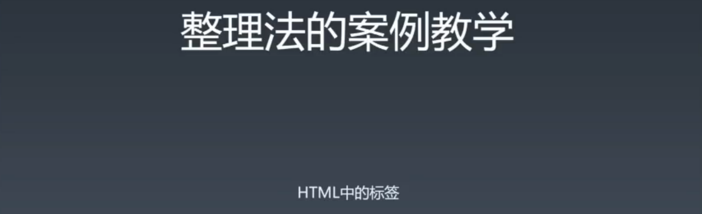
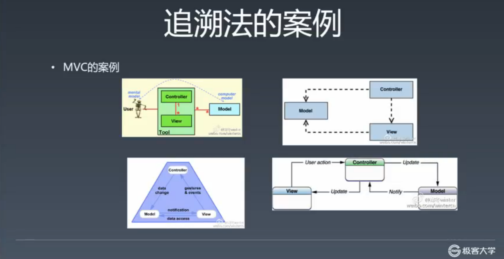
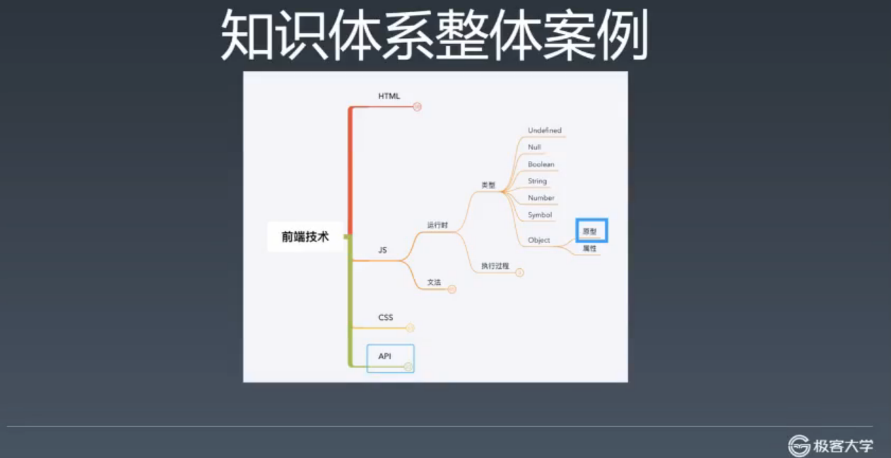
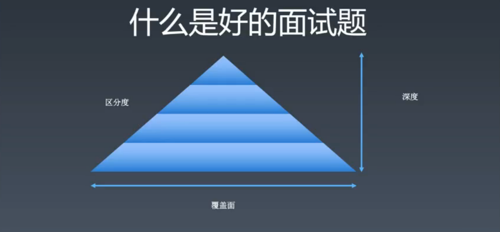
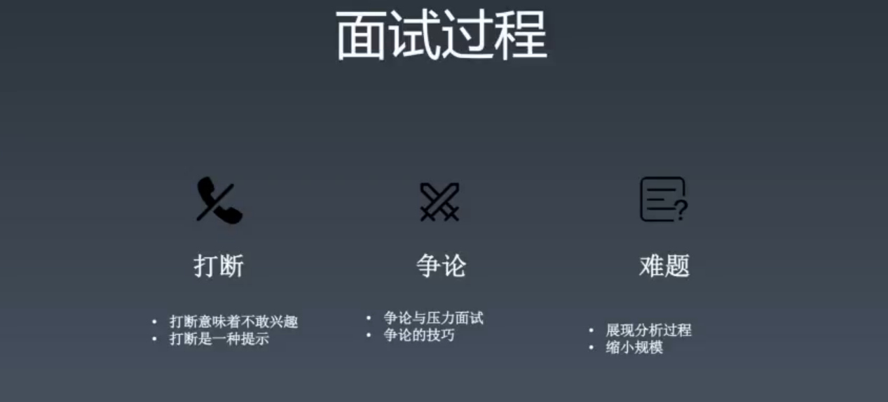
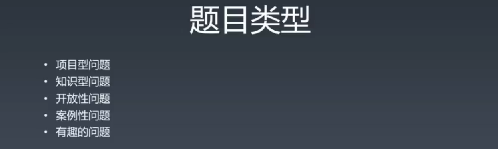

1. 在每周三凌晨12点之前提交上周作业，按照学习手册上作业提交说明进行提交。
2. 看直播才算签到，录播不算。
3. 不能按时完成作业，需要请假。

## winter 部分

## 前端进阶之路

### 前端与学习方法

完整课程需要先讲学习方法，否则知识点是没用的。

### 问题

- 你会什么？
  - 实际上在问你的知识是否成体系的问题，也就是你知识房间是否有序合理，而不是散乱各处。
  - 如果没有知识体系不整理，你很难找到你想要用的知识。
- 前端到底有什么？
  - 针线活是吗？
  - 你要知道哪些知识是属于前端，哪些不是。

- 编程能力
  - 利用语言来解决细小问题的能力。
    - 复杂问题的分拆、实现
  - 解决难的问题

- 架构能力
  - 对于复杂系统进行分析、设计，多个程序员的协同等
  - 解决大的问题
  - 能解决细小的问题，但是不一定能解决大的系统性问题
- 工程能力
  - 解决人的问题
    - 人多的时候该如何协作的问题
- 前端知识
  - 语言：TS、JS、HTML、CSS
  - 浏览器 API
  - 还原设计（CSS 是其他非前端程序员最难受的部分）
- 领域知识
  - 比如新零售
    - 埋点（数据统计埋点）
  - 极客邦 Qcon 学习领域知识

#### 知道了前端这些知识、能力，该如何提高？

- 编程能力，刷题、练！
  - 前端一定用不到红黑树，但不一定就不去学，从不会到会。
  - 一个周末就能学会多种排序
  - 刻意练习，不一定是用到才去练
  - 忘，练习忘记就忘很正常，不要觉得要忘就不学
  - 工作中可能会用到的才学，而是有机会就去学
- 架构能力
  - 看源码，看项目
  - 不推荐通读源代码，建议带着目的去读，或是解决 issue
- 工程能力
  - 选择合适工作，在公司中争取

建立知识体系，教你如何整理你的房间。

0.1 + 0.2 为什么，是建立前端知识体系的线索，而不是一个知识点。

### 前端训练营

- 不教追新追热点的技术
  - 比如 vue 3.0 ，比如去看文档
  - 这里不教到处都能找到的知识
- 不教包装建立应付面试的技巧
  - 真正的提高
  - 对企业、对社会要负责任
- 不教找捷径图省事的本领
  - 只教痛苦
  - 此课程是帮助你应付痛苦

#### 前端技术不是武林秘籍，真正的能力是练出来的。

- 这个课程的提高取决于自己，而不是 winter，投入的时间越多回报越高，要努力。

### 学习方式———整理法

整理知识是建立关系，将这些知识串联起来的时候，就不容易忘。

- 顺序关系
  - 每一个子节点是父节点的一个步骤，并有顺序。
  - 比如，编译
    1. 词法分析（对每一个词做分析）
    2. 语法分析（语法树到抽象语法树）
    3. 代码优化（对 AST 结构做一些优化）
    4. 代码生成
- 组合关系
  - 比如 CSS rules
    - 选择器（selector）* # > < （符号）
    - 属性（）[]
    - 值
  - 父节点在描述一个事物，子节点是事物的一部分
- 维度关系（角度）
  - 比如 JS
    - 词法
    - 文法
    - 语义
    - 运行时（最终的效果）
- 分类关系

建立知识体系除了关系之外还有完备性，不多也不少，一旦知识体系缺失一部分，就可能会导致整个知识体系的错误建立。

工具：脑图

- 写在纸上或是黑板上都无所谓

（一些学习和思考方式可能也是错误的，比如 google 工程师，只需要英语和搜索，实际上能够记住和理解更重要）

- w3.org（最全的 html 文档网站）
  - w3.org/tr（所有技术索引页面）

- whatwg.org（参考人家是如何对 html 进行分类）
- mdn

如何完备？比如这三个有差异怎么办？

追溯源头去查证知识

比如 closure

- 首先 google
- 看一个看得过去的网站 ---》 wiki
- 会发现有很多种意思
- 不要去看 wiki 本身，去看 history ，然后会发现是谁在什么时间定义的
- 然后给这个人发个邮件问他这个到底是什么意思。。。。。不是，是去 google scholar 搜索找到论文，打开，搜索 closure，ok，你开始会觉得很累，虽然你可能看不懂，但是这个过程会很有收获。

#### 大师

- 除了图片中大师以外，还有 TS 的创造人。
- 大师是把一辈子都投入其中的。
- winter 和一些网红并非大师，因为他们是工程圈中的人，对很多东西缺少深刻的理解，不像大师几年几十年都投入其中。

- Alan Kay 面向对象之父
  - 在他眼中 C++ 的不是一个理想的面向对象语言。
- 大师之间的言论是有冲突的，需要你去斟酌。注意语境，注意是在什么情况下的概念。

- MVC 更复杂
- 不说正确的，只说来历
  - 右下，苹果的定义
  - 右上，MSDN（微软）
  - 左下，MVP 作者，某公司 CEO
  - 左上，最原始的 MVP 的论文作者
- MVC 实际上是历史上的公案，怎么做的都有。
- 有些事不是追求结论，错误还是对的，而是在**追溯的过程中获取知识**，本质的理解，本质是个人的理解，世界只存在其表象。

追溯法作业：面向对象

- 记录追溯的过程

- 自己去先建立，然后再对照，思考差异和原因。

整理和追溯是建立知识体系的两种方法。

理解面试这件事，从而更好的学习和面试。

三要素

- 区分度
  - 大草原算法题，所有人都不会。不好
  - 所有人都会的，也不好。
- 覆盖面
  - 如果要写一本前端的书，你的目录是什么样的。这个比较难，全覆盖。
- 深度

知乎 hax，面试题本身差，但是通过提示，引导，分解来让考察面试者。

- 打断

  - 可能意味着离题，帮你节省时间
  - 打断是一种提示

- 争论

  - 面试官设计，和你争论的环节，是一种压力面试（管理岗）

  - 面试官不成熟

  - 想争论赢，用追溯法，论点、论据、论证

    - 克制情绪，谦虚
    - 论点不重要，论据和论证更重要
    - 比如闭包，1964 年 某某人在某某杂志上发表的论文上，讲**来源信息**

    - 执行上下文，当初在 TC39 上是如何讨论的，因为现在邮件这些都是公开的

- 难题

  - 展现分析过程
  - 缩小规模
    - 比如从计算机能完成的能力缩小到人能完成的问题

- 排序问题
  - 是为了测验写代码和解决问题的能力，用 sort 不香吗？
- 有趣的问题
  - 微软问题：为什么下水井盖是圆的？有很多答案。希望你的开发性思维，有这样的问题说明面试官对你有期望。

面试官如何评判？

- 可能会因为一个问题否决一个人，也可能直接通过。这样的方式是错误的，造成很多人去学很多垃圾知识，然后屋子里很乱。

面试是展示一个人是否有知识体系的过程。

有些时候会遇到很差的面试官。

建立知识体系并不是一蹴而就的，但是需要完备性，需要小修小改。

学完之后，能够自己建立知识体系，自己去追溯，独门的理解。

微服务去听听 qcon